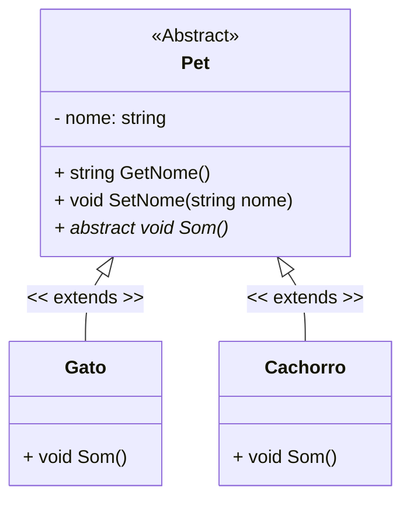

<h1>Classes Abstratas</h1>


Relembrando nossa primeira sessão sobre Orientação a Objetos...

- Um programa escrito em Linguagem Orientada à Objetos representa uma parte do mundo real;
- As partes das quais o modelo é construído são objetos que aparecem no domínio do problema;
- Uma classe descreve de maneira **abstrata** todos os objetos de um tipo em particular.

> **Abstrato:** que não é concreto; que resulta da abstração, que opera unicamente com ideias, com associações de ideias, não diretamente com a realidade sensível, que possui alto grau de generalização. 

Em nosso Projeto Guia (Conta), Conta é uma Classe, entretanto observamos que quando definimos o conceito de **“uma Conta”**, estamos generalizando o conceito de uma Conta Bancária, sem definir maiores detalhes, apenas o que é comum para toda e qualquer conta. 

Quando definimos os conceitos de **Conta Corrente** e **Conta Poupança**, estamos definindo um tipo específico de conta, que terá as suas especificidades.

> **Especificidades:** Em nosso exemplo são as características que são exclusivas de cada tipo de conta. 

Nenhum banco possui uma conta genérica, toda e qualquer conta possui um propósito e especificidades, logo não será necessário criar um Objeto do tipo Conta, pois é uma definição muito genérica de Conta Bancária.

Para definirmos uma Classe Genérica, **que não necessita ser instanciada**, que servirá apenas como uma **Superclasse** para geração de outras Classes derivadas, implementaremos a Classe Conta como uma **Classe Abstrata**.

**Classes abstratas** são classes que não podem ser instanciadas, porém podem ser derivadas (herdadas). Geralmente são utilizadas apenas para permitir a derivação de novas classes. Identificamos uma Classe como Abstrata pelo modificador **abstract** na sua assinatura.

**Classe Concreta** é uma classe que pode ser instanciada.

<div align="center"></div>

Utilizamos Classes Abstratas porquê em uma hierarquia de classes, quanto mais alta a classe, mais abstrata é a sua definição. Uma classe no topo da hierarquia pode definir apenas o comportamento e os atributos que são comuns a todas as classes. Na maioria dos casos, a classe não precisa ser instanciada diretamente e cumpre apenas o papel de ser um repositório de comportamentos e atributos em comuns a todas as classes estendidas (herdadas).

<br />

<h3>Métodos Abstratos</h3>

A Classe Abstrata também pode ter em sua implementação **Métodos Abstratos**. Métodos abstratos são métodos sem código. Eles são prefixados pelo modificador **abstract**, não apresentam um corpo e sua declaração termina com “**;**” após a declaração dos parâmetros.

Um Método Abstrato indica que a classe não implementa aquele método e que ele deve ser obrigatoriamente implementado nas Classes derivadas, pois é um comportamento comum das subclasses. **Eles são utilizados somente em classes abstratas.**

**Sintaxe - Método Abstrato dentro da Classe Abstrata**

<div align="center"></div>

**Sintaxe - Subclasse (Classe estendida ou herdada)**

<div align="center"></div>

<br />

<div align="left"> <a href="https://learn.microsoft.com/pt-br/dotnet/csharp/language-reference/keywords/abstract" target="_blank"><b>Documentação: Classe Abstrata</b></a></div>

<br />

Veja o Exemplo abaixo:

<div align="center"></div>

A **Classe Pet** é uma Generalização de animais de estimação, logo ela será a Super Classe e do tipo Abstrata (abstract). A Classe Pet terá um Atributo (nome) e um Método Abstrato chamado **Som()**. As Classes **Gato e Cachorro** serão Sub Classes da **Classe Pet**, ou seja, são tipos de Pet. As Classes **Gato e Cachorro** deverão implementar o Método **Som()**, independente dele ser ou não utilizado. Veja o Diagrama de Classes abaixo:



<br />

**Exemplo 01 - Implementação em C#:** 

**Classe Pet**

```c#
using System;
using System.Collections.Generic;
using System.Linq;
using System.Runtime.Serialization;
using System.Text;
using System.Threading.Tasks;

namespace Pets
{
    public abstract class Pet
    {
        private string nome;

        public Pet (string nome)
        {
            this.nome = nome;
        }

        public string GetNome()
        {
            return nome;
        }

        public void SetNome(string nome)
        {
            this.nome = nome;
        }

        public abstract void Som();
    }
}
```

A Classe Pet (Superclasse), foi criada com apenas um Atributo (nome), conforme o Diagrama de Classes acima. Também foi criado o Método Construtor, os Métodos Get e Set do Atributo e o Método abstrato Som(), que será implementado por todas as Sub Classes que herdarem a Classe Pet.

**Classe Gato**


```c#
using System;
using System.Collections.Generic;
using System.Linq;
using System.Text;
using System.Threading.Tasks;

namespace Pets
{
    public class Gato : Pet
    {
        public Gato(string nome) : base(nome)
        {
        }

        public override void Som()
        {
            Console.WriteLine("Miau!");
        }
    }
}
```

A Classe Gato herda a Classe Pet e obrigatoriamente implementa o Método abstrato Som(). 

**Classe Cachorro**


```c#
using System;
using System.Collections.Generic;
using System.Linq;
using System.Text;
using System.Threading.Tasks;

namespace Pets
{
    public class Cachorro : Pet
    {
        public Cachorro(string nome) : base(nome)
        {
        }

        public override void Som()
        {
            Console.WriteLine("Au Au!");
        }
    }
}
```

A Classe Cachorro herda a Classe Pet e obrigatoriamente implementa o Método abstrato Som(). 

**Classe Program**

```java
namespace Pets
{
    public class Program
    {
        static void Main(string[] args)
        {
            Gato g1 = new Gato("Melvin");

            g1.Som();

            Cachorro c1 = new Cachorro("Ruffus");

            c1.Som();
        }
    }
}
```

Na Classe Program, foi instanciado um Objeto da Classe Gato e um Objeto da Classe Cachorro. Observe que caso você tente criar um Objeto da Classe Pet o C# não irá permitir porque uma Classe Abstrata não pode ser instanciada. As Classes Gato e Cachorro possuem a sua implementação própria do Método Som() e graças ao Polimorfismo, a assinatura do Método é a mesma em ambas as Classes. Abaixo, você confere o resultado do código no Console:

**Resultado do Algoritmo:**

```bash
Miau!
Au Au!
```

<br />

------

## 🔑**Pontos chave:**

1. **Classes Abstratas** são classes que não podem ser instanciadas, porém podem ser derivadas (herdadas). Geralmente são utilizadas apenas para permitir a derivação de novas classes. 
2. Identificamos uma Classe como Abstrata pelo modificador **abstract** na sua assinatura.
3. Abstract é um modificador que é aplicável para Classes, Interfaces e Métodos. 
4. Classe Abstrata representa uma classe incompleta, que depende de subclasses para sua implementação, ou seja, a criação de pelo menos uma subclasse é obrigatória para a classe abstrata. 
5. A Classe Abstrata também pode ter em sua implementação **Métodos Abstratos**. 
6. **Métodos abstratos** são métodos sem código. Eles são prefixados pelo modificador **abstract**, não apresentam um corpo e sua declaração termina com “**;**” após a declaração dos parâmetros.
7. Métodos Abstratos **são utilizados somente em classes abstratas.**

<br /><br />

<div align="left"><a href="README.md">Voltar</a></div>
