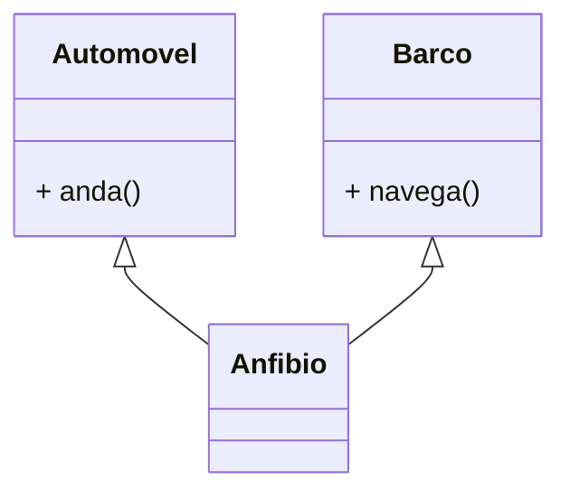
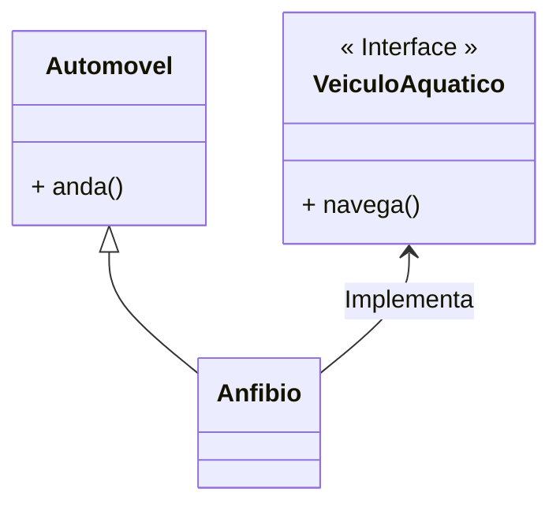
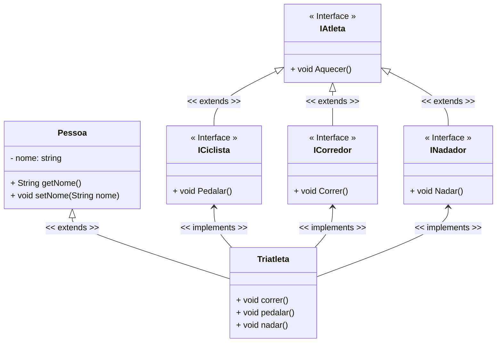

<h1>Interfaces</h1>

Como vimos no conteúdo sobre  Herança, C# permite a criação de uma Classe herdando as características de outra Classe, chamada Superclasse, com objetivo de simplificar o processo de desenvolvimento através da reutilização de código.

Entretanto, a linguagem C# não permite que uma classe seja derivada de duas ou mais classes (Polimorfismo), como no exemplo demonstrado na figura abaixo, ou seja, C# não permite a utilização do conceito de **Herança Múltipla**.



> •**Herança Simples** é o princípio, implementado em todas as linguagens de programação orientadas a objetos, que possibilita o compartilhamento de atributos e operações de apenas uma classe em uma subclasse. 
>
> •**Herança Múltipla** é o princípio, implementado em algumas linguagens de programação orientadas a objetos, como a liguagem C++ por exemplo, que possibilita o compartilhamento de atributos e operações de duas ou mais classes em uma subclasse, ou seja, uma classe pode ter mais de um superclasse.

Para contornar este fato, a Linguagem C# oferece uma solução elegante para este fim: o conceito de **Interfaces**, onde um Objeto "implementa" as características de outro Objeto.



**Interface** é uma estrutura que representa uma **Classe abstrata "pura"** em C#, que **não têm atributos de dados** (só pode ter constantes estáticas - tipo final), **não tem construtor**, **todos os métodos são abstratos** e **não é declarada como Classe, e sim como Interface**.

Uma Classe pode implementar várias Interfaces, entretanto não é recomendável implementar mais do que 3 Interfaces, porquê pode criar uma complexidade desnecessária ao projeto.

A Interface estabelece **um conjunto de Métodos apenas assinados, ou seja, sem o corpo, que obrigatoriamente devem ser implementados nas Classes que a utiliza**. Abaixo vemos a sintaxe de como criar uma Interface:

**Sintaxe:**

```c#
public interface Inome_da_interface {
    // Código da Interface
}
```

Observe que **obrigatoriamente o nome da Interface deve ser iniciado pela letra I (Maiúscula)**.

<br />

Na imagem abaixo, vemos a sintaxe de como implementar uma Interface em uma Classe. Observe que da mesma forma que na Herança, as Classes também utilizam os **dois pontos (:)** na sua assinatura para indicar as Interfaces que serão implementadas. Para diferenciar a Classe Herdada (caso haja uma Herança) das Interfaces Implementadas (pode-se implementar mais de uma Interface), utiliza-se a letra letra **I (Maiúscula)** no nome da Interface para identificá-la.

**Sintaxe:**

```c#
[modificador de Acesso] [modificador Non Access] class nome_da_classe : Inome_da_interface {
    // Implementação
}
```

<br />

Vamos ao nosso exemplo:

<div align="center"></div>

Observe que **Corredor, Nadador e Ciclista** estendem (herdam) a Classe Atleta. Vamos acrescentar a **Classe Triatleta**.

<div align="center"></div>

Na imagem acima, vemos que a Classe **Triatleta** estenderia (herdaria) as 3 Classes: **Corredor, Nadador e Ciclista**.

Teoricamente isto funcionaria, mas na prática não, pois C# **NÃO ACEITA HERANÇA MÚLTIPLA**. Para resolvermos o problema, teríamos que implementar o conceito de **Interfaces**, onde **Atleta, Nadador, Corredor e Ciclista**, seriam as nossas **Interfaces**, enquanto **Pessoa e Triatleta** seriam as únicas classes.

<div align="center"></div>

<br />

Abaixo, vemos o Diagrama de Classes do exemplo acima:

**Exemplo 01 - Diagrama de Classes** 



<br />

<div align="left"> <a href="https://learn.microsoft.com/pt-br/dotnet/csharp/language-reference/keywords/interface" target="_blank"><b>Documentação: Interface</b></a></div>

<br />

**Exemplo 01 - Implementação em C#:** 

**Classe Pessoa**

```c#
using System;
using System.Collections.Generic;
using System.Linq;
using System.Text;
using System.Threading.Tasks;

namespace interface_01
{
    public class Pessoa
    {
        private string nome;

        public Pessoa(string nome)
        {
            this.nome = nome;
        }

        public string GetNome()
        {
            return nome;
        }

        public void SetNome(string nome)
        {
            this.nome = nome;
        }

        public void Cansou()
        {
            Console.WriteLine("\nCansou...");
        }
    }
}
```

A Classe Pessoa (Superclasse), foi criada com apenas um Atributo (nome), conforme o Diagrama de Classes acima. Também foi criado o Método Construtor, os Métodos Get e Set do Atributo e o Método Cansou().

**Interface IAtleta**


```c#
using System;
using System.Collections.Generic;
using System.Linq;
using System.Text;
using System.Threading.Tasks;

namespace interface_01
{
    public interface IAtleta
    {
        public void Aquecer();
    }
}
```

A Interface IAtleta foi criada com apenas um Método (Aquecer()), conforme o Diagrama de Classes acima. 

**Interface ICiclista**


```c#
using System;
using System.Collections.Generic;
using System.Linq;
using System.Text;
using System.Threading.Tasks;

namespace interface_01
{
    public interface ICiclista : IAtleta
    {
        public void Pedalar();
    }
}
```

A Interface ICiclista foi criada como uma Herança da Classe Atleta, com apenas um Método (Pedalar()), conforme o Diagrama de Classes acima. 

**Interface ICorredor**


```c#
using System;
using System.Collections.Generic;
using System.Linq;
using System.Text;
using System.Threading.Tasks;

namespace interface_01
{
    public interface ICorredor : IAtleta
    {
        public void Correr();
    }
}
```

A Interface ICorredor foi criada como uma Herança da Classe Atleta, com apenas um Método (Correr()), conforme o Diagrama de Classes acima. 

**Interface INadador**


```c#
using System;
using System.Collections.Generic;
using System.Linq;
using System.Text;
using System.Threading.Tasks;

namespace interface_01
{
    public interface INadador: IAtleta
    {
        public void Nadar();
    }
}
```

A Interface INadador foi criada como uma Herança da Classe Atleta, com apenas um Método (Nadar()), conforme o Diagrama de Classes acima. 

**Classe Triatleta**


```c#
using System;
using System.Collections.Generic;
using System.Linq;
using System.Text;
using System.Threading.Tasks;

namespace interface_01
{
    public class Triatleta : Pessoa, ICiclista, ICorredor, INadador
    {
        public Triatleta(string nome) : base(nome)
        {
        }

        public void Aquecer()
        {
            Console.WriteLine("Aquecendo...");
        }

        public void Correr()
        {
            Console.WriteLine("Correndo...");
        }

        public void Nadar()
        {
            Console.WriteLine("Nadando...");
        }

        public void Pedalar()
        {
            Console.WriteLine("Pedalando...");
        }
    }
}
```

A Classe Triatleta foi criada como Herança da Classe Pessoa e Implementa as Interfaces: Nadador, Corredor e Ciclista, conforme o Diagrama de Classes acima. Além disso, também foi criado o Método Construtor. 

Observe que todos os Métodos das 3 Interfaces foram implementados. Quando uma Classe Implementa uma Interface, ela "assina um contrato" com a Interface, que a obriga a implementar ou minimamente inserir as assinaturas de todos os Métodos da Interface no Corpo da Classe.

**Classe Program**

```java
package meios_transporte;

public class TestaTriatleta {

    public static void main(String[] args) {

        Triatleta triatleta = new Triatleta("Kelvyn");
        
        triatleta.aquecer();
        triatleta.nadar();
        triatleta.pedalar();
        triatleta.correr();
        triatleta.cansou();

    }

}
```

Na Classe Program, foi instanciado um Objeto da Classe Triatleta. Observe que graças a Herança e as Interfaces implementadas, o Objeto da Classe Triatleta consegue executar os Métodos das 4 Interfaces e da Classe Pessoa. Abaixo, você confere o resultado do código no Console:

**Resultado do Algoritmo:**

```
Aquecendo...

Nadando...

Pedalando...

Correndo...

Cansou...
```

<br />

<div align="left"> <a href="" target="_blank"><b>Código fonte: Exemplo Interface</b></a>


<br />

<h2>2. Interfaces x Classes Abstratas</h2>

| Classes Abstratas                                            | Interfaces                                                   |
| ------------------------------------------------------------ | ------------------------------------------------------------ |
| Agrupa objetos com implementações compartilhadas             | Agrupa objetos com implementações diferentes                 |
| Define novas classes através de herança (simples) de código  | Define novas interfaces através de herança (múltipla) de **assinaturas** |
| Uma Classe pode ter apenas uma Superclasse (herança).        | Uma Classe pode implementar várias Interfaces.               |
| Uma classe abstrata pode fornecer código completo, código padrão ou ter apenas a declaração de seu esqueleto para ser posteriormente sobrescrita. | Uma interface não pode conter qualquer tipo de código, muito menos código padrão. |
| Pode conter constantes estáticas e de instância.             | Suporte somente constantes do tipo estática.                 |

<br />

<h2>3. Regras para usar Interface</h2>

Aqui estão alguns pontos-chave para definir uma interface em C# que devem ser mantidos em mente. As regras são as seguintes:

1. Uma interface não pode ser instanciada diretamente como uma Classe.

2. Uma interface não pode ser declarada com a palavra-chave sealed.

3. Uma classe que implementa uma interface deve fornecer suas próprias implementações de todos os métodos definidos na interface.

5. Não podemos reduzir a visibilidade de um método da interface durante a substituição, ou seja, quando implementamos um método da interface, ele obrigatoriamente deve ser declarado como public (público).

6. Um Método da interface também pode ser implementado em uma Classe com o corpo vazio. 

7. Uma interface de nível superior pode ser declarada com public (pública) ou padrão (internal). 

8. Todos os métodos definidos em uma interface são abstratos e públicos por definição. 

9. Se você adicionar qualquer novo método na interface, todas as classes concretas que implementam essa interface devem fornecer implementações para o método recém-adicionado, porque todos os métodos na interface são abstratos por definição.

<br />

## 🔑**Pontos chave:**

1.  **Interface** é uma estrutura que representa uma **Classe abstrata "pura"** em C#, que **não têm atributos de dados** (só pode ter constantes estáticas - tipo final), **não tem construtor**, **todos os métodos são abstratos** e **não é declarada como Classe, e sim como Interface**.
2. Uma Classe pode implementar várias Interfaces, entretanto não é recomendável implementar mais do que 3 Interfaces, porquê pode criar uma complexidade desnecessária ao projeto.
3. A Interface estabelece **um conjunto de Métodos apenas assinados, ou seja, sem o corpo, que obrigatoriamente devem ser implementados nas Subclasses que a utiliza**.

<br /><br />

<div align="left"><a href="README.md">Voltar</a></div>