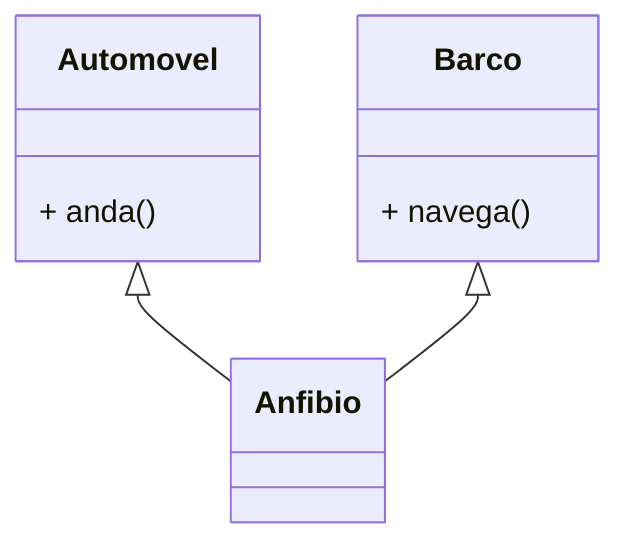
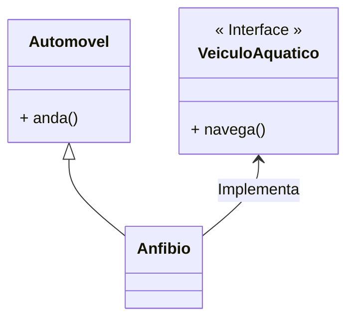
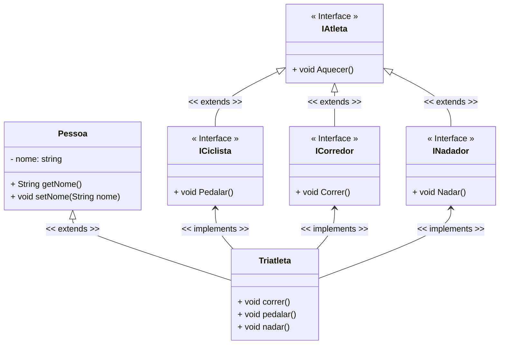

<h1>Interfaces</h1>

Como vimos no conteúdo sobre  Herança, C# permite a criação de uma Classe herdando as características de outra Classe, chamada Superclasse, com objetivo de simplificar o processo de desenvolvimento através da reutilização de código.

Entretanto, a linguagem C# não permite que uma classe seja derivada de duas ou mais classes (Polimorfismo), como no exemplo demonstrado na figura abaixo, ou seja, C# não permite a utilização do conceito de **Herança Múltipla**.



> •**Herança Simples** é o princípio, implementado em todas as linguagens de programação orientadas a objetos, que possibilita o compartilhamento de atributos e operações de apenas uma classe em uma subclasse. 
>
> •**Herança Múltipla** é o princípio, implementado em algumas linguagens de programação orientadas a objetos, como a liguagem C++ por exemplo, que possibilita o compartilhamento de atributos e operações de duas ou mais classes em uma subclasse, ou seja, uma classe pode ter mais de um superclasse.

Para contornar este fato, a Linguagem C# oferece uma solução elegante para este fim: o conceito de **Interfaces**, onde um Objeto "implementa" as características de outro Objeto.



**Interface** é uma estrutura que representa uma **Classe abstrata "pura"** em C#, que **não possui atributos de dados** (exceto membros estáticos abstratos `static abstract` e virtuais `static virtual`), **não possui Métodos  Construtores**, **todos os Métodos declarados são abstratos** e **não é declarada como uma Classe** `class`, e **sim como uma Interface** `interface`.

Uma Classe pode implementar várias Interfaces, entretanto não é recomendável implementar muitas Interfaces, porquê pode criar uma complexidade desnecessária ao projeto.

A Interface estabelece **um conjunto de Métodos, que são apenas assinados, ou seja, sem o corpo do Método, que obrigatoriamente devem ser implementados nas Classes que implementam a Interface**. Abaixo vemos a sintaxe de como criar uma Interface:

**Sintaxe - Criar Interface:**

```c#
public interface Inome_da_interface {
    // Corpo da Interface
}
```

Observe que **obrigatoriamente o nome da Interface deve ser iniciado pela letra I (Maiúscula)**, para indicar que se trata de uma Interface.

No trecho de código abaixo, vemos a sintaxe de como implementar uma Interface em uma Classe. Observe que da mesma forma que na Herança, as Classes também utilizam os **dois pontos (:)** na sua assinatura para indicar as Interfaces que serão implementadas. Para diferenciar a Classe Herdada (Herança), das Interfaces Implementadas, utiliza-se a letra letra **I (Maiúscula)** no nome da Interface para diferenciar, embora por inferência o C# possui a capacidade de identificar automaticamente.

**Sintaxe - Implementar Interface:**

```c#
[modificador de Acesso] [modificador Non Access] class nome_da_classe : Inome_da_interface {
    // Implementação da Classe
}
```

<br />

Vamos analisar o exemplo abaixo, que apresenta o uso de Interfaces para resolver uma questão de Herança Múltipla:

<div align="center"></div>

Observe na imagem acima que as Classes **Corredor, Nadador e Ciclista** estendem (herdam) a Super Classe **Atleta**. Na sequência, vamos acrescentar a **Classe Triatleta**.

<div align="center"></div>

Na imagem acima, vemos que a Classe **Triatleta** foi implementada como herança das Classes: **Corredor, Nadador e Ciclista**.

Teoricamente isto funcionaria, mas na prática não, pois a Linguagem C# **NÃO ACEITA HERANÇA MÚLTIPLA**. Para resolvermos esta questão, teríamos que implementar o conceito de **Interfaces**, onde **Atleta, Nadador, Corredor e Ciclista**, seriam convertidas em **Interfaces**, enquanto **Pessoa e Triatleta** seriam implementadas como Classes, como mostra a imagem abaixo:

<div align="center"></div>

<br />

As **Interfaces Nadador, Corredor e Ciclista** serão implementadas Herdando a Interface Atleta. A **Classe Triatleta irá implementar as 3 Interfaces e Herdará a Classe Pessoa**. Por consequência, Triatleta também herdará Atleta.

Abaixo, vemos o Diagrama de Classes do exemplo acima:

**Exemplo 01 - Diagrama de Classes** 



<br />

<div align="left"> <a href="https://learn.microsoft.com/pt-br/dotnet/csharp/language-reference/keywords/interface" target="_blank"><b>Documentação: Interface</b></a></div>

<br />

**Exemplo 01 - Implementação em C#:** 

**Classe Pessoa**

```c#
using System;
using System.Collections.Generic;
using System.Linq;
using System.Text;
using System.Threading.Tasks;

namespace interface_01
{
    public class Pessoa
    {
        private string nome;

        public Pessoa(string nome)
        {
            this.nome = nome;
        }

        public string GetNome()
        {
            return nome;
        }

        public void SetNome(string nome)
        {
            this.nome = nome;
        }

        public void Cansou()
        {
            Console.WriteLine("\nCansou...");
        }
    }
}
```

A Classe Pessoa (Superclasse), foi criada com apenas um Atributo (nome), conforme o Diagrama de Classes acima. Também foi criado o Método Construtor, os Métodos Get e Set do Atributo e o Método Cansou().

**Interface IAtleta**


```c#
using System;
using System.Collections.Generic;
using System.Linq;
using System.Text;
using System.Threading.Tasks;

namespace interface_01
{
    public interface IAtleta
    {
        public void Aquecer();
    }
}
```

A Interface IAtleta foi criada com apenas um Método (Aquecer()), conforme o Diagrama de Classes acima. 

**Interface ICiclista**


```c#
using System;
using System.Collections.Generic;
using System.Linq;
using System.Text;
using System.Threading.Tasks;

namespace interface_01
{
    public interface ICiclista : IAtleta
    {
        public void Pedalar();
    }
}
```

A Interface ICiclista foi criada como uma Herança da Classe Atleta, com apenas um Método (Pedalar()), conforme o Diagrama de Classes acima. 

**Interface ICorredor**


```c#
using System;
using System.Collections.Generic;
using System.Linq;
using System.Text;
using System.Threading.Tasks;

namespace interface_01
{
    public interface ICorredor : IAtleta
    {
        public void Correr();
    }
}
```

A Interface ICorredor foi criada como uma Herança da Classe Atleta, com apenas um Método (Correr()), conforme o Diagrama de Classes acima. 

**Interface INadador**


```c#
using System;
using System.Collections.Generic;
using System.Linq;
using System.Text;
using System.Threading.Tasks;

namespace interface_01
{
    public interface INadador: IAtleta
    {
        public void Nadar();
    }
}
```

A Interface INadador foi criada como uma Herança da Classe Atleta, com apenas um Método (Nadar()), conforme o Diagrama de Classes acima. 

**Classe Triatleta**


```c#
using System;
using System.Collections.Generic;
using System.Linq;
using System.Text;
using System.Threading.Tasks;

namespace interface_01
{
    public class Triatleta : Pessoa, ICiclista, ICorredor, INadador
    {
        public Triatleta(string nome) : base(nome)
        {
        }

        public void Aquecer()
        {
            Console.WriteLine("Aquecendo...");
        }

        public void Correr()
        {
            Console.WriteLine("Correndo...");
        }

        public void Nadar()
        {
            Console.WriteLine("Nadando...");
        }

        public void Pedalar()
        {
            Console.WriteLine("Pedalando...");
        }
    }
}
```

A Classe Triatleta foi criada como Herança da Classe Pessoa e Implementa as Interfaces: Atleta (por herança), Nadador, Corredor e Ciclista, conforme o Diagrama de Classes acima. Além disso, também foi criado o Método Construtor. 

Observe que todos os Métodos das 4 Interfaces foram implementados. Quando uma Classe Implementa uma Interface, ela "assina um contrato" com a Interface, que a obriga a implementar ou minimamente inserir as assinaturas de todos os Métodos da Interface no Corpo da Classe, mesmo sem a implementação.

**Classe Program**

```java
package meios_transporte;

public class TestaTriatleta {

    public static void main(String[] args) {

        Triatleta triatleta = new Triatleta("Kelvyn");
        
        triatleta.aquecer();
        triatleta.nadar();
        triatleta.pedalar();
        triatleta.correr();
        triatleta.cansou();

    }

}
```

Na Classe Program, foi instanciado um Objeto da Classe Triatleta. Observe que graças a Herança e as Interfaces implementadas, o Objeto da Classe Triatleta consegue executar os Métodos das 4 Interfaces e da Classe Pessoa. Abaixo, você confere o resultado do código no Console:

**Resultado do Algoritmo:**

```
Aquecendo...

Nadando...

Pedalando...

Correndo...

Cansou...
```

<br />

<h2>2. Interfaces x Classes Abstratas</h2>

| **Interface**                                                | **Classe Abstrata**                                          |
| ------------------------------------------------------------ | ------------------------------------------------------------ |
| Uma classe pode implementar diversas     Interfaces.         | Uma Classe pode Herdar somente uma Classe, seja ela  Abstrata ou não. |
| Define novas interfaces através de herança (múltipla) de **assinaturas.** | Define novas classes através de herança (simples) de código. |
| Uma Interface não pode conter qualquer tipo de código, muito menos código padrão. | Uma Classe Abstrata pode fornecer código completo, código padrão ou ter apenas a declaração de sua estrutura para ser posteriormente sobrescrita. |
| Suporte somente constantes do tipo estática abstrata ou virtual. | Pode conter constantes estáticas e de instância (atributos). |
| Se todas as implementações da Interface compartilham a mesma assinatura do método, então a interface é a melhor opção. | Se as várias implementações são todas do tipo da Classe e compartilham um comportamento comum, então a classe abstrata é a melhor opção. |

<br />

<h2>3. Regras para usar Interface</h2>

Aqui estão alguns pontos-chave para definir uma interface em C# que devem ser mantidos em mente. As regras são as seguintes:

1. Uma interface não pode ser instanciada diretamente como uma Classe, ela deve ser implementada em uma Classe Concreta.

2. Uma interface não pode ser declarada com o modificador **sealed**. Lembre-se que o modificador sealed indica que uma Classe não poder instanciada, logo uma Interface sealed não faria sentido.

3. Uma classe que implementa uma interface deve fornecer suas próprias implementações de todos os métodos definidos na interface.

4. Não implemente uma Interface caso um ou mais Métodos da Interface não serão implementados, ou seja, corpo vazio. Analise e refatore o código em outras Interfaces menores.

5. Não podemos reduzir a visibilidade de um método da interface durante a substituição, ou seja, quando implementamos um método da interface, ele obrigatoriamente deve ser declarado como **public** (público).

6. Um Método da interface também pode ser implementado em uma Classe com o corpo vazio, embora não seja uma prática recomendada. 

7. Uma Interface de nível superior pode ser declarada como public (pública) ou padrão (internal), embora seja recomendado o uso do modificador **public**. 

8. Todos os métodos definidos em uma interface são abstratos e públicos por definição. 

9. Se você adicionar qualquer novo método na Interface, todas as Classes Concretas que implementam essa Interface devem fornecer implementações para o método recém-adicionado, porque todos os métodos na Interface são abstratos por definição. Lembre-se que uma Interface é um contrato, que lhe obriga a implementar todos os Métodos em uma Classe que implementa a Interface.

<br />

<div align="left"> <a href="https://github.com/rafaelq80/exemplos_csharp/tree/main/15_interface/interface_01" target="_blank"><b>Código Fonte dos Exemplos</b></a></div>

<br />

------

## 🔑**Pontos chave:**

1.  **Interface** é uma estrutura que representa uma **Classe abstrata "pura"** em C#, que **não possui atributos de dados** (exceto membros estáticos abstratos `static abstract` e virtuais `static virtual`), **não possui Métodos  Construtores**, **todos os Métodos declarados são abstratos** e **não é declarada como uma Classe** `class`, e **sim como uma Interface** `interface`.
2. Uma Classe pode implementar várias Interfaces, entretanto não é recomendável implementar muitas Interfaces, porquê pode criar uma complexidade desnecessária ao projeto.
3. A Interface estabelece **um conjunto de Métodos apenas assinados, ou seja, sem o corpo, que obrigatoriamente devem ser implementados nas Subclasses que implementa a Interface**.

<br /><br />

<div align="left"><a href="README.md">Voltar</a></div>
