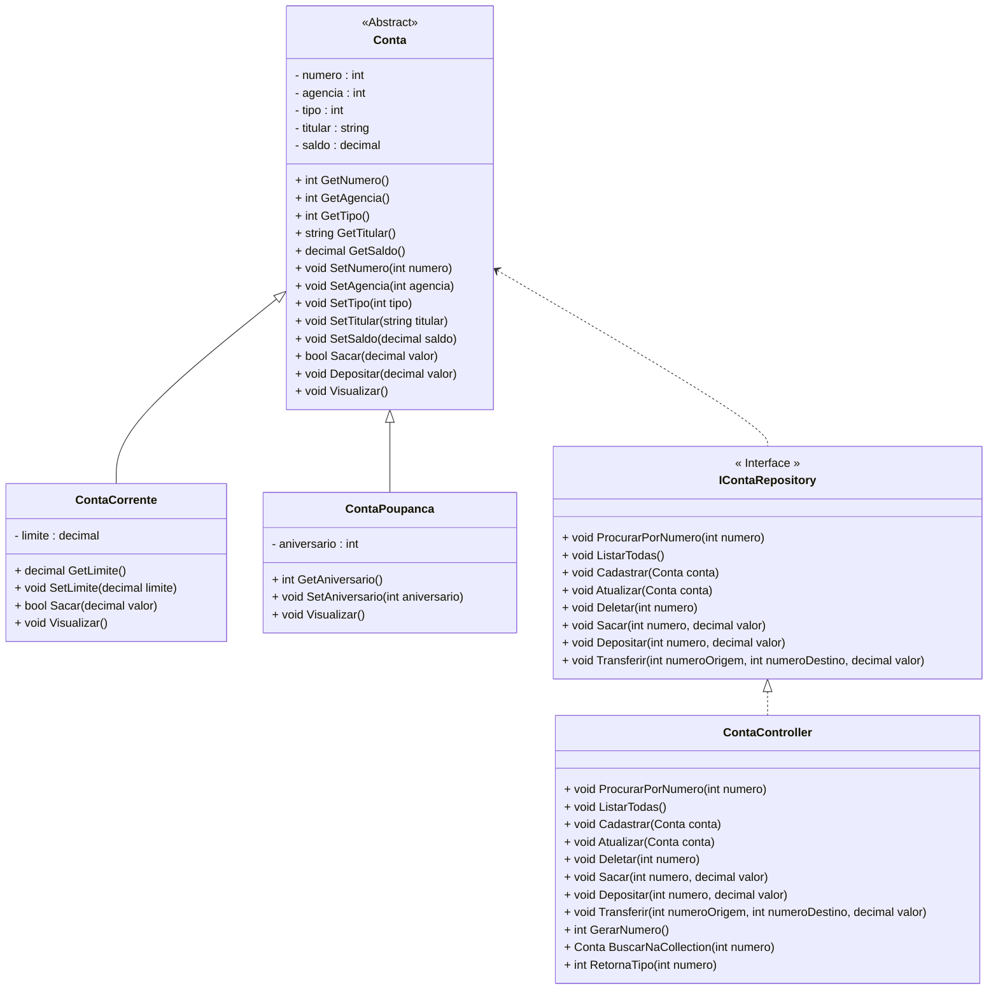

<h1>Projeto 01 - Conta Bancária - Iniciando o Projeto C#</h1>

<br />

<h2>1. O Projeto Conta Bancária</h2>

O Projeto Conta Bancária será o nosso Projeto Guia no aprendizado dos Conceitos e aplicação da Orientação a Objetos. Todo o código que implementarmos no projeto Conta Bancária servirá de base para a construção do Projeto C#, que marca o final do Bloco 01. O Projeto Conta Bancária receberá novas funcionalidades a cada nova Sessão e depois que você adquirir e praticar os novos conhecimentos, você poderá aplicar no Projeto C#. Veja o Diagrama de Classes do Projeto Conta Bancária completo na figura abaixo:



<br />

O Projeto será composto pelas seguintes Classes e Interfaces:

| Classe/Interface    | Descrição                                                    |
| ------------------- | ------------------------------------------------------------ |
| **Menu**            | Classe principal, que conterá o Método main, responsável por criar o Menu inicial da aplicação com todas as funcionalidades do sistema. |
| **Conta**           | Classe responsável por definir o Objeto Conta genérico.      |
| **ContaCorrente**   | Classe responsável por definir o Objeto Conta Corrente.      |
| **ContaPoupanca**   | Classe responsável por definir o Objeto Conta Poupanca.      |
| **ContaRepository** | Interface responsável por encapsular os Métodos que serão utilizados no Menu da aplicação |
| **ContaController** | Classe responsável por implementar a Interface ContaRepository. |

Antes de começar a criar as nossas Classes, vamos criar o nosso Projeto no Eclipse/STS.

 <h2>👣 Passo 01 - Criar o Projeto</h2>

1. Abra o Visual Studio. Ao iniciar o Visual Studio IDE, será aberta a tela abaixo, perguntando que você deseja fazer. 

<div align="center"></div>

2. Para Criar um novo Projeto, clique na opção **Criar um projeto**. 

<div align="center">
  
</div>


3. Na próxima tela, selecione o tipo de projeto que será criado. Selecione a opção **Aplicativo do Console** e clique em **Próximo** para continuar.

<div align="center">
  
</div>

4. Na próxima tela, vamos configurar o nosso projeto. No item **Nome do projeto**, informe o nome do projeto: **contabancaria**. 

<div align="center">
  
</div>


5. No item local, **clique no botão com 3 pontos** para selecionar a pasta onde o Projeto será criado.

<div align="center">
  
</div>


6. Crie na Área de Trabalho do seu computador a pasta **conta_bancaria**.
6. Abra a pasta **conta_bancaria** e clique no botão **Selecionar pasta**.

<div align="center">
  
</div>

8. Mantenha o item **Colocar a solução e o projeto no mesmo diretório** selecionado, como mostra a imagem abaixo e clique em **Próximo** para continuar.

<div align="center">
  
</div>


9. Na próxima tela, mantenha o item **Não use instruções de nível superior** selecionado, como mostra a imagem abaixo e clique no botão **Criar**. 

<div align="center">
  
</div>
10. Será aberta a janela abaixo, com um Hello World na Classe Program:

<div align="center"></div>


<br />

<h2>👣 Passo 02 - Criar o Menu na Classe Program</h2>

Vamos implementar o código do Menu - versão monocromática (sem as cores) na  **Classe Program**. Vamos analisar o código abaixo:

 <div align="left"></div>

**Linha 03:** Observe que o modificador de acesso da Classe foi alterado de **internal para public**, desta forma tornarmos a nossa Classe acessível para qualquer aplicação.

**Linha 07:** Criamos a variável do tipo **int**, chamada **opcao**, que receberá o número da opção do Menu, que deverá ser executada.

**Linha 09:** Iniciamos a estrutura de repetição while, responsável por gerar o Menu e repeti-lo na tela. Na condição do menu, inserimos a opção **true** para que o loop seja infinito, desta forma, o loop será finalizado apenas se a opção 9 for digitada.

 <div align="left"></div>

**Linhas 12 a 30:** Construímos a parte visual do nosso Menu. Os espaços em branco antes e depois dos itens do menu e as linhas em branco não foram construídas com tabulações (tecla Tab do teclado) e sim com espaços em branco simples.

**Linha 32:** Através do Método de entrada de dados via teclado **ReadLine()** em conjunto com o Método de Conversão string  inteiro **ToInt32()**, vamos ler um número inteiro e armazenar na variável **opcao**, ou seja, qual a opção do Menu que desejamos executar.

 <div align="left"></div>

**Linhas 34 a 39:** Através do condicional if, verificamos se o valor da variável opcao é 9. Caso seja, será exibida a mensagem de saída (linha 36), será executado o Método **Sobre()** (linha 37), que exibe na tela os dados da pessoa desenvolvedora e o programa será finalizado (linha 39).

 <div align="left"></div>

**Linhas 41 a 78:** Através do condicional case, checaremos se o valor da variável opcao está no intervalo entre 1 e 8. Conforme o numero, será exibida uma mensagem diferente na tela. Caso o numero esteja fora do intervalo 1 a 8 e seja diferente de 9, será exibida na tela a mensagem **Opção Inválida!**

 <div align="left"></div>

**Linhas 81 a 88:** Implementação do Método **Sobre()**, que exibe na tela os dados da pessoa desenvolvedora. **Substitua as informações contidas nas linhas 85 e 86 pelos seus dados pessoais (Nome, E-mail e Link do Github)**.

<br />

|  | <div align="left"> **ALERTA DE BSM:** *Mantenha a Atenção aos Detalhes ao criar o Método Sobre(). Não esqueça de inserir os seus dados pessoais no Método Sobre().* </div> |
| ------------------------------------------------------------ | ------------------------------------------------------------ |

<br />

Execute o projeto clicando no botão **Run**. 

O visual do Menu deve ser semelhante ao da figura abaixo:

 <div align="center"></div>

Ao digitar a **opção 9**, será exibida uma mensagem semelhante a imagem abaixo, contendo os seus dados pessoais.

 <div align="center"></div>

O código completo, você confere abaixo:

```c#
namespace conta_bancaria
{
    public class Program
    {
        static void Main(string[] args)
        {
            int opcao;

            while (true)
            {

                Console.WriteLine("*****************************************************");
                Console.WriteLine("                                                     ");
                Console.WriteLine("                BANCO DO BRAZIL COM Z                ");
                Console.WriteLine("                                                     ");
                Console.WriteLine("*****************************************************");
                Console.WriteLine("                                                     ");
                Console.WriteLine("            1 - Criar Conta                          ");
                Console.WriteLine("            2 - Listar todas as Contas               ");
                Console.WriteLine("            3 - Buscar Conta por Numero              ");
                Console.WriteLine("            4 - Atualizar Dados da Conta             ");
                Console.WriteLine("            5 - Apagar Conta                         ");
                Console.WriteLine("            6 - Sacar                                ");
                Console.WriteLine("            7 - Depositar                            ");
                Console.WriteLine("            8 - Transferir valores entre Contas      ");
                Console.WriteLine("            9 - Sair                                 ");
                Console.WriteLine("                                                     ");
                Console.WriteLine("*****************************************************");
                Console.WriteLine("Entre com a opção desejada:                          ");
                Console.WriteLine("                                                     ");

                opcao = Convert.ToInt32(Console.ReadLine());

                if (opcao == 9)
                {
                    Console.WriteLine("\nBanco do Brazil com Z - O seu Futuro começa aqui!");
                    Sobre();
                    System.Environment.Exit(0);
                }

                switch (opcao)
                {
                    case 1:
                        Console.WriteLine("Criar Conta\n\n");

                        break;
                    case 2:
                        Console.WriteLine("Listar todas as Contas\n\n");

                        break;
                    case 3:
                        Console.WriteLine("Consultar dados da Conta - por número\n\n");

                        break;
                    case 4:
                        Console.WriteLine("Atualizar dados da Conta\n\n");

                        break;
                    case 5:
                        Console.WriteLine("Apagar a Conta\n\n");

                        break;
                    case 6:
                        Console.WriteLine("Saque\n\n");

                        break;
                    case 7:
                        Console.WriteLine("Depósito\n\n");

                        break;
                    case 8:
                        Console.WriteLine("Transferência entre Contas\n\n");

                        break;
                    default:
                        Console.WriteLine("\nOpção Inválida!\n");
                        break;
                }
            }

            static void Sobre()
            {
                Console.WriteLine("\n*********************************************************");
                Console.WriteLine("Projeto Desenvolvido por: ");
                Console.WriteLine("Generation Brasil - generation@generation.org");
                Console.WriteLine("github.com/conteudoGeneration");
                Console.WriteLine("*********************************************************");
            }

        }
    }
}
```

<br />

<div align="left"> <a href="https://github.com/rafaelq80/csharp_conta_bancaria/tree/01_Criar_Menu_Monocromatico" target="_blank"><b>Código fonte: Projeto Conta Bancária</b></a></div>

<br /><br />


<div align="left"><a href="README.md">Voltar</a></div>
