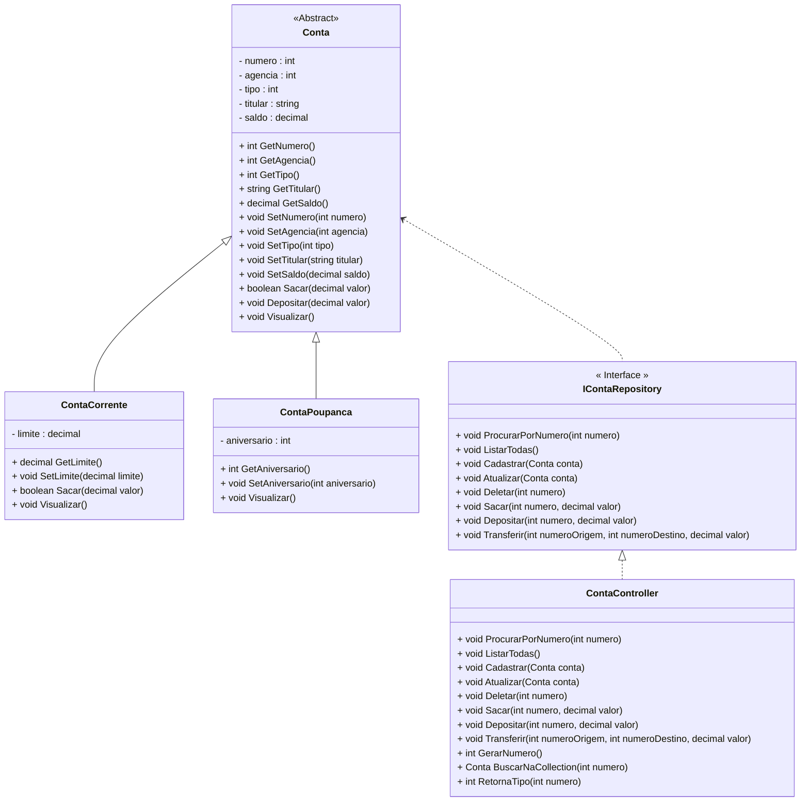

<h1>Projeto 01 - Conta Bancária - Colorindo o Menu </h1>

Na etapa anterior, criamos o Projeto Conta Bancária, que será o nosso Projeto Guia no aprendizado dos Conceitos e aplicação da Orientação a Objetos. Veja o Diagrama de Classes do Projeto Conta Bancária completo na figura abaixo:



<br />

Além de criar o projeto, criamos também o Menu na Classe Program, que é Classe principal do Projeto, que contém o Método main(). Ao executar a aplicação, temos o seguinte resultado:

 <div align="center"></div>

Nesta etapa, vamos deixar o nosso Menu colorido. Antes, vamos entender como funcionam as cores no Console do C#. 

<h2>1. Cores no Console do C#</h2>

Os Terminais (console) tradicionalmente recebem uma entrada de bytes e os exibem como texto branco em um fundo preto. Se a entrada contiver “caracteres de controle” específicos, o terminal poderá alterar certas propriedades de exibição do texto, como cor ou fonte. Os terminais conseguem exibir no máximo 16 cores. No entanto, as telas de computador modernas são capazes de exibir cores RGB de 24 bits, que fica inviável para o console exibir tantas cores. Para trabalhar com as 16 cores básicas dentro do Console, O C# utiliza o padrão ANSI Escape Code.

As sequências de escape ANSI são um padrão adotados pelos terminais para controlar a localização do cursor, cor, estilo de fonte e outras opções em terminais de texto de vídeo e emuladores de terminal. Certas sequências de caracteres, a maioria começando com um caractere de escape ASCII e um caractere de colchete, quando incorporadas ao texto, fazem o terminal interpretar essas sequências como comandos, em vez de texto para exibição literal. 

O C# modifica as cores do Console através das propriedades: **Console.BackgroundColor** (Cor de fundo) e **Console.ForegroundColor** (Cor do texto). Para restaurar as cores padrões, utiliza o Método **Console.ResetColor()**. 

Veja os códigos de cores na tabela abaixo:

| Cor                        | Cor                    |
| -------------------------- | ---------------------- |
| *ConsoleColor.Black*       | *ConsoleColor.Gray*    |
| *ConsoleColor.DarkBlue*    | *ConsoleColor.Blue*    |
| *ConsoleColor.DarkGreen*   | *ConsoleColor.Green*   |
| *ConsoleColor.DarkCyan*    | *ConsoleColor.Cyan*    |
| *ConsoleColor.DarkRed*     | *ConsoleColor.Red*     |
| *ConsoleColor.DarkMagenta* | *ConsoleColor.Magenta* |
| *ConsoleColor.DarkYellow*  | *ConsoleColor.Yellow*  |
| *ConsoleColor.DarkGray*    | *ConsoleColor.White*   |

Cada uma das cores acima, internamente utiliza um código ANSI diferente para alterar a cor do Console.

<br />

<h2>👣 Passo 01 - Atualizar a Classe Program</h2>

Neste passo, vamos atualizar o código da Classe Menu adicionando cores e um Método chamado **KeyPress()**, que  tem por Objetivo exigir que a tecla **enter** do seu teclado seja pressionada para finalizar uma opção do Menu. 

No estágio  atual, quando você seleciona uma opção do Menu, ele mostra a mensagem e  recarrega o Menu novamente. Com o Método **keyPress()**, o Menu será recarregado somente depois de pressionar a tecla enter. 

Vamos analisar as alterações no código abaixo:

 <div align="left"></div>

**Linha 5:** Importamos a **Classe Cores**, que permite adicionar Cores nos comandos de saída de dados.

**Linha 17:** Antes do conteúdo do comando **System.out.println()**, concatenamos as constantes **Cores.TEXT_YELLOW** e **Cores.ANSI_BLACK_BACKGROUND**, definindo que o texto será amarelo e o plano de fundo do texto será preto.

|  | <div align="left"> **IMPORTANTE:** *Ao aplicar a cor de fundo, esta cor será aplicada apenas no texto, ou seja, ela não será aplicada em toda a tela. Para aplicar na tela será necessário inserir vários espaços em brancos (como fizemos no Menu) para preencher áreas da tela antes e depois do texto.* </div> |
| ------------------------------------------------------------ | ------------------------------------------------------------ |

 <div align="left"></div>

**Linha 36:** Depois do conteúdo do comando **System.out.println()**, concatenamos a constante **Cores.TEXT_RESET**, definindo que ao finalizar o Menu, o texto e o plano de fundo voltarão a ter as cores padrão.

**Linha 41:** Antes do conteúdo do comando **System.out.println()**, concatenamos a constante **Cores.TEXT_WHITE_BOLD**, definindo que ao sair do programa, a mensagem de finalização será exibida com o texto na cor branca em negrito.

 <div align="left"></div>

**Linhas 48, 52, 56, 60, 64, 68, 72 e 76:** Antes do conteúdo do comando **System.out.println()**, concatenamos a constante **Cores.TEXT_WHITE_BOLD**, definindo que as mensagens de cada opção do Menu será exibida com o texto na cor branca em negrito.

**Linha 80:** Antes do conteúdo do comando **System.out.println()**, concatenamos a constante **Cores.TEXT_RED_BOLD**, definindo que a mensagem de opção inválida do Menu será exibida com o texto na cor vermelha em negrito. Depois do conteúdo do comando **System.out.println()**, concatenamos a constante **Cores.TEXT_RESET**, definindo que depois de exibir a mensagem, o texto e o plano de fundo voltarão a ter as cores padrão.

 <div align="left"></div>


Execute o projeto clicando no botão **Run**. 

O visual do Menu deve ser semelhante ao da figura abaixo:

 <div align="center"></div>

O código completo, você confere abaixo:

```java
package conta;

import C#.util.Scanner;

import conta.util.Cores;

public class Menu {
    public static void main(string[] args) {
        
        Scanner leia = new Scanner(System.in);
		
		int opcao;
				
		while(true) {

			System.out.println(Cores.TEXT_YELLOW + Cores.ANSI_BLACK_BACKGROUND
					+ "*****************************************************");
			System.out.println("                                                     ");
			System.out.println("                BANCO DO BRAZIL COM Z                ");
			System.out.println("                                                     ");
			System.out.println("*****************************************************");
			System.out.println("                                                     ");
			System.out.println("            1 - Criar Conta                          ");
			System.out.println("            2 - Listar todas as Contas               ");
			System.out.println("            3 - Buscar Conta por Numero              ");
			System.out.println("            4 - Atualizar Dados da Conta             ");
			System.out.println("            5 - Apagar Conta                         ");
			System.out.println("            6 - Sacar                                ");
			System.out.println("            7 - Depositar                            ");
			System.out.println("            8 - Transferir valores entre Contas      ");
			System.out.println("            9 - Sair                                 ");
			System.out.println("                                                     ");
			System.out.println("*****************************************************");
			System.out.println("Entre com a opção desejada:                          ");
			System.out.println("                                                     " + Cores.TEXT_RESET);
			
			opcao = leia.nextInt();
				
			if (opcao == 9) {
				System.out.println(Cores.TEXT_WHITE_BOLD + "\nBanco do Brazil com Z - O seu Futuro começa aqui!");
				leia.close();
				System.exit(0);
			}
				
			switch (opcao) {
				case 1:
					System.out.println(Cores.TEXT_WHITE + "Criar Conta\n\n");
				
                    break;
				case 2:
					System.out.println(Cores.TEXT_WHITE + "Listar todas as Contas\n\n");
					
                    break;
				case 3:
					System.out.println(Cores.TEXT_WHITE + "Consultar dados da Conta - por número\n\n");
	
                    break;
				case 4:
					System.out.println(Cores.TEXT_WHITE + "Atualizar dados da Conta\n\n");
					
                    break;
				case 5:
					System.out.println(Cores.TEXT_WHITE + "Apagar a Conta\n\n");
		
                    break;
				case 6:
					System.out.println(Cores.TEXT_WHITE + "Saque\n\n");

                    break;
				case 7:
					System.out.println(Cores.TEXT_WHITE + "Depósito\n\n");
					
                    break;
				case 8:
					System.out.println(Cores.TEXT_WHITE + "Transferência entre Contas\n\n");
					
                    break;
				default:
					System.out.println(Cores.TEXT_RED_BOLD + "\nOpção Inválida!\n" + Cores.TEXT_RESET);
                    break;
			}
		}	
    }

}
```

<br />

<div align="left"> <a href="https://github.com/rafaelq80/conta_bancaria_C#/blob/02_Menu_Colorido/src/conta/Menu.C#" target="_blank"><b>Código fonte: Menu.C#</b></a>

<br /><br />

<div align="left"> <a href="https://github.com/rafaelq80/conta_bancaria_java/tree/02_Menu_Colorido" target="_blank"><b>Código fonte: Projeto Conta Bancária</b></a>

<br /><br />

<div align="left"><a href="README.md">Voltar</a></div>