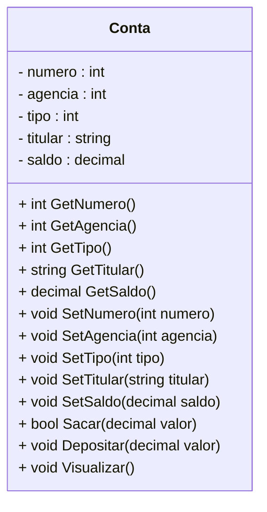

<h1>Projeto 01 - Conta Bancária - Classe Model Conta</h1>

Na etapa anterior, implementamos o Menu na Classe **Program**, com as respectivas opções para manipular os Objetos da Classe Conta. 

Nesta etapa, vamos criar a Classe Conta no **Namespace conta_bancaria.Model** da nossa aplicação. O Diagrama de Classes do nossa Classe Conta ficará da seguinte forma:



<br />

Durante o Desenvolvimento do Projeto Conta Bancária, vamos criar dentro do Namespace principal, 3 Namespaces aninhados, que também podem ser chamados de **Camadas**. Dentro destes Namespaces aninhados, iremos criar as Classes e as Interfaces da nossa aplicação. Os 3 Namespaces aninhados que serão criados, respectivamente são:

| Namespace      | Descrição                                                    |
| -------------- | ------------------------------------------------------------ |
| **Model**      | Camada responsável pela abstração dos nossos Objetos. As Classes criadas neste Namespace representam os Objetos da nossa aplicação, que serão compostos por seus Atributos (características) e Métodos (ações). |
| **Repository** | Camada responsável por implementar a Interface, que contém diversos Métodos pré-implementados para a manipulação dos dados de um Objeto, entre eles os Métodos salvar, deletar, listar e atualizar dados do Objeto. |
| **Controller** | Camada responsável por criar a Classe que será responsável por implementar os Métodos criados na Interface Repository. Lembre-se que em uma Interface não é possível implementar Métodos, apenas assiná-los. |

<br />

<h2>👣 Passo 01 - Criar a pasta Model</h2>

Dentro do projeto **contabancaria**, vamos criar a pasta **Model** (Namespace **Model**):

1. No lado direito superior, na Guia **Gerenciador de Soluções**, clique com o botão direito do mouse sobre o projeto  **contabancaria** e clique na opção **Adicionar 🡪 Nova Pasta**, como mostra a animação abaixo:

<div align="center"></div>

2. Digite o nome da pasta (**Model**), com a primeira letra maiúscula, seguindo o padrão do C# e pressione **enter** para concluir. O Gerenciador de Soluções da aplicação ficará semelhante a imagem abaixo:

<div align="center"></div>

<br />

<h2>👣 Passo 02 - Criar a Classe Conta</h2>

Agora vamos criar a **Classe Conta** no **Namespace Model**.

1. Clique com o botão direito do mouse sobre a **pasta Model** e na sequência, clique na opção **Adicionar 🡪 Classe**, como mostra a animação abaixo:

<div align="center"></div>

2. Na janela **Adicionar Novo item**, no item **Nome**, digite o nome da Classe (**Conta**), como mostra a figura abaixo:

<div align="center"></div>

3. Clique no botão **Adicionar** para concluir.

4. O Gerenciador de Soluções da aplicação ficará semelhante a imagem abaixo:

 <div align="center"></div>

5. Na imagem abaixo, vemos o código inicial da **Classe Conta**:

 <div align="left"></div>


Vamos implementar e analisar o código da Classe Conta:

 <div align="left"></div>

**Linha 07:** Observe que o modificador de acesso da Classe foi alterado de **internal para public**, desta forma tornarmos a nossa Classe acessível para qualquer aplicação.

**Linhas 11 a 15:** Criamos as variáveis que representam os Atributos da Classe Conta, que foram definidos no Diagrama de Classes acima. Observe que todos os Atributos possuem o modificador de acesso **private**, ou seja, são acessíveis apenas dentro da Classe Conta. Eles foram criados desta forma para implementar o **Encapsulamento**, ou seja, os dados de um Objeto somente poderão ser alterados e recuperados por uma outra Classe através dos Métodos Get e Set, que serão criados logo abaixo.

<br />

<h2 >👣 Passo 03 - Criar o Método Construtor na Classe Conta</h2>


Depois de criarmos os Atributos, precisamos criar o **Método Construtor** da Classe Conta. Através destes Método, poderemos criar novos Objetos da Classe Conta. 

Vamos implementar e analisar o código do Método Construtor da Classe Conta:

 <div align="left"></div>

**Linha 17:** O Método Construtor foi criado com o mesmo nome da Classe (Conta) e com os respectivos parâmetros. Observe que as variáveis inseridas possuem os mesmos nomes e tipos dos Atributos da Classe Conta. Ao instanciar uma novo Objeto, o Método Construtor receberá todos os dados do Objeto através deste parâmetros, que serão atribuídos aos Atributos do Objeto da Classe Conta.

**Linhas 19 a 23:** Os dados recebidos nos parâmetros do Método Construtor são atribuídos aos respectivos Atributos da Classe Conta. Como os parâmetros possuem os mesmos nomes do Atributos da Classe, foi utilizada a palavra reservada **this** para diferenciar o Atributo da Classe Conta do parâmetro do Método Construtor da Classe Conta.

 <div align="center"></div>

<br />

<h2>👣 Passo 04 - Criar os Métodos Get e Set</h2>

Depois de criarmos os Atributos e o Método Construtor, precisamos criar os **Métodos Get e Set** para todos os Atributos da Classe Conta. Através destes Métodos, poderemos acessar e modificar os Atributos da Classe Conta, a partir de outras Classes. Desta forma, manteremos os nosso Atributos protegidos através do Encapsulamento.

Vamos implementar e analisar o código dos Métodos **Get e Set** da Classe Conta:

 <div align="left"></div>

Observe que foi criado um Método Get para cada Atributo da Classe Conta e cada um foi assinado com o mesmo tipo de dado do respectivo Atributo, porquê o valor armazenado no Atributo será retornado, através do comando **return**. Se o Atributo é do tipo string, o comando return obrigatoriamente retornará um dado do tipo string, por exemplo, logo o Método também deve ser assinado com o mesmo tipo de dado do Atributo.

Da mesma forma, foi criado um Método Set para cada Atributo da Classe Conta, entretanto todos os Métodos foram assinados como **void** (sem retorno de valor), porquê o valor do Atributo será alterado e o Método não irá retornar nenhum valor. Como o valor do Atributo será modificado, na assinatura de cada Método Set foi adicionado um parâmetro com o mesmo nome e tipo do respectivo Atributo, e a modificação será efetuada através de uma atribuição, onde o Atributo, identificado pela palavra reservada **this**, receberá o valor recebido através do parâmetro do Método.

<br />

<h2>👣 Passo 05 - Criar os Métodos Específicos</h2>

Vamos criar 3 Métodos Específicos na Classe Conta:

1. **Sacar:** Método responsável por efetuar a operação de saque na Conta;
2. **Depositar:** Método responsável por efetuar a operação de depósito na Conta;
3. **Visualizar:** Método responsável por efetuar a operação de visualizar todos os dados da Conta.

 <div align="left"></div>

**Linha 76:** O Método Sacar, do tipo bool, foi criado contendo o parâmetro **decimal valor**, que receberá o valor a ser sacado da conta. O parâmetro valor é do tipo decimal porquê o Atributo saldo é do tipo decimal.

**Linha 79:** Através do laço condicional if, verifica se o valor do saque é menor do que o saldo disponível na conta. Para obter o saldo atual da conta, foi utilizado o Método **GetSaldo()**. A palavra reservada **this** foi utilizada para fazer referência ao Objeto que está executando o Método GetSaldo().

**Linha 81:** Caso o saldo seja insuficiente, será exibida a mensagem de **Saldo Insuficiente** no console.

**Linha 82:** Como se trata de um Método do tipo bool, é necessário retornar uma resposta true ou false. Como o saque nesta condição não pode ser efetuada, retornaremos **false**. O comando return tem a função de retornar um valor após o Método finalizar o processamento.

**Linha 85:** Caso a condição anterior seja falsa (o saldo é suficiente), o saque será efetuado. Para atualizar o saldo, foi utilizado o Método **SetSaldo(decimal saldo)**. Com o parâmetro do Método, foi efetuada a operação saldo - valor, onde o saldo atual da conta foi obtido através do Método **GetSaldo()**. A palavra reservada **this** foi utilizada para fazer referência ao Objeto que está executando o Método GetSaldo(). O Método SetSaldo(decimal saldo) irá atualizar o Atributo saldo do Objeto com o resultado da subtração (saldo - valor).

**Linha 86:** Como o saque foi efetuado, retornaremos **true**. 

------

💰 **Exemplo - Saque bem sucedido:**

**Saldo atual:** *R$ 1000.00*

**Valor do Saque:** *R$ 100.00*

*Saldo = 1000.00 - 100.00*

**Saldo atualizado:** *R$ 900.00*

------

💰 **Exemplo - Saque mal sucedido:**

**Saldo atual:** *R$ 1000.00*

**Valor do Saque:** *R$ 2000.00*

*2000.00 é maior do que 1000.00*

**Mensagem:** *Saldo Insuficiente!*

**Saldo atual:** *R$ 1000.00*

------

<br />

 <div align="left"></div>

**Linha 89:** O Método Depositar, do tipo void, foi criado contendo o parâmetro **decimal valor**, que receberá o valor a ser depositado na conta. O parâmetro valor é do tipo decimal porquê o Atributo saldo é do tipo decimal. O Método Depositar foi definido como void porquê ele não precisa retornar uma confirmação, pois diferente do Método Sacar, não é necessário efetuar nenhuma verificação no saldo da conta antes de efetuar o depósito.

**Linha 91:** Para atualizar o saldo, foi utilizado o Método **SetSaldo(decimal saldo)**. Com o parâmetro do Método, foi efetuada a operação saldo + valor, onde o saldo atual da conta foi obtido através do Método **GetSaldo()**. A palavra reservada **this** foi utilizada para fazer referência ao Objeto que está executando o Método GetSaldo(). O Método SetSaldo(decimal saldo) irá atualizar o Atributo saldo do Objeto com o resultado da soma (saldo + valor).

------

💰 **Exemplo - Depósito bem sucedido:**

**Saldo atual:** *R$ 1000.00*

**Valor do Depósito:** *R$ 500.00*

*Saldo = 1000.00 + 500.00*

**Saldo atualizado:** *R$ 1500.00*

------

<br />

 <div align="left"></div>

**Linha 94:** O Método Visualizar, do tipo void, foi criado sem parâmetros. O Método Visualizar foi definido como void porquê ele não precisa retornar uma confirmação, apenas exibir os dados de um Objeto da Classe Conta no console.

**Linha 97:** Foi criada a variável string, chamada **tipo**, para receber textualmente o tipo da Conta. Como o Atributo tipo armazena um numero inteiro (int), que representa o código do tipo da conta, vamos criar um laço condicional, para ao invés de exibir no console o código numérico, vamos exibir uma descrição para o código. 

**Linhas 99 a 107:** Através do laço condicional case, vamos checar se o tipo da conta é 1 ou 2. Caso seja 1, exibe Conta Corrente, caso seja 2 exibe Conta Poupança. Como parâmetro do comando switch, foi passado o Atributo **tipo**. A palavra reservada **this** foi utilizada para fazer referência ao Atributo **tipo**.


|  | <div align="left">**DICA:** *No parâmetro do comando switch, da mesma forma que foi utilizado o comando this.tipo para selecionar o valor do Atributo tipo do Objeto da Classe Conta, também poderia ter sido utilizado o comando this.GetTipo().* </div> |
| ------------------------------------------------------------ | ------------------------------------------------------------ |

**Linhas 109 a 116:** Através do comando de Saída **Console.WriteLine()**, foi construída a exibição dos dados do Objeto Conta no console. Para obter os dados de cada Atributo do Objeto conta, foi utilizada a palavra reservada **this**, para fazer referência ao Objeto que exibirá os dados no console, seguido do nome do Atributo que será exibido em cada linha. Observe que na **linha 114**, foi inserida a variável string **tipo**, contendo a descrição do tipo da conta, ao invés do Atributo tipo, que possui o código numérico do tipo da conta.

O código completo da Classe Conta, você confere abaixo:

```c#
using System;
using System.Collections.Generic;
using System.Linq;
using System.Text;
using System.Threading.Tasks;

namespace conta_bancaria.Model
{
    public class Conta
    {
        private int numero;
        private int agencia;
        private int tipo;
        private string titular;
        private decimal saldo;

        public Conta(int numero, int agencia, int tipo, string titular, decimal saldo)
        {
            this.numero = numero;
            this.agencia = agencia;
            this.tipo = tipo;
            this.titular = titular;
            this.saldo = saldo;
        }

        public int GetNumero()
        {
            return numero;
        }

        public void SetNumero(int numero)
        {
            this.numero = numero;
        }

        public int GetAgencia()
        {
            return agencia;
        }

        public void SetAgencia(int agencia)
        {
            this.agencia = agencia;
        }

        public int GetTipo()
        {
            return tipo;
        }

        public void SetTipo(int tipo)
        {
            this.tipo = tipo;
        }

        public string GetTitular()
        {
            return titular;
        }

        public void SetTitular(string titular)
        {
            this.titular = titular;
        }

        public decimal GetSaldo()
        {
            return saldo;
        }

        public void SetSaldo(decimal saldo)
        {
            this.saldo = saldo;
        }

        public bool Sacar(decimal valor)
        {

            if (this.GetSaldo() < valor)
            {
                Console.WriteLine("\n Saldo Insuficiente!");
                return false;
            }

            this.SetSaldo(this.saldo - valor);
            return true;
        }

        public void Depositar(decimal valor)
        {
            this.SetSaldo(this.saldo + valor);
        }

        public void Visualizar()
        {

            string tipo = "";

            switch (this.tipo)
            {
                case 1:
                    tipo = "Conta Corrente";
                    break;
                case 2:
                    tipo = "Conta Poupança";
                    break;
            }

            Console.WriteLine("\n\n*********************************************************************");
            Console.WriteLine("Dados da Conta:");
            Console.WriteLine("*********************************************************************");
            Console.WriteLine("Numero da Conta: " + this.numero);
            Console.WriteLine("Agência: " + this.agencia);
            Console.WriteLine("Tipo da Conta: " + tipo);
            Console.WriteLine("Titular: " + this.titular);
            Console.WriteLine("Saldo: " + this.saldo);

        }

    }
}
```

<br />

<div align="left"> <a href="https://github.com/rafaelq80/csharp_conta_bancaria/blob/03_Model_Conta/model/Conta.cs" target="_blank"><b>Código fonte: Conta.C#</b></a>

<br />

<h2>👣 Passo 06 - Atualizar a Classe Program</h2>

Neste passo, vamos atualizar o código da Classe Program adicionando algumas linhas para testar a Classe Conta. Vamos analisar as alterações no código abaixo:

 <div align="left"></div>

**Linha 1:** Através do comando **using** importamos o Namespace da Classe Conta (conta_bancaria.Model), permitindo criar novos Objetos Conta e utilizar os seus Métodos.

**Linha 13:** Foi instanciado o Objeto c1, da Classe Conta, através do **Método Construtor**. Para chamar o Método Construtor, foi utilizada a palavra reservada **new**.

**Linha 14:** O Objeto c1, da Classe Conta, chama o **Método Visualizar()**, que exibirá no console todos os dados do Objeto.

**Linha 15:** O Objeto c1, da Classe Conta, chama o **Método Sacar()**, que tentará fazer um saque na conta. Como o valor passado é maior que o saldo, o saque não será efetuado e será exibida a mensagem: **Saldo Insuficiente!**.

**Linha 16:** O Objeto c1, da Classe Conta, chama novamente o **Método Visualizar()**, para confirmar que o valor do saldo não foi alterado.

**Linha 17:** O Objeto c1, da Classe Conta, chama o **Método Depositar()**, que fará um depósito na conta.

**Linha 18:** O Objeto c1, da Classe Conta, chama novamente o **Método Visualizar()**, para confirmar que o valor do saldo foi alterado.

<br />

<div align="left"> <a href="https://learn.microsoft.com/pt-br/dotnet/csharp/language-reference/keywords/using-directive" target="_blank"><b>Documentação: Diretiva using</b></a></div>

<br />

Execute o projeto clicando no botão **Run**. 

O resultado, você confere abaixo:

```bash
*********************************************************************
Dados da Conta:
*********************************************************************
Numero da Conta: 1
Agência: 123
Tipo da Conta: Conta Corrente
Titular: Adriana
Saldo: 10000.0

 Saldo Insuficiente!


*********************************************************************
Dados da Conta:
*********************************************************************
Numero da Conta: 1
Agência: 123
Tipo da Conta: Conta Corrente
Titular: Adriana
Saldo: 10000.0


*********************************************************************
Dados da Conta:
*********************************************************************
Numero da Conta: 1
Agência: 123
Tipo da Conta: Conta Corrente
Titular: Adriana
Saldo: 15000.0

menu...
```

|  | <div align="left"> **ALERTA DE BSM:** *Mantenha a Atenção aos Detalhes ao executar o projeto. Observe que as linhas acima, serão exibidas antes do Menu, logo você precisará rolar a tela do Console para cima, para visualizar os testes com a Classe Conta.* </div> |
| ------------------------------------------------------------ | ------------------------------------------------------------ |

O código completo da Classe Program, você confere abaixo:

```c#
using conta_bancaria.Model;

namespace conta_bancaria
{
    public class Program
    {
        private static ConsoleKeyInfo consoleKeyInfo;

        static void Main(string[] args)
        {

            // Teste da Classe Conta
            Conta c1 = new Conta(1, 123, 1, "Adriana", 10000.0M);
            c1.Visualizar();
            c1.Sacar(12000.0M);
            c1.Visualizar();
            c1.Depositar(5000.0M);
            c1.Visualizar();

            int opcao;

            while (true)
            {
                Console.BackgroundColor = ConsoleColor.Black;
                Console.ForegroundColor = ConsoleColor.Yellow;
                Console.WriteLine("*****************************************************");
                Console.WriteLine("                                                     ");
                Console.WriteLine("                BANCO DO BRAZIL COM Z                ");
                Console.WriteLine("                                                     ");
                Console.WriteLine("*****************************************************");
                Console.WriteLine("                                                     ");
                Console.WriteLine("            1 - Criar Conta                          ");
                Console.WriteLine("            2 - Listar todas as Contas               ");
                Console.WriteLine("            3 - Buscar Conta por Numero              ");
                Console.WriteLine("            4 - Atualizar Dados da Conta             ");
                Console.WriteLine("            5 - Apagar Conta                         ");
                Console.WriteLine("            6 - Sacar                                ");
                Console.WriteLine("            7 - Depositar                            ");
                Console.WriteLine("            8 - Transferir valores entre Contas      ");
                Console.WriteLine("            9 - Sair                                 ");
                Console.WriteLine("                                                     ");
                Console.WriteLine("*****************************************************");
                Console.WriteLine("Entre com a opção desejada:                          ");
                Console.WriteLine("                                                     ");
                Console.ResetColor();


                opcao = Convert.ToInt32(Console.ReadLine());

                if (opcao == 9)
                {
                    Console.BackgroundColor = ConsoleColor.Black;
                    Console.ForegroundColor = ConsoleColor.Green;
                    Console.WriteLine("\nBanco do Brazil com Z - O seu Futuro começa aqui!");
                    Sobre();
                    Console.ResetColor();
                    System.Environment.Exit(0);
                }

                switch (opcao)
                {
                    case 1:
                        Console.ForegroundColor = ConsoleColor.Green;
                        Console.WriteLine("Criar Conta\n\n");
                        Console.ResetColor();

                        KeyPress();
                        break;
                    case 2:
                        Console.ForegroundColor = ConsoleColor.Green;
                        Console.WriteLine("Listar todas as Contas\n\n");
                        Console.ResetColor();

                        KeyPress();
                        break;
                    case 3:
                        Console.ForegroundColor = ConsoleColor.Green;
                        Console.WriteLine("Consultar dados da Conta - por número\n\n");
                        Console.ResetColor();

                        KeyPress();
                        break;
                    case 4:
                        Console.ForegroundColor = ConsoleColor.Green;
                        Console.WriteLine("Atualizar dados da Conta\n\n");
                        Console.ResetColor();

                        KeyPress();
                        break;
                    case 5:
                        Console.ForegroundColor = ConsoleColor.Green;
                        Console.WriteLine("Apagar a Conta\n\n");
                        Console.ResetColor();

                        KeyPress();
                        break;
                    case 6:
                        Console.ForegroundColor = ConsoleColor.Green;
                        Console.WriteLine("Saque\n\n");
                        Console.ResetColor();

                        KeyPress();
                        break;
                    case 7:
                        Console.ForegroundColor = ConsoleColor.Green;
                        Console.WriteLine("Depósito\n\n");
                        Console.ResetColor();

                        KeyPress();
                        break;
                    case 8:
                        Console.ForegroundColor = ConsoleColor.Green;
                        Console.WriteLine("Transferência entre Contas\n\n");
                        Console.ResetColor();

                        KeyPress();
                        break;
                    default:
                        Console.ForegroundColor = ConsoleColor.Red;
                        Console.WriteLine("\nOpção Inválida!\n");
                        Console.ResetColor();

                        KeyPress();
                        break;
                }
            }
        }

        static void Sobre()
        {
            Console.WriteLine("\n*********************************************************");
            Console.WriteLine("Projeto Desenvolvido por: ");
            Console.WriteLine("Generation Brasil - generation@generation.org");
            Console.WriteLine("github.com/conteudoGeneration");
            Console.WriteLine("*********************************************************");

        }

        static void KeyPress()
        {
            do
            {
                Console.Write("\nPressione Enter para Continuar...\"");
                consoleKeyInfo = Console.ReadKey();
            } while (consoleKeyInfo.Key != ConsoleKey.Enter);
        }

    }

}
```

<br />

<div align="left"> <a href="https://github.com/rafaelq80/csharp_conta_bancaria/blob/03_Model_Conta/Program.cs" target="_blank"><b>Código fonte: Program</b></a></div>

<br />

<div align="left"> <a href="https://github.com/rafaelq80/csharp_conta_bancaria/tree/03_Model_Conta" target="_blank"><b>Código fonte: Projeto Conta Bancária</b></a></div>


<br /><br />

<div align="left"><a href="README.md">Voltar</a></div>
