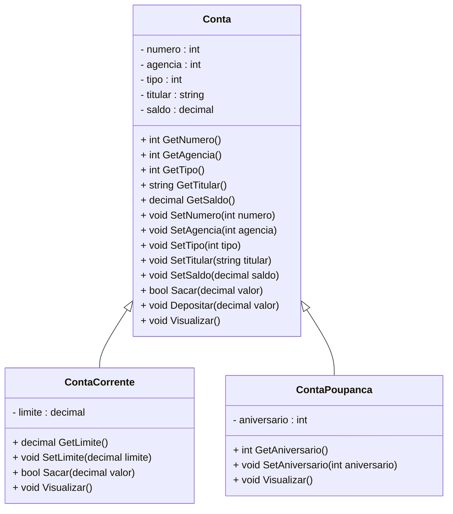

<h1>Projeto 01 - Conta Bancária - Heranças - Classe Conta</h1>

Na etapa anterior, implementamos a nossa primeira Classe Model, a Classe Conta, que define uma Conta Bancária genérica, com os Atributos comuns a toda e qualquer tipo de conta.

Nesta etapa, vamos implementar as Classes Model **ContaCorrente** e **ContaPoupanca** como **Heranças da Classe Conta**. O Diagrama de Classes do nosso Projeto ficará da seguinte forma:



<br />

<h2>👣 Passo 01 - Criar a Classe ContaCorrente herdando a Classe Conta</h2>

Agora vamos criar a **Classe ContaCorrente** no **Namespace Model**.

1. Clique com o botão direito do mouse sobre a **pasta Model** e na sequência, clique na opção **Adicionar 🡪 Classe**, como mostra a animação abaixo:

<div align="center"></div>

3. Na janela **Adicionar Novo item**, no item **Nome**, digite o nome da Classe (**ContaCorrente**), como mostra a figura abaixo:

<div align="center"></div>

4. Clique no botão **Adicionar** para concluir.
5. O Gerenciador de Soluções da aplicação ficará semelhante a imagem abaixo:

 <div align="center"></div>

6. Na imagem abaixo, vemos o código inicial da **Classe ContaCorrente**:

 <div align="left"></div>

Vamos implementar o código da **Classe ContaCorrente herdando a Classe Conta**. Vamos analisar o código abaixo:

<div align="center"></div>

**Linha 09:** Observe que o modificador de acesso da Classe foi alterado de **internal para public** e na assinatura da Classe **ContaCorrente**, vamos adicionar **:** (dois pontos) e na sequência o nome da Classe que será herdada (**Conta**). Observe que depois de adicionar a Herança, será exibido um erro na Classe ContaCorrente (indicado pela seta verde no código). 

<div align="center"></div>

Este erro indica que deve ser criado um Método Construtor na Classe Conta Corrente, contendo todos os Atributos da Classe Conta. Vamos criar o Método Construtor, entretanto devido a herança, ele será um pouco diferente do Método Construtor padrão, como veremos no código abaixo: 

<div align="center"></div>

**Linha 11:** O Método Construtor foi criado com o mesmo nome da Classe (ContaCorrente) e com os respectivos parâmetros herdados da Classe Conta. Observe que as variáveis inseridas possuem o mesmo nome e tipo dos Atributos da Classe Conta. Ao instanciar uma novo Objeto, o Método Construtor receberá todos os dados do Objeto através deste parâmetros, que serão atribuídos aos Atributos do Objeto

**Linha 12:** Observe que os Atributos da Classe Conta são acessados e modificados através do Método **base()**. Nos argumentos do Método base(), foram adicionados os parâmetros do Método Construtor ContaCorrente, que serão recebidos do Método Construtor da Classe Conta. A reutilização do código da Classe Conta, na Classe ContaCorrente é possível graças ao conceito de Herança.

<div align="center"></div>

**Linha 12:** Vamos adicionar a variável **limite**, que representa um Atributo específico da Classe ContaCorrente, que foram definidos no Diagrama de Classes acima. Observe que o Atributo possui o modificador de acesso **private**, ou seja, é acessível apenas dentro da Classe ContaCorrente. 

**Linha 15:** Vamos adicionar no Método Construtor ContaCorrente o parâmetro limite. Observe que a variável possui o mesmo nome e tipo do Atributo limite da Classe. Ao instanciar um novo Objeto da Classe ContaCorrente, o Método Construtor receberá todos os dados da Classe Conta através do Método base() e o valor do limite será recebido através do parâmetro limite, que foi adicionado na assinatura do Método Construtor da Classe ContaCorrente.

**Linha 19:** Os dados recebidos no parâmetro limite do Método Construtor da Classe ContaCorrente será atribuído ao Atributo limite da Classe ContaCorrente. Como o parâmetro possui o mesmo nome do Atributo da Classe, foi utilizada a palavra reservada **this** para diferenciar o Atributo da Classe ContaCorrente do parâmetro do Método Construtor ContaCorrente.

> **Observações Importantes!** 
>
> A palavra-chave **base** refere-se a uma **superclasse**. Ela indica a chamada ao Método Construtor da **superclasse**. Caso a **superclasse** não possua um Método Construtor e o Método Construtor da **subclasse** não chamar nenhum outro Método Construtor da **superclasse** explicitamente o compilador C# vai informar um erro.
>
> Observe que na **Classe ContaCorrente** foram declaradas apenas **as diferenças (Métodos e Atributos)** entre a **subclasse** e **superclasse**, ou seja, o reuso é automático.

<br />

<h2>👣 Passo 02 - Criar os Métodos Get e Set</h2>

Depois de criarmos os Atributos e o Método Construtor, precisamos criar os **Métodos Get e Set** para o Atributo limite da Classe ContaCorrente. Através destes Métodos, poderemos acessar e modificar os Atributos da Classe ContaCorrente a partir de outras Classes e mantermos o nosso Atributo protegido através do Encapsulamento.

A implementação dos Métodos ficará igual a imagem abaixo:

<div align="center"></div>

<br />

|  | <div align="left"> **ATENÇÃO:** *Observe que foram implementados Métodos Get e Set apenas do atributo limite. Os demais atributos herdarão os Métodos Get e Set da superclasse.* </div> |
| ------------------------------------------------------------ | ------------------------------------------------------------ |

<br />

<h2>👣 Passo 03 - Criar os Métodos Específicos</h2>

Vamos criar 2 Métodos Específicos na Classe Conta:

1. **Sacar:** Método responsável por efetuar a operação de saque na ContaCorrente. Este Método será implementado sobrescrevendo o Método Sacar da Classe Conta;
2. **Visualizar:** Método responsável por efetuar a operação de Visualizar todos os dados da ContaCorrente. Este Método será implementado sobrescrevendo o Método Visualizar da Classe Conta

Antes de sobrescrevermos estes 2 Métodos, precisamos indicar na Classe Conta, que ambos podem ser sobrescritos.

1. Abra a Classe Conta;
2. Acrescente o modificador **virtual** no Método **Sacar()**, como mostra a imagem abaixo:

 <div align="left"></div>

3. Acrescente o modificador **virtual** no Método **Visualizar()**, como mostra a imagem abaixo:

 <div align="left"></div>

<br />

> O **modificador virtual** diz que um método não tem estado definido até que  seja executado, ou seja, é "virtual". Geralmente utilizamos este  modificador para indicar que um Método poderá ser Sobrescrito na Sub Classe.

Na sequência, vamos criar os Métodos **Sacar()** e **Visualizar()** Sobrescritos na Classe ContaCorrente:

1. Volte para a Classe ContaCorrente;
2. Implemente o **Método Sobrescrito Sacar()**, igual a imagem abaixo:

 <div align="left"></div>

**Linha 33:** Foi adicionado na assinatura do Método o modificador **override**, indicando que o Método foi sobrescrito.

**Linhas 33 a 45:** O Método **Sacar()** da Classe ContaCorrente é praticamente igual ao Método Sacar() da Classe Conta. A única mudança será no laço condicional if (linha 36), que verifica se o valor do saque é menor do que o saldo disponível na conta somado com o limite da conta. Numa Conta Corrente, para obter o saldo atual da conta, será necessário somar o saldo e o limite. Observe que foram utilizados os métodos **GetSaldo()** e **GetLimite()** para obter os valores de ambos os Atributos e posteriormente somar. A palavra reservada **this** foi utilizada para fazer referência ao Objeto que está executando os Métodos.

 <div align="left"></div>

**Linha 47:** Foi adicionado na assinatura do Método o modificador **override**, indicando que o Método foi sobrescrito.

**Linha34:** Foi adicionado o comando **base.Visualizar()**, que executa o Método Visualizar() da Classe Conta. O comando base pode ser utilizado na Classe filha pra chamar qualquer Método da Classe mãe.

**Linha 35:** Através do comando de Saída **Console.WriteLine()**,, foi adicionado o Atributo limite. Para obter os dados do Atributo limite da Classe ContaCorrente, foi utilizada a palavra reservada **this**, para fazer referência ao Objeto que exibirá os dados no console, seguido do nome do Atributo que será exibido em cada linha.

> **Observações Importantes!**
>
> Observe que as assinaturas dos Métodos **Sacar e Visualizar** da Classe ContaCorrente são praticamente as mesmas da Classe Conta, entretanto eles possuem uma implementação diferente da Classe Conta, logo os Métodos **Sacar e Visualizar** da Classe Conta foram Sobrescritos na Classe ContaCorrente.
>
> Os Métodos **Sacar e Visualizar** da Classe ContaCorrente foram sobrescritos por um simples motivo: A Classe ContaCorrente **não possui acesso direto** às variáveis de instância privadas (Atributos) da **Superclasse**, ou seja, esses métodos não podem alterar diretamente uma variável de instância, embora cada objeto da Classe **ContaCorrente** tenha uma variável de instância igual a da Superclasse, logo para executarem um processamento diferente da Superclasse, eles precisam ser Sobrescritos.
>
> Um ponto de atenção importante em relação a Sobrescrita é que um **método redefinido em uma Subclasse** com o **mesmo nome** e **mesma lista de parâmetros** que o **método em uma de suas classes antecessoras**, automaticamente oculta o método da classe ancestral (superclasse) a partir da Subclasse, ou seja, ele passa a usar o Método da Subclasse.

O código completo da Classe ContaCorrente, você confere abaixo:

```c#
using System;
using System.Collections.Generic;
using System.Linq;
using System.Text;
using System.Threading.Tasks;

namespace conta_bancaria.Model
{
    public class ContaCorrente : Conta
    {
        
        private decimal limite;

        public ContaCorrente(int numero, int agencia, int tipo, string titular, 
                             decimal saldo, decimal limite) : 
            base(numero, agencia, tipo, titular, saldo)
        {

            this.limite = limite;

        }

        public decimal GetLimite()
        {
            return limite;
        }

        public void SetLimite(decimal limite)
        {
            this.limite = limite;
        }

        public override bool Sacar(decimal valor)
        {

            if (this.GetSaldo() + this.GetLimite() < valor)
            {
                Console.WriteLine("\n Saldo Insuficiente!");
                return false;
            }

            this.SetSaldo(this.GetSaldo() - valor);
            return true;

        }

        public override void Visualizar()
        {
            base.Visualizar();
            Console.WriteLine("Limite de Crédito: " + this.limite);
        }

    }
}
```

<br />

<div align="left"> <a href="https://github.com/rafaelq80/csharp_conta_bancaria/blob/04_Model_ContaCorrente/model/ContaCorrente.cs" target="_blank"><b>Código fonte: ContaCorrente</b></a></div>

<div align="left"> <a href="https://github.com/rafaelq80/csharp_conta_bancaria/blob/04_Model_ContaCorrente/model/Conta.cs" target="_blank"><b>Código fonte: Conta</b></a></div>

<br />


<h2>👣 Passo 04 - Criar a Classe ContaPoupanca herdando a Classe Conta</h2>


Agora vamos criar a **Classe ContaPoupanca** no **Namespace Model**.

1. Clique com o botão direito do mouse sobre a **pasta Model** e na sequência, clique na opção **Adicionar 🡪 Classe**, como mostra a animação abaixo:

<div align="center"></div>

3. Na janela **Adicionar Novo item**, no item **Nome**, digite o nome da Classe (**ContaPoupanca**), como mostra a figura abaixo:

<div align="center"></div>

4. Clique no botão **Adicionar** para concluir.
5. O Gerenciador de Soluções da aplicação ficará semelhante a imagem abaixo:

 <div align="center"></div>

6. Na imagem abaixo, vemos o código inicial da **Classe ContaPoupanca**:

<div align="center"></div>

<br />

|  | <div align="left"> **IMPORTANTE:** *Observe que a Classe ContaPoupanca não possui o Método main(), por não se tratar da Classe Principal do projeto.* </div> |
| ------------------------------------------------------------ | ------------------------------------------------------------ |

<br />

Vamos implementar o código da Classe ContaPoupanca herdando a Classe Conta, conforme o código abaixo:


```c#
using System;
using System.Collections.Generic;
using System.Linq;
using System.Text;
using System.Threading.Tasks;

namespace conta_bancaria.Model
{
    public class ContaPoupanca : Conta
    {
        private int aniversario;

        public ContaPoupanca(int numero, int agencia, int tipo, string titular, 
                             decimal saldo, int aniversario) 
            : base(numero, agencia, tipo, titular, saldo)
        {
            this.aniversario = aniversario;
        }

        public int GetAniversario()
        {
            return aniversario;
        }

        public void SetAniversario(int aniversario)
        {
            this.aniversario = aniversario;
        }

        public override void Visualizar()
        {
            base.Visualizar();
            Console.WriteLine("Aniversário da conta: " + this.aniversario);
        }

    }
}
```

Observe que na **Classe ContaPoupanca** foram declaradas apenas **as diferenças (Métodos e Atributos)** entre a **subclasse** e **superclasse**, ou seja, o reuso é automático. Além disso, apenas o Método **Visualizar()** foi Sobrescrito.

<br />

<div align="left"> <a href="https://github.com/rafaelq80/csharp_conta_bancaria/blob/05_Model_ContaPoupanca/model/ContaPoupanca.cs" target="_blank"><b>Código fonte: ContaPoupanca</b></a></div>

<br />

<h2>👣 Passo 05 - Atualizar a Classe Program</h2>

1. Abra a Classe Program;
2. Adicione os testes das **Classes ContaCorrente e ContaPoupanca**, como mostra a imagem abaixo:

<div align="center"></div>

Observe que foi instanciado um Objeto da Classe ContaCorrente e outro Objeto da Classe ContaPoupanca, chamando os respectivos Métodos de cada Classe. 

Execute o projeto clicando no botão **Run**. 

O resultado, você confere abaixo:

```bash
*********************************************************************
Dados da Conta:
*********************************************************************
Numero da Conta: 1
Agência: 123
Tipo da Conta: Conta Corrente
Titular: Adriana
Saldo: 10000.0

 Saldo Insuficiente!


*********************************************************************
Dados da Conta:
*********************************************************************
Numero da Conta: 1
Agência: 123
Tipo da Conta: Conta Corrente
Titular: Adriana
Saldo: 10000.0


*********************************************************************
Dados da Conta:
*********************************************************************
Numero da Conta: 1
Agência: 123
Tipo da Conta: Conta Corrente
Titular: Adriana
Saldo: 15000.0


*********************************************************************
Dados da Conta:
*********************************************************************
Numero da Conta: 2
Agência: 123
Tipo da Conta: Conta Corrente
Titular: Mariana
Saldo: 15000.0
Limite de Crédito: 1000.0


*********************************************************************
Dados da Conta:
*********************************************************************
Numero da Conta: 2
Agência: 123
Tipo da Conta: Conta Corrente
Titular: Mariana
Saldo: 3000.0
Limite de Crédito: 1000.0


*********************************************************************
Dados da Conta:
*********************************************************************
Numero da Conta: 2
Agência: 123
Tipo da Conta: Conta Corrente
Titular: Mariana
Saldo: 8000.0
Limite de Crédito: 1000.0


*********************************************************************
Dados da Conta:
*********************************************************************
Numero da Conta: 3
Agência: 123
Tipo da Conta: Conta Poupança
Titular: Victor
Saldo: 100000.0
Aniversário da conta: 15


*********************************************************************
Dados da Conta:
*********************************************************************
Numero da Conta: 3
Agência: 123
Tipo da Conta: Conta Poupança
Titular: Victor
Saldo: 99000.0
Aniversário da conta: 15


*********************************************************************
Dados da Conta:
*********************************************************************
Numero da Conta: 3
Agência: 123
Tipo da Conta: Conta Poupança
Titular: Victor
Saldo: 104000.0
Aniversário da conta: 15

menu...
```

<br />

Observe que as Operações de Saque e Depósito, efetuadas nos Objetos das Classes ContaCorrente e ContaPoupanca, foram efetuados com sucesso.

<br />


|  | <div align="left"> **ALERTA DE BSM:** *Mantenha a Atenção aos Detalhes ao executar o projeto. Observe que as linhas acima, serão exibidas antes do Menu, logo você precisará rolar a tela do Console para cima, para Visualizar os testes.* </div> |
| ------------------------------------------------------------ | ------------------------------------------------------------ |

O código completo da Classe Program, você confere abaixo:

```c#
using conta_bancaria.Model;

namespace conta_bancaria
{
    public class Program
    {
        private static ConsoleKeyInfo consoleKeyInfo;

        static void Main(string[] args)
        {

            // Teste da Classe Conta
            Conta c1 = new Conta(1, 123, 1, "Adriana", 10000.0M);
            c1.Visualizar();
            c1.Sacar(12000.0M);
            c1.Visualizar();
            c1.Depositar(5000.0M);
            c1.Visualizar();

            // Teste da Classe Conta Corrente
            ContaCorrente cc1 = new(2, 123, 1, "Mariana", 15000.0M, 1000.0M);
            cc1.Visualizar();
            cc1.Sacar(12000.0M);
            cc1.Visualizar();
            cc1.Depositar(5000.0M);
            cc1.Visualizar();

            // Teste da Classe Conta Poupança
            ContaPoupanca cp1 = new(3, 123, 2, "Victor", 100000.0M, 15);
            cp1.Visualizar();
            cp1.Sacar(1000.0M);
            cp1.Visualizar();
            cp1.Depositar(5000.0M);
            cp1.Visualizar();

            int opcao;

            while (true)
            {
                Console.BackgroundColor = ConsoleColor.Black;
                Console.ForegroundColor = ConsoleColor.Yellow;
                Console.WriteLine("*****************************************************");
                Console.WriteLine("                                                     ");
                Console.WriteLine("                BANCO DO BRAZIL COM Z                ");
                Console.WriteLine("                                                     ");
                Console.WriteLine("*****************************************************");
                Console.WriteLine("                                                     ");
                Console.WriteLine("            1 - Criar Conta                          ");
                Console.WriteLine("            2 - Listar todas as Contas               ");
                Console.WriteLine("            3 - Buscar Conta por Numero              ");
                Console.WriteLine("            4 - Atualizar Dados da Conta             ");
                Console.WriteLine("            5 - Apagar Conta                         ");
                Console.WriteLine("            6 - Sacar                                ");
                Console.WriteLine("            7 - Depositar                            ");
                Console.WriteLine("            8 - Transferir valores entre Contas      ");
                Console.WriteLine("            9 - Sair                                 ");
                Console.WriteLine("                                                     ");
                Console.WriteLine("*****************************************************");
                Console.WriteLine("Entre com a opção desejada:                          ");
                Console.WriteLine("                                                     ");
                Console.ResetColor();


                opcao = Convert.ToInt32(Console.ReadLine());

                if (opcao == 9)
                {
                    Console.BackgroundColor = ConsoleColor.Black;
                    Console.ForegroundColor = ConsoleColor.Green;
                    Console.WriteLine("\nBanco do Brazil com Z - O seu Futuro começa aqui!");
                    Sobre();
                    Console.ResetColor();
                    System.Environment.Exit(0);
                }

                switch (opcao)
                {
                    case 1:
                        Console.ForegroundColor = ConsoleColor.Green;
                        Console.WriteLine("Criar Conta\n\n");
                        Console.ResetColor();

                        KeyPress();
                        break;
                    case 2:
                        Console.ForegroundColor = ConsoleColor.Green;
                        Console.WriteLine("Listar todas as Contas\n\n");
                        Console.ResetColor();

                        KeyPress();
                        break;
                    case 3:
                        Console.ForegroundColor = ConsoleColor.Green;
                        Console.WriteLine("Consultar dados da Conta - por número\n\n");
                        Console.ResetColor();

                        KeyPress();
                        break;
                    case 4:
                        Console.ForegroundColor = ConsoleColor.Green;
                        Console.WriteLine("Atualizar dados da Conta\n\n");
                        Console.ResetColor();

                        KeyPress();
                        break;
                    case 5:
                        Console.ForegroundColor = ConsoleColor.Green;
                        Console.WriteLine("Apagar a Conta\n\n");
                        Console.ResetColor();

                        KeyPress();
                        break;
                    case 6:
                        Console.ForegroundColor = ConsoleColor.Green;
                        Console.WriteLine("Saque\n\n");
                        Console.ResetColor();

                        KeyPress();
                        break;
                    case 7:
                        Console.ForegroundColor = ConsoleColor.Green;
                        Console.WriteLine("Depósito\n\n");
                        Console.ResetColor();

                        KeyPress();
                        break;
                    case 8:
                        Console.ForegroundColor = ConsoleColor.Green;
                        Console.WriteLine("Transferência entre Contas\n\n");
                        Console.ResetColor();

                        KeyPress();
                        break;
                    default:
                        Console.ForegroundColor = ConsoleColor.Red;
                        Console.WriteLine("\nOpção Inválida!\n");
                        Console.ResetColor();

                        KeyPress();
                        break;
                }
            }
        }

        static void Sobre()
        {
            Console.WriteLine("\n*********************************************************");
            Console.WriteLine("Projeto Desenvolvido por: ");
            Console.WriteLine("Generation Brasil - generation@generation.org");
            Console.WriteLine("github.com/conteudoGeneration");
            Console.WriteLine("*********************************************************");

        }

        static void KeyPress()
        {
            do
            {
                Console.Write("\nPressione Enter para Continuar...\"");
                consoleKeyInfo = Console.ReadKey();
            } while (consoleKeyInfo.Key != ConsoleKey.Enter);
        }

    }

}
```

<br />

<div align="left"> <a href="https://github.com/rafaelq80/csharp_conta_bancaria/blob/05_Model_ContaPoupanca/Program.cs" target="_blank"><b>Código fonte: Program</b></a></div>

<br />

<div align="left"> <a href="https://github.com/rafaelq80/csharp_conta_bancaria/tree/05_Model_ContaPoupanca" target="_blank"><b>Código fonte: Projeto Conta Bancária</b></a></div>

<br /><br />

<div align="left"><a href="README.md">Voltar</a></div>