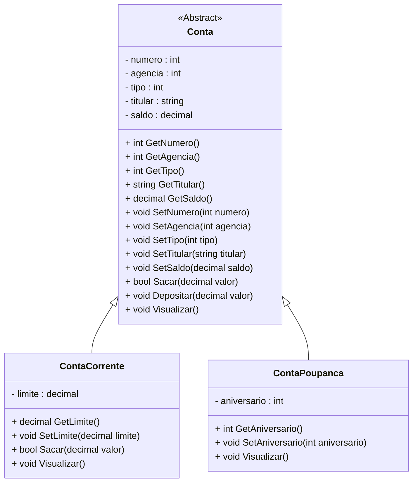

<h1>Projeto 01 - Conta Bancária - Classes Abstratas - Classe Conta</h1>

Na etapa anterior, implementamos as Classes Model **ContaCorrente** e **ContaPoupanca** como **Heranças da Classe Conta**. 

Nesta etapa, vamos transformar a Classe **Conta** em uma **Classe Abstrata**. O Diagrama de Classes do nosso Projeto ficará da seguinte forma:



<br />

<h2>👣 Passo 01 - Implementar a Classe Conta como Classe Abstrata</h2>

1. Abra a Classe **Conta**:

2. Adicione o modificador **abstract** na assinatura da Classe **Conta**, conforme indicado na imagem abaixo:

<div align="center"></div>

3. O código completo da Classe **Conta**, você confere abaixo:

```c#
using System;
using System.Collections.Generic;
using System.Linq;
using System.Text;
using System.Threading.Tasks;

namespace conta_bancaria.Model
{
    public abstract class Conta
    {
        private int numero;
        private int agencia;
        private int tipo;
        private string titular;
        private decimal saldo;

        public Conta(int numero, int agencia, int tipo, string titular, decimal saldo)
        {
            this.numero = numero;
            this.agencia = agencia;
            this.tipo = tipo;
            this.titular = titular;
            this.saldo = saldo;
        }

        public int GetNumero()
        {
            return numero;
        }

        public void SetNumero(int numero)
        {
            this.numero = numero;
        }

        public int GetAgencia()
        {
            return agencia;
        }

        public void SetAgencia(int agencia)
        {
            this.agencia = agencia;
        }

        public int GetTipo()
        {
            return tipo;
        }

        public void SetTipo(int tipo)
        {
            this.tipo = tipo;
        }

        public string GetTitular()
        {
            return titular;
        }

        public void SetTitular(string titular)
        {
            this.titular = titular;
        }

        public decimal GetSaldo()
        {
            return saldo;
        }

        public void SetSaldo(decimal saldo)
        {
            this.saldo = saldo;
        }

        public virtual bool Sacar(decimal valor)
        {

            if (this.GetSaldo() < valor)
            {
                Console.WriteLine("\n Saldo Insuficiente!");
                return false;
            }

            this.SetSaldo(this.saldo - valor);
            return true;
        }

        public void Depositar(decimal valor)
        {
            this.SetSaldo(this.saldo + valor);
        }

        public virtual void Visualizar()
        {

            string tipo = "";

            switch (this.tipo)
            {
                case 1:
                    tipo = "Conta Corrente";
                    break;
                case 2:
                    tipo = "Conta Poupança";
                    break;
            }

            Console.WriteLine("\n\n*********************************************************************");
            Console.WriteLine("Dados da Conta:");
            Console.WriteLine("*********************************************************************");
            Console.WriteLine("Numero da Conta: " + this.numero);
            Console.WriteLine("Agência: " + this.agencia);
            Console.WriteLine("Tipo da Conta: " + tipo);
            Console.WriteLine("Titular: " + this.titular);
            Console.WriteLine("Saldo: " + this.saldo);

        }

    }
}
```

Observe que a única alteração implementada na Classe Conta foi a adição do modificador **abstract** na assinatura da Classe.

<br />

<div align="left"> <a href="https://github.com/rafaelq80/csharp_conta_bancaria/blob/06_Repository_ContaRepository/model/Conta.cs" target="_blank"><b>Código fonte: Conta</b></a></div>

<br />

<h2>👣 Passo 02 - Remover o Objeto da Classe Conta da Classe Program</h2>

Como a Classe Conta se tornou uma Classe Abstrata, **não é possível instanciar Objetos desta Classe**. Observe na imagem abaixo, que depois de salvar a Classe Conta, automaticamente a Classe Program apresentou uma indicação de erro:

<div align="center"></div>

Para corrigir o erro, precisamos remover o Objeto da Classe Conta, que foi criado na Classe Program, para testes.

1. Abra a Classe Program;
2. Apague o Objeto da Classe Conta, que foi criado na Classe Program, conforme indicado na imagem abaixo:

<div align="center"></div>

3. O código completo da Classe Program, você confere abaixo:

```c#
using conta_bancaria.Model;

namespace conta_bancaria
{
    public class Program
    {
        private static ConsoleKeyInfo consoleKeyInfo;

        static void Main(string[] args)
        {

            // Teste da Classe Conta Corrente
            ContaCorrente cc1 = new(2, 123, 1, "Mariana", 15000.0M, 1000.0M);
            cc1.Visualizar();
            cc1.Sacar(12000.0M);
            cc1.Visualizar();
            cc1.Depositar(5000.0M);
            cc1.Visualizar();

            // Teste da Classe Conta Poupança
            ContaPoupanca cp1 = new(3, 123, 2, "Victor", 100000.0M, 15);
            cp1.Visualizar();
            cp1.Sacar(1000.0M);
            cp1.Visualizar();
            cp1.Depositar(5000.0M);
            cp1.Visualizar();

            int opcao;

            while (true)
            {
                Console.BackgroundColor = ConsoleColor.Black;
                Console.ForegroundColor = ConsoleColor.Yellow;
                Console.WriteLine("*****************************************************");
                Console.WriteLine("                                                     ");
                Console.WriteLine("                BANCO DO BRAZIL COM Z                ");
                Console.WriteLine("                                                     ");
                Console.WriteLine("*****************************************************");
                Console.WriteLine("                                                     ");
                Console.WriteLine("            1 - Criar Conta                          ");
                Console.WriteLine("            2 - Listar todas as Contas               ");
                Console.WriteLine("            3 - Buscar Conta por Numero              ");
                Console.WriteLine("            4 - Atualizar Dados da Conta             ");
                Console.WriteLine("            5 - Apagar Conta                         ");
                Console.WriteLine("            6 - Sacar                                ");
                Console.WriteLine("            7 - Depositar                            ");
                Console.WriteLine("            8 - Transferir valores entre Contas      ");
                Console.WriteLine("            9 - Sair                                 ");
                Console.WriteLine("                                                     ");
                Console.WriteLine("*****************************************************");
                Console.WriteLine("Entre com a opção desejada:                          ");
                Console.WriteLine("                                                     ");
                Console.ResetColor();


                opcao = Convert.ToInt32(Console.ReadLine());

                if (opcao == 9)
                {
                    Console.BackgroundColor = ConsoleColor.Black;
                    Console.ForegroundColor = ConsoleColor.Green;
                    Console.WriteLine("\nBanco do Brazil com Z - O seu Futuro começa aqui!");
                    Sobre();
                    Console.ResetColor();
                    System.Environment.Exit(0);
                }

                switch (opcao)
                {
                    case 1:
                        Console.ForegroundColor = ConsoleColor.Green;
                        Console.WriteLine("Criar Conta\n\n");
                        Console.ResetColor();

                        KeyPress();
                        break;
                    case 2:
                        Console.ForegroundColor = ConsoleColor.Green;
                        Console.WriteLine("Listar todas as Contas\n\n");
                        Console.ResetColor();

                        KeyPress();
                        break;
                    case 3:
                        Console.ForegroundColor = ConsoleColor.Green;
                        Console.WriteLine("Consultar dados da Conta - por número\n\n");
                        Console.ResetColor();

                        KeyPress();
                        break;
                    case 4:
                        Console.ForegroundColor = ConsoleColor.Green;
                        Console.WriteLine("Atualizar dados da Conta\n\n");
                        Console.ResetColor();

                        KeyPress();
                        break;
                    case 5:
                        Console.ForegroundColor = ConsoleColor.Green;
                        Console.WriteLine("Apagar a Conta\n\n");
                        Console.ResetColor();

                        KeyPress();
                        break;
                    case 6:
                        Console.ForegroundColor = ConsoleColor.Green;
                        Console.WriteLine("Saque\n\n");
                        Console.ResetColor();

                        KeyPress();
                        break;
                    case 7:
                        Console.ForegroundColor = ConsoleColor.Green;
                        Console.WriteLine("Depósito\n\n");
                        Console.ResetColor();

                        KeyPress();
                        break;
                    case 8:
                        Console.ForegroundColor = ConsoleColor.Green;
                        Console.WriteLine("Transferência entre Contas\n\n");
                        Console.ResetColor();

                        KeyPress();
                        break;
                    default:
                        Console.ForegroundColor = ConsoleColor.Red;
                        Console.WriteLine("\nOpção Inválida!\n");
                        Console.ResetColor();

                        KeyPress();
                        break;
                }
            }
        }

        static void Sobre()
        {
            Console.WriteLine("\n*********************************************************");
            Console.WriteLine("Projeto Desenvolvido por: ");
            Console.WriteLine("Generation Brasil - generation@generation.org");
            Console.WriteLine("github.com/conteudoGeneration");
            Console.WriteLine("*********************************************************");

        }

        static void KeyPress()
        {
            do
            {
                Console.Write("\nPressione Enter para Continuar...\"");
                consoleKeyInfo = Console.ReadKey();
            } while (consoleKeyInfo.Key != ConsoleKey.Enter);
        }

    }

}
```

4. Salve e execute o projeto clicando no botão **Run**. 

5. O resultado, você confere abaixo:

   ```bash
   *********************************************************************
   Dados da Conta:
   *********************************************************************
   Numero da Conta: 2
   Agência: 123
   Tipo da Conta: Conta Corrente
   Titular: Mariana
   Saldo: 15000.0
   Limite de Crédito: 1000.0
   
   
   *********************************************************************
   Dados da Conta:
   *********************************************************************
   Numero da Conta: 2
   Agência: 123
   Tipo da Conta: Conta Corrente
   Titular: Mariana
   Saldo: 3000.0
   Limite de Crédito: 1000.0
   
   
   *********************************************************************
   Dados da Conta:
   *********************************************************************
   Numero da Conta: 2
   Agência: 123
   Tipo da Conta: Conta Corrente
   Titular: Mariana
   Saldo: 8000.0
   Limite de Crédito: 1000.0
   
   
   *********************************************************************
   Dados da Conta:
   *********************************************************************
   Numero da Conta: 3
   Agência: 123
   Tipo da Conta: Conta Poupança
   Titular: Victor
   Saldo: 100000.0
   Aniversário da conta: 15
   
   
   *********************************************************************
   Dados da Conta:
   *********************************************************************
   Numero da Conta: 3
   Agência: 123
   Tipo da Conta: Conta Poupança
   Titular: Victor
   Saldo: 99000.0
   Aniversário da conta: 15
   
   
   *********************************************************************
   Dados da Conta:
   *********************************************************************
   Numero da Conta: 3
   Agência: 123
   Tipo da Conta: Conta Poupança
   Titular: Victor
   Saldo: 104000.0
   Aniversário da conta: 15
   
   Menu...
   ```

<br />

Observe que o Objeto da Classe Conta foi removido.

<br />


|  | <div align="left"> **ALERTA DE BSM:** *Mantenha a Atenção aos Detalhes ao executar o projeto. Observe que as linhas acima, serão exibidas antes do Program, logo você precisará rolar a tela do Console para cima, para visualizar os testes.* </div> |
| ------------------------------------------------------------ | ------------------------------------------------------------ |

<br />

<div align="left"> <a href="https://github.com/rafaelq80/csharp_conta_bancaria/blob/06_Repository_ContaRepository/Program.cs" target="_blank"><b>Código fonte: Program</b></a></div>

<br />

<div align="left"> <a href="https://github.com/rafaelq80/csharp_conta_bancaria/tree/06_Repository_ContaRepository" target="_blank"><b>Código fonte: Projeto Conta Bancária</b></a></div>

<br /><br />

<div align="left"><a href="README.md">Voltar</a></div>