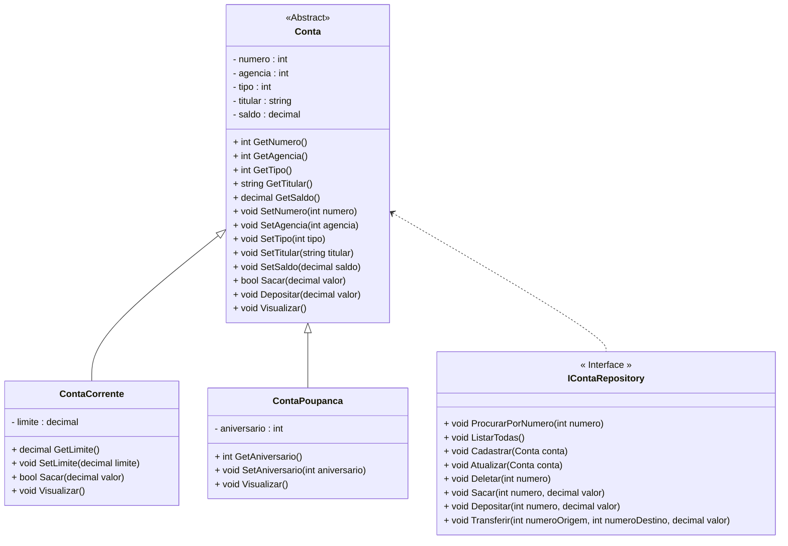

<h1>Projeto 01 - Conta Bancária - Interface - Interface IContaRepository</h1>

Na etapa anterior, implementamos a Classe **Conta** como uma Classe **Abstrata**. 

Nesta etapa, vamos criar a Interface **IContaRepository**, que fornecerá a assinatura dos Métodos necessários para manipular os Objetos das Classes **ContaCorrente** e **ContaPoupanca**, que posteriormente serão armazenados em uma Collection. 

Os Métodos da Interface IContaRepository, posteriormente, serão implementados em uma Classe, de modo a manter os detalhes da implementação (Métodos Construtores, Get e Set, por exemplo), encapsulados na nova Classe. A Interface fornece apenas as assinaturas dos Métodos. O Diagrama de Classes do nosso Projeto ficará da seguinte forma:



<br />

<h2>👣 Passo 01 - Criar a pasta Repository</h2>

Dentro do projeto **contabancaria**, vamos criar a pasta **Repository** (Namespace **Repository**):

1. No lado direito superior, na Guia **Gerenciador de Soluções**, clique com o botão direito do mouse sobre o projeto  **contabancaria** e clique na opção **Adicionar 🡪 Nova Pasta**, como mostra a animação abaixo:

<div align="center"></div>

2. Digite o nome da pasta (**Repository**), com a primeira letra maiúscula, seguindo o padrão do C# e pressione **enter** para concluir. O Gerenciador de Soluções da aplicação ficará semelhante a imagem abaixo:

<div align="center"></div>

<br />

<h2>👣 Passo 02 - Criar a Interface IContaRepository</h2>


Agora vamos criar a **Classe Conta** no **Namespace Repository**.

1. Clique com o botão direito do mouse sobre a **pasta Repository** e na sequência, clique na opção **Adicionar 🡪 Novo Item...**, como mostra a animação abaixo:

<div align="center"></div>

3. Na janela **Adicionar Novo item**, selecione a opção **Interface**, como mostra a figura abaixo:

<div align="center"></div>

4. No item **Nome**, digite o nome da Interface (**IContaRepository**), como mostra a figura abaixo:

<div align="center"></div>

5. Clique no botão **Adicionar** para concluir.
6. O Gerenciador de Soluções da aplicação ficará semelhante a imagem abaixo:

 <div align="center"></div>

7. Na imagem abaixo, vemos o código inicial da **Interface IContaRepository**:

 <div align="left"></div>


Vamos implementar e analisar o código da **Interface IContaRepository**:

 <div align="left"></div>

**Linhas 8 a 12:** Criamos as assinaturas dos 5 Métodos do CRUD (Criar, Listar todas, Consultar pelo numero, Atualizar e Deletar), da Classe Conta. Estes Métodos serão implementados na **Classe ContaController**, que será implementada nas próximas Tarefas do Projeto Conta Bancária. 

**Linhas 15 a 17:** Criamos as assinaturas dos 3 Métodos de Operações Bancárias (Sacra, Depositar e Transferir), da Classe Conta. Estes Métodos também serão implementados na **Classe ContaController**, que será implementada nas próximas Tarefas do Projeto Conta Bancária. 

O Código completo da Interface **IContaRepository**, você confere abaixo:

```c#
using conta_bancaria.Model;

namespace conta_bancaria.Repository
{
    public interface IContaRepository
    {
        // CRUD da Classe Conta
        public void ProcurarPorNumero(int numero);
        public void ListarTodas();
        public void Cadastrar(Conta conta);
        public void Atualizar(Conta conta);
        public void Deletar(int numero);

        // Métodos Bancários
        public void Sacar(int numero, decimal valor);
        public void Depositar(int numero, decimal valor);
        public void Transferir(int numeroOrigem, int numeroDestino, decimal valor);
    }
}
```

6. Salve e execute o projeto clicando no botão **Run**. 

Observe que não houve nenhuma mudança visível no projeto. Nas próximas tarefas, os Métodos assinados na Interface IContaRepository serão implementados na Classe ContaController.

<br />

<div align="left"> <a href="https://github.com/rafaelq80/csharp_conta_bancaria/blob/06_Repository_ContaRepository/repository/IContaRepository.cs" target="_blank"><b>Código fonte: IContaRepository</b></a></div>

<br />

<div align="left"> <a href="https://github.com/rafaelq80/csharp_conta_bancaria/tree/06_Repository_ContaRepository" target="_blank"><b>Código fonte: Projeto Conta Bancária</b></a></div>

<br /><br />

<div align="left"><a href="README.md">Voltar</a></div>