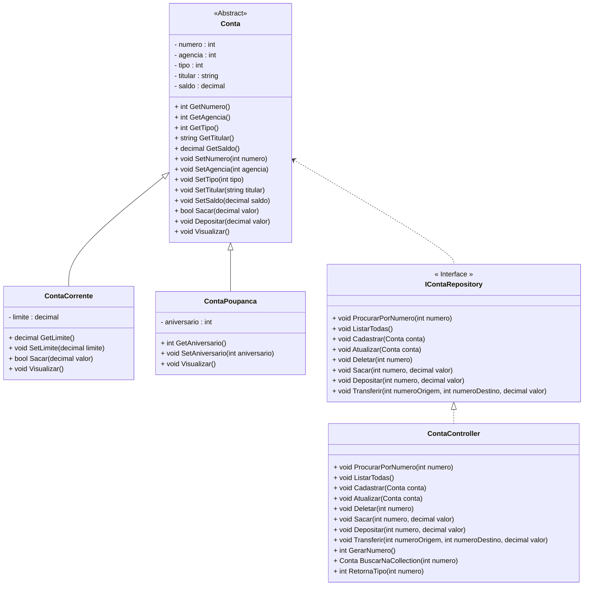

<h1>Projeto 01 - Conta Bancária - ContaController - Parte I</h1>


Na etapa anterior, implementamos a Interface **IContaRepository**, onde foram assinados 5 Métodos do CRUD (Criar Conta, Consultar todas as Contas, Consultar Conta pelo número, Atualizar dados da Conta e Apagar Conta) e 3 Métodos Bancários (Saque, Depósito e Transferência). 

Nesta etapa, vamos criar a Classe **ContaController**, que implementará a Interface **ContaRepository**, que possui a assinatura dos Métodos necessários para manipular os Objetos das Classes **ContaCorrente** e **ContaPoupanca**, e armazená-los em uma Collection do tipo List (Classe ArrayList). Além dos Métodos da Interface **IContaRepository**, também serão implementados 3 Métodos auxiliares (Gerar Numero da Conta, Buscar Conta na Collection e Retornar Tipo da Conta).

O Diagrama de Classes do nosso Projeto ficará da seguinte forma:



<br />

<h2>👣 Passo 01 - Criar o Pasta Controller</h2>

Dentro do projeto **contabancaria**, vamos criar a pasta **Controller** (Namespace **Controller**):

1. No lado direito superior, na Guia **Gerenciador de Soluções**, clique com o botão direito do mouse sobre o projeto  **contabancaria** e clique na opção **Adicionar 🡪 Nova Pasta**, como mostra a animação abaixo:

<div align="center"></div>

2. Digite o nome da pasta (**Controller**), com a primeira letra maiúscula, seguindo o padrão do C# e pressione **enter** para concluir. O Gerenciador de Soluções da aplicação ficará semelhante a imagem abaixo:

<div align="center"></div>

<br />

<h2>👣 Passo 02 - Criar a Classe ContaController</h2>

Agora vamos criar a **Classe ContaController** no **Namespace Controller**.

1. Clique com o botão direito do mouse sobre a **pasta Controller** e na sequência, clique na opção **Adicionar 🡪 Classe**, como mostra a animação abaixo:

<div align="center"></div>

3. Na janela **Adicionar Novo item**, no item **Nome**, digite o nome da Classe (**ContaController**), como mostra a figura abaixo:

<div align="center"></div>

4. Clique no botão **Adicionar** para concluir.
5. O Gerenciador de Soluções da aplicação ficará semelhante a imagem abaixo:

 <div align="center"></div>

6. Na imagem abaixo, vemos o código inicial da **Classe ContaController**:

 <div align="left"></div>

Vamos implementar o código da Classe **ContaController** aos poucos, Método a Método. Após a implementação de cada Método, faremos as alterações necessárias na Classe Program, para utilizar os Métodos e faremos os respectivos testes.

Vamos começar implementando a Interface IContaRepository na Classe ContaController, através do código abaixo:

 <div align="left"></div>

**Linha 10:** Observe que o modificador de acesso da Classe foi alterado de **internal para public** e na assinatura da Classe **ContaController**, vamos adicionar **:** (dois pontos) e na sequência o nome da Interface que será herdada (**IContaRepository**). Observe que depois de adicionar a Interface, será exibido um erro na Classe ContaController (indicado pela seta verde no código). 

A mensagem de erro, informa que a Classe ContaController deve implementar todos os Métodos da Interface IContaRepository, independente de utilizá-los ou não. 

Vamos implementar todos os Métodos da Interface IContaRepository através da **Ferramenta Ações Rápidas** . 

> A Ferramenta **Ações Rápidas** tem por objetivo principal corrigir e/ou sugerir correções para erros no código que podem fazer com que o build (compilar e gerar o executável) da aplicação falhe.

A animação abaixo mostra como implementar todos os Métodos da Interface IContaRepository na Classe ContaController:

 <div align="left"></div>

*Ao posicionar o cursor do mouse sobre o erro, o Visual Studio exibirá uma lâmpada (), sugerindo correções. Clique na primeira sugestão: **Implementar a Interface**. Observe que todos os 8 Métodos da Interface serão inseridos na Classe ContaController, com uma implementação básica.*

Na sequência, vamos criar a Collection List que irá armazenar os dados de todas as Contas, funcionando como um Banco de dados em Memória da nossa aplicação.

 <div align="left"></div>

**Linha 14:** Criamos uma **Collection List**, do tipo Conta (Classe Abstrata), chamada **listaContas**. 

Observe que foi adicionado o modificador **readonly** na Collection List, por se tratar de um atributo inicializado com um valor (vazio). Em uma declaração de campo, readonly indicamos que a atribuição ao campo só pode ocorrer como parte da declaração ou em um construtor na mesma classe. Um campo readonly pode ser atribuído e reatribuído várias vezes na declaração de campo ou no no Método Construtor.

**Linha 15:** Criamos uma variável do tipo **int** chamada **numero**, que armazenará o numero da última conta que foi criada, funcionando como uma Chave Primária auto incremental. 

<br />

<div align="left"> <a href="https://learn.microsoft.com/pt-br/dotnet/csharp/language-reference/keywords/readonly" target="_blank"><b>Documentação: Modificador readonly</b></a></div>

<br />

<h2>Como a Colection List irá armazenar os dados?</h2>

Na imagem abaixo, temos uma representação gráfica da Collection List **listaContas**:

 <div align="left"></div>

Observe que a Collection **listaContas**, será do tipo **Conta** (Super Classe) e cada novo Objeto das suas respectivas Sub-Classes, que estendem (herdam) a Classe Conta, será adicionado em uma linha da CollectionList. Assim como os vetores, cada linha é identificada por um número inteiro (índice).

A Collection List sempre respeita a ordem em que o Objeto foi inserido, ou seja, a cada novo Objeto inserido, uma nova linha será criada após o último Objeto adicionado.

|  | <div align="left"> **ATENÇÃO:** Embora a Collection listaContas seja do tipo Conta (Classe Abstrata), ela consegue armazenar Objetos do tipo ContaCorrente e ContaPoupanca, por se tratarem de Classes que Herdam as características da Classe Conta. Esse conceito é chamado de Polimorfismo de Inserção.</div> |
| ------------------------------------------------------------ | ------------------------------------------------------------ |

<br />

<h2>👣 Passo 03 - Implementar o Método Listar todas as Contas</h2>

Na sequência, vamos implementar o Método Listar todas as Contas, através do código abaixo:

<div align="center"></div>

**Linha 37:** Observe que na assinatura do Método não foi inserido nenhum parâmetro, porque o Método exibirá todos os  Objetos da Classe Conta, armazenados na Collection **listaContas**.

**Linha 40:** Através do Laço de Repetição **foreach**, percorremos toda a **Collection listaContas**. 

Observe que a variável local **conta**, utilizada para receber um Objeto da Classe Conta a cada iteração da Collection, definida pelo Laço de repetição, foi criada através da palavra reservada **var**.

> **var:** É uma palavra reservada do C#, que tem o objetivo de criar variáveis locais, sem a definição do tipo. O tipo da variável é definido por inferência, ou seja, a palavra reservada var define o tipo da variável através do valor de inicialização da variável.
>
> **Exemplo:** 
>
> ```java
> var teste = 1;
> ```
>
> Como o valor atribuído é um inteiro, a palavra reservada **var** entende que esta variável deve ser criada com o tipo **int** (integer), ou seja, o equivalente ao código abaixo:
>
> ```java
> int teste = 1;
> ```
> <br />


No código do Método **ListarTodas()**, como o Laço de Repetição está percorrendo a Collection listaContas, que armazena Objetos da Classe Conta, a palavra reservada **var** entende por inferência, que a variável **conta** deve ser criada como um Objeto da Classe Conta.

**Linha 41:** Exibe os dados do Objeto da Classe Conta armazenado na variável **conta**, através do Método **Visualizar()**, que foi criado na Classe Model **Conta** e Herdado pelas Classes **ContaCorrente** e **ContaPoupanca**.

<br />

<h2>👣 Passo 04 - Inserir o Método Listar todas as Contas na Classe Program</h2>

Agora que implementamos o Método Listar todas as Contas e inserir uma chamada para este Método no Menu:

1. Na Classe Program, Insira a linha de código abaixo (indicado por uma seta verde), no início do Método Main():

<div align="center"></div>

**Linha 14:** Cria um Objeto da Classe **ContaController**, para armazenar os dados das contas na Collection listaContas e executar os Métodos do CRUD e os Métodos Bancários.

2. Ainda na Classe Program, localize o trecho de código abaixo:

<div align="center"></div>

3. Insira a linha de código abaixo (indicado por uma seta verde):

<div align="center"></div>

**Linha 95:** Executa o Método **ListarTodas()**, da Classe **ContaController**, para listar os dados de todas as contas armazenadas na Collection **listaContas**.

Salve e Execute o projeto clicando no botão **Run**. 

1. Será aberto o Menu, que deve ser semelhante ao da figura abaixo:

<div align="center"></div>

2. Digite a opção **2** (indicado com uma seta verde na imagem acima) e veja o resultado abaixo:

```bash
Listar todas as Contas


Pressione Enter para Continuar...

```

Observe que não foram exibidos os dados de nenhuma conta, porque as contas que nós criamos para teste não foram inseridas na Collection **listaContas**, logo ela está vazia. Para inserirmos dados na Collection **listaContas**, precisamos implementar o Método **Cadastrar(conta)**.

<br />

<h2>👣 Passo 05 - Criar o Método Cadastrar Conta</h2>

Na sequência, vamos implementar o Método Cadastrar Conta, através do código abaixo:

<div align="center"></div>

**Linha 23:** Observe que na assinatura do Método, foi inserido como parâmetro um Objeto da Classe Conta, chamado **conta**. Este Objeto será adicionado na Collection **listaContas**.

**Linha 25:** Para inserir um novo Objeto da Classe Conta, utilizamos o Método **Add()**, da Collection **List**, passando como parâmetro o Objeto da Classe Conta, chamado **conta**.

**Linha 26:** Exibe uma mensagem no console, indicando que o Objeto da Classe Conta, chamado **conta** foi adicionado na Collection **listaContas**. Para identificar a conta que foi criada, utilizamos o Método **GetNumero()**, da Classe Model Conta, que retornará o número da conta.

Para gerar automaticamente o número da conta, vamos criar o Método auxiliar **GerarNumero()**, no final da Classe ContaController, através do código abaixo:

<div align="center"></div>

**Linha 66:** Observe que na assinatura do Método não foi inserido nenhum parâmetro, porque o Método tem como único Objetivo retornar o número da conta todas as vezes que uma nova conta for cadastrada.

**Linha 68:** Como a variável numero foi inicializada com zero (0), vamos incrementar a variável através do operador de **pré-incremento (++)**, incrementando de 1 em 1, a cada nova conta que for criada. Este número será retornado como o número da nova Conta. Desta forma, automatizaremos o processo de geração do número da conta, através de uma sequência:

- **1º conta criada** 🡒 *numero = 1*
- **2º conta criada** 🡒 *numero = 2*
- ...
- **N conta criada** 🡒 *numero = N*

|  | <div align="left"> **IMPORTANTE:** Na prática, este Método simula a Chave Primária de um Banco de dados, do tipo auto incremental, que será tema de estudo do Bloco 2.</div> |
| ------------------------------------------------------------ | ------------------------------------------------------------ |

Para gerar o Objeto da Classe Conta, precisamos receber os dados da Conta, via teclado. Para receber os dados via teclado, precisamos criar um "formulário" para cadastrar os dados da Conta através dos Comandos de Entrada e Saída.

<br />

<h2>👣 Passo 06 - Inserir o Método Cadastrar Conta na Classe Program</h2>

Agora que implementamos o Método Cadastrar Conta, vamos inserir uma chamada para este Método na Classe Program:

Para Criar uma nova conta, precisamos criar as entradas de dados, ou seja, criar um formulário de cadastro. Para começar, vamos criar algumas variáveis, que irão armazenar temporariamente os dados da nova conta.

1. Crie as novas variáveis na Classe Program, como mostra o trecho de código abaixo:

<div align="center"></div>

<br />

|  | <div align="left"> **ALERTA DE BSM:** *Mantenha a Atenção aos Detalhes ao criar as novas  variáveis na Classe Program. A variável *opcao*, já havia sido criada na construção da Classe Program.* </div> |
| ------------------------------------------------------------ | ------------------------------------------------------------ |

<br />

2. O trecho acima, cria as seguintes variáveis:

| Nome        | Tipo    | Descrição                                                    |
| ----------- | ------- | ------------------------------------------------------------ |
| numero      | int     | Numero da conta                                              |
| agencia     | int     | Numero da agência                                            |
| tipo        | int     | Tipo da conta:<br />**1**: *Conta Corrente*<br />**2**: *Conta Poupança* |
| aniversario | int     | Dia do aniversário da Conta Poupança                         |
| titular     | string  | Nome do titular da conta                                     |
| saldo       | decimal | Saldo disponível na conta                                    |
| limite      | decimal | Limite de crédito da conta corrente                          |

<br />

Variáveis criadas, vamos criar o formulário de cadastro e criar a chamada para o Método Cadastrar na Classe Program

1. Na Classe Program, localize o trecho de código abaixo:

<div align="center"></div>

2. Insira o trecho de código abaixo:

<div align="center"></div>

**Linhas 91 a 94:** Foram criadas as entradas de dados via teclado para as variáveis **agencia** e **titular**.

**Linha 96:** Verifica se a variável titular é nula, através do **Operador de Coalescência** (??). Caso seja nula, será retornada uma string vazia.

> O **Operador de Coalescência nula** `??` retornará o valor do operando esquerdo se não for `null`. Caso contrário, ele avaliará o operando direito e retornará seu resultado. O operador `??` não avaliará o operando do lado direito se o operando esquerdo for avaliado como não nulo.
>
> <br />
>
> <div align="left"> <a href="https://learn.microsoft.com/pt-br/dotnet/csharp/language-reference/operators/null-coalescing-operator" target="_blank"><b>Documentação: Operador de Coalescência</b></a></div>
>
> <br />

**Linhas 98 a 102:** Foi criado um Laço de repetição **do...while**, para garantir que a variável **tipo** receba via teclado somente os números **1** - *Conta Corrente ou **2** - *Conta Poupança*.

**Linhas 104 a 105:** Foi criada a entrada de dados via teclado para a variável **saldo**.

**Linhas 107 a 121:** Foi criado um Laço condicional do tipo **Switch**, que checará qual o tipo da conta. 

- Caso a conta seja do tipo **Conta Corrente (tipo 1)**, solicita a entrada de dados via teclado para a variável **limite** e executa o Método **cadastrar** da Classe **ContaController**.
- Caso a conta seja do tipo **Conta Poupança (tipo 2)**, solicita a entrada de dados via teclado para a variável **aniversario** e executa o Método **cadastrar** da Classe **ContaController**.

**Linha 112:** Observe que dentro do Método **Cadastrar** foi criado um Objeto da Classe **ContaCorrente**, composto pelos valores das variáveis auxiliares, que receberam dados via teclado. O Atributo **numero**, foi preenchido com o Método auxiliar **GerarNumero()**, criado na Classe **ContaController**.

**Linha 118:** Observe que dentro do Método **Cadastrar** foi criado um Objeto da Classe **ContaPoupanca**, composto pelos valores das variáveis auxiliares, que receberam dados via teclado. O Atributo **numero**, foi preenchido com o Método auxiliar **GerarNumero()**, criado na Classe **ContaController**.

Execute o projeto clicando no botão **Run**. 

1. Será aberto o Menu, semelhante ao da figura abaixo:

<div align="center"></div>

2. Digite a opção **1** e faça o Cadastro de uma nova Conta Corrente, como mostra o console abaixo:

```bash
Criar Conta

Digite o Numero da Agência: 
123
Digite o Nome do Titular: 
João da Silva
Digite o Tipo da Conta (1-CC ou 2-CP): 
1
Digite o Saldo da Conta (R$): 
1000
Digite o Limite de Crédito (R$): 
500

A Conta número: 1 foi criada com sucesso!


Pressione Enter para Continuar...

```

3. Observe que a Conta foi Cadastrada com sucesso. Pressione a tecla enter e crie uma Conta Poupança:

```bash
Criar Conta

Digite o Numero da Agência: 
456
Digite o Nome do Titular: 
Maria da Silva
Digite o Tipo da Conta (1-CC ou 2-CP): 
2
Digite o Saldo da Conta (R$): 
2000
Digite o dia do Aniversario da Conta: 
10

A Conta número: 2 foi criada com sucesso!


Pressione Enter para Continuar...
```

4. Digite a opção 2 (indicado com uma seta verde na imagem abaixo):

<div align="center"></div>

5. Veja o resultado abaixo:

```bash
Listar todas as Contas

*********************************************************************
Dados da Conta:
*********************************************************************
Numero da Conta: 1
Agência: 123
Tipo da Conta: Conta Corrente
Titular: João da Silva
Saldo: 1000.0
Limite de Crédito: 500.0


*********************************************************************
Dados da Conta:
*********************************************************************
Numero da Conta: 2
Agência: 456
Tipo da Conta: Conta Poupança
Titular: Maria da Silva
Saldo: 2000.0
Aniversário da conta: 10

Pressione Enter para Continuar...

```

Observe que desta vez foram exibidos os dados das 2 contas cadastradas, porque as contas foram inseridas na Collection **listaContas**.

Como a Collection **listaContas** não persiste (grava) os dados de forma definitiva, como um Banco de dados, daria muito trabalho criar novas contas todas as vezes que precisarmos testar a aplicação. Para simplificar, vamos substituir os dados de teste atuais, que não estão utilizando a Collection **listaContas**, pelo trecho de código abaixo:

```c#
  		   Console.WriteLine("\nCriar Contas\n");

            ContaCorrente cc1 = new(contas.GerarNumero(), 123, 1, "João da Silva", 1000M, 100.0M);
            contas.Cadastrar(cc1);

            ContaCorrente cc2 = new(contas.GerarNumero(), 124, 1, "Maria da Silva", 2000M, 100.0M);
            contas.Cadastrar(cc2);

            ContaPoupanca cp1 = new(contas.GerarNumero(), 125, 2, "Mariana dos Santos", 4000M, 12);
            contas.Cadastrar(cp1);

            ContaPoupanca cp2 = new(contas.GerarNumero(), 125, 2, "Juliana Ramos", 8000M, 15);
            contas.Cadastrar(cp2);

            contas.ListarTodas();
```

O trecho de código acima, cria 2 Objetos da Classe ContaCorrente e 2 Objetos da Classe ContaPoupanca, dentro da Collection **listaContas**, todas as vezes que o projeto for executado.

|  | **DESAFIO:** Após inserir o trecho de código acima, experimente o Método Listar todas as contas e verifique se os dados das 4 contas foram listadas. A melhor forma de aprender uma Linguagem de Programação é praticando! |
| ------------------------------------------------------------ | :----------------------------------------------------------- |

A implementação dos Métodos do CRUD, continuam na parte II...

<br /><br />

<div align="left"><a href="README.md">Voltar</a></div>
