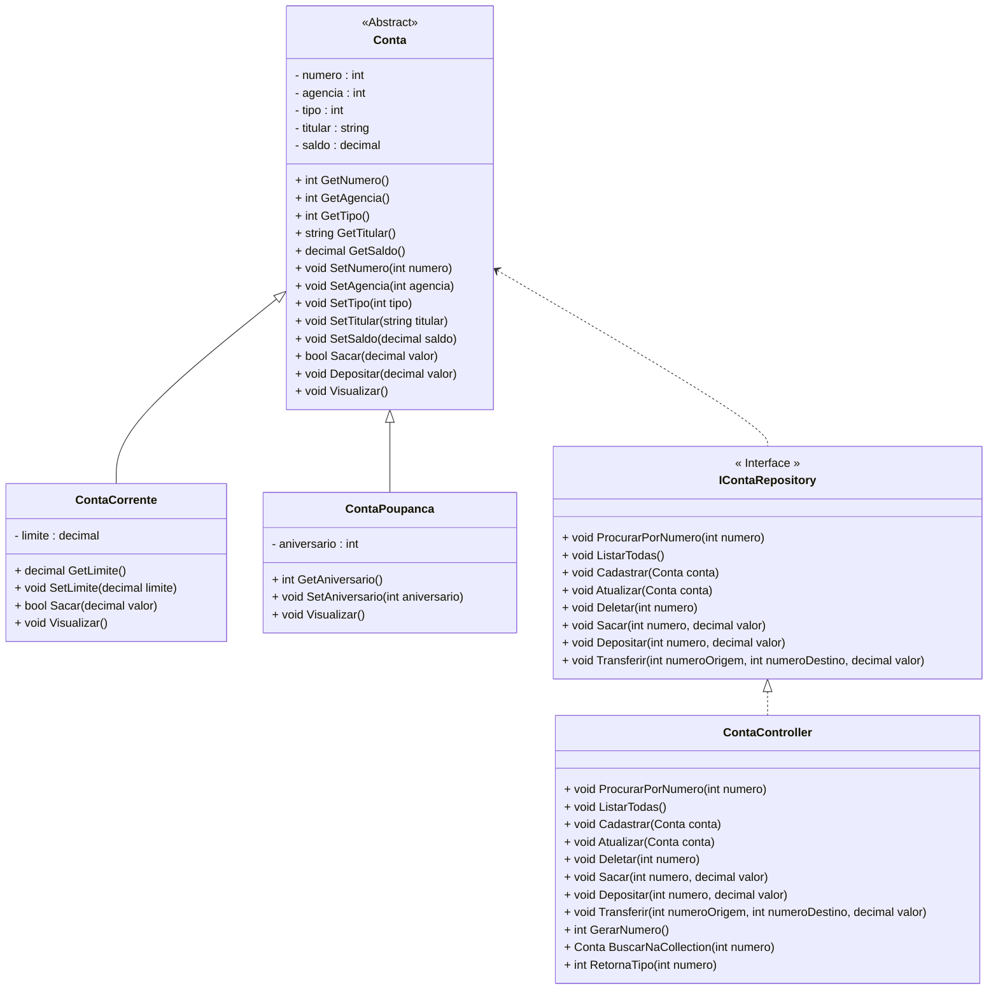

<h1>Projeto 01 - Conta Bancária - ContaController - Parte II</h1>


Na etapa anterior, criamos a Classe **ContaController**, que implementa a Interface **IContaRepository**, que possui a assinatura dos Métodos necessários para manipular os Objetos das Classes **ContaCorrente** e **ContaPoupanca**, e armazená-los (em memória) na Collection do tipo List (listaContas). Implementamos os Métodos Listar Todas as Contas e Cadastrar Conta da Interface **IContaRepository**, e o Método auxiliar **Gerar Numero da Conta**.

Nesta etapa, vamos continuar a implementação dos Métodos da  Interface **IContaRepository** e de alguns Métodos auxiliares.

O Diagrama de Classes do nosso Projeto ficará da seguinte forma:



<br />

<h2>👣 Passo 01 - Implementar o Método Procurar Conta por Numero</h2>


Na sequência, vamos implementar o Método Procurar Conta por Numero, mas antes, precisamos criar o Método auxiliar Buscar na Collection, no final da Classe ContaController, que retornará um Objeto conta a partir do numero da conta, caso este Objeto exista, através do código abaixo:

<div align="center"></div>

**Linha 71:** Observe que na assinatura do Método foi inserido como parâmetro uma variável do tipo *int*, chamada **numero**, que receberá o número da conta que se deseja localizar. Observe que no tipo de retorno do Método (Conta), foi adicionada uma interrogação (?), indicando que o retorno do Método pode ser um Objeto Nulo, caso a conta não seja encontrada.

**Linha 74:** Através do Laço de Repetição **foreach**, percorremos toda a **Collection listaContas**. 

Observe que a variável local **conta**, utilizada para receber um Objeto Conta a cada iteração da Collection, definida pelo Laço de repetição, foi criada através da palavra reservada **var**.


Assim como no código do Método **ListarTodas()**, o Laço de Repetição percorre toda a Collection **listaContas**, que armazena Objetos da Classe Conta. A palavra reservada **var** entende que a variável **conta** deve ser criada como um Objeto da Classe Conta, porque receberá um Objeto da Classe Conta.

**Linha 76:** Verifica se o Atributo **numero** (obtido através do Método GetNumero()), do Objeto da Classe Conta armazenado na variável **conta** é o mesmo que foi enviado na variável numero.

**Linha 78:** Se os números forem iguais, o Método devolve o Objeto Conta encontrado e finaliza o Laço de repetição.

**Linha 82:** Se o número não for encontrado na Collection listaContas, o Método devolve um Objeto Nulo.

Método auxiliar criado, vamos implementar o código do Método Procurar Conta por Numero, através do código abaixo:

<div align="center"></div>

**Linha 43:** Observe que na assinatura do Método foi inserido como parâmetro uma variável do tipo *int*, chamada **numero**, que receberá o número da conta que se deseja localizar. 

**Linha 44:** Foi criada a variável local **conta**, utilizada para receber o Objeto Conta, que foi encontrado na Collection **listaContas**, através da palavra reservada **var**. Por inferência, a palavra reservada **var** entende que a variável conta, deve ser um Objeto da Classe Conta, porque receberá o retorno do Método **BuscarNaCollection**.

**Linhas 47 a 54:** Através do Laço Condicional, verifica se o Objeto Conta foi encontrado. 

- Se foi encontrado, exibe os dados na tela através do Método **Visualizar()**. 
- Caso contrário (Objeto null), exibe na tela a mensagem informando que a conta não foi encontrada.

Para buscar um Objeto da Classe Conta, precisamos receber o numero da Conta, via teclado. Para receber os dados via teclado, precisamos criar um "formulário" para receber o numero da conta através dos Comandos de Entrada e Saída.

<br />

<h2>👣 Passo 02 - Inserir o Método Procurar Conta por Número na Classe Program</h2>


Agora que implementamos o Método Procurar Conta por Número, vamos inserir uma chamada para este Método na Classe Program:

1. Adicione a variável inteira **numero**, que receberá o numero da conta que se deseja pesquisar

<div align="center"></div>

2. Localize o trecho de código abaixo:

<div align="center"></div>

3. Insira o trecho de código abaixo:

<div align="center"></div>

**Linhas 139 a 140:** Foi criada a entrada de dados via teclado para a variável **numero**, que receberá o numero da conta que deverá ser procurada na Collection **listaContas**.

**Linha 142:** Executa o Método **ProcurarPorNumero(int numero)**, da Classe **ContaController**, passando como parâmetro a variável **numero**, que contém o numero da conta (recebido via teclado), que deverá ser procurada na Collection **listaContas**. 

Salve e Execute o projeto clicando no botão **Run**. 

1. Será aberto o Menu, que deve ser semelhante ao da figura abaixo:

<div align="center"></div>

2. Digite a opção **3** (indicado com uma seta verde na imagem acima) e veja o resultado abaixo:

```bash
Consultar dados da Conta - por número

Digite o número da conta: 
1

*********************************************************************
Dados da Conta:
*********************************************************************
Numero da Conta: 1
Agência: 123
Tipo da Conta: Conta Corrente
Titular: João da Silva
Saldo: 1000.0
Limite de Crédito: 100.0

Pressione Enter para Continuar...
```

Observe que ao procurarmos a conta numero **1**, a conta foi encontrada e os seus dados foram exibidos na tela. 

3. Experimente repetir a operação e digitar o numero 10:

```bash
Consultar dados da Conta - por número

Digite o número da conta: 
10

A Conta número: 10 não foi encontrada!

Pressione Enter para Continuar...
```

Observe que ao procurarmos a conta numero **10**, a conta não foi encontrada e uma mensagem foi exibida na tela. 

<br />

<h2>👣 Passo 03 - Implementar o Método Atualizar Conta</h2>


Na sequência, vamos implementar o Método Atualizar Conta, através do código abaixo:

<div align="center"></div>

**Linha 18:** Observe que na assinatura do Método, foi inserido como parâmetro um Objeto da Classe Conta, chamado **conta**. Este Objeto terá os seus dados atualizados na Collection **listaContas**.

**Linha 20:** Antes de atualizar o Objeto Conta na Collection **listaContas**, precisamos verificar se o Objeto conta existe. Observe que foi criada a variável local **buscaConta**, para receber o Objeto da Classe Conta, que foi encontrado na Collection **listaContas**. 

O Objeto **buscaConta** foi criado através da palavra reservada **var**. Por inferência, a palavra reservada **var** entende que a variável buscaConta, deve ser um Objeto da Classe Conta, porque receberá o retorno do Método **BuscarNaCollection**.

Observe que o numero da conta, foi enviado através do Método **GetNumero()** do Objeto conta.

**Linhas 22 a 45:** Através do Laço Condicional, verifica se o Objeto Conta foi encontrado. 

- Se a conta foi encontrada, os dados do Objeto são atualizados na Collection **listaContas**:
  - **Linha 24:** Através do Método **IndexOf(buscaConta)**, vamos **procurar o índice (posição) do Objeto conta** encontrado na Collection listaContas, ou seja, os dados atuais.
  - **Linha 26:** Assim como atualizamos os dados de um array, vamos informar o índice do Objeto buscaConta, que será atualizado, na Collection **listaContas** e na sequencia, vamos atribuir o Objeto conta, que foi recebido no parâmetro do Método **Atualizar(conta)**, substituindo os dados atuais pelos novos dados recebidos via teclado. 
- Caso contrário (Objeto null), exibe na tela a mensagem informando que a conta não foi encontrada.

Além de implementarmos o Método **Atualizar(conta)**, precisamos criar um Método para identificar o tipo da conta no formulário de atualização dos dados, que será criado na Classe Program, para evitar que o tipo da conta seja alterado. Com este objetivo, vamos criar o Método auxiliar **RetornarTipo(int numero)**, no final da Classe ContaController, através do código abaixo:

<div align="center"></div>

**Linha 112:** Observe que na assinatura do Método foi inserido como parâmetro uma variável do tipo *int*, chamada **numero**, que receberá o número da conta que se deseja localizar o tipo. 

**Linha 115:** Através do Laço de Repetição **foreach**, percorremos toda a **Collection listaContas**. Observe que a variável local **conta**, utilizada para receber um Objeto Conta a cada iteração da Collection, definida pelo Laço de repetição, foi criada através da palavra reservada **var**.

Assim como no código dos Métodos **listarTodas()** e **buscarNaCollection(int numero)**, o Laço de Repetição percorre toda a Collection **listaContas**, que armazena Objetos da Classe Conta. A palavra reservada **var** entende por inferência,  que a variável **conta** deve ser criada como um Objeto da Classe Conta, porque receberá um Objeto da Classe Conta.

**Linha 117:** Verifica se o Atributo **numero** (obtido através do Método GetNumero()), do Objeto da Classe Conta armazenado na variável **conta** é o mesmo que foi enviado na variável numero.

**Linha 119:** Se os números forem iguais, o Método devolve o valor do Atributo **tipo** do Objeto Conta encontrado, através do Método **GetTipo()** e finaliza o Laço de repetição.

**Linha 123:** Se a conta não for encontrada na Collection listaContas, o Método devolve **0 (zero)**.

Para atualizar os dados de um Objeto da Classe Conta, precisamos receber os novos dados da Conta, via teclado. Para receber os dados via teclado, precisamos criar um "formulário" para inserir os novos dados da Conta através dos Comandos de Entrada e Saída.

<br />

<h2>👣 Passo 04 - Inserir o Método Atualizar Conta na Classe Program</h2>

Agora que implementamos o Método Atualizar Conta, vamos inserir uma chamada para este Método na Classe Program:

Para atualizar os dados de uma conta, precisamos criar as entradas de dados, ou seja, criar um formulário de cadastro, semelhante ao do Método Cadastrar. 

Vamos criar o formulário de atualização e criar a chamada para o Método Atualizar na Classe Program

1. Na Classe Program, localize o trecho de código abaixo:

<div align="center"></div>

2. Insira o trecho de código abaixo:

<div align="center"></div>

**Linhas 151 a 152:** Foi criada a entrada de dados via teclado para a variável **numero**, que receberá o numero da conta que será atualizada na Collection **listaContas**.

**Linha 154:** Através do Laço Condicional, verifica se o Objeto Conta foi encontrado. 

Se o Objeto da Classe Conta foi encontrado, o processo de atualização da conta será iniciado. 

**Linhas 156 a 159:** Foram criadas as entradas de dados via teclado para as variáveis **agencia** e **titular**.

**Linha 161:** Verifica se a variável titular é nula, através do **Operador de Coalescência** (??). Caso seja nula, será retornada uma string vazia.

> O **Operador de Coalescência nula** `??` retornará o valor do operando esquerdo se não for `null`. Caso contrário, ele avaliará o operando direito e retornará seu resultado. O operador `??` não avaliará o operando do lado direito se o operando esquerdo for avaliado como não nulo.
>
> <br />
>
> <div align="left"> <a href="https://learn.microsoft.com/pt-br/dotnet/csharp/language-reference/operators/null-coalescing-operator" target="_blank"><b>Documentação: Operador de Coalescência</b></a></div>
>
> <br />

**Linhas 163 a 164:** Foi criada a entrada de dados via teclado para a variável **saldo**.

**Linha 166:** Executa o Método **RetornarTipo(numero)**, da Classe ContaController, que checará a partir do numero da conta, qual é o **tipo** da conta: **1** - *Conta Corrente* ou **2** - *Conta Poupança*. Esta informação, será armazenada na variável auxiliar **tipo**.

- **Linhas 168 a 182:** Foi criado um Laço condicional do tipo **Switch**, que checará qual o tipo da conta. 
  - Caso a conta seja do tipo **Conta Corrente (tipo 1)**, solicita a entrada de dados via teclado para a variável **limite** e executa o Método **cadastrar** da Classe **ContaController**.
  - Caso a conta seja do tipo **Conta Poupança (tipo 2)**, solicita a entrada de dados via teclado para a variável **aniversario** e executa o Método **cadastrar** da Classe **ContaController**.

**Linha 173:** Observe que dentro do Método **atualizar** foi criado um Objeto da Classe **ContaCorrente**, composto pelos valores das variáveis auxiliares, que receberam dados via teclado. 

**Linha 179:** Observe que dentro do Método **atualizar** foi criado um Objeto da Classe **ContaPoupanca**, composto pelos valores das variáveis auxiliares, que receberam dados via teclado.

**Linhas 184 a 189 :** Caso o Objeto da Classe Conta não seja encontrado (Objeto null), exibe na tela a mensagem informando que a conta não foi encontrada.

Salve e Execute o projeto clicando no botão **Run**. 

1. Será aberto o Program, semelhante ao da figura abaixo:

<div align="center"></div>

2. Digite a opção **4** e faça a Atualização dos dados da Conta Corrente numero **1**, como mostra o console abaixo:

```bash
Atualizar dados da Conta

Digite o número da conta: 
1
Digite o Numero da Agência: 
789
Digite o Nome do Titular: 
João da Silva Santos
Digite o Saldo da Conta (R$): 
5000
Digite o Limite de Crédito (R$): 
600

A Conta numero: 1 foi atualizada com sucesso!

Pressione Enter para Continuar...
```

3. Observe que a Conta foi Atualizada com sucesso. Pressione a tecla enter e atualize a Conta Poupança numero 3:

```bash
Atualizar dados da Conta

Digite o número da conta: 
3
Digite o Numero da Agência: 
321
Digite o Nome do Titular: 
Mariana dos Santos Noronha
Digite o Saldo da Conta (R$): 
4500
Digite o dia do Aniversario da Conta: 
15

A Conta numero: 3 foi atualizada com sucesso!

Pressione Enter para Continuar...
```

4. Digite a opção 2 (indicado com uma seta verde na imagem abaixo):

<div align="center"></div>

5. Veja o resultado abaixo:

```bash
Listar todas as Contas

*********************************************************************
Dados da Conta:
*********************************************************************
Numero da Conta: 1
Agência: 789
Tipo da Conta: Conta Corrente
Titular: João da Silva Santos
Saldo: 5000.0
Limite de Crédito: 600.0

*********************************************************************
Dados da Conta:
*********************************************************************
Numero da Conta: 2
Agência: 124
Tipo da Conta: Conta Corrente
Titular: Maria da Silva
Saldo: 2000.0
Limite de Crédito: 100.0

*********************************************************************
Dados da Conta:
*********************************************************************
Numero da Conta: 3
Agência: 321
Tipo da Conta: Conta Poupança
Titular: Mariana dos Santos Noronha
Saldo: 4500.0
Aniversário da conta: 15

*********************************************************************
Dados da Conta:
*********************************************************************
Numero da Conta: 4
Agência: 125
Tipo da Conta: Conta Poupança
Titular: Juliana Ramos
Saldo: 8000.0
Aniversário da conta: 15

Pressione Enter para Continuar...
```

Observe que os dados das contas 1 e 3 foram atualizados na Collection **listaContas**.

<br />

<h2>👣 Passo 05 - Implementar o Método Deletar Conta</h2>

Para finalizar os Métodos do CRUD, vamos implementar o Método Deletar Conta, através do código abaixo:

<div align="center"></div>

**Linha 48:** Observe que na assinatura do Método foi inserido como parâmetro uma variável do tipo *int*, chamada **numero**, que receberá o número da conta que se deseja deletar. 

**Linha 50:** Antes de deletar o Objeto Conta na Collection **listaContas**, precisamos verificar se o Objeto conta existe. 

Observe que foi criada a variável local **conta**, para receber o Objeto da Classe Conta, que foi encontrado na Collection **listaContas**. Esse Objeto foi criado através da palavra reservada **var**. Por inferência, a palavra reservada **var** entende que a variável conta, deve ser um Objeto da Classe Conta, porque receberá o retorno do Método **BuscarNaCollection**.

**Linhas 52 a 63:** Através do Laço Condicional, verifica se o Objeto Conta foi encontrado. 

- Se a conta foi encontrada, o Objeto conta será apagado na Collection **listaContas** através do Método **Remove(conta)**. Observe que dentro do Método **Remove(conta)**, foi adicionado como parâmetro o Objeto conta. 
  - Observe na **Linha 54** que através de uma Laço condicional, será checado se a exclusão foi bem sucedida. Se foi bem sucedida, será exibida uma mensagem informando que a exclusão foi efetuada com sucesso. 

- Caso contrário (Objeto nulo), exibe na tela a mensagem informando que a conta não foi encontrada.

Para buscar um Objeto da Classe Conta e Excluir caso seja encontrado, precisamos receber o numero da Conta, via teclado. Para receber os dados via teclado, precisamos criar um "formulário" para receber o numero da conta através dos Comandos de Entrada e Saída.

<br />

<h2>👣 Passo 06 - Inserir o Método Deletar Conta na Classe Program</h2>

Agora que implementamos o Método Método Deletar Conta, vamos inserir uma chamada para este Método na Classe Program:

1. Na Classe Program, localize o trecho de código abaixo:

<div align="center"></div>

3. Insira o trecho de código abaixo:

<div align="center"></div>

**Linhas 198 a 199:** Foi criada a entrada de dados via teclado para a variável **numero**, que receberá o numero da conta que será excluída da Collection **listaContas**.

**Linha 201:** Executa o Método **Deletar(numero)**, da Classe **ContaController**, passando como parâmetro a variável **numero**, que contém o numero da conta (recebido via teclado), que será excluída da Collection **listaContas**. 

Salve e Execute o projeto clicando no botão **Run**. 

1. Será aberto o Program, que deve ser semelhante ao da figura abaixo:

<div align="center"></div>

2. Digite a opção **5** (indicado com uma seta verde na imagem acima) e veja o resultado abaixo:

```bash
Apagar a Conta

Digite o número da conta: 
1

A Conta numero: 1 foi deletada com sucesso!

Pressione Enter para Continuar...
```

Observe que ao procurarmos a conta numero **1** a conta foi encontrada e deletada. Além disso, uma mensagem de confirmação foi exibida na tela. 

3. Experimente repetir a operação e digitar o numero 10:

```bash
Apagar a Conta

Digite o número da conta: 
10

A Conta numero: 10 não foi encontrada!

Pressione Enter para Continuar...
```

Observe que ao procurarmos a conta numero **10**, a conta não foi encontrada e uma mensagem foi exibida na tela. 

Na sequência, vamos confirmar se a conta numero 1 foi excluída:

1. Digite a opção **3** (indicado com uma seta verde na imagem abaixo):

<div align="center"></div>

2.  No item numero da conta, digite o numero **1** e veja o resultado abaixo:

```bash
Consultar dados da Conta - por número

Digite o número da conta: 
1

A Conta número: 1 não foi encontrada!

Pressione Enter para Continuar...
```

Observe que a conta numero **1** não foi encontrada, confirmando que a conta foi apagada. 

<br />

<div align="left"> <a href="https://github.com/rafaelq80/csharp_conta_bancaria/blob/08_Controller_CRUD/controller/ContaController.cs" target="_blank"><b>Código fonte: ContaController</b></a>

<div align="left"> <a href="https://github.com/rafaelq80/csharp_conta_bancaria/blob/08_Controller_CRUD/Program.cs" target="_blank"><b>Código fonte: Program</b></a>

<br />

<div align="left"> <a href="https://github.com/rafaelq80/csharp_conta_bancaria/tree/08_Controller_CRUD" target="_blank"><b>Código fonte: Projeto Conta Bancária</b></a></div>

<br /><br />


<div align="left"><a href="README.md">Voltar</a></div>