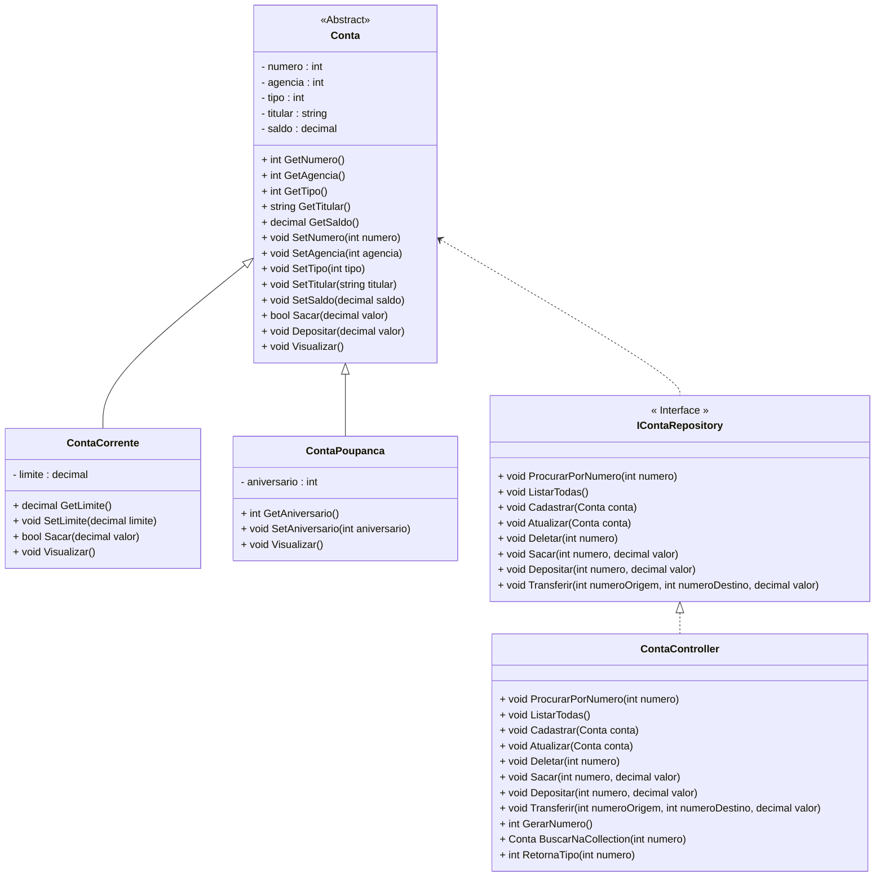

<h1>Projeto 01 - Conta Bancária - ContaController - Parte III</h1>


Na etapa anterior, implementamos os 5 Métodos do CRUD na Classe **ContaController**. Nesta última etapa do Projeto vamos finalizar a Classe ContaController implementando os 3 Métodos Bancários (Sacar, Depositar e Transferir).

O Diagrama de Classes do nosso Projeto ficará da seguinte forma:



<br />

<h2>👣 Passo 01 - Implementar o Método Sacar</h2>

Na sequência, vamos implementar o Método Sacar, através do código abaixo:

<div align="center"></div>

**Linha 88:** Observe que na assinatura do Método, foram inseridos 2 parâmetros:

- **numero:** Número da conta que será efetuada a operação de Saque.
- **valor:** O valor que será debitado da conta. 

**Linha 90:** Antes de Efetuar o saque na conta, precisamos verificar se a conta existe. Observe que foi criada a variável local **buscaConta**, para receber o Objeto da Classe Conta, que foi encontrado na Collection **listaContas**. 

O Objeto **conta** foi criado através da palavra reservada **var**. Por inferência, a palavra reservada **var** entende que a variável conta, deve ser um Objeto da Classe Conta, porque receberá o retorno do Método **BuscarNaCollection**.

**Linhas 92 a 103:** Através do Laço Condicional, verifica se o Objeto Conta foi encontrado (linha 92). 

- Se a conta foi encontrada, um novo laço condicional será executado para checar se o saque foi bem sucedido (linha 94). A operação saque será efetuada através do Método **Sacar(valor)**, do tipo bool (verdadeiro ou falso). 
- Caso o saque tenha sido bem sucedido (true), será exibida uma mensagem confirmando o saque (linha 95). 
- Caso o Saque **não seja bem sucedido** (Saldo insuficiente), o próprio Método **Sacar(valor)** exibirá uma mensagem indicando que o Saldo da conta é insuficiente.
- Caso a conta não seja encontrada (linha 101), será exibida na tela a mensagem informando que a conta não foi encontrada.

Para efetuar o saque, precisamos receber o numero da Conta de origem e o valor do saque, via teclado. Para receber os dados via teclado, precisamos criar um "formulário" para receber os dados através dos Comandos de Entrada e Saída.

<br />

<h2>👣 Passo 02 - Inserir o Método Sacar na Classe Program</h2>

Agora que implementamos o Método Sacar, vamos inserir uma chamada para este Método na Classe Program:

Para efetuar as operações bancárias, vamos criar algumas variáveis, que irão armazenar temporariamente os dados da transação.

1. Crie as variáveis **numeroDestino e valor**, na Classe Program, como mostra o trecho de código abaixo:

<div align="center"></div>

2. Na tabela abaixo, temos detalhes das 2 variáveis criadas:

| Nome          | Tipo  | Descrição                                 |
| ------------- | ----- | ----------------------------------------- |
| numeroDestino | int   | Numero da conta de destino do depósito    |
| valor         | float | Valor do saque, depósito ou transferência |

<br />

Na sequência, vamos criar o formulário da operação saque e criar a chamada para o Método Sacar na Classe Program

1. Na Classe Program, localize o trecho de código abaixo:

<div align="center"></div>

2. Insira o trecho de código abaixo:

<div align="center"></div>

**Linhas 211 a 215:** Foram criadas as entradas de dados via teclado, para as variáveis **numero** e **valor**.

**Linha 217:** Foi criada a chamada para o Método **Sacar(numero, valor)**, criado na Classe **ContaController**. Na chamada do Método foram inseridos 2 parâmetros:

- **numero:** Numero da Conta onde o saque será efetuado;
- **valor:** Valor que será debitado da conta.

Salve e Execute o projeto clicando no botão **Run**. 

1. Será aberto o Program, que deve ser semelhante ao da figura abaixo:

<div align="center"></div>

2. Digite a opção **6** (indicado com uma seta verde na imagem acima) e veja o resultado abaixo:

```bash
Digite o Numero da conta: 
1
Digite o Valor do Saque (R$): 
100

O Saque na Conta numero: 1 foi efetuado com sucesso!


Pressione Enter para Continuar...
```

No exemplo acima fizemos um saque de **R$ 100,00** na conta numero **1** e uma mensagem de confirmação foi exibida na tela. 

3. Experimente repetir a operação na conta numero 10:

```bash
Digite o Numero da conta: 
10
Digite o Valor do Saque (R$): 
100

A Conta numero: 10 não foi encontrada!

Pressione Enter para Continuar...
```

Observe que a conta numero **10** não foi encontrada e uma mensagem foi exibida na tela. 

Na sequência, vamos confirmar se o saque na conta numero 1 foi efetuado com sucesso:

1. Digite a opção **3** (indicado com uma seta verde na imagem abaixo):

<div align="center"></div>

2.  No item numero da conta, digite o numero **1** e veja o resultado abaixo:

```bash
Consultar dados da Conta - por número

Digite o número da conta: 
1

*********************************************************************
Dados da Conta:
*********************************************************************
Numero da Conta: 1
Agência: 123
Tipo da Conta: Conta Corrente
Titular: João da Silva
Saldo: 900.0
Limite de Crédito: 100.0

Pressione Enter para Continuar...
```

Observe que o saldo da conta numero **1** foi alterado de **R$ 1000,00** para **R$ 900,00**, confirmando que o saque foi efetuado com sucesso. 

<br />

|  | **DESAFIO:** Experimente fazer um saque com um valor maior do que o Saldo da conta e um outro saque passando um valor negativo. No caso de uma Conta Corrente, lembre-se que o saldo é composto por: saldo + limite. A melhor forma de aprender uma Linguagem de Programação é praticando! |
| ------------------------------------------------------------ | :----------------------------------------------------------- |

<br />

<h2>👣 Passo 03 - Implementar o Método Depositar</h2>

Na sequência, vamos implementar o Método Depositar, através do código abaixo:

<div align="center"></div>

**Linha 106:** Observe que na assinatura do Método, foram inseridos 2 parâmetros:

- **numero:** Número da conta que será efetuada a operação de Saque.
- **valor:** O valor que será debitado da conta. 

**Linha 108:** Antes de Efetuar o depósito na conta, precisamos verificar se a conta existe. Observe que foi criada a variável local **conta**, para receber o Objeto da Classe Conta, que foi encontrado na Collection **listaContas**. Esse Objeto foi criado através da palavra reservada **var**. Por inferência, a palavra reservada **var** entende que a variável conta, deve ser um Objeto da Classe Conta, porque receberá o retorno do Método **BuscarNaCollection**.

- **Linhas 110 a 121:** Através do Laço Condicional, verifica se o Objeto Conta foi encontrado (linha 110). 
  - Se a conta foi encontrada, a operação depósito será efetuada através do Método **Depositar(valor)** (linha 112). 
  - Na sequência será exibida uma mensagem confirmando o depósito (linha 113). 
  - Caso a conta não seja encontrada (linha 119), será exibida na tela a mensagem informando que a conta não foi encontrada.

Para efetuar o depósito, precisamos receber o numero da Conta de destino e o valor do depósito, via teclado. Para receber os dados via teclado, precisamos criar um "formulário" para receber os dados através dos Comandos de Entrada e Saída.

<br />

<h2>👣 Passo 04 - Inserir o Método Depositar na Classe Program</h2>

Agora que implementamos o Método Depositar, vamos criar o formulário da operação depósito e criar a chamada para o Método Depositar na Classe Program:

1. Na Classe Program, localize o trecho de código abaixo:

<div align="center"></div>

2. Insira o trecho de código abaixo:

<div align="center"></div>

**Linhas 226 a 230:** Foram criadas as entradas de dados via teclado, para as variáveis **numero** e **valor**.

**Linha 202:** Foi criada a chamada para o Método **Depositar(numero, valor)**, criado na Classe **ContaController**. Na chamada do Método foram inseridos 2 parâmetros:

- **numero:** Numero da Conta onde o depósito será efetuado;
- **valor:** Valor que será creditado na conta.

Salve e Execute o projeto clicando no botão **Run**. 

1. Será aberto o Program, que deve ser semelhante ao da figura abaixo:

<div align="center"></div>

2. Digite a opção **7** (indicado com uma seta verde na imagem acima) e veja o resultado abaixo:

```bash
Depósito

Digite o Numero da conta: 
1
Digite o Valor do Depósito (R$): 
100

O Depósito na Conta numero: 1 foi efetuado com sucesso!

Pressione Enter para Continuar...
```

No exemplo acima fizemos um depósito de **R$ 100,00** na conta numero **1** e uma mensagem de confirmação foi exibida na tela. 

3. Experimente repetir a operação na conta numero 10:

```bash
Depósito

Digite o Numero da conta: 
10
Digite o Valor do Depósito (R$): 
100

A Conta numero: 10 não foi encontrada ou a Conta destino não é uma Conta Corrente!

Pressione Enter para Continuar...
```

Observe que a conta numero **10** não foi encontrada e uma mensagem foi exibida na tela. 

Na sequência, vamos confirmar se o depósito na conta numero 1 foi efetuado com sucesso:

1. Digite a opção **3** (indicado com uma seta verde na imagem abaixo):

<div align="center"></div>

2.  No item numero da conta, digite o numero **1** e veja o resultado abaixo:

```bash
Consultar dados da Conta - por número

Digite o número da conta: 
1

*********************************************************************
Dados da Conta:
*********************************************************************
Numero da Conta: 1
Agência: 123
Tipo da Conta: Conta Corrente
Titular: João da Silva
Saldo: 1100.0
Limite de Crédito: 100.0

Pressione Enter para Continuar...
```

Observe que o saldo da conta numero **1** foi alterado de **R$ 1000,00** para **R$ 1100,00**, confirmando que o depósito foi efetuado com sucesso. 

<br />

|  | **DESAFIO:** Experimente fazer um depósito passando um valor negativo. A melhor forma de aprender uma Linguagem de Programação é praticando! |
| ------------------------------------------------------------ | :----------------------------------------------------------- |

<br />

<h2>👣 Passo 05 - Implementar o Método Transferir</h2>

Na sequência, vamos implementar o Método Transferir, através do código abaixo:

<div align="center"></div>

**Linha 124:** Observe que na assinatura do Método, foram inseridos 3 parâmetros:

- **numeroOrigem:** Número da conta que será efetuada a operação de Saque.
- **numeroDestino:** Número da conta que será efetuada a operação de Depósito, ou seja, receberá a Transferência.
- **valor:** O valor que será debitado da conta de origem e será creditado na conta de destino. 

**Linha 126:** Antes de Efetuar o saque na conta de origem, precisamos verificar se a conta existe. Observe que foi criada a variável local **contaOrigem**, para receber o Objeto da Classe Conta, que foi encontrado na Collection **listaContas**. 

**Linha 127:** Antes de Efetuar o depósito na conta de destino, precisamos verificar se a conta existe. Observe que foi criada a variável local **contaDestino**, para receber o Objeto da Classe Conta, que foi encontrado na Collection **listaContas**. 

- **Linhas 129 a 142:** Através do Laço Condicional, verifica se os dois Objetos Conta (conta origem e conta destino) foram encontrados (linha 129). 
  - Se as 2 contas foram encontradas, um novo laço condicional será executado para checar se o saque na conta origem foi bem sucedido (linha 131). A operação saque será efetuada através do Método **Sacar(valor)**, do tipo bool (verdadeiro ou falso). 
  - Caso o saque tenha sido bem sucedido, o Método **Sacar(valor)** retornará o valor **true** (verdadeiro) . 
  - Caso o Saque **não seja bem sucedido** (Saldo insuficiente), o próprio Método **Sacar(valor)** exibirá uma mensagem indicando que o Saldo da conta é insuficiente.
  - Na sequência, a operação depósito será efetuada na conta destino, através do Método **Depositar(valor)** (linha 133). 
  - Se as 2 operações forem bem sucedidas, será exibida uma mensagem confirmando a transferência (linha 134).
  - Caso uma ou as duas contas não sejam encontradas (linha 140), será exibida na tela a mensagem informando que as contas não foram encontradas.

Para efetuar a transferência, precisamos receber os números das Contas de origem e destino, além do valor da transferência, via teclado. Para receber os dados via teclado, precisamos criar um "formulário" para receber os dados através dos Comandos de Entrada e Saída.

<br />

<h2>👣 Passo 06 - Inserir o Método Transferir na Classe Program</h2>

Agora que implementamos o Método Transferir, vamos criar o formulário da operação transferência e criar a chamada para o Método Transferir na Classe Program:

1. Na Classe Program, localize o trecho de código abaixo:

<div align="center"></div>

2. Insira o trecho de código abaixo:

<div align="center"></div>

**Linhas 241 a 248:** Foram criadas as entradas de dados via teclado, para as variáveis **numero**, **numeroDestino** e **valor**.

**Linha 219:** Foi criada a chamada para o Método **Transferir(numeroOrigem, numeroDestino, valor)**, criado na Classe **ContaController**. Na chamada do Método foram inseridos 3 parâmetros:

- **numero:** Número da conta que será efetuada a operação de Saque.
- **numeroDestino:** Número da conta que será efetuada a operação de Depósito, ou seja, receberá a Transferência.
- **valor:** O valor que será debitado da conta de origem e será creditado na conta de destino. 

Salve e Execute o projeto clicando no botão **Run**. 

1. Será aberto o Program, que deve ser semelhante ao da figura abaixo:

<div align="center"></div>

2. Digite a opção **6** (indicado com uma seta verde na imagem acima) e veja o resultado abaixo:

```bash
Transferência entre Contas

Digite o Numero da Conta de Origem: 
1
Digite o Numero da Conta de Destino: 
2
Digite o Valor da Transferência (R$): 
100

A Transferência foi efetuado com sucesso!

Pressione Enter para Continuar...
```

No exemplo acima fizemos uma transferência de **R$ 100,00** da conta numero **1** para a conta numero 2 e uma mensagem de confirmação foi exibida na tela. 

3. Experimente repetir a operação na conta de origem numero 10:

```bash
Transferência entre Contas

Digite o Numero da Conta de Origem: 
10
Digite o Numero da Conta de Destino: 
2
Digite o Valor da Transferência (R$): 
100

A Conta de Origem e/ou Destino não foram encontradas!

Pressione Enter para Continuar...
```

Observe que a conta numero **10** não foi encontrada e uma mensagem foi exibida na tela. 

Na sequência, vamos confirmar se a transferência da conta numero 1 para a conta numero 2 foi efetuada com sucesso:

1. Digite a opção **3** (indicado com uma seta verde na imagem abaixo):

<div align="center"></div>

2.  No item numero da conta, digite o numero **1** e veja o resultado abaixo:

```bash
Consultar dados da Conta - por número

Digite o número da conta: 
1

*********************************************************************
Dados da Conta:
*********************************************************************
Numero da Conta: 1
Agência: 123
Tipo da Conta: Conta Corrente
Titular: João da Silva
Saldo: 900.0
Limite de Crédito: 100.0

Pressione Enter para Continuar...
```

Observe que o saldo da conta numero **1** foi alterado de **R$ 1000,00** para **R$ 900,00**, confirmando que o saque foi efetuado com sucesso. 

3. Na sequência, vamos checar a conta numero **2** e veja o resultado abaixo:

```bash
Consultar dados da Conta - por número

Digite o número da conta: 
2

*********************************************************************
Dados da Conta:
*********************************************************************
Numero da Conta: 2
Agência: 124
Tipo da Conta: Conta Corrente
Titular: Maria da Silva
Saldo: 2100.0
Limite de Crédito: 100.0

Pressione Enter para Continuar...
```

Observe que o saldo da conta numero **2** foi alterado de **R$ 1000,00** para **R$ 1000,00**, confirmando que a transferência  foi efetuada com sucesso.

<br />

|  | **DESAFIO:** Experimente fazer uma transferência com um valor maior do que o Saldo da conta de origem e uma outra transferência passando um valor negativo. No caso de uma Conta Corrente, lembre-se que o saldo é composto por: saldo + limite. A melhor forma de aprender uma Linguagem de Programação é praticando! |
| ------------------------------------------------------------ | :----------------------------------------------------------- |

<br />

<div align="left"> <a href="https://github.com/rafaelq80/csharp_conta_bancaria/blob/09_Controller_Metodos_Bancarios/controller/ContaController.cs" target="_blank"><b>Código fonte: ContaController</b></a></div>

<div align="left"> <a href="https://github.com/rafaelq80/csharp_conta_bancaria/blob/09_Controller_Metodos_Bancarios/Program.cs" target="_blank"><b>Código fonte: Program</b></a></div>

<br />

<div align="left"> <a href="https://github.com/rafaelq80/csharp_conta_bancaria/tree/09_Controller_Metodos_Bancarios" target="_blank"><b>Código fonte: Projeto Conta Bancária</b></a></div>

<br /><br />

<div align="left"><a href="README.md">Voltar</a></div>
