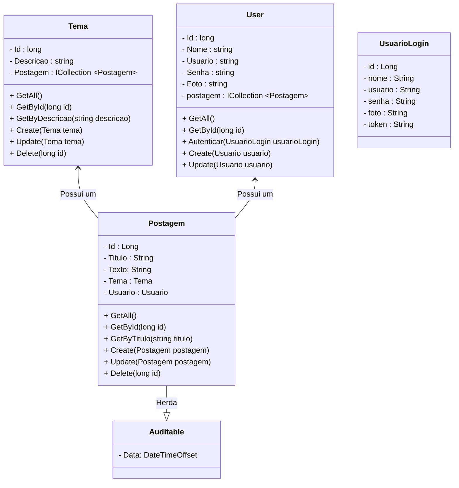
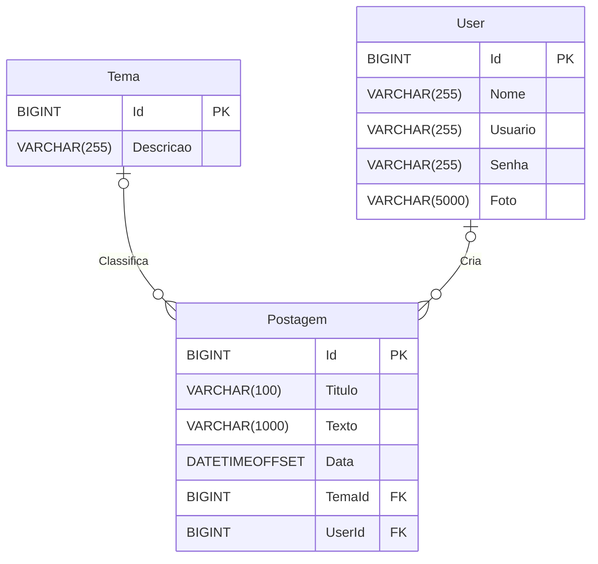

<h1>Projeto 02 - Blog Pessoal - Criar o Projeto no Visual Studio</h1>


O que veremos por aqui:

1. Apresentação do Projeto Blog Pessoal
2. Criar o Projeto no Visual Studio
3. Instalar os primeiros Pacotes com o Nuget
4. Configurar a Porta
5. Configurar a Classe Program

<br />

<h2>1. O Projeto Blog Pessoal</h2>


O Projeto Blog Pessoal será o nosso Projeto Guia no aprendizado do Framework ASP.NET e suas principais funcionalidades. Todo o código que implementarmos no projeto Blog Pessoal servirá de base para a construção do Projeto Integrador, que sempre receberá novas funcionalidades depois que você adquirir os conhecimentos necessários através do Projeto Blog Pessoal. Veja o Diagrama de Classes do Projeto Blog Pessoal completo na figura abaixo:



<br />

O Projeto será composto por 3 Recursos (*Conjunto de Classes e Interfaces responsáveis por mapear um tipo de Objeto e persistir no Banco de dados Relacional*).

| Módulo       | Descrição                                                    |
| ------------ | ------------------------------------------------------------ |
| **Postagem** | Recurso responsável por definir o Objeto Postagem (posts) do Blog Pessoal. |
| **Tema**     | Recurso responsável por classificar as postagens através do Objeto tema. |
| **Usuario**  | Recurso responsável por definir o Objeto Usuario, que será utilizado pelo Módulo Auth na implementação da segurança e na identificação do autor das postagens do Blog Pessoal. |

Cada Recurso irá gerar uma tabela no Banco de dados da aplicação. Os Recursos serão implementados na mesma sequência da tabela acima. Veja o Diagrama de Entidade e Relacionamentos do Projeto Blog Pessoal completo. com todas as tabelas que serão geradas e os respectivos relacionamentos na figura abaixo:



Antes de começarmos a implementar as Classes, vamos criar o nosso Projeto ASP.NET, instalar alguns pacotes e configurar a Classe Main.

<br />

<h2>👣 Passo 01 - Criar o Projeto com o Visual Studio</h2>


1. 
   Ao iniciar o Visual Studio IDE, será aberta a tela abaixo, perguntando que você deseja fazer. Para Criar um novo Projeto, clique na opção **Criar um projeto**. 

<div align="center">
  
</div>

2. Na próxima tela, selecione o tipo de projeto que será criado. Selecione a opção **API Web do ASP.NET Core** e clique em **Próximo** para continuar.

<div align="center">
  
</div>

3. Na próxima tela, vamos configurar o nosso projeto. No item **Nome do projeto**, informe o nome do projeto: **blogpessoal**. 

<div align="center">
  
</div>

4. No item **Local**, **clique no botão com 3 pontos** para selecionar a pasta onde o Projeto será criado.

<div align="center">
  
</div>

5. Localize na **Área de Trabalho do seu Computador** a pasta chamada **aspnet**. Na sequência, abra a pasta **aspnet**, crie uma pasta chamada **blogpessoal**, mantenha esta pasta selecionada e clique no botão **Selecionar pasta**.

<div align="center">
  
</div>

<br />

|  | <div align="left"> **ATENÇÃO:** *Todos os projetos do Bloco 02 - ASP.NET, serão criados dentro da pasta aspnet. Cada novo projeto que você criar, uma nova pasta será gerada dentro da pasta aspnet.* </div> |
| ------------------------------------------------------------ | ------------------------------------------------------------ |

<br />

6. Mantenha o item **Colocar a solução e o projeto no mesmo diretório** selecionado, como mostra a imagem abaixo e clique em **Próximo** para continuar.

<div align="center">
  
</div>

7. Na próxima tela, mantenha o item **configure igual** a imagem abaixo e clique no botão **Criar**. 

<div align="center">
  
</div>

Opções da Janela Informações Adicionais:

| Opção                                    | Descrição                                                    |
| ---------------------------------------- | ------------------------------------------------------------ |
| **Estrutura**                            | Permite escolher a versão do SDK do .NET, desde que esteja instalada no computador. Mantenha a opção padrão. |
| **Tipo de autenticação**                 | Permite escolher o modo de autenticação da aplicação (Windows ou Plataforma Microsoft). Como iremos configurar a autenticação por Token JWT mais adiante, vamos manter a opção **nenhum** selecionada. |
| **Configurar HTTPS**                     | Esta opção força a nossa API a trabalhar com o protocolo HTTPS. Localmente, em desenvolvimento, não há necessidade de se utilizar o HTTPS, além disso, quando fizermos o Deploy, o próprio serviço de hospedagem fará este trabalho para nós. Mantenha esta opção desmarcada. |
| **Habilitar o Docker**                   | Esta opção gera o arquivo Dockerfile, que é base para criação de uma imagem Docker, entretanto ao habilitar esta opção, automaticamente será exigida a instalação do Docker, que no processo de desenvolvimento não iremos utilizar. Mantenha esta opção desmarcada. |
| **Usar Controladores**                   | Mantenha esta opção marcada para permitir o uso de Classes Controladoras. |
| **Habilitar o suporte a OpenAPI**        | Mantenha esta opção marcada para gerar a Documentação da nossa API automaticamente, através do OpenAPI em conjunto com o Swagger. |
| **Não use instruções de nível superior** | Mantenha esta opção marcada para utilizarmos instruções no formato tradicional. |

> **APIs mínimas** é uma abordagem simplificada para criar APIs REST rápidas com o ASP.NET Core. Você pode criar pontos de extremidade REST totalmente funcionais com o  mínimo de codificação e configuração. Declare fluentemente rotas e ações de API ignorando todo o processo tradicional e evitar controladores  desnecessários.
>
> **Instruções de nível superior** é um forma simplificada de escrever o código C#, que permitem evitar a cerimônia extra necessária colocando o ponto de entrada do programa em um método estático de uma classe. 
>
> <br />
>
> <div align="left"> <a href="https://learn.microsoft.com/pt-br/aspnet/core/fundamentals/minimal-apis/overview?view=aspnetcore-7.0" target="_blank"><b>Documentação: APIs Mínimas.</b></a></div>
>
> <div align="left"> <a href="https://learn.microsoft.com/pt-br/dotnet/csharp/whats-new/tutorials/top-level-statements" target="_blank"><b>Documentação: Instruções de Nível Superior</b></a></div>
>
> <br />

<br />

8. Será aberta a janela abaixo, com o projeto criado:

<div align="center"></div>

<br />

<h2>👣 Passo 02 - Excluir arquivos desnecessários</h2>


Vamos excluir alguns arquivos e pastas do nosso projeto, ante de prosseguirmos:

1. No **Gerenciador de Soluções** vamos excluir o arquivo **WeatherForecast.cs**:

<div align="center"></div>

2. Ainda no **Gerenciador de Soluções** vamos excluir a pasta **Controllers**:

<div align="center"></div>

3. Depois de excluir os arquivos e pastas, o projeto ficará com a estrutura semelhante ao da imagem abaixo:

<div align="center"></div>

<br />

<h2>👣 Passo 03 - Instalar os primeiros pacotes</h2>


Para criarmos a nossa aplicação ASP.NET com acesso a Banco de dados e outros recursos, que serão implementados, precisamos instalar alguns pacotes, através do **NUGET**. Inicialmente, vamos instalar os seguintes pacotes:


| Pacote                                      | Descrição                                                    |
| ------------------------------------------- | ------------------------------------------------------------ |
| **Fluent Validation**                       | Pacote que fornece um conjunto de regras que permitem validar os atributos das Classes Model (veremos mais adiante). <br />**Exemplo:** No atributo Usuario o Fluent Validation checará se o usuário digitou realmente um endereço de e-mail no atributo |
| **Entity Framework Core**                   | Pacote responsável por conectar e criar as tabelas no Banco de dados, além de interagir com os  Objetos persistidos no Bancos de dados, através do Mapeamento Objeto Relacional (ORM - Object Relation Mapping). Para mais detalhes, veja o conteúdo sobre <a href="03.md" target="_blank">Entity Framework</a>. |
| **Entity Framework Core SQL Server Driver** | Pacote responsável por criar a conexão entre a nossa aplicação e o Banco de Dados SQL Server. Se o SGBD (Postgres SQL, MySQL Server, entre outros), for alterado no futuro precisaremos instalar um novo pacote com o driver específico para o novo SGBD. |
| **Entity Framework Core Tools**             | Pacote responsável por instalar as ferramentas de gerenciamento do Entity Framework, via console. |
| **Mvc Newtonsoft Json**                     | Pacote responsável por gerenciar os Objetos no formato JSON gerados (Respostas) e recebidos (Requisições) pela API. |

<br />

Além dos pacotes acima, foram instalados na criação do projeto:

| Pacote          | Descrição                                                    |
| --------------- | ------------------------------------------------------------ |
| **OpenApi**     | Pacote que habilita a geração automática da documentação da API com o Open API. |
| **Swashbuckle** | Pacote responsável pela instalação e configuração do Swagger, que é a Interface Gráfica do Open API. |

<br />

Para instalar os pacotes, vamos utilizar o **Gerenciador de Pacotes do Nuget**: 

1. Para abrir o **Gerenciador de Pacotes do Nuget** no Visual Studio, clique no Menu **Projeto 🡢 Gerenciador de Pacotes do Nuget**

<div align="center"></div>

2. Será aberta a janela do Nuget.

<div align="center"></div>

3. Caso tenha alguma atualização para ser instalada, observe que na **Guia Atualizações** aparecerá um número indicando o total de atualizações. Clique na **Guia Atualizações** para instalar as atualizações.

<div align="center"></div>

4. Na **Guia Atualizações**, marque a caixa **Selecionar todos os pacotes** e clique no botão **Atualizar**.

<div align="center"></div>

5. Durante a instalação, caso apareça a janela **Aceitação da Licença**, clique no botão **Eu Aceito**:

<div align="center"></div>

6. Atualização concluída, clique na **Guia Procurar** para localizar os pacotes que serão instalados:

<div align="center"></div>

7. O primeiro pacote que vamos instalar é o Pacote **FluentValidation**. Na caixa de texto **Pesquisar** digite o nome do pacote, selecione o pacote como mostra a imagem abaixo e na sequência clique no botão **Instalar**, localizado do lado direito da janela do Nuget.

<div align="center"></div>

8. O segundo pacote que vamos instalar é o pacote **Microsoft.EntityFrameworkCore**. Na caixa de texto **Pesquisar** digite o nome do pacote, selecione o pacote como mostra a imagem abaixo e na sequência clique no botão **Instalar**, localizado do lado direito da janela do Nuget.

<div align="center"></div>

9. O terceiro pacote que vamos instalar é o pacote **Microsoft.EntityFrameworkCore.SqlServer**. Na caixa de texto **Pesquisar** digite o nome do pacote, selecione o pacote como mostra a imagem abaixo e na sequência clique no botão **Instalar**, localizado do lado direito da janela do Nuget.

<div align="center"></div>

10. O quarto pacote que vamos instalar é o pacote **Microsoft.EntityFrameworkCore.Tools**. Na caixa de texto **Pesquisar** digite o nome do pacote, selecione o pacote como mostra a imagem abaixo e na sequência clique no botão **Instalar**, localizado do lado direito da janela do Nuget.

<div align="center"></div>

11. O quinto pacote que vamos instalar é o pacote **Microsoft.AspNetCore.Mvc.NewtonsoftJson**. Na caixa de texto **Pesquisar** digite o nome do pacote, selecione o pacote como mostra a imagem abaixo e na sequência clique no botão **Instalar**, localizado do lado direito da janela do Nuget.

<div align="center"></div>

12.  Ao concluir a Instalação dos 5 pacotes, clique na **Guia Instalado** e verifique se todos os pacotes foram instalados corretamente. A **Guia Instalado** deve estar semelhante a imagem abaixo:

<div align="center"></div>

<br />

<div align="left"> <a href="https://www.nuget.org/packages/FluentValidation/11.6.0?_src=template" target="_blank"><b>Documentação: Pacote FluentValidation.</b></a></div>

<div align="left"> <a href="https://www.nuget.org/packages/Microsoft.EntityFrameworkCore/7.0.9?_src=template" target="_blank"><b>Documentação: Pacote Entity Framework Core</b></a></div>

<div align="left"> <a href="https://www.nuget.org/packages/Microsoft.EntityFrameworkCore.SqlServer/7.0.9?_src=template" target="_blank"><b>Documentação: Pacote Entity Framework Core SQL Server.</b></a></div>

<div align="left"> <a href="https://www.nuget.org/packages/Microsoft.EntityFrameworkCore.Tools/7.0.9?_src=template" target="_blank"><b>Documentação: Pacote Entity Framework Core Tools</b></a></div>

<div align="left"> <a href="https://www.nuget.org/packages/Microsoft.AspNetCore.Mvc.NewtonsoftJson/7.0.9?_src=template" target="_blank"><b>Documentação: Pacote AspNetCore Mvc Newtonsoft Json</b></a></div>

<br />

<h2>👣 Passo 04 - Configurar o Ambiente de Execução</h2>


O ASP.NET Core configura o comportamento do aplicativo com base no ambiente de runtime usando uma variável de ambiente. O arquivo o arquivo **launchSettings.json** é responsável por guardar estas configurações. Inicialmente, um projeto ASP.NET vem com 2 configurações:

- **HTTP:** Executa a aplicação através do Servidor **Kestrel**, que é o servidor Web que está incluído por padrão em modelos de projeto do ASP.NET Core.
- **IIS Express:** Executa a aplicação através do **IIS Express (Internet Information Services)**, que é uma versão light do Servidor Web IIS.

Vamos ajustar o Projeto ASP.NET para ser executado no Ambiente Local (localhost), no servidor Kestrel, na porta **5000**:

1. No **Gerenciador de Soluções** abra o arquivo **launchSettings.json**, localizado na pasta **Properties**:

<div align="center"></div>

2. Localize o trecho de código abaixo:

<div align="center"></div>

3. Na linha 17 (**applicationUrl**), altere o endereço da porta. No exemplo abaixo, **altere a porta 5206 para 5000**.

<div align="center"></div>

4. Veja abaixo o código completo do arquivo **launchSettings.json** após a alteração:

```json
{
  "$schema": "https://json.schemastore.org/launchsettings.json",
  "iisSettings": {
    "windowsAuthentication": false,
    "anonymousAuthentication": true,
    "iisExpress": {
      "applicationUrl": "http://localhost:27484",
      "sslPort": 0
    }
  },
  "profiles": {
    "http": {
      "commandName": "Project",
      "dotnetRunMessages": true,
      "launchBrowser": true,
      "launchUrl": "swagger",
      "applicationUrl": "http://localhost:5000",
      "environmentVariables": {
        "ASPNETCORE_ENVIRONMENT": "Development"
      }
    },
    "IIS Express": {
      "commandName": "IISExpress",
      "launchBrowser": true,
      "launchUrl": "swagger",
      "environmentVariables": {
        "ASPNETCORE_ENVIRONMENT": "Development"
      }
    }
  }
}
```

<br />

<div align="left"> <a href="https://learn.microsoft.com/pt-br/aspnet/core/fundamentals/environments?view=aspnetcore-7.0" target="_blank"><b>Documentação: Ambientes</b></a></div>

<div align="left"> <a href="https://learn.microsoft.com/pt-br/aspnet/core/fundamentals/servers/kestrel?view=aspnetcore-7.0" target="_blank"><b>Documentação: Kestrel Server</b></a></div>

<div align="left"> <a href="https://learn.microsoft.com/pt-br/aspnet/core/host-and-deploy/iis/development-time-iis-support?view=aspnetcore-7.0" target="_blank"><b>Documentação: IIS Express</b></a></div>

<br />

<h2>👣 Passo 05 - Configurando a Classe Program</h2>


A Classe **Program** é a Classe principal da nossa aplicação ASP.NET. Nesta Classe definimos algumas configurações sobre como a nossa aplicação será inicializada, os serviços que serão carregados, entre outras. Durante o desenvolvimento do projeto, faremos outras atualizações e configurações nesta Classe.

1. No **Gerenciador de Soluções** abra a Classe **Program.cs**:

<div align="center"></div>

2. Esta é a implementação atual da Classe **Program.cs** conforme a imagem abaixo.

<div align="center"></div>

Vamos detalhar o código:

**Linha 8:** Cria uma variável chamada **Builder**, que receberá uma nova aplicação WEB, criada pelo Método **CreateBuilder()**, da **Classe WebApplication**.

**Linha 12:** Adiciona o **Serviço Controllers**, através do **Método AddControllers()**, responsável por gerenciar as Classes Controladoras da aplicação e os respectivos endpoints (rotas), responsáveis por acessar os Métodos de cada recurso da aplicação.

**Linha 17:** Adiciona o **Serviço EndpointsApiExplorer**, através do **Método AddEndpointsApiExplorer()**, responsável por registrar os endpoints (rotas) da aplicação, permitindo que eles sejam expostos (acessíveis).

**Linha 18:** Adiciona o **Serviço SwaggerGen**, através do **Método AddSwaggerGen()**, responsável por gerar a documentação da API através do Swagger.

**Linha 20:** Cria uma variável chamada **app**, que receberá a aplicação WEB, criada pelo Método **CreateBuilder()**, inicializada com todas as configurações efetuadas acima, através do Método **Build()**.

**Linhas 23 a 27:** Verifica se a aplicação está em ambiente de desenvolvimento. Se estiver, inicializa os Serviços **Swagger** (gera o arquivo JSON com a Documentação da API) e **SwaggerUI** (gera a interface gráfica do Swagger), através dos Métodos **app.UseSwagger()** e **app.UseSwaggerUI()**.

<br />

|  | <div align="left">**DICA:** *Ao executar o projeto no Visual Studio, automaticamente será aberta uma janela do Navegador, que inicializará o Swagger. O Swagger também poderá ser acessado através do endereço: http://localhost:5000/swagger/index.html* </div> |
| ------------------------------------------------------------ | ------------------------------------------------------------ |

<br />

**Linha 29:** O método **app.UseAuthorization()** é usado para habilitar a autorização em um aplicativo ASP.NET Core. Ele verifica as permissões do usuário (se houver uma implementação de segurança), antes de executar determinadas operações.

**Linha 32:** O método **app.MapControllers()** é usado para mapear (identificar) todos os endpoints da aplicação e redirecionar para a Classe Controladora responsável por responder cada requisição recebida.

**Linha 34:** Inicializa a aplicação através do Método **app.Run()**.

<br />

<div align="left"> <a href="https://learn.microsoft.com/pt-br/dotnet/api/microsoft.aspnetcore.builder.webapplicationbuilder?view=aspnetcore-7.0" target="_blank"><b>Documentação: WebApplicationBuilder</b></a></div>

<div align="left"> <a href="https://learn.microsoft.com/pt-br/dotnet/api/microsoft.extensions.dependencyinjection.mvcservicecollectionextensions.addcontrollers?view=aspnetcore-7.0#microsoft-extensions-dependencyinjection-mvcservicecollectionextensions-addcontrollers(microsoft-extensions-dependencyinjection-iservicecollection)" target="_blank"><b>Documentação: Serviço Controllers</b></a></div>

<div align="left"> <a href="https://learn.microsoft.com/pt-br/aspnet/core/tutorials/getting-started-with-swashbuckle?view=aspnetcore-7.0&tabs=visual-studio" target="_blank"><b>Documentação: Swagger</b></a></div>

<div align="left"> <a href="https://learn.microsoft.com/pt-br/dotnet/api/microsoft.aspnetcore.builder.authorizationappbuilderextensions.useauthorization?view=aspnetcore-7.0" target="_blank"><b>Documentação: UseAuthorization</b></a></div>

<br />

2. Na sequência, vamos inserir o trecho de código abaixo, antes da linha 20:

```c#
// Configuração do CORS
            builder.Services.AddCors(options => {
                options.AddPolicy(name: "MyPolicy",
                    policy =>
                    {
                        policy.AllowAnyOrigin()
                        .AllowAnyHeader()
                        .AllowAnyMethod();
                    });
            });
```

3. Adicione a linha abaixo, antes da linha **app.UseAuthorization()**:

```c#
app.UseCors("MyPolicy");
```

4. Depois de adicionar os 2 trechos, a Classe **Program** ficará semelhante a imagem abaixo:

<div align="center"></div>

**Linhas 20 a 29:**  Adiciona o **Serviço Cors**, através do **Método AddCors()**, responsável por habilitar na aplicação o recurso chamado **Cross Origin**.

> **Cross Origin:** Indica que todas as Classes Controladoras aceitarão todas as requisições realizadas de fora do Domínio (atualmente o seu domínio é **localhost** e futuramente o seu domínio será o endereço da sua aplicação na nuvem), ao qual ela pertence. Essa propriedade é essencial  para que o front-end, que você irá desenvolver no próximo Bloco, tenha acesso à sua aplicação (O termo técnico é consumir a API). Além de liberar todas as **Origens das requisições** (**AllowAnyOrigin**), na configuração acima também foram liberdaos os **Métodos das Requisições** (**AllowAnyMethods**) e os **Cabeçalhos das Requisições** (**AllowAnyHeaders**), que em alguns casos trazem informações essenciais para o correto funcionamento da aplicação. Um bom exemplo é o **Token de Segurança**, que veremos mais à frente em Segurança da aplicação, que tem a função de liberar o acesso à um endpoint específico. **Em produção, recomenda-se fixar o endereço do deploy do front-end substituindo  o Método AllowAnyOrigins() pelo Método WithOrigins("endereço do deploy do frontend")**.

**Linha 40: ** O método **app.UseCors()** é usado inicializar o **Serviço Cors** em toda a aplicação.

<br />

<div align="left"> <a href="https://learn.microsoft.com/pt-br/aspnet/core/security/cors?view=aspnetcore-7.0#enable-cors" target="_blank"><b>Documentação: CORS</b></a></div>

<br />

<h2>👣 Passo 05 - Executar o Projeto ASP.NET</h2>


1. Para executarmos o Projeto, clique no botão **Run http**, na **Barra de Ferramentas Principal** (indicado em verde na imagem):


2. Será aberta uma janela do Terminal do Windows com o processamento do código, ou seja, as mensagens da execução da aplicação.


3. Além disso, será aberta uma janela do seu Navegador preferido, exibindo o Swagger, como mostra a imagem abaixo:

<div align="center"></div>

4. Para interromper a execução do Projeto, clique no botão **Parar Depuração**, na **Barra de Ferramentas Principal** (indicado em verde na imagem). Outra forma de parar a execução da aplicação é fechando a janela do Console ou do Navegador.


<br />

<div align="left"> <a href="" target="_blank"><b>Código fonte do projeto</b></a></div>

<br /><br />

<div align="left"><a href="README.md">Voltar</a></div>