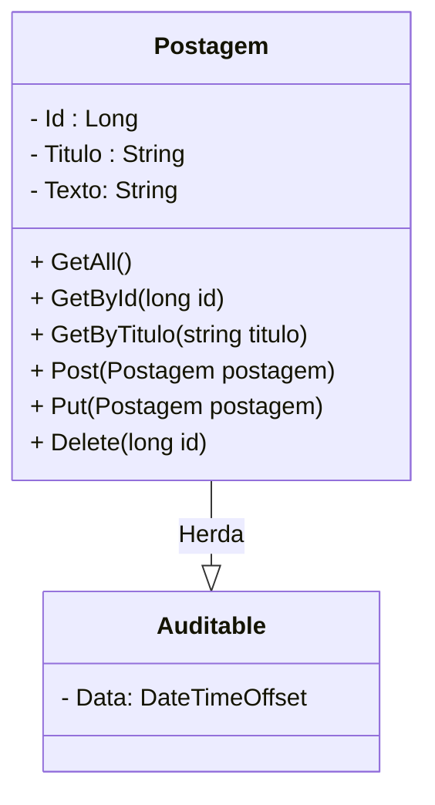

<h1>Projeto 02 - Blog Pessoal - Model Postagem</h1>


O que veremos por aqui:

1. Apresentação do Recurso Postagem
2. Criar a Classe Model Auditable
3. Criar a Classe Model Postagem
4. Criar a Classe Validator PostagemValidator
5. Registrar a Classe Model Postagem na Classe AppDbContext
6. Registrar a Classe Validator PostagemValidator na Classe Program

<br />

<h2>1. O Módulo Postagem</h2>


Nesta etapa vamos começar a construir o Recurso Postagem. Veja o Diagrama de Classes abaixo: 



<br />

Primeiro vamos construir as **Classes Model Auditable e Postagem (Model no modelo MVC)**, que serão utilizadas como modelo para construir a tabela **tb_postagens** (Entidade) dentro do nosso Banco de dados **db_blogpessoal**. Os campos (Atributos) da tabela serão os mesmos que estão definidos no Diagrama de Classes acima. Na próxima etapa vamos começar a construir a Interface **IPostagemRepository** e as Classes **PostagemRepository** (Implementa os Métodos da Interface IPostagemRepository) e **PostagemController** (Implementa os métodos do CRUD descritos no Diagrama de Classes acima).

> **CRUD:** É um acrônimo para **Create** (Persistir dados na tabela), **Read** (Pesquisar dados na tabela), **Update** (Atualizar dados da tabela) e **Delete** (Apagar dados da tabela), ou seja, são os Métodos para interagirmos com as tabelas do nosso Banco de dados.

Depois de criar a Classe Entidade Postagem, vamos executar o projeto Blog Pessoal. Após a execução veremos que será criado dentro do Banco de dados **db_blogpessoal**, a tabela **tb_postagens**. Veja abaixo como ficará a estrutura da nossa tabela através do **Diagrama de Entidade e Relacionamentos (DER)** da tabela tb_postagens:

<div align="center"></div>

O **Dicionário de dados da nossa tabela tb_postagens** será o seguinte:

| Atributo   | Tipo de dado      | Descrição                                         | Chave |
| ---------- | ----------------- | ------------------------------------------------- | ----- |
| **id**     | BIGINT            | Identificador único                               | PK    |
| **titulo** | VARCHAR(100)      | Título da postagem                                |       |
| **texto**  | VARCHAR(1000)     | Conteúdo da postagem                              |       |
| **data**   | DATETIMEOFFSET(7) | Data e hora da publicação/atualização da postagem |       |

<br />

<h2>👣 Passo 01 - Criar a Classe Model Auditable</h2>


A Classe Model é responsável pela abstração dos nossos Objetos em Registros (linhas) nas Tabelas do Banco de dados. As Classes Model representam os Objetos que serão persistidos no Banco de dados. As Classes Model também são utilizadas pelo Entity Framework como modelo para criar automaticamente as nossas tabelas no Banco de dados. 

Vamos implementar a nossa primeira Classe Model, a Classe **Auditable**, que será utilizada para auditar a nossa Classe Model **Postagem**. 

> Uma Entidade Auditada significa que os Objetos da Entidade armazenam a data e a hora em que foram criados e/ou atualizados de forma automática. 

Para automatizar o processo, vamos Criar a  Classe Auditable e na sequência, vamos configurar a Classe **AppDbContext** para fazer essa tarefa para nós. Para tornar Classe Model Postagem auditável, vamos implementá-la como uma herança da **Classe Auditable**.

Importante reforçar que a Classe **Auditable** não irá gerar uma tabela. A Classe Auditable será utilizada pela Classe Postagem para gerar o atributo **Data** dentro da tabela **tb_postagens**. 

Dentro do projeto **blogpessoal**, vamos criar a pasta **Model**:

1. No lado direito superior, na Guia **Gerenciador de Soluções**, clique com o botão direito do mouse sobre o projeto  **blogpessoal** e clique na opção **Adicionar 🡪 Nova Pasta**

2. Digite o nome da pasta (**Model**), com a primeira letra maiúscula, seguindo o padrão do C# e pressione **enter** para concluir. O Gerenciador de Soluções da aplicação ficará semelhante a imagem abaixo:

<div align="center"></div>

Na sequência, vamos criar a **Classe Auditable** na pasta **Model**.

1. Clique com o botão direito do mouse sobre a **pasta Model** e na sequência, clique na opção **Adicionar 🡪 Classe**
2. Na janela **Adicionar Novo item**, no item **Nome**, digite o nome da Classe (**Auditable**), como mostra a figura abaixo:

<div align="center"></div>

3. Clique no botão **Adicionar** para concluir.
4. O Gerenciador de Soluções da aplicação ficará semelhante a imagem abaixo:

 <div align="center"></div>

Vamos implementar e analisar o código da **Classe Auditable**:

 <div align="left"></div>

**Linha 05:** Criamos o atributo **Data**, do tipo **DateTimeOffSet**. O formato **DateTimeOffSet** permite armazenar data e hora, incluindo o fuso horário. Observe que os Métodos get e set foram criados num formato simplificado, chamado de auto implementado. Como os Métodos Get e Set farão apenas a Recuperação e Modificação do atributo, sem operações adicionais, o C# permite simplificar os Métodos, igual fizemos no código acima.

Observe que não foi criado um Método Construtor na Classe Auditable, porque a responsabilidade de criar os Objetos será do ASP.NET. Dentro do Framework ASP.NET, utilizaremos o conceito de **Injeção de Dependências**, que transfere esta responsabilidade para o Framework. Veremos este conceito com mais detalhes na Implementação das Classes Repository e Controller.

<br />

<h2>👣 Passo 02 - Criar a Classe Model Postagem</h2>


Vamos implementar a nossa segunda Classe Model, a Classe **Postagem**, que será utilizada para gerar a tabela **tb_postagens**. Observe que como a Classe Postagem será utilizada para gerar uma tabela, serão adicionadas algumas anotações nos Atributos, para definir as constraints dos atributos da tabela.

Vamos criar a **Classe Postagem** na pasta **Model**.

1. Clique com o botão direito do mouse sobre a **pasta Model** e na sequência, clique na opção **Adicionar 🡪 Classe**
2. Na janela **Adicionar Novo item**, no item **Nome**, digite o nome da Classe (**Postagem**), como mostra a figura abaixo:

<div align="center"></div>

3. Clique no botão **Adicionar** para concluir.
4. O Gerenciador de Soluções da aplicação ficará semelhante a imagem abaixo:

 <div align="center"></div>

Vamos implementar e analisar o código da **Classe Postagem**:

 <div align="left"></div>

**Linhas 1 e 2:** Importamos os Namespaces **DataAnnotations.Schema** e **DataAnnotations**, que disponibilizam as anotações utilizadas para definir as constraints dos atributos da tabela, através da palavra reservada **using**.

**Linha 01:** Importamos o Namespace do **Fluent Validation**.

**Linha 6:** A Classe Postagem foi assinada como Herança da Classe **Auditable**.

**Linhas 11, 15 e 19:** foram criados os Atributos da Classe Postagem, que foram definidos no Diagrama de Classes acima. Veja na tabela abaixo a conversão de **Tipo de dados C# 🡪 SQL Server**. O atributo **Data** será herdado da Classe **Auditable**.

| Atributo   | Tipo de dado TypeScript | Tipo de dado SQL Server |
| ---------- | ----------------------- | ----------------------- |
| **id**     | <i>long</i>             | BIGINT                  |
| **titulo** | <i>string</i>           | VARCHAR(100)            |
| **texto**  | <i>string</i>           | VARCHAR(1000)           |
| **data**   | <i>DateTimeOffSet</i>   | DATETIMEOFFSET(7)       |

<br />

|  | <div align="left">**DICA:** *Para relembrar os tipos de dados do C#, <a href="https://github.com/rafaelq80/cookbook_csharp/blob/main/01_csharp/03.md">clique aqui</a> e explore os principais tipos de dados oferecidos pelo TypeScript.* </div> |
| ------------------------------------------------------------ | ------------------------------------------------------------ |

Observe que os atributos string, foram inicializados com uma string vazia (**string.Empty**), para evitar que o atributo seja nulo.

Observe que acima de cada atributo foram adicionados algumas **anotações**. Estas anotações tem a função de configurar as propriedades dos atributos e constraints para os dados que serão inseridos no Objeto.

**Linha 9:** A anotação **Key** indica que o Atributo Id será a **Chave Primária** (Primary Key - PK) da Tabela **tb_postagens**. 

**Linha 10:** A anotação **[DatabaseGenerated(DatabaseGeneratedOption.Identity)]** define que a **Chave Primária** será gerada pelo Banco de dados, através da propriedade **IDENTITY(1,1)** (auto incremental), que gera uma sequência numérica iniciando em 1, iterando de 1 em 1.

|  | <div align="left"> **ATENÇÃO:** *Não confundir o auto-incremento do Banco de Dados que inicia em 1 com o índice de um array (Vetor ou Matriz) que inicia em 0.* </div> |
| ------------------------------------------------------------ | ------------------------------------------------------------ |

**Nas linhas 13 e 17:** A anotação **Column(TypeName = "varchar")** define que o atributo será do tipo VARCHAR. 

**Nas linhas 14 e 18:** A anotação **StringLength** define o tamanho do atributo VARCHAR. 

<br />

<div align="left"> <a href="https://learn.microsoft.com/pt-br/ef/core/modeling/keys?tabs=data-annotations" target="_blank"><b>Documentação: Key</b></a></div>

<div align="left"> <a href="https://learn.microsoft.com/pt-br/ef/core/modeling/generated-properties?tabs=data-annotations" target="_blank"><b>Documentação: DatabaseGenerated</b></a></div>

<div align="left"> <a href="https://learn.microsoft.com/en-us/dotnet/api/system.componentmodel.dataannotations.schema.databasegeneratedoption?view=net-7.0" target="_blank"><b>Documentação: DatabaseGeneratedOption</b></a></div>

<div align="left"> <a href="https://learn.microsoft.com/pt-br/aspnet/mvc/overview/older-versions-1/models-data/validation-with-the-data-annotation-validators-cs" target="_blank"><b>Documentação: Schema Validation</b></a></div>

<br />

<h2>👣 Passo 03 - Criar a Classe Validator PostagemValidator</h2>


Validar os dados antes deles serem persistidos no Banco de dados é fundamental, para evitar erros no Banco de dados, além de garantir que as informações persistidas estão de acordo com as regras de negócio do sistema. O ASP.NET oferece algumas soluções para efetuar a validação dos dados, entre elas, a **Fluent Validation**. A **Fluent Validation** é uma biblioteca .NET desenvolvida para criar regras de validação fortemente tipadas.

Para utilizar o FluentValidation precisamos criar uma Classe de validação para cada Classe Model, que implementará as respectivas regras de validação. Vamos começar criando a Classe de Validação para a Classe Postagem, chamada **PostagemValidator**.

Dentro do projeto **blogpessoal**, vamos criar a pasta **Validator**, que armazenará todas as Classes de Validação:

1. No lado direito superior, na Guia **Gerenciador de Soluções**, clique com o botão direito do mouse sobre o projeto  **blogpessoal** e clique na opção **Adicionar 🡪 Nova Pasta**

2. Digite o nome da pasta (**Validator**), com a primeira letra maiúscula, seguindo o padrão do C# e pressione **enter** para concluir. O Gerenciador de Soluções da aplicação ficará semelhante a imagem abaixo:

<div align="center"></div>

Na sequência, vamos criar a **Classe PostagemValidator** na pasta **Validator**.

1. Clique com o botão direito do mouse sobre a **pasta Validator** e na sequência, clique na opção **Adicionar 🡪 Classe**
2. Na janela **Adicionar Novo item**, no item **Nome**, digite o nome da Classe (**PostagemValidator**), como mostra a figura abaixo:

<div align="center"></div>

3. Clique no botão **Adicionar** para concluir.
4. O Gerenciador de Soluções da aplicação ficará semelhante a imagem abaixo:

 <div align="center"></div>

Vamos implementar e analisar o código da **Classe PostagemValidator**:

 <div align="left"></div>

**Linha 01:** Importamos o Namespace **Model** (pasta Model do projeto Blog Pessoal), através da palavra reservada **using**.

**Linha 02:** Importamos o Namespace do **Fluent Validation**, através da palavra reservada **using**.

**Linha 6:** A Classe PostagemValidator foi assinada como Herança da Classe **AbstractValidator**.

**Linhas 10 a 13:** Criamos as regras de validação do atributo titulo.

**Linhas 15 a 18:** Criamos as regras de validação do atributo texto.

**Regras de Validação utilizadas**

| Propriedade            | Descrição                           |
| ---------------------- | ----------------------------------- |
| **NotEmpty()**         | A string não pode ser nula ou vazia |
| **MinimumLength(tam)** | Define o tamanho mínimo da string.  |
| **MaximumLength(tam)** | Define o tamanho máximo da string.  |

Existem outras Regras de Validação que podem ser consultadas na documentação do **Fluent Validation** nos links abaixo.

<br />

|  | <div align="left"> **ATENÇÃO:** *A validação criaa pelo Fluent Validation não interfere na criação da tabela no Banco de dados. O Objetivo do Fluent Validation é validar os dados do Objeto antes dele ser persistido no Banco.* </div> |
| ------------------------------------------------------------ | ------------------------------------------------------------ |

<br />

<div align="left"> <a href="https://docs.fluentvalidation.net/en/latest/built-in-validators.html" target="_blank"><b>Documentação: Fluent Validation - Regras de Validação</b></a></div>

<br />

<h2>👣 Passo 04 - Registrar a Classe Postagem na Classe AppDbContext</h2>


Vamos registrar a Classe **Postagem** na Classe **AppDbContext**, para gerar a tabela **tb_postagens** no Banco de dados. O código da Classe **AppDbContext** será implementado conforme a imagem abaixo:

<div align="left"></div>

Vamos analisar o código:

Observe que o nome da Tabela segue o padrão **tb_nome_da_tabela** (tb_postagens). O prefixo **tb** indica que se trata de uma Table (Tabela). O nome da Tabela é recomendado que seja **o mesmo da Classe Entidade** (postagem), em **letras minúsculas**, **sem espaços em branco ou caracteres especiais e acentos**. 

**Linha 01:** Importamos o Namespace **Model** (pasta Model do projeto Blog Pessoal), através da palavra reservada **using**.

**Linhas 13 a 17:** Implementamos o Método **OnModelCreating**, responsável por criar as tabelas, baseado nas Classes Model registradas.

**Linha 15:** Cria a tabela **tb_postagens**, a partir da Classe Model Postagem.

**Linha 19:** Cria um Objeto da Classe **DbSet**, chamado **Postagens**, a partir da Classe Model Postagem.

> Um **DbSet** representa a coleção de todas as entidades no contexto ou que podem ser consultadas no banco de dados de um determinado tipo, ou seja, é a porta de entrada para as operações  de banco de dados em uma entidade.
>
> A classe DbSet<TEntity> é adicionada como propriedade do DbContext e são mapeadas por padrão para as  tabelas do Banco de dados, que levam o nome da propriedade DbSet<TEntity>. O *DbSet* é uma implementação do padrão *Repository*.

**Linhas 21 a 50:** Implementamos o Método **SaveChangesAsync**, responsável por persistir os dados no Banco de dados. Observe que ele sobrescreve o Método **SaveChangesAsync**.

**Linhas 23 a 25:** O método **ChangeTracker.Entries()** retorna todos os registros que foram criados no **AppDbContext** e armazena na variável **insertedEntry**. 

**Linhas 27 a 34:** Percorre o Objeto **insertedEntry**, que é uma Collection **IEnumerable**, através do Laço de Repetição foreach. Na sequência, verifica se o Objeto criado herda a Entidade Auditable. Se herdar a Entidade Auditable, o atributo **Data**, da Entidade Auditable é atualizado com a data e hora do momento.

**Linhas 36 a 38:** O método **ChangeTracker.Entries()** retorna todos os registros que foram modificados no **AppDbContext** e armazena na variável **modifiedEntry**. 

**Linhas 40 a 47:** Percorre o Objeto **modifiedEntry**, que é uma Collection **IEnumerable**, através do Laço de Repetição foreach. Na sequência, verifica se o Objeto criado herda a Entidade Auditable. Se herdar a Entidade Auditable, o atributo **Data**, da Entidade Auditable é atualizado com a data e hora do momento.

**Linha 49:** Retorna o Objeto persistido no Banco de dados.

Com esta implementação, o Atributo **Data** será atualizado todas as vezes que um Objeto que herda a Classe Auditable for criado ou modificado.

<br />

<div align="left"> <a href="https://learn.microsoft.com/pt-br/dotnet/api/system.data.entity.dbset-1?view=entity-framework-6.2.0" target="_blank"><b>Documentação: Classe DbSet</b></a></div>

<div align="left"> <a href="https://learn.microsoft.com/pt-br/dotnet/api/microsoft.entityframeworkcore.modelbuilder?view=efcore-7.0" target="_blank"><b>Documentação: ModelBuilder</b></a></div>

<div align="left"> <a href="https://learn.microsoft.com/pt-br/dotnet/api/microsoft.entityframeworkcore.changetracking.changetracker.entries?view=efcore-7.0" target="_blank"><b>Documentação: ChangeTracker.Entries</b></a></div>

<br />

<h2>👣 Passo 05 - Registrar a Classe PostagemValidator na Classe Program</h2>


Para finalizar, vamos registrar a Classe **PostagemValidator** como um serviço na Classe **Program**. 

1. Abra a Classe **Program**;
2. Adicione no inicio da Classe **Program** as importações do Pacote **FluentValidation**, do Namespace **Model** (pasta Model do projeto Blog Pessoal) e do Namespace **Validator** (pasta Validator do projeto Blog Pessoal), através da palavra reservada **using**, como mostra a imagem abaixo:

 <div align="left"></div>

3. Localize a linha indicada abaixo:

 <div align="left"></div>

4. Após a linha indicada acima, adicione o trecho de código abaixo:

```c#
			// Validação das Entidades
            builder.Services.AddTransient<IValidator<Postagem>, PostagemValidator>();
```

5. Vamos entender o trecho de código acima:

 <div align="left"></div>

**Linha 29:** Através do Método **AddTransient**, vamos Registrar a Classe **PostagemValidator** associada a Classe **Postagem**, que será utilizada para gerar uma Collection do tipo **IValidator**, que armazenará uma instância da Classe **PostagemValidator**, contendo todas as Regras de Validação (Métodos). A partir do registro da Classe **PostagemValidator** como um serviço, podemos criar **Injeções de Dependências** dentro das nossas Classes Controladoras e Classes de Serviço. Desta forma, poderemos validar os Objetos da Classe Postagem.

<br />

<div align="left"> <a href="https://learn.microsoft.com/pt-br/dotnet/api/microsoft.extensions.dependencyinjection.servicecollectionserviceextensions.addtransient?view=dotnet-plat-ext-7.0" target="_blank"><b>Documentação: AddTransient</b></a></div>

<div align="left"> <a href="https://learn.microsoft.com/pt-br/dotnet/api/system.web.ui.ivalidator?view=netframework-4.8.1" target="_blank"><b>Documentação: Interface IValidator</b></a></div>

<br />

<h2>👣 Passo 06 - Executar o projeto</h2>


1. Para executarmos o Projeto, clique no botão **Run http**, na **Barra de Ferramentas Principal** (indicado em verde na imagem):


2. Observe que na janela do Terminal do Windows, que será aberta durante a execução, é possível visualizar que a tabela **tb_postagens** foi criada, como mostra a imagem abaixo:


3. Abra o **SQL Server Management Studio** e conecte-se com o **SQL Server**.
3. Para visualizar se a **Tabela tb_postagens**  foi criada no **Banco de Dados db_blogpessoal**, abra o **SQL Server Management Studio** e na janela **Pesquisador de Objetos**, localizada no lado esquerdo da tela, selecione o servidor **localhost** e clique no botão **Atualizar** .

<div align="center"></div>

5. Na mesma janela, clique no sinal de (**+**) ao lado do item **Banco de Dados**, na sequência, clique no sinal de (**+**) ao lado do **Banco de Dados db_blogpessoal**, clique no sinal de (**+**) ao lado do item **Tabelas** e se tudo deu certo, veremos a tabela ** tb_postagens** criada dentro do **Banco de Dados db_blogpessoal**, como mostra a imagem abaixo:

<div align="center"></div>

6. Para interromper a execução do Projeto, clique no botão **Parar Depuração**, na **Barra de Ferramentas Principal** (indicado em verde na imagem). Outra forma de parar a execução da aplicação é fechando a janela do Console ou do Navegador.


<br />

<div align="left"> <a href="" target="_blank"><b>Código fonte do projeto</b></a></div>

<br /><br />


<div align="left"><a href="README.md">Voltar</a></div>