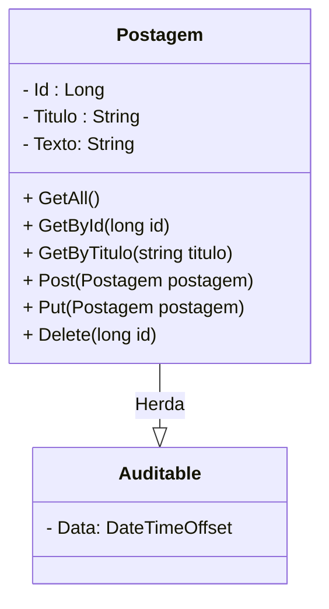
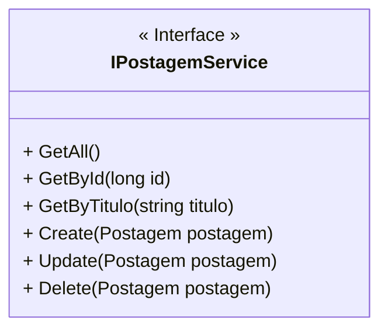

<h1>Projeto 02 - Blog Pessoal - Interface Postagem Service</h1>


O que veremos por aqui:

1. Criar a Interface IPostagemService
1. Implementar os Métodos na Classe PostagemService
1. Registrar a Classe PostagemService na Classe Program


<h2>1. O Recurso Postagem</h2>


Na etapa anterior, começamos a construir o Recurso Postagem, a partir da Classe Model Postagem, onde implementamos todos os Atributos do recurso. Veja o Diagrama de Classes abaixo: 



Nesta etapa, vamos construir a **Interface PostagemService**, que irá nos auxiliar na interação com o Banco de dados. Esta Interface contém diversos Métodos, que serão implementados na Classe PostagemService, com o objetivo de gerar as consultas, que serão utilizadas para manipular os dados da entidade Postagem. Os Métodos pré-implementados realizarão ações como: Salvar (persistir), Deletar, Consultar e Atualizar dados dos objetos persistidos. 

O Diagrama de Classes da nossa Interface será igual a imagem abaixo:



<br />

<h2>👣 Passo 01 - Criar a Interface IPostagemService</h2>


Dentro do projeto **blogpessoal**, vamos criar a pasta **Service**:

1. No lado direito superior, na Guia **Gerenciador de Soluções**, clique com o botão direito do mouse sobre o projeto  **blogpessoal** e clique na opção **Adicionar 🡪 Nova Pasta**

2. Digite o nome da pasta (**Service**), com a primeira letra maiúscula, seguindo o padrão do C# e pressione **enter** para concluir. O Gerenciador de Soluções da aplicação ficará semelhante a imagem abaixo:

<div align="center"></div>

<br />

Vamos criar a **Interface IPostagemService** na pasta **Service**.

1. Clique com o botão direito do mouse sobre a **pasta Service** e na sequência, clique na opção **Adicionar 🡪 Novo item**
2. Na janela **Adicionar Novo Item**, Selecione a opção **Interface**, como mostra a figura abaixo:

<div align="center"></div>

3. No item **Nome**, digite o nome da Interface (**IPostagemService**), como mostra a figura abaixo:

<div align="center"></div>

4. Clique no botão **Adicionar** para concluir.
5. O **Gerenciador de Soluções** da aplicação ficará semelhante a imagem abaixo:

 <div align="center"></div>

<br />

|  | <div align="left"> **ALERTA DE BSM:** *Mantenha a Atenção aos Detalhes ao criar a Interface Service. Na Linguagem C# toda a Interface inicia o nome com a Letra I (maiúscula), porque geralmente a Classe que implementa a Interface tem o mesmo nome da Interface.* </div> |
| ------------------------------------------------------------ | ------------------------------------------------------------ |

<br />

Vamos implementar e analisar o código da **Interface IPostagemService**:

 <div align="left"></div>

<br />

> Antes de continuar, vamos relembrar **o que é uma Interface?**
>
> Uma **interface** é uma **Classe Abstrata** (uma Classe que serve de modelo para outras Classes), composta somente por Métodos abstratos. E como tal, obviamente não pode ser instanciada, ou seja, ela só contém as declarações dos Métodos e constantes, nenhuma implementação, apenas as assinaturas dos Métodos, que serão implementados em uma Classe.

**Linha 01:** Importamos o Namespace **Model** (pasta Model do projeto Blog Pessoal), através da palavra reservada **using**.

**Linhas 07 a 17:** Criamos as assinaturas dos 6 Métodos do CRUD, que serão implementados na Classe **PostagemService**. Observe que todos os Métodos foram assinados com a Classe **Task<TResult>**. Esta Classe representa uma única operação que retorna um valor, executada de forma assíncrona, ou seja, o Método será executado em paralelo ao fluxo de execução principal da aplicação. 

Como vimos nas sessões sobre Banco de dados, para trabalhar com os Bancos de dados, é necessário criar uma grande quantidade de código contendo instruções **SQL**. Através do **Entity Framework**, estes códigos SQL podem ser facilmente reduzidos, através do **LinQ** - *Language Integrated Query*, ou *Consulta Integrada à Linguagem*. 

O **LinQ** tem como objetivo justamente remover essa complexidade, pois ele  abstrai a complexidade envolvida na utilização da linguagem SQL, permitindo consultar uma base de dados relacional, através de uma única API, invocada através de uma linguagem integrante do .NET Framework, como o C#.

Na prática, quando implementarmos os Métodos assinados na Interface **IPostagemService**, utilizaremos o LinQ para gerar as consultas e criarmos as 4 operações do CRUD, sem escrever uma linha de SQL.

<br />

<div align="left"> <a href="https://learn.microsoft.com/pt-br/dotnet/api/system.threading.tasks.task-1?view=net-7.0" target="_blank"><b>Documentação: Task</b></a></div>

<br />

<h2>👣 Passo 02 - Criar a Classe PostagemService</h2>


Dentro da pasta **Service**, vamos criar a pasta **Implements**:

1. No lado direito superior, na Guia **Gerenciador de Soluções**, clique com o botão direito do mouse sobre a pasta **Service** e clique na opção **Adicionar 🡪 Nova Pasta**

2. Digite o nome da pasta (**Implements**), com a primeira letra maiúscula, seguindo o padrão do C# e pressione **enter** para concluir. O Gerenciador de Soluções da aplicação ficará semelhante a imagem abaixo:

<div align="center"></div>

<br />

Vamos criar a **Classe PostagemService** na pasta **Implements**, dentro da pasta **Service**:

1. Clique com o botão direito do mouse sobre a **pasta Implements** e na sequência, clique na opção **Adicionar 🡪 Classe**.
2. No item **Nome**, digite o nome da Classe (**PostagemService**), como mostra a figura abaixo:

<div align="center"></div>

4. Clique no botão **Adicionar** para concluir.
5. O **Gerenciador de Soluções** da aplicação ficará semelhante a imagem abaixo:

 <div align="center"></div>

Vamos implementar o código da Classe **PostagemService** aos poucos, Método a Método. Após a implementação de cada Método, faremos a chamada de cada um deles na Classe **PostagemController**, para utilizar os Métodos e acessarmos através de Requisições HTTP.

Vamos começar implementando a Interface **IPostagemService** na Classe **PostagemService**, através do código abaixo:

 <div align="left"></div>

**Linha 03:** Observe que na assinatura da Classe **PostagemService**, vamos adicionar **:** (dois pontos) e na sequência o nome da Interface que será implementada (**IPostagemService**). Note que depois de adicionar a Interface, será exibido um erro na Classe **PostagemService** (indicado pela seta verde no código). 

A mensagem de erro, informa que a Classe PostagemService deve implementar todos os Métodos da Interface IPostagemService, independente de utilizá-los ou não. 

Vamos implementar todos os Métodos da Interface IPostagemService através da **Ferramenta Ações Rápidas** . 

> A Ferramenta **Ações Rápidas** tem por objetivo principal corrigir e/ou sugerir correções para erros no código que podem fazer com que o build (compilar e gerar o executável) da aplicação falhe.

A animação abaixo mostra como implementar todos os Métodos da Interface IPostagemService na Classe PostagemService:

 <div align="left"></div>

*Ao posicionar o cursor do mouse sobre o erro, o Visual Studio exibirá uma lâmpada (), sugerindo correções. Clique na primeira sugestão: **Implementar a Interface**. Observe que todos os 6 Métodos da Interface serão inseridos na Classe PostagemService, com uma implementação básica.*

Após a implementação básica dos Métodos, a Classe PostagemService deverá estar com o seguinte código:

```c#
using blogpessoal.Model;

namespace blogpessoal.Service.Implements
{
    public class PostagemService : IPostagemService
    {

        public Task<IEnumerable<Postagem>> GetAll()
        {
            throw new NotImplementedException();
        }

        public Task<Postagem?> GetById(long id)
        {
            throw new NotImplementedException();
        }

        public Task<IEnumerable<Postagem>> GetByTitulo(string titulo)
        {
            throw new NotImplementedException();
        }

        public Task<Postagem?> Create(Postagem postagem)
        {
            throw new NotImplementedException();
        }

        public Task<Postagem?> Update(Postagem postagem)
        {
            throw new NotImplementedException();
        }

        public Task Delete(Postagem postagem)
        {
            throw new NotImplementedException();
        }

    }
}
```

Observe que a ordem em que os Métodos foram criados foi alterada. No código acima, os Métodos foram organizados na mesma ordem que serão implementados.

Nos próximos conteúdos, vamos implementar o código das Classes PostagemService e PostagemController simultaneamente, método a método. desta forma, ao final de cada implementação, já poderemos testar a API através de **Requisições HTTP**.

<br />

<h2>👣 Passo 03 - Registrar a Classe PostagemService na Classe Program</h2>


Para finalizar, vamos registrar a Classe **PostagemService** como um serviço na Classe **Program**. 

1. Abra a Classe **Program**;
2. Adicione no inicio da Classe **Program** as importações do Namespace **Service** (pasta Service do projeto Blog Pessoal) e do Namespace **Service.Implements** (pasta Service/Implements do projeto Blog Pessoal), através da palavra reservada **using**, como mostra a imagem abaixo:

 <div align="left"></div>

3. Localize a linha indicada abaixo:

 <div align="left"></div>

4. Após a linha indicada acima, adicione o trecho de código abaixo:

```c#
		    // Registrar as Classes e Interfaces Service
            builder.Services.AddScoped<IPostagemService, PostagemService>();
```

5. Vamos entender o trecho de código acima:

 <div align="left"></div>

**Linha 35:** Através do Método **AddScoped**, vamos Registrar a Classe **PostagemService**, que implementa a Interface **IPostagemService**, que será utilizada para gerar uma Collection do tipo **IServiceCollection**, que armazenará uma instância da Classe **PostagemService**, contendo todos os Métodos implementados. A partir do registro da Classe **PostagemService** como um serviço, podemos criar **Injeções de Dependências** dentro das nossas Classes Controladoras e outras Classes de Serviço, assim como fizemos com a Classe **PostagemValidator**. Desta forma, poderemos utilizar os Métodos implementados na Classe **PostagemService**.

> **Qual é a diferença entre AddScoped e AddTransient?**
>
> Ambas são utilizadas para registrar serviços dentro da aplicação ASP.NET, mas a grande diferença está no tempo de vida da nova instância do Objeto, que será criada pelos serviços registrados, quando forem injetados em uma Classe.
>
> **AddTransient** por exemplo, você **sempre terá uma nova instância** do objeto, ou seja, **TODA VEZ** que o controlador for instanciado, será gerada uma nova instância do Objeto. Este cenário é ideal para quando queremos executar ações pontuais e já dispor o objeto, que normalmente é a maioria dos casos. Por isso este modelo foi utilizado para registrar a Classe **PostagemValidator**, pois uma vez que o Objeto da Classe Postagem for validado, não vamos mais precisar do Objeto PostagemValidator.
>
> O **AddScoped** trabalha de forma parecida com o **AddTransient** porém ele retém o objeto durante toda a requisição, e sempre que invocado, retorna o mesmo objeto, ou seja, **UMA VEZ** que o controlador for instanciado, a instância do Objeto será mantida em memória, até que a requisição seja finalizada. Este cenário é ideal para quando queremos manter o objeto durante toda uma operação. Por isso este modelo foi utilizado para registrar a Classe **PostagemService**, pois até que a Requisição HTTP seja respondida, precisamos manter o Objeto da Classe PostagemService na memória, para executarmos as consultas no Banco de dados. 

<br />

<div align="left"> <a href="https://learn.microsoft.com/pt-br/dotnet/api/microsoft.extensions.dependencyinjection.servicecollectionserviceextensions.addscoped?view=dotnet-plat-ext-7.0" target="_blank"><b>Documentação: AddScoped</b></a></div>

<div align="left"> <a href="https://learn.microsoft.com/pt-br/dotnet/api/microsoft.extensions.dependencyinjection.iservicecollection?view=dotnet-plat-ext-7.0" target="_blank"><b>Documentação: Interface IServiceCollection</b></a></div>

<br />

<div align="left"> <a href="" target="_blank"><b>Código fonte do projeto</b></a></div>

<br /><br />
	

<div align="left"><a href="README.md">Voltar</a></div>