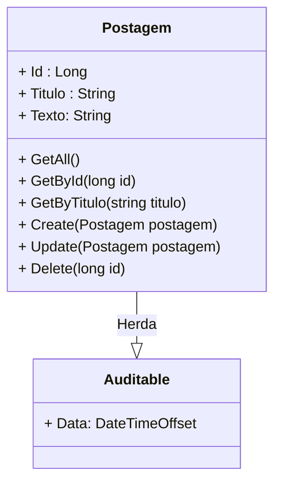

<h1>Projeto 02 - Blog Pessoal - Classes PostagemController e PostagemService - Método Consultar todas as Postagens</h1>


O que veremos por aqui:

1. Implementar o método GetAll() na Classe PostagemService
2. Criar a Classe PostagemController
3. Criar o método GetAll() para listar todas as Postagens na Classe PostagemController
4. Testar o Método no Insomnia


<h2>1. O Recurso Postagem</h2>


Na etapa anterior, começamos a construir o **Recurso Postagem**, a partir da **Classe Entidade (Model) Postagem**, onde implementamos todos os atributos do recurso Postagem e geramos a tabela **tb_postagens** dentro do nosso Banco de dados **db_blogpessoal**. Agora vamos começar a criar os Métodos do CRUD do recurso Postagem, listados no Diagrama de Classes abaixo, nas Classes **PostagemService** e **PostagemController**.



Serão implementados 6 Métodos: 

- 3 Métodos de Busca (GET)
- 1 Método de Persistência dos Objetos no Banco de dados (POST)
- 1 Método de Atualização dos Objetos persistidos no Banco de dados (PUT)
- 1 Método para apagar Objetos persistidos no Banco de dados (DELETE)

A Classe **PostagemService** será a Classe de Serviço do Recurso Postagem, ou seja, onde implementaremos os Métodos com as consultas ao Banco de dados e as Regras de Negócio da aplicação. 

A Classe **PostagemController** será a Classe Controladora do Recurso Postagem, ou seja, onde implementaremos os Métodos responsáveis por responder toda e qualquer Requisição (HTTP Request), que for enviada de fora da aplicação para o recurso Postagem. 

> **Regras de Negócio:**  O termo regras de negócio refere-se às **diretrizes que definem ou restringem as ações, mostrando como os Métodos devem funcionar, o que deve ser checado em cada Método e quais são os limites da aplicação**. Essas regras são importantes para que a pessoa desenvolvedora tenha uma visão clara do que deve ser feito, como e por qual razão.

Nós iremos implementar os métodos do **CRUD** nas duas Classes, com os mesmos nomes, mas com responsabilidades diferentes. O Método da Classe de Serviço fará o processamento dos dados enviados na Requisição, enquanto o Método da Classe Controladora receberá as Requisições e enviará os dados para a Classe de Serviço. Após a conclusão do processamento da Requisição, A Classe Controladora enviará uma Resposta HTTP, definida a partir do retorno do Método da Classe de Serviço, além do resultado do processamento do Método da Classe de Serviço. 

<br />

<h2>👣 Passo 01 - Implementar o Método GetAll() na Classe PostagemService</h2>


Agora vamos começar a implementar o código da Classe **PostagemService**, como mostra a figura abaixo. Como iremos construir 6 Métodos dentro da Classe de Serviço, vamos construir por partes. Aqui construiremos apenas o primeiro Método (**GetAll()**), que tem como objetivo listar todas as Postagens persistidas no Banco de dados.

<div align="left"></div>

Vamos analisar o código:

**Linha 01:** Importamos o Namespace **Data** (pasta Data do projeto Blog Pessoal).

**Linha 03:** Importamos o pacote **EntityFrameworkCore**.

**Linha 10:** Instanciamos um Objeto da Classe **AppDbContext**, chamado **_context** (somente leitura). Esta é a  forma utilizada utilizada pelo EntityFramework para  aplicar  a  **Inversão  de  Controle (IoC)**, sempre que for necessário. A Injeção de Dependência define quais Classes serão instanciadas automaticamente e em quais lugares serão "Injetadas" quando houver necessidade. Observe que o Objeto **_context** será somente leitura, porque durante o processamento da Requisição HTTP, a Classe de Serviço deve se referir sempre ao mesmo Objeto da Classe **AppDbContext**, ao invés de criar um novo.

> **Inversão de controle:** ou IOC é um princípio de design de programas de computadores, onde a sequência de chamadas dos  métodos é invertida em relação à programação tradicional, ou seja, ela  não é determinada diretamente pelo programador e sim pela Linguagem ou Framework. É a transferência da responsabilidade de Criar e Instanciar Objetos para a Linguagem ou Framework. A Injeção de Dependências é um tipo de Inversão de Controle. 

**Linhas 12 a 15:** Cria um **Método Construtor**, que receberá as **Injeções de Dependência** necessárias para o desenvolvimento da Classe de Serviço. Observe que o Método Construtor receberá como Parâmetro um Objeto da Classe **AppDbContext**, chamado **context**.

Em nosso exemplo, a Classe de Serviço cria um ponto de injeção do tipo **AppDbContext** e quando houver a necessidade o EntityFramework cria um novo **Objeto da Classe Postagem** através da Interface **IPostagemService**. A grande vantagem de se utilizar a Injeção de Dependências é que você consegue instanciar e acessar os Objetos sem a necessidade de criar Métodos Construtores na Classe Entidade (Model) ou criar/instanciar Objetos de forma manual, semelhante ao que era feito nas Sessões de Programação Orientada à Objetos. Estamos transferindo esta responsabilidade para o EntityFramework e desta forma nos preocuparemos apenas com o processamento das Requisições HTTP.

**Linhas 17 a 20:** Alteramos o Método **GetAll()** para um **Método Assíncrono**, através da palavra reservada **async**, que promete retornar uma **Promise** (Promessa), contendo uma Collection List de Objetos da Classe Postagem. Como o Método GetAll() lista vários Objetos é necessário criar uma Collection para armazenar todos os Objetos.

> **Processamento Assíncrono**
>
> **Processamento Assíncrono** é essencial para atividades que são potencialmente passíveis de bloqueio do sistema, como acesso ao Banco de dados na WEB. O acesso a um recurso da Web às vezes é lento ou atrasado. Se tal atividade for bloqueada em um processo síncrono, todo o aplicativo deverá esperar. Em um processo assíncrono, o aplicativo poderá prosseguir com outra tarefa que não dependa do recurso da Web até a tarefa potencialmente causadora do bloqueio terminar, com um resultado de sucesso ou de falha.
>
> Quando falamos de bloqueio da aplicação, estamos falando em situações onde seu aplicativo pára de responder, o que poderia levar a conclusão de que ele falhou quando, na verdade, está apenas aguardando. Quando você usa métodos assíncronos, o aplicativo continua a  responder e o usuário poderá aguardar a sua conclusão ou cancelar a operação.

Note que a Classe **Task** recebe no parâmetro Generic Type (`<T>`) uma Collection Genérica do Tipo **IEnumerable**, que aramazenará Objetos do tipo Postagem. Lembre-se que a Interface **IEnumerable** é a interface base para todas as Collections não genéricas que podem ser enumeradas, como a Collection List, por exemplo.

**Linha 19:** Retorna a execução do Método **ToListAsync()**, da Classe **DbContext**. Traçando um paralelo com o SQL, o Método **ToListAsync()** sem parâmetros seria o equivalente a instrução: <code>SELECT * FROM tb_postagens;</code>, que lista todas as postagens da Tabela tb_postagens. 

Observe que na instrução **return** foi inserido o comando **await** (aguarde), que na prática significa espere que a **Promise** seja resolvida (Todos os Objetos Postagem sejam inseridos na Collection List), antes de retornar a execução do Método e o valor resolvido para a Classe que acionou o Método.

> **Promise:** É um objeto usado para processamento assíncrono. Uma Promise na prática é uma promessa, que representa um valor que pode estar disponível agora, no futuro ou nunca. Uma Promise é como um "procurador" para um valor que não é necessariamente conhecido quando a promessa é criada. Isso permite a associação de métodos de tratamento para eventos da ação assíncrona num caso eventual de sucesso ou de falha. Isto permite que os métodos assíncronos retornem valores como métodos síncronos: ao invés do valor final, o método assíncrono retorna uma *promessa* ao valor em algum momento no futuro.
>
> Uma Promise geralmente possui 3 estados: 
>
> - *pending* (pendente): Estado inicial, que não foi realizada nem rejeitada.
> - *resolved* (resolvida): Sucesso na operação.
> - *rejected* (rejeitado):  Falha na operação.

**Informações importantes sobre Métodos Assíncronos:**

- O código assíncrono usa a Classe Task`<T>`, que é utilizada para modelar o trabalho que está sendo feito em segundo plano (assíncrono).

- A palavra-chave **async** transforma um método síncrono (que segue o fluxo principal da aplicação), em um método assíncrono (que cria um fluxo paralelo, em segundo plano), o que permite que você use a palavra-chave **await** em seu corpo.

- Quando a palavra-chave **await** é aplicada, ela suspende o método de chamada e transfere o controle de volta ao seu chamador até que a tarefa em espera seja concluída.

- A palavra **await** só pode ser usada dentro de um método assíncrono.

- **Os Métodos assíncronos (async) precisam ter uma palavra-chave await no corpo ou eles nunca transferirão o controle!**. Se a palavra await não for utilizada no corpo de um método async, o compilador do C# gerará um aviso, mas o código será compilado e  executado como se fosse um método síncrono. Isso também seria extremamente ineficiente, pois a máquina de estado gerada pelo compilador do C# para o método assíncrono não realizaria nada.

<br />

<div align="left"> <a href="https://learn.microsoft.com/pt-br/dotnet/api/system.threading.tasks.task-1?view=net-7.0" target="_blank"><b>Documentação: Task</b></a></div>

<div align="left"> <a href="https://learn.microsoft.com/pt-br/dotnet/csharp/asynchronous-programming/async-scenarios" target="_blank"><b>Documentação: Programação Assíncrona</b></a></div>

<div align="left"> <a href="https://learn.microsoft.com/pt-br/dotnet/csharp/asynchronous-programming/task-asynchronous-programming-model" target="_blank"><b>Documentação: Modelo de Tarefa Assíncrona</b></a></div>

<div align="left"> <a href="https://learn.microsoft.com/pt-br/dotnet/csharp/fundamentals/types/generics" target="_blank"><b>Documentação: Classes Genéricas</b></a></div>

<div align="left"> <a href="https://learn.microsoft.com/pt-br/dotnet/api/system.collections.ienumerable?view=net-7.0" target="_blank"><b>Documentação: Interface IEnumerable</b></a></div>

<br />

<h2>👣 Passo 02 - Criar a Classe PostagemController</h2>


Dentro do projeto **blogpessoal**, vamos criar a pasta **Controller**:

1. No lado direito superior, na Guia **Gerenciador de Soluções**, clique com o botão direito do mouse sobre o projeto  **blogpessoal** e clique na opção **Adicionar 🡪 Nova Pasta**

2. Digite o nome da pasta (**Controller**), com a primeira letra maiúscula, seguindo o padrão do C# e pressione **enter** para concluir. O Gerenciador de Soluções da aplicação ficará semelhante a imagem abaixo:

<div align="center"></div>

<br />

Vamos criar a **Classe PostagemController** na pasta **Controller**:

1. Clique com o botão direito do mouse sobre a **pasta Controller** e na sequência, clique na opção **Adicionar 🡪 Classe**.
2. No item **Nome**, digite o nome da Classe (**PostagemController**), como mostra a figura abaixo:

<div align="center"></div>

4. Clique no botão **Adicionar** para concluir.
5. O **Gerenciador de Soluções** da aplicação ficará semelhante a imagem abaixo:

 <div align="center"></div>

Agora vamos começar a criar o código da Classe **PostagemController**, como mostra a figura abaixo. Como iremos construir 6 Métodos dentro da Classe Controladora, vamos construir por partes. Aqui construiremos apenas o primeiro Método, o **GetAll()**, que tem como objetivo executar o Método com o mesmo nome na **Classe PostagemService**.

<div align="left"></div>

Vamos analisar o código:

**Linha 01:** Importamos o Namespace **Model** (pasta Model do projeto Blog Pessoal), através da palavra reservada **using**.

**Linha 02:** Importamos o Namespace **Service** (pasta Service do projeto Blog Pessoal), através da palavra reservada **using**.

**Linha 03:** Importamos o Namespace do **Fluent Validation**, através da palavra reservada **using**.

**Linha 04:** Importamos o Namespace do **AspNetCore.Mvc**, através da palavra reservada **using**. Este Pacote possui os Métodos necessários para criar a Classe Controladora.

**Linha 08:** A Anotação **[Route("~/postagens")]** é utilizada para mapear todas as Requisições HTTP, recebidas na **URL** (endereço) padrão do Recurso Postagem (**/postagens**), para a classe controladora **PostagemController**. Quando a API receber uma Requisição HTTP com o endereço **http://localhost:5000/postagens**, a Classe Controladora PostagemController irá receber e processar a Requisição com o respectivo Método, de acordo com o caminho e o verbo HTTP (GET, POST, PUT ou DELETE). 

<br />

|  | <div align="left"> **ALERTA DE BSM:** *Mantenha a Atenção aos Detalhes ao configurar a URL do Recurso. Observe que configuramos a URL (/postagens) iniciando com uma barra, com letras minúsculas, sem acentos, caracteres especiais e espaços em branco. Lembre-se que todos os endereços na WEB seguem este padrão.* </div> |
| ------------------------------------------------------------ | ------------------------------------------------------------ |

<br />

**Linha 09:** A Anotação **[ApiController]** indica que a classe é do tipo **RestController**, que receberá requisições que serão compostas por:

- **URL:** Endereço da requisição (**endpoint**)
- **Verbo:** Define qual método HTTP será acionado na Classe controladora.
- **Corpo da requisição (Request Body):** Objeto que contém os dados que serão persistidos no Banco de dados. Apenas as Requisições do tipo POST e PUT conseguem enviar dados no Corpo da Requisição.

Após receber e processar a requisição, a Classe Controladora Responderá com:

- Um **Código de Status HTTP** pertinente a operação que está sendo realizada.
- O resultado do processamento (Objetos de uma Classe, por exemplo) inserido diretamente no corpo da resposta (**Response Body**)

**Linha 10:** A Classe PostagemController foi assinada como Herança da Classe **ControllerBase**, que é responsável por definir a estrutura básica de um controlador MVC.

**Linha 12:** Instanciamos um Objeto da Interface **IPostagemService**, chamado **_postagemService** (somente leitura). Este objeto será utilizado pelo EntityFramework para  aplicar  a  **Inversão  de  Controle (IoC)**, sempre que for necessário. Observe que o Objeto **_postagemService** será somente leitura, porque durante o processamento da Requisição HTTP, a Classe Controladora deve se referir sempre ao mesmo Objeto da Interface **IPostagemService**, ao invés de criar um novo.

> **Por quê estamos instanciando a Interface IPostagemService ao ínvés da Classe PostagemService?**
>
> Lembre-se que quando fizemos o registro do Serviço PostagemService na Classe Program, nós passamos como parâmetros a Interface e a Classe que definem o serviço. Na Classe Controladora os serviços são adicionados como um parâmetro do Método Construtor e o runtime do ASP.NET resolve o serviço de contêiner. Os serviços são normalmente definidos usando interfaces, que são inseridas através de um Injeção de Dependência, graças ao suporte interno do ASP.NET. 
>
> Neste caso utilizamos uma Interface para quebrar as dependências entre as classes de nível superior (PostagemService) e inferior (PostagemController). Em outras palavras, ambas as classes dependem da interface e não mais uma da outra.
>
> Esse princípio melhora a capacidade de reutilização do seu código e limita o efeito cascata se você precisar alterar as classes de nível inferior. Mas mesmo se você implementá-lo perfeitamente, ainda mantém uma dependência na classe de nível inferior. A interface apenas desacopla o uso da classe de nível inferior, mas não sua instanciação. Em algum lugar do seu código, você precisa instanciar a implementação da interface. Isso evita que você substitua a implementação da interface por uma diferente.
>
> <div align="center"></div>
>
> O objetivo da técnica de injeção de dependência é remover essa dependência separando o uso da criação do objeto. Isso reduz a quantidade de código repetitivo necessário e melhora a flexibilidade.

**Linha 13:** Seguindo o mesmo príncipio da linha 12, instanciamos um Objeto da Interface **IValidator**, chamado **_postagemValidator**, que será utilizado para validar os Objetos da Classe Postagem, nos Métodos **Post** e **Put**.

**Linhas 15 a 22:** Cria um **Método Construtor**, que receberá as **Injeções de Dependência** necessárias para o desenvolvimento da Classe de Serviço. Observe que o Método Construtor receberá como Parâmetros as Injeções de Dependência **_postagemService** e **_postagemValidator**.

**Linhas 24 a 28:** Criamos o Método **GetAll()** como um **Método Assíncrono**, através da palavra reservada **async**, que promete retornar um Objeto **ActionResult**, contendo uma Collection List de Objetos da Classe Postagem, recebidas do **Método GetAll() da Classe de Serviço PostagemService**. 

> A Classe **ActionResult** é uma implementação da Interface **IActionResult**, que representa o resultado de um método de ação de forma assíncrona. 

**Linha 24:** A Anotação **[HttpGet]** mapeia todas as Requisições **HTTP GET**, enviadas para um endereço específico, chamado **endpoint**, dentro do Recurso Postagem, para um Método específico que responderá a Requisição, ou seja, ele indica que o Método **GetAll()**, responderá a todas as requisições do tipo **HTTP GET**, enviadas no endereço **http://localhost:5000/postagens/**.

|  | <div align="left"> **ATENÇÃO:** *O Endereço do endpoint será igual ao Endereço do Recurso apenas quando a anotação [HttpGet] não possuir um endereço personalizado, como um parâmetro. Caso existam dois ou mais métodos do tipo GET será necessário personalizar o endereço de cada Método anotado com algo do tipo [HttpGet("endereço")].* </div> |
| ------------------------------------------------------------ | ------------------------------------------------------------ |

**Linha 27:** Através da palavra reservada **return**, retornaremos o resultado da execução do Método **Ok()**. O Método **Ok()** cria uma  **Resposta HTTP** padrão, com o HTTP Status **OK 🡪 200** e insere no Corpo da Resposta um JSON, contendo a Coleção de Objetos Postagem encontrados no Banco de dados.   

Por se tratar de uma Coleção, a Resposta da Requisição sempre será positiva, o máximo que pode acontecer é o Método GetAll() retornar uma Coleção vazia, caso não exista nenhum registro no Banco de dados.

<br />

<div align="left"> <a href="https://developer.mozilla.org/pt-BR/docs/Web/HTTP/Methods" target="_blank"><b>Documentação: HTTP Methods Request</b></a></div>

<div align="left"> <a href="https://developer.mozilla.org/pt-BR/docs/Web/HTTP/Status" target="_blank"><b>Documentação: HTTP Status Code</b></a></div>

<div align="left"> <a href="https://learn.microsoft.com/pt-br/dotnet/api/microsoft.aspnetcore.mvc.controllerbase?view=aspnetcore-7.0" target="_blank"><b>Documentação: Classe ControllerBase</b></a></div>

<div align="left"> <a href="https://learn.microsoft.com/pt-br/aspnet/core/web-api/?view=aspnetcore-7.0" target="_blank"><b>Documentação: Criar APIs Web com o ASP.NET Core</b></a></div>

<div align="left"> <a href="https://learn.microsoft.com/pt-br/aspnet/core/mvc/controllers/dependency-injection?view=aspnetcore-7.0" target="_blank"><b>Documentação: Injeção de dependência em controladores</b></a></div>

<div align="left"> <a href="https://learn.microsoft.com/pt-br/dotnet/api/microsoft.aspnetcore.mvc.actionresult?view=aspnetcore-7.0" target="_blank"><b>Documentação: Classe ActionResult</b></a></div>

<div align="left"> <a href="https://learn.microsoft.com/pt-br/dotnet/api/microsoft.aspnetcore.mvc.controllerbase.ok?view=aspnetcore-7.0" target="_blank"><b>Documentação: Método Ok()</b></a></div>

<br />

<h2>👣 Passo 03 - Executar o projeto</h2>


Para executarmos o Projeto, clique no botão **Run http**, na **Barra de Ferramentas Principal** (indicado em verde na imagem):


<br />

<h2>👣 Passo 04 - Inserir dados no Banco de dados</h2>


Como ainda não criamos um Método para Cadastrar Postagens (criaremos em breve), vamos inserir dois registros diretamente no Banco de Dados **db_blogpessoal** na Tabela **tb_postagens** para testarmos o nosso Método GetAll().

1. Abra o **SQL Server Management Studio** e conecte-se com o **SQL Server**.

2. Na Barra de Ferramentas do **SQL Server Management Studio**, clique no botão **Nova Consulta**, para criar uma nova janela de consulta:

<div align="center"></div>

3. Crie um novo arquivo SQL **(SQLFile)** e digite os comandos abaixo:

```sql
USE db_blogpessoal;
GO

INSERT INTO tb_postagens (Titulo, Texto, Data)
VALUES ('Postagem 01', 'Texto da Postagem 01', SYSDATETIMEOFFSET());
INSERT INTO tb_postagens (Titulo, Texto, Data)
VALUES ('Postagem 02', 'Texto da Postagem 02', SYSDATETIMEOFFSET());
GO

SELECT * FROM tb_postagens;
GO
```

4. Para executar a Query, selecione todas as linhas e clique no comando Executar , disponível na Barra de Ferramentas do **SQL Server Management Studio**:

<div align="center"></div>

5. O resultado será semelhante a imagem abaixo:

<div align="center"></div>

A imagem acima mostra que os dados foram inseridos com sucesso!

<br />

<h2>👣 Passo 05 - Testar no Insomnia</h2>


Para testar a aplicação, utilizaremos o **Insomnia**. 

Para organizar os nossos testes, vamos criar uma **Collection** para guardar todas as nossas **Requisições do Projeto Blog Pessoal**. Na sequência vamos criar dentro da Collection uma pasta chamada **Postagem** para guardar todas as requisições do Recurso Postagem. Para concluir, vamos criar uma requisição do tipo **GET**, dentro da pasta Postagem, para testar o nosso Método **GetAll()**.

<br />

<h3>5.1. Criando a Collection Blog Pessoal</h3>


1. Na janela principal do **Insomnia**, clique no botão **Create** e clique na opção **Request Collection**.

<div align="center"></div>

2. Na janela que será aberta, informe o nome da Collection (**Blog Pessoal**) e clique no botão **Create** para concluir. 

<div align="center"></div>

<br />

<h3>5.2. Criando a  Pasta Postagem</h3>


Vamos criar dentro da **Collection Blog Pessoal**, na **Pasta Postagem**, que guardará todas as requisições do **Recurso Postagem**.

1. Na **Collection Blog Pessoal**, clique no botão . No menu que será aberto, clique na opção **New Folder**.

<div align="center"></div>

2. Na janela que será aberta, informe o nome da pasta (**Postagem**) e clique no botão **Create** para concluir. 

<div align="center"></div>

<br />

<h3>5.3. Criando a  Requisição - Consultar todas as postagens - GetAll()</h3>


Agora vamos criar a Requisição para o **Método GetAll()**:

1. Clique com o botão direito do mouse sobre a **Pasta Postagem** para abrir o menu e clique na opção **New HTTP Request**.

<div align="center"></div>

2. Será criada uma nova Requisição (New Request) dentro da pasta **Postagem**.

<div align="center"></div>

3. Dê um duplo clique sobre a nova requisição (**New Request**), informe o nome da requisição (indicado na imagem abaixo na cor amarela) e pressione a tecla **enter** do seu teclado.

<div align="center"></div>

4. Selecione o Método HTTP que será utilizado (**GET**) na requisição, indicado na imagem abaixo na cor verde. 

<div align="center"></div>

5. Configure a requisição conforme a imagem abaixo:

<div align="center"></div>

6. No item marcado em amarelo na imagem acima, informe o endereço do endpoint da Requisição. A Requisição **Consultar Todas as postagens** foi configurada da seguinte maneira:

- A primeira parte do endereço (http://localhost:5000) é o endereço do nosso servidor local. Quando a aplicação estiver na nuvem, ele será substituído pelo endereço da nuvem (**Exemplo:** http://nomedaaplicacao.onrender.com).
- A segunda parte do endereço é o **endpoint** configurado anotação **[Route("~/postagens")]**, em nosso caso  **/postagens**. 

7. Para testar a requisição, com a aplicação rodando, clique no botão .

8. O resultado da requisição você confere na imagem abaixo:

<div align="center"></div>

9. Observe que a aplicação além de exibir os dados de todos os Objetos da Classe Postagem persistidos no Banco de dados, no Corpo da Resposta, ela também retornará um **HTTP Status 200 🡪 OK** (indicado em verde na imagem acima), informando que a Requisição foi bem sucedida!
9. Caso o Projeto ASP.NET não esteja em Execução, o Insomnia retornará a mensagem abaixo:

<div align="center"></div>

11. Execute o seu Projeto e teste novamente!

<br />

<div align="left"><a href="https://docs.insomnia.rest/" target="_blank"><b>Documentação: Insomnia Rest</b></a></div>

<div align="left"><a href="https://www.json.org/json-pt.html" target="_blank"><b>Site Oficial do JSON</b></a></div>

<br />

<div align="left"> <a href="" target="_blank"><b>Código fonte do projeto</b></a></div>

<br /><br />

<div align="left"><a href="README.md">Voltar</a></div>