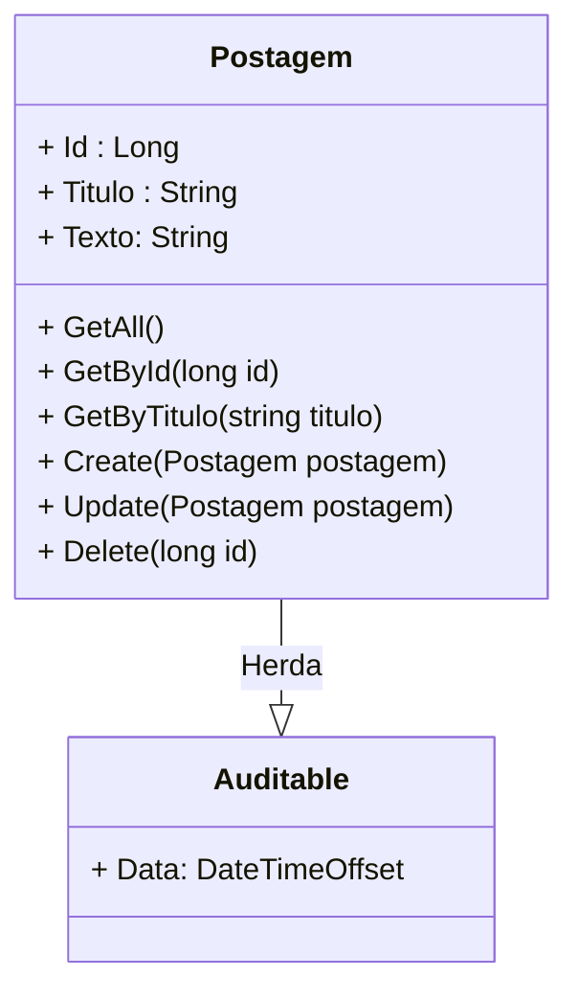

<h1>Projeto 02 - Blog Pessoal - Classe PostagemController e PostagemService - Método Consultar Postagens por Id</h1>

O que veremos por aqui:

1. Criar o Método GetById(long id) na Classe PostagemService
2. Criar o Método GetById(long id) na Classe PostagemController
3. Testar o Método no Insomnia

<h2>1. O Recurso Postagem</h2>

Na etapa anterior, começamos a construir as Classes **PostagemService** e  **PostagemController**, além de  implementamos o Método **GetAll()**, que retorna todos os Objetos da Classe Postagem persistidos no Banco de dados. Vamos continuar a construção das nossas Classes implementando o **Método GetById( long id )**.

 

<h2>👣 Passo 01 - Implementar o Método GetById(long id) na Classe PostagemService</h2>

Vamos implementar o Método **GetById(long id)** na Classe PostagemService. Traçando um paralelo com o MySQL, seria o equivalente a instrução: <code>SELECT * FROM tb_postagens where id = id;</code>.

1. Abra a Classe **PostagemService**.

2. Insira o código abaixo no Método **GetById(long id)**.

Vamos analisar o código do Método:

**Linhas 22 a 35:** Criamos o Método Assíncrono (async), chamado **GetById(long id)**, que promete retornar uma **Promise** com **apenas um** Objeto da Classe Postagem. Como o Método **GetById(long id)** lista apenas um Objeto específico, diferente do Método GetAll() que lista todos, será necessário criar apenas um Objeto da Classe Postagem para armazenar o Objeto procurado.

Note que a Classe **Task** recebe no parâmetro Generic Type (<T>) o tipo Postagem, entretanto, ao lado do tipo foi adicionado uma interrogação (**?**). Esta interrogação indica que o Objeto Postagem, que será retornado pelo Método, pode ser nulo (null), caso ele não seja encontrado na consulta ao Banco de dados.

Observe que o Método **GetById(long id)** possui um parâmetro do tipo **long**, chamado **id**. Esta variável receberá o id da Postagem que você deseja procurar. O id será enviado pelo Método da **Classe PostagemController**. 

**Linhas 24 a 33:** Criamos uma estrutura de tratamento de erros **try...catch**, para checar se a Postagem foi ou não encontrada.

**Linha 26:** Criamos um Objeto da Classe postagem, chamado **Postagem**, que receberá o resultado da execução do Método **FirstAsync(i => i.Id == id)**, da Interface **PostagemService**, que retorna apenas um Objeto específico (o primeiro), cujo id seja igual ao valor da variável id (parâmetro do Método GetById(long id)). Traçando um paralelo com o SQL, o Método **FirstAsync(i => i.Id == id)** seria o equivalente a instrução: <code>SELECT * FROM tb_postagens where id = id_procurado;</code>. 

Observe que na instrução **return** foi inserido o comando **await** (aguarde), que na prática significa espere que a **Promise** seja resolvida (o Objeto Postagem seja encontrado e inserido no Objeto Postagem criado na Promise na linha 26), antes de retornar a execução do Método e o valor resolvido para a Classe que acionou o Método.

Note que o critério de busca, foi definido no parâmetro do Método **FirstAsync(i => i.Id == id)**, através de uma **Expressão Lambda**. 

 

|  | 
**DICA:** *Caso tenha alguma dúvida sobre Expressões Lambda, <a href="https://github.com/rafaelq80/cookbook_csharp/blob/main/01_csharp/18.md">clique aqui</a> e explore como criar e utilizar Expressões Lambda.* 
 |
| ------------------------------------------------------------ | ------------------------------------------------------------ |

 

**Linha 28:** Se o Objeto postagem for encontrado, o Método retorna o Objeto postagem para a Classe que acionou o Método, através da palavra reservada **return**.

**Linha 32:** Se a Postagem não foi encontrada, caso o usuário digite um id que não exista, por exemplo, o Objeto Postagem será nulo e o Método retorna um Objeto **null** para a Classe que acionou o Método, através da palavra reservada **return**.

 

 <a href="https://learn.microsoft.com/pt-br/dotnet/api/system.threading.tasks.task-1?view=net-7.0" target="_blank"><b>Documentação: Task</b></a>

 <a href="https://learn.microsoft.com/pt-br/dotnet/csharp/asynchronous-programming/async-scenarios" target="_blank"><b>Documentação: Programação Assíncrona</b></a>

 <a href="https://learn.microsoft.com/pt-br/dotnet/csharp/asynchronous-programming/task-asynchronous-programming-model" target="_blank"><b>Documentação: Modelo de Tarefa Assíncrona</b></a>

 <a href="https://learn.microsoft.com/pt-br/dotnet/csharp/fundamentals/types/generics" target="_blank"><b>Documentação: Classes Genéricas</b></a>

 

<h2>👣 Passo 02 - Criar o Método GetById(long id) na Classe PostagemController</h2>

Vamos implementar o Método **GetById(long id)** na Classe PostagemController, que tem como objetivo executar o Método com o mesmo nome na Classe de Serviço PostagemService. 

1. Abra a Classe **PostagemController**.

2. Insira o código abaixo depois do Método **GetAll()**.

Vamos analisar o código do Método:

**Linhas 30 a 41:** Criamos o Método **GetById(long id)** como um **Método Assíncrono**, através da palavra reservada **async**, que promete retornar um Objeto **ActionResult**, contendo um Objeto da Classe Postagem, recebido do **Método GetById(long id) da Classe de Serviço PostagemService**. 

**Linha 30:** A Anotação **[HttpGet("{id}")]** mapeia todas as Requisições **HTTP GET**, enviadas para um endereço específico, chamado **endpoint**, dentro do Recurso Postagem, para um Método específico que responderá a Requisição. No Projeto Blog Pessoal, ele indica que o Método **GetById(long id)**, responderá a todas as requisições do tipo **HTTP GET**, enviadas para o endereço **http://localhost:5000/postagens/{id}**. O **{id}** é uma variável de caminho, que será substituída pelo id da postagem, que se deseja consultar. O Valor enviado na variável de caminho, será inserido no parâmetro **id** do método **GetById( long id )**.

**Exemplo:**

http://localhost:5000/postagens/1

Neste exemplo, o parâmetro **long id**, do Método  **GetById( long id )**, receberá o valor 1 (Id que será procurado na tabela tb_postagens), que foi enviado na variável de caminho **/{id}**.

|  | 
 **ATENÇÃO:** *O Endereço deste Endpoint será composto pelo Endereço do Recurso (/postagens) + a variável de caminho ({id}), indicada na anotação [HttpGet("{id}")]. Lembre-se que não pode existir dois ou mais métodos do tipo GET com o mesmo endereço.* 
 |
| ------------------------------------------------------------ | ------------------------------------------------------------ |

 

|  | 
 **ATENÇÃO:** *Por questões de boas práticas e legibilidade do código, a Variável de Caminho e o Parâmetro do Método devem possuir o mesmo nome e escrita (letras minúsculas).* 
 |
| ------------------------------------------------------------ | ------------------------------------------------------------ |

 

**Linha 33:** Criamos um Objeto da Classe postagem, chamado **Resposta**, que receberá o resultado da execução do Método **GetById(id)**, da Classe **PostagemService**, que retorna apenas um Objeto específico (o primeiro), cujo id seja igual ao valor da variável id (parâmetro do Método GetById(long id)). 

**Linhas 35 a 38:** Verifica se o Objeto **Resposta** é nulo (null). Caso seja nulo, o Método **GetById( long id )** retornará o HTTP Status **NOT FOUND 🡪 404** (Não Encontrado!), através do Método **NotFound()**.

**Linha 40:** Caso a Postagem seja encontrada, retornaremos o Objeto Resposta através do Método **Ok()**. O Método **Ok()** cria uma  **Resposta HTTP** padrão, com o HTTP Status **OK 🡪 200**, e insere no Corpo da Resposta um JSON, contendo o Objeto Postagem encontrado. 

Observe que o Método foi chamado através da **Injeção de Dependência _postagemService** e foi adicionada a palavra reservada **await**, por se tratar de um Método Assíncrono.

Caso seja passada uma string, ao invés de um numero na variável de caminho **id**, será retornado o HTTP Status **BadRequest 🡪 400**, como mostra a imagem abaixo:

 

 <a href="https://developer.mozilla.org/pt-BR/docs/Web/HTTP/Methods" target="_blank"><b>Documentação: HTTP Methods Request</b></a>

 <a href="https://developer.mozilla.org/pt-BR/docs/Web/HTTP/Status" target="_blank"><b>Documentação: HTTP Status Code</b></a>

 <a href="https://learn.microsoft.com/pt-br/dotnet/api/microsoft.aspnetcore.mvc.controllerbase?view=aspnetcore-7.0" target="_blank"><b>Documentação: Classe ControllerBase</b></a>

 <a href="https://learn.microsoft.com/pt-br/aspnet/core/web-api/?view=aspnetcore-7.0" target="_blank"><b>Documentação: Criar APIs Web com o ASP.NET Core</b></a>

 <a href="https://learn.microsoft.com/pt-br/aspnet/core/mvc/controllers/dependency-injection?view=aspnetcore-7.0" target="_blank"><b>Documentação: Injeção de dependência em controladores</b></a>

 <a href="https://learn.microsoft.com/pt-br/dotnet/api/microsoft.aspnetcore.mvc.actionresult?view=aspnetcore-7.0" target="_blank"><b>Documentação: Classe ActionResult</b></a>

 <a href="https://learn.microsoft.com/pt-br/dotnet/api/microsoft.aspnetcore.mvc.controllerbase.ok?view=aspnetcore-7.0" target="_blank"><b>Documentação: Método Ok()</b></a>

 <a href="https://learn.microsoft.com/pt-br/dotnet/api/microsoft.aspnetcore.mvc.controllerbase.notfound?view=aspnetcore-7.0" target="_blank"><b>Documentação: Método NotFound()</b></a>

 

<h2>👣 Passo 03 - Executar o projeto</h2>

Para executarmos o Projeto, clique no botão **Run http**, na **Barra de Ferramentas Principal** (indicado em verde na imagem):

 

<h2>👣 Passo 04 - Testar no Insomnia</h2>

Agora vamos criar a Requisição para o Método **GetById( long id )**:

1. Clique com o botão direito do mouse sobre a **Pasta Postagem** para abrir o menu e clique na opção **New Request**.

2. Será criada uma nova Requisição (New Request) dentro da pasta **Postagem**.

   

3. Dê um duplo clique sobre a nova requisição (**New Request**), informe o nome da requisição (indicado na imagem abaixo na cor amarela) e pressione a tecla **enter** do seu teclado.

4. Selecione o Método HTTP que será utilizado (**GET**) na requisição, indicado na imagem abaixo na cor verde. 

5. Configure a requisição conforme a imagem abaixo:

6. No item marcado em amarelo na imagem acima, informe o endereço (endpoint) da Requisição. A requisição **Consultar postagem por ID** foi configurada da seguinte maneira:

- A primeira parte do endereço (http://localhost:5000) é o endereço do nosso servidor local. Quando a aplicação estiver na nuvem, ele será substituído pelo endereço da nuvem (Exemplo: http://nomedaaplicacao.onrender.com).
- A segunda parte do endereço é o **endpoint** configurado na anotação ***[Route("~/postagens")]***, em nosso caso **/postagens**.  
- A terceira parte (**/1**) é a variável de caminho **id**. Informe o id da postagem que você deseja procurar.

7. Para testar a requisição, com a aplicação rodando, clique no botão .

8. O resultado da requisição você confere na imagem abaixo:

9. Observe que a aplicação quando encontra o Objeto no Banco de dados, além de exibir os dados do Objeto no Corpo da Resposta, respeitando o critério informado na consulta (id = 1), ela também retorna um **HTTP Status 200 🡪 OK** (indicado em verde na imagem acima), informando que a Requisição foi bem sucedida!

10. Caso o Objeto Postagem não seja encontrado, a aplicação retornará o **HTTP Status 404 🡪 NOT FOUND** (Não encontrado), marcado em laranja na imagem abaixo:

 

 <a href="" target="_blank"><b>Código fonte do projeto</b></a>

  

<a href="README.md">Voltar</a>
