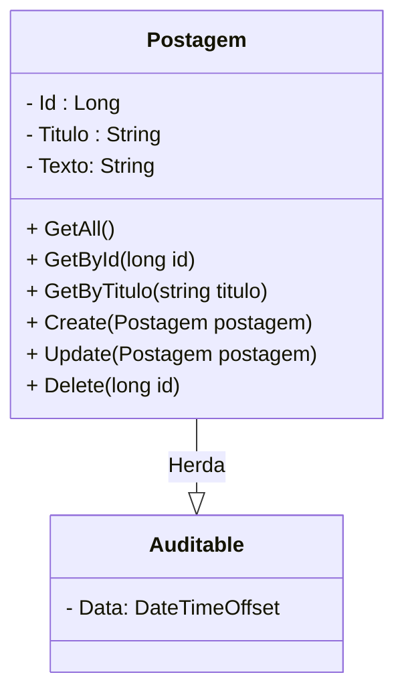

<h1>Projeto 02 - Blog Pessoal - Classe PostagemController e PostagemService - Método Consultar Postagens por Título</h1>

O que veremos por aqui:

1. Implementar o Método GetByTitulo(string titulo) na Classe PostagemService
2. Criar o Método GetByTitulo(string titulo) na Classe PostagemController
3. Testar o Método no Insomnia

 

<h2>1. O Recurso Postagem</h2>

Nas etapas anteriores, começamos a construir as Classes **PostagemService** e **PostagemController** e implementamos os Métodos:

- **GetAll()**  🡪 Retorna todos os Objetos da Classe Postagem persistidos no Banco de dados.
- **GetById(long id)** 🡪 Retorna um Objeto específico da Classe Postagem persistidos no Banco de dados. A Postagem é identificada pelo atributo id.

Vamos continuar a construção das nossas duas Classes implementando o **Método GetByTitulo( string titulo )**, que retornará todos os Objetos da Classe Postagem persistidos no Banco  de dados, cujo atributo titulo contenha a string enviada no parâmetro titulo do Método.

 

<h2>👣 Passo 01 - Implementar o Método GetByTitulo(string titulo) na Classe PostagemService</h2>

Vamos implementar o Método **GetByTitulo(string titulo)** na Classe PostagemService. Traçando um paralelo com o SQL, seria o equivalente a instrução: <code>SELECT * FROM tb_postagens where titulo like "%titulo%";</code>.

1. Abra a Classe **PostagemService**.

2. Insira o código abaixo no Método **GetById(long id)**.

Vamos analisar o código do Método:

**Linhas 37 a 44:** Criamos o Método Assíncrono (async), chamado **GetByTitulo(string titulo)**, que promete retornar uma **Promise** contendo um array de Objetos da Classe Postagem. Como o **Método GetByTitulo(string titulo)** lista todos os Objetos que atendam ao critério da consulta. Assim como no Método GetAll(), será necessário criar uma Collection para armazenar todos os Objetos encontrados.

Note que a Classe **Task** recebe no parâmetro Generic Type (<T>) uma Collection Genérica do Tipo **IEnumerable**, que aramazenará Objetos do tipo Postagem. Lembre-se que a Interface **IEnumerable** é a interface base para todas as Collections não genéricas que podem ser enumeradas, como a Collection List, por exemplo.

Observe que o Método **GetByTitulo(string titulo)** possui um parâmetro do tipo **string**, chamado **titulo**. Esta variável receberá a string que você deseja procurar no Atributo titulo de todas as Postagens persistidas. Qualquer postagem, cujo **Atributo titulo contenha a string enviada no parâmetro** (seja no inicio, no meio ou no fim), será adicionada na Collection e exibida no resultado do Método. O parâmetro titulo será enviado pelo Método da **Classe PostagemController**. 

**Linha 39:** Retorna a execução do Método **ToListAsync()**, da Classe **DbContext**. O resultado da execução do Método  **ToListAsync()**, será uma Coleção de Objetos Postagem, selecionados de acordo com o(s) critério(s) da clausula where.  

Note que a filtragem dos dados foi criada através de uma consulta criada com o **LinQ - *Language Integrated Query***. O critério da consulta, **localize a Postagem cujo atributo titulo contenha, em qualquer parte, a string titulo enviada no parâmetro do Método GetByTitulo(string titulo)**, inserido na clausula **where**, foi enviado através de uma **Expressão Lambda**. Ao final, o resultado é inserido em uma Collection List.

Observe que na instrução **return** foi inserido o comando **await** (aguarde), que na prática significa espere que a **Promise** seja resolvida (Todos os Objetos Postagem, que atendem aos critérios, sejam inseridos na Collection List), antes de retornar a execução do Método e o valor resolvido para a Classe que acionou o Método.

**Linha 43:** O Método retorna a Collection contendo todos os Objetos da Classe Postagem,  selecionados de acordo com o(s) critério(s) da clausula where, para a Classe que acionou o Método, através da palavra reservada **return**.

 

 <a href="https://learn.microsoft.com/pt-br/dotnet/api/system.threading.tasks.task-1?view=net-7.0" target="_blank"><b>Documentação: Task</b></a>

 <a href="https://learn.microsoft.com/pt-br/dotnet/csharp/asynchronous-programming/async-scenarios" target="_blank"><b>Documentação: Programação Assíncrona</b></a>

 <a href="https://learn.microsoft.com/pt-br/dotnet/csharp/asynchronous-programming/task-asynchronous-programming-model" target="_blank"><b>Documentação: Modelo de Tarefa Assíncrona</b></a>

 <a href="https://learn.microsoft.com/pt-br/dotnet/csharp/fundamentals/types/generics" target="_blank"><b>Documentação: Classes Genéricas</b></a>

 <a href="https://learn.microsoft.com/pt-br/dotnet/api/system.collections.ienumerable?view=net-7.0" target="_blank"><b>Documentação: Interface IEnumerable</b></a>

 

<h2>👣 Passo 02 - Criar o Método GetByTitulo(string titulo) na Classe PostagemController</h2>

Vamos implementar o Método **GetByTitulo(string titulo)** na Classe PostagemController, que tem como objetivo executar o Método com o mesmo nome na Classe de Serviço PostagemService. 

1. Abra a Classe **PostagemController**.

2. Insira o código abaixo depois do Método **GetById(long id)**.

Vamos analisar o código do Método:

**Linhas 43 a 47:** Criamos o Método **GetByTitulo(string titulo)** como um **Método Assíncrono**, através da palavra reservada **async**, que promete retornar um Objeto **ActionResult**, contendo uma Collection List de Objetos da Classe Postagem, recebidas do **Método GetByTitulo(string titulo) da Classe de Serviço PostagemService**. 

**Linha 30:** A Anotação **[HttpGet("titulo/{titulo}")]** mapeia todas as Requisições **HTTP GET**, enviadas para um endereço específico, chamado **endpoint**, dentro do Recurso Postagem, para um Método específico que responderá a Requisição. No Projeto Blog Pessoal, ele indica que o Método **GetByTitulo(string titulo)**, responderá a todas as requisições do tipo **HTTP GET**, enviadas para o endereço **http://localhost:5000/postagens/titulo/{titulo}**. O **{titulo}** é uma variável de caminho, que será substituída pela string, que se deseja consultar se existe alguma postagem que contenha esta string no título. O Valor enviado na variável de caminho, será inserido no parâmetro **titulo** do método **GetByTitulo(string titulo)**.

**Exemplo:**

http://localhost:5000/postagens/titulo/palavra

Neste exemplo, o parâmetro **string titulo**, do Método **GetByTitulo(string titulo)**, receberá a string **"palavra"** (parâmetro que será enviado para a Classe PostagemService), que foi inserido na variável de caminho **{titulo}**.

|  | 
 **ATENÇÃO:** *O Endereço deste Endpoint será composto pelo Endereço do Recurso (/postagens) + a variável de caminho indicada na anotação [HttpGet("titulo/{titulo}")]. Lembre-se que não pode existir dois ou mais métodos do tipo GET com o mesmo endereço.* 
 |
| ------------------------------------------------------------ | ------------------------------------------------------------ |

 

|  | 
 **ATENÇÃO:** *Por questões de boas práticas e legibilidade do código, a Variável de Caminho e o Parâmetro do Método devem possuir o mesmo nome e escrita (letras minúsculas).* 
 |
| ------------------------------------------------------------ | ------------------------------------------------------------ |

 

**Linha 46:** Através da palavra reservada **return**, retornaremos o resultado da execução do Método **Ok()**. O Método **Ok()** cria uma  **Resposta HTTP** padrão, com o HTTP Status **OK 🡪 200** e insere no Corpo da Resposta um JSON, contendo a Coleção de Objetos Postagem encontrados no Banco de dados.   

Por se tratar de uma Coleção, a Resposta da Requisição sempre será positiva, o máximo que pode acontecer é o Método GetAll() retornar uma Coleção vazia, caso não exista nenhum registro no Banco de dados.

 

 <a href="https://developer.mozilla.org/pt-BR/docs/Web/HTTP/Methods" target="_blank"><b>Documentação: HTTP Methods Request</b></a>

 <a href="https://developer.mozilla.org/pt-BR/docs/Web/HTTP/Status" target="_blank"><b>Documentação: HTTP Status Code</b></a>

 <a href="https://learn.microsoft.com/pt-br/dotnet/api/microsoft.aspnetcore.mvc.controllerbase?view=aspnetcore-7.0" target="_blank"><b>Documentação: Classe ControllerBase</b></a>

 <a href="https://learn.microsoft.com/pt-br/aspnet/core/web-api/?view=aspnetcore-7.0" target="_blank"><b>Documentação: Criar APIs Web com o ASP.NET Core</b></a>

 <a href="https://learn.microsoft.com/pt-br/aspnet/core/mvc/controllers/dependency-injection?view=aspnetcore-7.0" target="_blank"><b>Documentação: Injeção de dependência em controladores</b></a>

 <a href="https://learn.microsoft.com/pt-br/dotnet/api/microsoft.aspnetcore.mvc.actionresult?view=aspnetcore-7.0" target="_blank"><b>Documentação: Classe ActionResult</b></a>

 <a href="https://learn.microsoft.com/pt-br/dotnet/api/microsoft.aspnetcore.mvc.controllerbase.ok?view=aspnetcore-7.0" target="_blank"><b>Documentação: Método Ok()</b></a>

 

<h2>👣 Passo 03 - Executar o projeto</h2>

1. Para executarmos o Projeto, clique no botão **Run http**, na **Barra de Ferramentas Principal** (indicado em verde na imagem):

   

    

<h2>👣 Passo 04 - Testar no Insomnia</h2>

Agora vamos criar a Requisição para o Método **GetByTitulo(string titulo)**:

1. Clique com o botão direito do mouse sobre a **Pasta Postagem** para abrir o menu e clique na opção **New Request**.

2. Será criada uma nova Requisição (New Request) dentro da pasta **Postagem**.

   

3. Dê um duplo clique sobre a nova requisição (**New Request**), informe o nome da requisição (indicado na imagem abaixo na cor amarela) e pressione a tecla **enter** do seu teclado.

4. Selecione o Método HTTP que será utilizado (**GET**) na requisição, indicado na imagem abaixo na cor verde. 

5. Configure a requisição conforme a imagem abaixo:

6. No item marcado em amarelo na imagem acima, informe o endereço (endpoint) da Requisição. A requisição **Consultar Postagem por Titulo** foi configurada da seguinte maneira:

- A primeira parte do endereço (http://localhost:5000) é o endereço do nosso servidor local. Quando a aplicação estiver na nuvem, ele será substituído pelo endereço da nuvem (Exemplo: http://nomedaaplicacao.onrender.com).
- A segunda parte do endereço é o **endpoint** configurado na anotação **[Route("~/postagens")]**, em nosso caso **/postagens**.  
- A terceira parte (**/titulo/{titulo}**) é a variável de caminho **titulo**. Informe a palavra, frase ou letra que você deseja procurar.

7. Para testar a requisição, com a aplicação rodando, clique no botão .

8. O resultado da requisição você confere na imagem abaixo:

9. Observe que a aplicação além de exibir os dados de todos os Objetos da Classe Postagem persistidos no Banco de dados, no Corpo da Resposta, respeitando o critério informado na consulta (palavra postagem), ela também retornará um **HTTP Status 200 🡪 OK** (indicado em verde na imagem acima), informando que a Requisição foi bem sucedida!

 

<a href="https://docs.insomnia.rest/" target="_blank"><b>Documentação: Insomnia Rest</b></a>

<a href="https://www.json.org/json-pt.html" target="_blank"><b>Site Oficial do JSON</b></a>

 

 <a href="" target="_blank"><b>Código fonte do projeto</b></a>

 

 

<a href="README.md">Voltar</a>
