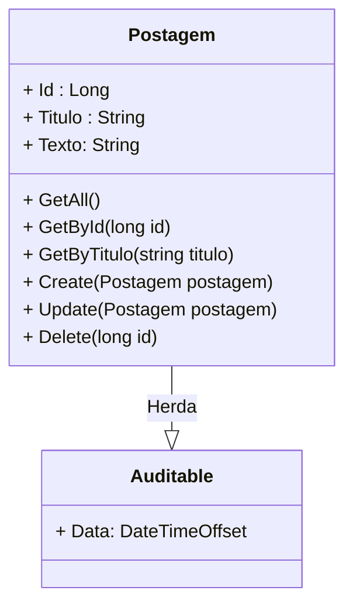

<h1>Projeto 02 - Blog Pessoal - Classe PostagemController e PostagemService - Método Atualizar Postagem</h1>


O que veremos por aqui:

1. Implementar o método Update(Postagem postagem) na Classe PostagemService
4. Criar o método Update(Postagem postagem) na Classe PostagemController
5. Testar os Métodos no Insomnia

<br />

<h2>1. O Recurso Postagem</h2>


Nas etapas anteriores, começamos a construir as Classes **PostagemService** e **PostagemController** e implementamos os seguintes Métodos:

-  **GetAll()**  🡪 Retorna todos os Objetos da Classe Postagem persistidos no Banco de dados.
-  **GetById(long id)** 🡪 Retorna um Objeto específico da Classe Postagem persistido no Banco de dados. A Postagem é identificada pelo atributo id. 
-  **GetByTitulo(string titulo)** 🡪 Retorna  todos os Objetos da Classe Postagem persistidos no Banco de dados, cujo atributo titulo contenha (em qualquer parte) a string enviada no parâmetro titulo do Método.   
-  **Método Create(postagem: Postagem)** 🡪 Persiste (salva) um novo Objeto da Classe Postagem no Banco de dados.

Vamos continuar a construção das Classes **PostagemService** e  **PostagemController** implementando o Método **Update(Postagem postagem)**, que atualizará um Objeto da Classe Postagem persistido no Banco de dados.



<br />

<h2>👣 Passo 01 - Criar o Método create(Postagem postagem) na Classe PostagemService</h2>


Vamos implementar o Método **Create(Postagem postagem)** na Classe PostagemService. Traçando um paralelo com o SQL, seria o equivalente a instrução: <code>UPDATE tb_postagens SET titulo = "titulo", texto = "texto", data = CURRENT_TIMESTAMP() WHERE id = id;</code>.

1. Abra a Classe **PostagemService**.

2. Insira o código abaixo no Método **Create(Postagem postagem)**.

<div align="left"></div>

Vamos analisar o código do Método:

**Linhas 56 a 70:** Criamos o Método Assíncrono (async), chamado **Update(Postagem postagem)**, que promete retornar uma **Promise** com **um** Objeto da Classe Postagem com os dados Atualizados. 

Note que a Classe **Task** recebe no parâmetro Generic Type (<T>) o tipo Postagem, entretanto, ao lado do tipo foi adicionado uma interrogação (**?**). Esta interrogação indica que o Objeto Postagem, que será retornado pelo Método, pode ser nulo (null), caso ele não seja persistido no Banco de dados.

Observe que o Método **Update(Postagem postagem)** possui um parâmetro do tipo **Postagem**, chamado **postagem**. Esta variável receberá um Objeto da Classe Postagem, que foi enviado no Corpo da Requisição (Request Body), conforme as regras definidas na Entidade Postagem (Tamanho, Pode ser Nulo, Pode ser vazio, entre outras). O Objeto postagem será enviado pelo Método da **Classe PostagemController**, através de um **JSON**, semelhante ao exemplo abaixo: 

```json
{
    "id" : 3,
    "titulo" : "Postagem 03",
    "texto" : "Texto da Postagem 03"
}
```

Observe que além dos Atributos **titulo e texto**, no caso de uma atualização, o **id também deve ser enviado**. Desta forma, será possível identificar exatamente qual é a postagem que será atualizada. O atributo **data será atribuído pelo ASP.NET** (timestamp). Importante reforçar que ao atualizar a postagem, o atributo data também será atualizado.

> **Timestamp:** Basicamente representa um instante único, um ponto específico na linha  do tempo, e seu valor corresponde a uma determinada quantidade de tempo decorrida a partir de um instante inicial. Dentro do nosso contexto, a aplicação consultará o Sistema Operacional para obter a data e a hora e gravará em um Atributo do Objeto (data, por exemplo) o momento exato em que ele foi criado ou atualizado.

**Linha 59:** Criamos um Objeto da Classe postagem, chamado **PostagemUpdate**, que receberá o resultado da execução do Método **FindAsync(postagem.Id)**, da Interface **PostagemService**, que retorna apenas um Objeto específico, cujo id seja igual ao valor do atributo **Id** do Objeto postagem. 

Observe que na istrução acima foi inserido o comando **await** (aguarde), que na prática significa espere que a **Promise** seja resolvida (o Objeto Postagem seja encontrado), antes de retornar a execução do Método e o valor resolvido.

**Linhas 61 a 62:** Verifica se o Objeto **PostagemUpdate** é nulo. Caso seja nulo, o Método retornará um Objeto nulo, indicando que a Postagem não foi econtrada.

**Linha 64:** Retiramos o Objeto **PostagemUpdate** da lista de Objetos rastreados pelo **DbContext**, alterando o **State** (estado) do Objeto postagem para **EntityState.Detached**. Como o ASP.NET atualiza todos os Objetos rastreados de uma única vez e o Objeto Postagem Update foi utilizado apenas para checar se o Objeto que iremos atualizar (postagem) existe, precisamos retirá-lo da lista de Objetos rastreados pelo **DbContext**, senão ele entrará na lista de Objetos atualizáveis. 

**Linha 65:** Adicionamos o Objeto postagem na lista de Objetos rastreados pelo **DbContext**, que serão atualizados, alterando o **State** (estado) do Objeto postagem para **EntityState.Modified**, até que eles sejam persistidos no Banco de dados.

**Linha 66:** O Objeto postagem é persistido no Banco de dados com as atualizações, através do Método **SaveChangesAsync**.

Observe que na instrução **SaveChangesAsync** foi inserido o comando **await** (aguarde), que na prática significa espere que a **Promise** seja resolvida (o Objeto postagem seja persistido).

**Linha 68:** Retorna o Objeto da Classe Postagem atualizado no Banco de dados, na tabela **tb_postagens**.  

No caso de uma atualização dos dados, o retorno esperado do Método **SaveChangesAsync** será a confirmação do Objeto persistido, no formato JSON, como mostra o exemplo abaixo:

```json
{
	"id": 3,
	"titulo": "Postagem 03 - Atualizado",
	"texto": "Texto da minha postagem 03 - Atualizado",
	"data": "2023-07-24T12:48:03.1494568-03:00"
}
```

<br />

<div align="left"> <a href="https://learn.microsoft.com/pt-br/dotnet/api/system.threading.tasks.task-1?view=net-7.0" target="_blank"><b>Documentação: Task</b></a></div>

<div align="left"> <a href="https://learn.microsoft.com/pt-br/dotnet/csharp/asynchronous-programming/async-scenarios" target="_blank"><b>Documentação: Programação Assíncrona</b></a></div>

<div align="left"> <a href="https://learn.microsoft.com/pt-br/dotnet/csharp/asynchronous-programming/task-asynchronous-programming-model" target="_blank"><b>Documentação: Modelo de Tarefa Assíncrona</b></a></div>

<div align="left"> <a href="https://learn.microsoft.com/pt-br/dotnet/csharp/fundamentals/types/generics" target="_blank"><b>Documentação: Classes Genéricas</b></a></div>

<div align="left"> <a href="https://learn.microsoft.com/pt-br/dotnet/api/system.data.entitystate?view=netframework-4.8.1" target="_blank"><b>Documentação: EntityState</b></a></div>

<div align="left"> <a href="https://learn.microsoft.com/pt-br/dotnet/api/microsoft.entityframeworkcore.dbcontext.savechangesasync?view=efcore-7.0" target="_blank"><b>Documentação: Método SaveChangesAsync</b></a></div>

<br />

<h2>👣 Passo 02 - Criar o Método Post(Postagem postagem) na Classe PostagemController</h2>


Vamos implementar o Método **Post(Postagem postagem)** na Classe PostagemController, que tem como objetivo executar o Método com o mesmo nome na Classe de Serviço PostagemService. 

1. Abra a Classe **PostagemController**.

2. Insira o código abaixo depois do Método **Update(Postagem postagem)**.

<div align="left"></div>

Vamos analisar o código do Método:

**Linhas 62 a 80:** Criamos o Método **Update(Postagem postagem)** como um **Método Assíncrono**, através da palavra reservada **async**, que promete retornar um Objeto **ActionResult**, contendo um Objeto da Classe Postagem atualizado no Banco de dados, recebido do **Método Update(Postagem postagem) da Classe de Serviço PostagemService**. 

**Linha 62:** A Anotação **[HttpPut]** mapeia todas as Requisições **HTTP PUT**, enviadas para um endereço específico, chamado **endpoint**, dentro do Recurso Postagem, para um Método específico que responderá a Requisição. No Projeto Blog Pessoal, ele indica que o Método **Update(Postagem postagem)**, responderá a todas as requisições do tipo **HTTP PUT**, enviadas para o endereço **http://localhost:5000/postagens**. 

**Linha 63:** Observe que o Método **Update(Postagem postagem)** possui na sua assinatura uma anotação ao lado do parâmetro **postagem**. A anotação **[FromBody]** indica que o Objeto postagem será recebido através do Corpo da Requisição HTTP. Na prática, será enviado através de um JSON inserido no Corpo da Requisição.

|  | <div align="left"> **ATENÇÃO:** *O Endereço do endpoint do Método Update(Postagem postagem) será igual ao endereço dos Métodos GetAll() e Create(Postagem postagem). Como os verbos HTTP dos dois Métodos são diferentes, o mesmo endereço pode ser de utilizado.* </div> |
| ------------------------------------------------------------ | ------------------------------------------------------------ |

**Linhas 65 a 66:** Verifica se o atributo Id do Objeto **postagem** é igual a zero. Caso seja zero, o Método retornará o HTTP Status **BADREQUEST 🡪 400**, através do Método **BadRequest()**.

**Linha 68:** Criamos um Objeto da Classe PostagemValidator, chamado **validarPostagem**, que receberá o resultado da execução do Método **ValidateAsync(postagem)**, da Classe **PostagemValidator**, que retorna a validação dos dados do Objeto postagem, de acordo com as regras de validação criadas na Classe PostagemValidator. 

**Linhas 70 a 71:** Verifica se o Objeto **postagemValidator** não é válido, ou seja, se alguma regra não foi validada. Caso não seja válido, o Método **Update(Postagem postagem)** retornará o HTTP Status **BADREQUEST 🡪 400** com a lista de erros de validação, através do Método **StatusCode()**.

**Linha 73:** Se o Objeto postagem for validado, criamos o Objeto **Resposta**, que receberá a execução do Método **Update(Postagem postagem)**, da Classe  **PostagemService**, responsável por atualizar os dados do Objeto persistido no Banco de dados.

Observe que na instrução **Update(Postagem postagem)** foi inserido o comando **await** (aguarde), que na prática significa espere que a **Promise** seja resolvida (o Objeto postagem seja persistido).

**Linhas 75 a 76:** Verifica se o Objeto **Resposta** é nulo (null). Caso seja nulo, o Método **Update(Postagem postagem)** retornará o HTTP Status **NOT FOUND 🡪 404** (Não Encontrado!), através do Método **NotFound()**.

**Linha 78:** Caso a Postagem seja atualizada, retornaremos o Objeto **Resposta** através do Método **Ok()**. O Método **Ok()** cria uma  **Resposta HTTP** padrão, com o HTTP Status **OK 🡪 200**, e insere no Corpo da Resposta um JSON, contendo o Objeto Postagem atualizado. 

<br />

<div align="left"> <a href="https://developer.mozilla.org/pt-BR/docs/Web/HTTP/Methods" target="_blank"><b>Documentação: HTTP Methods Request</b></a></div>

<div align="left"> <a href="https://developer.mozilla.org/pt-BR/docs/Web/HTTP/Status" target="_blank"><b>Documentação: HTTP Status Code</b></a></div>

<div align="left"> <a href="https://learn.microsoft.com/pt-br/dotnet/api/microsoft.aspnetcore.mvc.controllerbase?view=aspnetcore-7.0" target="_blank"><b>Documentação: Classe ControllerBase</b></a></div>

<div align="left"> <a href="https://learn.microsoft.com/pt-br/aspnet/core/web-api/?view=aspnetcore-7.0" target="_blank"><b>Documentação: Criar APIs Web com o ASP.NET Core</b></a></div>

<div align="left"> <a href="https://learn.microsoft.com/pt-br/aspnet/core/mvc/controllers/dependency-injection?view=aspnetcore-7.0" target="_blank"><b>Documentação: Injeção de dependência em controladores</b></a></div>

<div align="left"> <a href="https://learn.microsoft.com/pt-br/dotnet/api/microsoft.aspnetcore.mvc.actionresult?view=aspnetcore-7.0" target="_blank"><b>Documentação: Classe ActionResult</b></a></div>

<div align="left"> <a href="https://learn.microsoft.com/pt-br/dotnet/api/microsoft.aspnetcore.mvc.controllerbase.ok?view=aspnetcore-7.0" target="_blank"><b>Documentação: Método Ok()</b></a></div>

<div align="left"> <a href="https://learn.microsoft.com/pt-br/dotnet/api/microsoft.aspnetcore.mvc.controllerbase.notfound?view=aspnetcore-7.0" target="_blank"><b>Documentação: Método NotFound()</b></a></div>

<br />


<h2>👣 Passo 03 - Executar o projeto</h2>


Para executarmos o Projeto, clique no botão **Run http**, na **Barra de Ferramentas Principal** (indicado em verde na imagem):


<br />

<h2>👣 Passo 04 - Testar no Insomnia o Método update</h2>


Agora vamos criar a Requisição para o **Método update(Postagem postagem)**:

1. Clique com o botão direito do mouse sobre a **Pasta Postagem** para abrir o menu e clique na opção **New Request**.

<div align="center"></div>

2.  Será criada uma nova Requisição (New Request) dentro da pasta **Postagem**.

<div align="center"></div>

3. Dê um duplo clique sobre a nova Requisição (**New Request**), informe o nome da Requisição (indicado na imagem abaixo na cor amarela) e pressione a tecla **enter** do seu teclado.

<div align="center"></div>

4. Selecione o Método HTTP que será utilizado (**PUT**) na Requisição, indicado na imagem abaixo na cor verde. 

<div align="center"></div>

5. No item **Body**, vamos alterar para **JSON**, como mostra a imagem abaixo. Desta forma poderemos enviar os dados do Objeto Postagem no Corpo da Requisição, no formato JSON.

<div align="center"></div>

6. Observe que o item **Body** será renomeado para **JSON**, como mostra a imagem abaixo:

<div align="center"></div>

7. Configure a Requisição conforme a imagem abaixo: 

<div align="center"></div>

4. No item marcado em amarelo na imagem acima, informe o endereço (endpoint)) da Requisição. A requisição **Atualizar Postagem** foi configurada da seguinte maneira:

   - A primeira parte do endereço (http://localhost:5000) é o endereço do nosso servidor local. Quando a aplicação estiver na nuvem, ele será substituído pelo endereço da nuvem (**Exemplo:** http://nomedaaplicacao.onrender.com).
   - A segunda parte do endereço é o **endpoint** configurado na anotação **[Route("~/postagens")]**, em nosso caso **/postagens**.  
   
5. Na guia **JSON**, precisamos inserir um **JSON** com os dados que serão inseridos na nova postagem. Lembrando que no padrão JSON: **o texto antes dos 2 pontos** (:) é o **atributo** da Classe e **o texto depois dos 2 pontos** (:) é o **dado** que será cadastrado no atributo.  Os atributos são separados por virgula, como mostra a imagem acima.

   |  | <div align="left"> **ATENÇÃO:** Observe que no método **PUT é necessário enviar o atributo id** no JSON para identificar a Postagem que será atualizada. A data não precisa ser enviada, porquê ela será atualizada pela própria aplicação.</div> |
   | ------------------------------------------------------------ | ------------------------------------------------------------ |

6. Para testar a requisição, com a aplicação rodando, clique no botão .

7. O resultado da requisição você confere na imagem abaixo:

<div align="center"></div>

8. Observe que a aplicação retorna além dos dados que foram atualizados no Banco de dados, ela também retorna um **HTTP Status 200 🡪 OK** (indicado em verde na imagem acima). Este Status indica que a Requisição foi bem sucedida!

9. Caso a Postagem não seja encontrada, será retornado o **HTTP Status 404 🡪 NOT_FOUND**, ou seja, a postagem não foi encontrada, como mostra a figura abaixo:

<div align="center"></div>

10. Caso os Atributos **titulo** ou **texto** sejam nulos ou em branco (indicado em amarelo), a aplicação retornará o **HTTP Status 400 🡪 BAD_REQUEST** (indicado em verde), devido as validações que foram inseridas na Classe **PostagemValidator** **( NotEmpty e MinimumLength(5) )**, como mostra a imagem abaixo:

<div align="center"></div>

<br />

<div align="left"><a href="https://docs.insomnia.rest/" target="_blank"><b>Documentação: Insomnia Rest</b></a></div>

<div align="left"><a href="https://www.json.org/json-pt.html" target="_blank"><b>Site Oficial do JSON</b></a></div>

<br />

<div align="left"> <a href="" target="_blank"><b>Código fonte do projeto</b></a></div>

<br /><br />

<div align="left"><a href="README.md">Voltar</a></div>