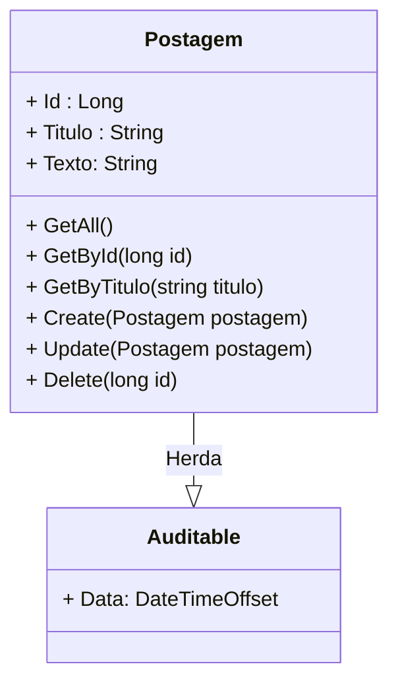

<h1>Projeto 02 - Blog Pessoal - Classe PostagemController e PostagemService - Método Deletar</h1>

O que veremos por aqui:

1. Implementar o método Delete(Postagem postagem) na Classe PostagemService
2. Criar o método Delete(Postagem postagem) na Classe PostagemController
3. Testar o Método no Insomnia

 

<h2>1. O Recurso Postagem</h2>

Nas etapas anteriores, construímos as Classes **PostagemService** e **PostagemController** e implementamos os Métodos:

- **GetAll()**  🡪 Retorna todos os Objetos da Classe Postagem persistidos no Banco de dados.

- **GetById(long id)** 🡪 Retorna um Objeto específico da Classe Postagem persistidos no Banco de dados. A Postagem é identificada pelo atributo id. 

- **GetByTitulo(string titulo)** 🡪 Retorna  todos os Objetos da Classe Postagem persistidos no Banco de  dados, cujo atributo titulo contenha (em qualquer parte) a string enviada no parâmetro titulo do Método.

- **Método Create(Postagem postagem)** 🡪 Persiste (salva) um novo Objeto da Classe Postagem no Banco de dados.

- **Método Update(Postagem postagem)** 🡪 Atualiza um Objeto da Classe Postagem persistido no Banco de dados.

Vamos finalizar a construção das Classes **PostagemService** e  **PostagemController** implementando os Métodos **Delete(Postagem postagem)** e **Delete(long id)** respectivamente, que apagará um Objeto da Classe Postagem persistido no Banco de dados, identificado pelo seu id.

 

<h2>👣 Passo 01 - Criar o Método Delete(Postagem postagem) na Classe PostagemService</h2>

Vamos implementar o Método **Delete(Postagem postagem)** na Classe **PostagemService**, que retornará a confirmação da exclusão de um Objeto específico persistido no Banco de dados. 

1. Abra a Classe **PostagemService**.

2. Insira o código abaixo no Método **GetById(long id)**.

Vamos analisar o código do Método:

**Linhas 72 a 78:** Criamos o Método Assíncrono (async), chamado **Delete(Postagem postagem)**, que promete retornar uma **Promise** com a confirmação de que **um** Objeto da Classe Postagem foi excluído. 

Observe que o Método **Delete(Postagem postagem)** possui um parâmetro do tipo **Postagem**, chamado **postagem**. Esta variável receberá um Objeto da Classe Postagem, que foi enviado pelo Método da **Classe PostagemController**.

**Linha 75:** Adicionamos o Objeto postagem na lista de Objetos rastreados pelo **DbContext**, para a exclusão, através do Método **Remove**, até que ele seja excluído no Banco de dados.

**Linha 76:** O Objeto postagem é excluído no Banco de dados e a exclusão é confirmada através do Método **SaveChangesAsync**.

Observe que na instrução **SaveChangesAsync** foi inserido o comando **await** (aguarde), que na prática significa espere que a **Promise** seja resolvida (o Objeto postagem excluído). 

O Método **SaveChangesAsync** funciona como uma espécie de "finalizador" das operações que criam, modificam ou excluem Objetos persistidos no Banco de dados. 

 

<h2>👣 Passo 02 - Criar o Método Delete(long id) na Classe PostagemController</h2>

Vamos implementar o Método **Delete(long id) **na Classe **PostagemController**, com o objetivo de executar o Método com o mesmo nome na Classe de Serviço PostagemService. Traçando um paralelo com o SQL, seria o equivalente a instrução: <code>DELETE FROM tb_postagens WHERE id = id;</code>. 

1. Abra a Classe **PostagemController**.

2. Insira o código abaixo depois do Método **Update(Postagem postagem)**.

Vamos analisar o código do Método:

**Linhas 82 a 94:** Criamos o Método **Delete(long id)** como um **Método Assíncrono**, através da palavra reservada **async**, que promete retornar um Objeto **ActionResult**, contendo a confirmação de que um Objeto da Classe Postagem foi excluído, pelo **Método Delete(Postagem postagem) da Classe de Serviço PostagemService**. 

**Linha 82:** A Anotação **[HttpDelete("{id}")]** mapeia todas as Requisições **HTTP DELETE**, enviadas para um endereço específico, chamado **endpoint**, dentro do Recurso Postagem, para um Método específico que responderá a Requisição. No Projeto Blog Pessoal, ele indica que o Método **Delete(long id)**, responderá a todas as requisições do tipo **HTTP DELETE**, enviadas para o endereço **http://localhost:5000/postagens/{id}**. O **{id}** é uma variável de caminho, que será substituída pelo id da postagem, que se deseja excluir. O Valor enviado na variável de caminho, será inserido no parâmetro **id** do método **Delete( long id )**.

**Exemplo:**

http://localhost:5000/postagens/3

Neste exemplo, o parâmetro **long id**, do Método  **Delete( long id )**, receberá o valor 3 (Id da postagem que será excluído na tabela tb_postagens), que foi enviado na variável de caminho **/{id}**.

|  | 
 **ATENÇÃO:** *O Endereço deste Endpoint será composto pelo Endereço do Recurso (/postagens) + a variável de caminho ({id}), indicada na anotação [HttpGet("{id}")]. Embora este seja o mesmo endereço do endpoint associado ao Método GetById( long id ), os Verbos HTTP dos 2 endpoints são diferentes.* 
 |
| ------------------------------------------------------------ | ------------------------------------------------------------ |

 

|  | 
 **ATENÇÃO:** *Por questões de boas práticas e legibilidade do código, a Variável de Caminho e o Parâmetro do Método devem possuir o mesmo nome e escrita (letras minúsculas).* 
 |
| ------------------------------------------------------------ | ------------------------------------------------------------ |

 

**Linha 85:** Criamos um Objeto da Classe postagem, chamado **BuscaPostagem**, que receberá o resultado da execução do Método **GetById(id)**, da Interface **PostagemService**, que retorna apenas um Objeto específico, cujo id seja igual ao valor da variável de caminho **id**. 

Observe que na istrução acima foi inserido o comando **await** (aguarde), que na prática significa espere que a **Promise** seja resolvida (o Objeto Postagem seja encontrado), antes de retornar a execução do Método e o valor resolvido.

**Linhas 87 a 88:** Verifica se o Objeto **BuscaPostagem** é nulo. Caso seja nulo, o Método **Delete(long id)** retornará o HTTP Status **NOT FOUND 🡪 404** (Não Encontrado!), através do Método **NotFound()**.

**Linha 90:** Se o Objeto postagem for encontrado, executamos o Método **Delete(BuscaPostagem)**, da Classe  **PostagemService**, responsável por excluir o Objeto no Banco de dados.

Observe que na instrução **Delete(Postagem postagem)** foi inserido o comando **await** (aguarde), que na prática significa espere que a **Promise** seja resolvida (o Objeto postagem seja excluído).

**Linha 59:** Retorna a  **Resposta HTTP** No Content, com o HTTP Status **NOCONTENT 🡪 204**, através do Método **NoContent()**, indicando que o Objeto não existe mais.

 

 <a href="https://developer.mozilla.org/pt-BR/docs/Web/HTTP/Methods" target="_blank"><b>Documentação: HTTP Methods Request</b></a>

 <a href="https://developer.mozilla.org/pt-BR/docs/Web/HTTP/Status" target="_blank"><b>Documentação: HTTP Status Code</b></a>

 <a href="https://learn.microsoft.com/pt-br/dotnet/api/microsoft.aspnetcore.mvc.controllerbase?view=aspnetcore-7.0" target="_blank"><b>Documentação: Classe ControllerBase</b></a>

 <a href="https://learn.microsoft.com/pt-br/aspnet/core/web-api/?view=aspnetcore-7.0" target="_blank"><b>Documentação: Criar APIs Web com o ASP.NET Core</b></a>

 <a href="https://learn.microsoft.com/pt-br/aspnet/core/mvc/controllers/dependency-injection?view=aspnetcore-7.0" target="_blank"><b>Documentação: Injeção de dependência em controladores</b></a>

 <a href="https://learn.microsoft.com/pt-br/dotnet/api/microsoft.aspnetcore.mvc.actionresult?view=aspnetcore-7.0" target="_blank"><b>Documentação: Classe ActionResult</b></a>

 <a href="https://learn.microsoft.com/pt-br/dotnet/api/microsoft.aspnetcore.mvc.controllerbase.nocontent?view=aspnetcore-7.0" target="_blank"><b>Documentação: Método NoContent()</b></a>

 <a href="https://learn.microsoft.com/pt-br/dotnet/api/microsoft.aspnetcore.mvc.controllerbase.notfound?view=aspnetcore-7.0" target="_blank"><b>Documentação: Método NotFound()</b></a>

 

Para executarmos o Projeto, clique no botão **Run http**, na **Barra de Ferramentas Principal** (indicado em verde na imagem):

 

<h2>👣 Passo 04 - Testar no Insomnia</h2>

Agora vamos criar a Requisição para o Método **Delete(long id)**:

1. Clique com o botão direito do mouse sobre a **Pasta Postagem** para abrir o menu e clique na opção **New HTTP Request**.

2. Será criada uma nova Requisição (New Request) dentro da pasta **Postagem**.

   

3. Dê um duplo clique sobre a nova requisição (**New Request**), informe o nome da requisição (indicado na imagem abaixo na cor amarela) e pressione a tecla **enter** do seu teclado.

4. Selecione o Método HTTP que será utilizado (**DELETE**) na requisição, indicado na imagem abaixo na cor verde. 

5. Configure a requisição conforme a imagem abaixo:

6. No item marcado em amarelo na imagem acima, informe o endereço (endpoint) da Requisição. A requisição **Deletar Postagem** foi configurada da seguinte maneira:

   - A primeira parte do endereço (http://localhost:5000) é o endereço do nosso servidor local. Quando a aplicação estiver na nuvem, ele será substituído pelo endereço da nuvem (Exemplo: http://nomedaaplicacao.onrender.com).
   - A segunda parte do endereço é o **endpoint** configurado na anotação ***[Route("~/postagens")]***, em nosso caso **/postagens**.  
   - A terceira parte (**/3**) é a variável de caminho **id**. Informe o id da postagem que você deseja excluir.
   
7. Para testar a requisição, com a aplicação rodando, clique no botão .

8. O resultado da requisição você confere na imagem abaixo:

9. Observe que a aplicação retorna apenas um **HTTP Status 204 🡪 NO_CONTENT** (indicado em verde na imagem acima). Este Status indica que a Requisição foi bem sucedida!, o Objeto foi apagado e o seu conteúdo não existe mais.

10. Caso o Objeto não seja encontrado, a aplicação retornará o **HTTP Status 404 🡪 NOT FOUND** (Não encontrado), como mostra a figura abaixo (marcado em laranja).

 

 <a href="https://github.com/rafaelq80/backend_blogpessoal_aspnet_v7/tree/10_postagem_controller_delete" target="_blank"><b>Código fonte do projeto</b></a>

  

<a href="README.md">Voltar</a>
