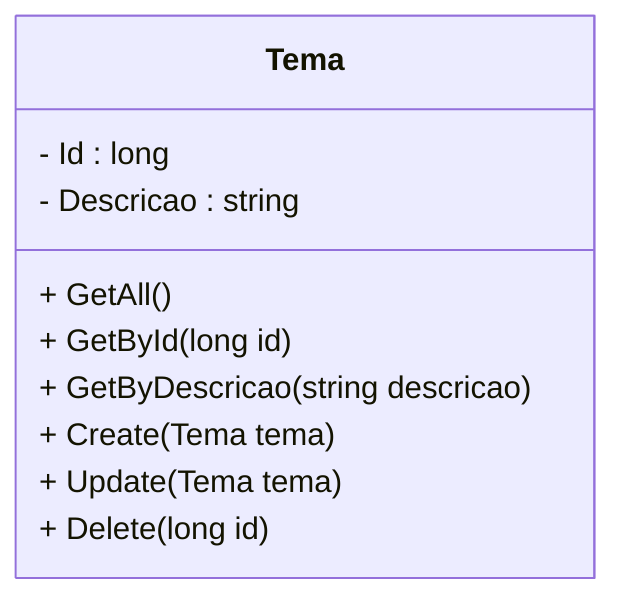
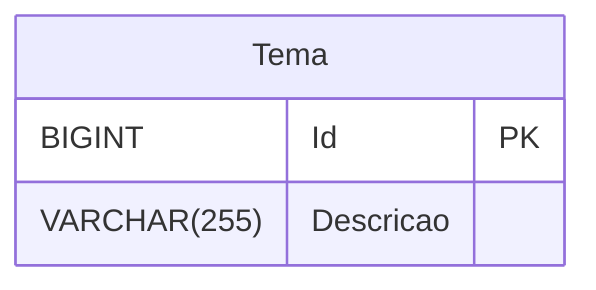
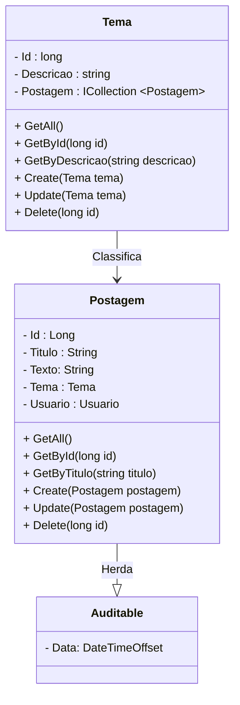
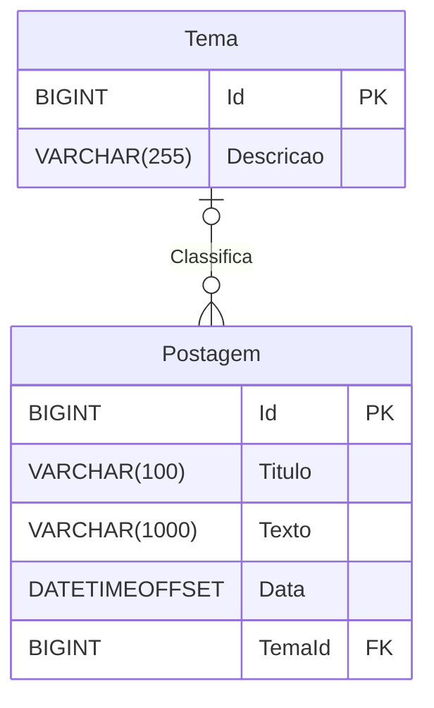

<h1>Projeto 02 - Blog Pessoal - Relacionamento entre Classes - Recurso Tema - Parte 01</h1>


O que veremos por aqui:

1. Apresentação do Recurso Tema
2. Criar a Classe Model Tema
4. Criar a Classe TemaValidator
5. Registrar a Classe Validator PostagemValidator na Classe Program
6. Registrar a Classe Model Postagem na Classe AppDbContext
7. Criar o Relacionamento entre as Classes Postagem e Tema na Classe AppDbContext

<br />

<h2>1. O Recurso Tema</h2>


Nesta etapa vamos começar a construir o Recurso Tema. Veja o Diagrama de Classes abaixo: 



A **Classe Tema** servirá de modelo para construir a tabela **tb_temas** (Model) dentro do nosso Banco de dados **db_blogpessoal**. Os campos (Atributos) da tabela serão os mesmos que estão definidos no Diagrama de Classes acima. **Além de construirmos a Classe Tema, também faremos o Relacionamento com a Classe Postagem**, construída anteriormente. 

Na próxima etapa vamos construir as Classes **TemaService e TemaController**, que irá nos auxiliar na interação com o Banco de dados e onde serão implementados os 6 métodos descritos no Diagrama de Classes acima.

Depois de criar a Classe Model Tema, vamos executar o projeto Blog Pessoal. Após a execução veremos que será criado no Banco de dados **db_blogpessoal** a tabela **tb_temas**. Veja abaixo como ficará a estrutura da nossa tabela através do **Diagrama de Model e Relacionamentos (DER)**:



O Dicionário de dados da nossa tabela tb_temas será o seguinte:

| Atributo      | Tipo de dado | Descrição           | Chave |
| ------------- | ------------ | ------------------- | ----- |
| **Id**        | BIGINT       | Identificador único | PK    |
| **Descricao** | VARCHAR(255) | Tema                |       |

<br />

|  | <div align="left"> **ALERTA DE BSM:** *Mantenha a Atenção aos Detalhes ao criar o Recurso Tema. Todas as Classes construídas no Recurso Postagem deverão ser construídas no Recurso Tema com as adaptações pertinentes ao Recurso Tema.* </div> |
| ------------------------------------------------------------ | ------------------------------------------------------------ |

<br />

|  | <div align="left"> **DICA:** *Caso você tenha alguma dúvida sobre como criar o Recurso, executar o projeto, entre outras, consulte a Documentação do Recurso Postagem.* </div> |
| ------------------------------------------------------------ | ------------------------------------------------------------ |

<br />

<h2>👣 Passo 01 - Criar a Classe Model Tema</h2>


Vamos criar a Classe Model **Tema**:

1. Clique com o botão direito do mouse sobre a **pasta Model** e na sequência, clique na opção **Adicionar 🡪 Classe**
2. Na janela **Adicionar Novo item**, no item **Nome**, digite o nome da Classe (**Tema**) e clique no botão **Adicionar** para concluir.

Agora vamos criar o código da Classe **Tema**:

```c#
using System.ComponentModel.DataAnnotations;
using System.ComponentModel.DataAnnotations.Schema;

namespace blogpessoal.Model
{
    public class Tema
    {

        [Key]
        [DatabaseGenerated(DatabaseGeneratedOption.Identity)]
        public long Id { get; set; }

        [Column(TypeName = "varchar")]
        [StringLength(255)]
        public string Descricao { get; set; } = string.Empty;

    }
}
```

Veja na tabela abaixo a conversão de **Tipo de dados C# 🡪 SQL, de acordo com o que foi definido no Diagrama de Classes acima:**

| Atributo      | Tipo de dado C# | Tipo de dado SQL |
| ------------- | --------------- | ---------------- |
| **Id**        | long            | BIGINT           |
| **Descricao** | <i>string</i>   | VARCHAR          |

<br />

|  | <div align="left">**DICA:** *Para relembrar os tipos de dados do C#, <a href="https://github.com/rafaelq80/cookbook_csharp/blob/main/01_csharp/03.md">clique aqui</a> e explore os principais tipos de dados oferecidos pelo C#.* </div> |
| ------------------------------------------------------------ | ------------------------------------------------------------ |

<br />

Observe que o código é semelhante ao da Classe Model **Postagem**, do Recurso Postagem.

<br />

<h2>👣 Passo 02 - Criar a Classe Validator TemaValidator</h2>


Vamos criar a Classe de Validação de dados **TemaValidator**:

1. Clique com o botão direito do mouse sobre a **pasta Validator** e na sequência, clique na opção **Adicionar 🡪 Classe**
2. Na janela **Adicionar Novo item**, no item **Nome**, digite o nome da Classe (**TemaValidator**) e clique no botão **Adicionar** para concluir.

Agora vamos criar o código da Classe **TemaValidator**:

```c#
using blogpessoal.Model;
using FluentValidation;

namespace blogpessoal.Validator
{
    public class TemaValidator : AbstractValidator<Tema>
    {
        
        public TemaValidator()
        {
            RuleFor(t => t.Descricao)
                .NotEmpty();
        }

    }
}
```

<br />

**Regras de Validação utilizadas**

| Propriedade    | Descrição                           |
| -------------- | ----------------------------------- |
| **NotEmpty()** | A string não pode ser nula ou vazia |

<br />

Observe que o código é semelhante ao da Classe de Validação de dados **PostagemValidator**, do Recurso Postagem.

<br />

<h2>👣 Passo 03 - Registrar a Classe TemaValidator na Classe Program</h2>


Vamos registrar a Classe **TemaValidator** como um serviço na Classe **Program**. 

1. Abra a Classe **Program**;
2. Localize a linha indicada abaixo:

 <div align="left"></div>

4. Após a linha indicada acima, adicione o trecho de código abaixo:

```c#
builder.Services.AddTransient<IValidator<Tema>, TemaValidator>();
```

5. A imagem abaixo, mostra como ficará o trecho com a nova linha:

 <div align="left"></div>

Veja o código completo da Classe **Program** abaixo:

```c#

using blogpessoal.Data;
using blogpessoal.Model;
using blogpessoal.Service.Implements;
using blogpessoal.Service;
using blogpessoal.Validator;
using FluentValidation;
using Microsoft.EntityFrameworkCore;

namespace blogpessoal
{
    public class Program
    {
        public static void Main(string[] args)
        {
            var builder = WebApplication.CreateBuilder(args);

            // Add services to the container.

            builder.Services.AddControllers();

            // Conexão com o Banco de dados
            var connectionString = builder.Configuration.
                    GetConnectionString("DefaultConnection");

            builder.Services.AddDbContext<AppDbContext>(options =>
                options.UseSqlServer(connectionString)
            );

            // Validação das Entidades
            builder.Services.AddTransient<IValidator<Postagem>, PostagemValidator>();
            builder.Services.AddTransient<IValidator<Tema>, TemaValidator>();

            // Registrar as Classes e Interfaces Service
            builder.Services.AddScoped<IPostagemService, PostagemService>();

            // Learn more about configuring Swagger/OpenAPI
            // at https://aka.ms/aspnetcore/swashbuckle

            builder.Services.AddEndpointsApiExplorer();
            builder.Services.AddSwaggerGen();

            // Configuração do CORS
            builder.Services.AddCors(options => {
                options.AddPolicy(name: "MyPolicy",
                    policy =>
                    {
                        policy.AllowAnyOrigin()
                        .AllowAnyHeader()
                        .AllowAnyMethod();
                    });
            });

            var app = builder.Build();

            // Criar o Banco de dados e as tabelas Automaticamente
            using (var scope = app.Services.CreateAsyncScope())
            {
                var dbContext = scope.ServiceProvider.GetRequiredService<AppDbContext>();
                dbContext.Database.EnsureCreated();

            }

            app.UseDeveloperExceptionPage();

            // Configure the HTTP request pipeline.
            if (app.Environment.IsDevelopment())
            {
                app.UseSwagger();
                app.UseSwaggerUI();
            }

            app.UseCors("MyPolicy");

            app.UseAuthorization();

            app.MapControllers();

            app.Run();
        }
    }
}
```

<br />

<h2>👣 Passo 04 - Registrar a Classe Tema na Classe AppDbContext</h2>


Vamos registrar a Classe **Tema** na Classe **AppDbContext**, para gerar a tabela **tb_temas** no Banco de dados.:

1. Abra a Classe **AppDbContext**, localizada na pasta **Data**;
2. Localize o Método **OnModelCreating(ModelBuilder modelBuilder)**, indicado na imagem abaixo:

<div align="left"></div>

4. Adicione a linha de código abaixo dentro do Método **OnModelCreating(ModelBuilder modelBuilder)**:

```c#
modelBuilder.Entity<Tema>().ToTable("tb_temas");
```

5. A imagem abaixo, mostra como ficará o Método com a nova linha:

 <div align="left"></div>

6. Localize a linha indicada abaixo:

<div align="left"></div>

7. Após a linha indicada acima, adicione a linha de código abaixo:

```c#
public DbSet<Tema> Temas { get; set; } = null!;
```

8. A imagem abaixo, mostra como ficará o trecho com a nova linha:

 <div align="left"></div>

Veja o código completo da Classe **AppDbContext** abaixo:

```c#
using blogpessoal.Model;
using Microsoft.EntityFrameworkCore;

namespace blogpessoal.Data
{
    public class AppDbContext: DbContext
    {
        public AppDbContext(DbContextOptions<AppDbContext> options) : base(options)
        {

        }

        protected override void OnModelCreating(ModelBuilder modelBuilder)
        {
            modelBuilder.Entity<Postagem>().ToTable("tb_postagens");
            modelBuilder.Entity<Tema>().ToTable("tb_temas");
        }

        // Registro das Entidades
        public DbSet<Postagem> Postagens { get; set; } = null!;
        public DbSet<Tema> Temas { get; set; } = null!;

        public override Task<int> SaveChangesAsync(CancellationToken cancellationToken = default)
        {
            var insertedEntries = this.ChangeTracker.Entries()
                                   .Where(x => x.State == EntityState.Added)
                                   .Select(x => x.Entity);

            foreach (var insertedEntry in insertedEntries)
            {
                //Se uma propriedade da Classe Auditable estiver sendo criada. 
                if (insertedEntry is Auditable auditableEntity)
                {
                    auditableEntity.Data = DateTimeOffset.Now;
                }
            }

            var modifiedEntries = ChangeTracker.Entries()
                       .Where(x => x.State == EntityState.Modified)
                       .Select(x => x.Entity);

            foreach (var modifiedEntry in modifiedEntries)
            {
                //Se uma propriedade da Classe Auditable estiver sendo atualizada.  
                if (modifiedEntry is Auditable auditableEntity)
                {
                    auditableEntity.Data = DateTimeOffset.Now;
                }
            }

            return base.SaveChangesAsync(cancellationToken);
        }

    }
}
```

<br />

<h2>2. Relacionamento entre Classes</h2>


**Mapeamento Objeto-Relacional (ORM)** é o processo de conversão das Classes em Tabelas (Models) no Banco de dados da aplicação e vice-versa. Em outras palavras, isso nos permite interagir com um Banco de dados Relacional sem utilizar código SQL. O **Entity Framework** é um framework que define como persistir dados em aplicativos C#. O foco principal do Entity Framework é a camada ORM. Para mais detalhes, consulte o conteúdo <a href="03.md" target="_blank"><b>Introdução ao Entity Framework</b></a>.

O **Entity Framework** simplifica o tratamento do modelo de Banco de dados Relacional nos aplicativos ASP.NET quando mapeamos cada Tabela para uma única ou para um conjunto de Classes Model. Assim como no SQL, precisamos criar o Relacionamento entre duas tabelas, no Entity Framework também precisamos criar o **Relacionamento entre as Classes** e desta forma ele construirá os Relacionamento entre as duas Tabelas no Banco de dados assim como fizemos no SQL. 

Nesta etapa vamos construir o Relacionamento do Recurso Tema com o Recurso Postagem, a partir das Classes Model Tema e Postagem. Veja o Diagrama de Classes abaixo: 



Para construirmos o Relacionamento entre Classes, o Entity Framework utiliza o **Fluent API**. O **Fluent API** é uma API interna do Entity Framework, que é utilizada para configurar as Classes de domínio para substituir as convenções do Banco de dados. A Fluent API é baseada em um padrão de design conhecido como Fluent Interface, onde o resultado é formulado por encadeamento de métodos, semelhante ao que fizemos no Fluent Validator.

No Entity Framework Core, a classe **ModelBuilder** atua como uma API Fluent. O **Fluent API** permite configurar os seguintes aspectos de um modelo:

- **Configuração do modelo:** Configura um modelo Entity Framework para mapeamentos de Banco de dados. Configura o esquema padrão, funções de Banco de dados, atributos de anotação de dados adicionais e entidades a serem excluídas do mapeamento.
- **Entity Configuration:** Configura a entidade para tabela e o mapeamento de relacionamentos, como por exemplo, a Chave Primária, Nome da tabela (inclusive configuramos este item na Classe **AppDbContext**), Relacionamentos um-para-um, um-para-muitos, muitos-para-muitos, entre outros.
- **Configuração da propriedade:** Configura a propriedade para o mapeamento da coluna, como por exemplo, nome da coluna, valor padrão, nulidade, chave estrangeira, tipo de dados, entre outros.

Para criarmos um Relacionamento entre Classes precisamos definir quais Entidades irão se Relacionar, a Direção do Relacionamento e a Cardinalidade do Relacionamento. 

<br />

<h3>2.1. Direção do Relacionamento</h3>


Quanto ao sentido, podemos definir de uma forma global dois tipos de Relacionamentos:

- **Unidirecional.**
- **Bidirecional.**

Nos **Relacionamentos Unidirecionais**, mapeamos somente uma das entidades  envolvidas no relacionamento. Nestes relacionamentos, temos os conceitos de **Entidade Fonte** e **Entidade Alvo**. A diferença básica é que a **Entidade Fonte** possui o Mapeamento do Relacionamento.

Nos **Relacionamentos Bidirecionais**, as  duas entidades são mapeadas e o relacionamento acontece em ambos os  sentidos entre as entidades, que se comportam como se existissem dois  Relacionamentos Unidirecionais, um para cada entidade envolvida.

Nos Relacionamentos Bidirecionais temos o conceito de **Entidade Proprietária** e **Entidade Inversa**.

- **Entidade Proprietária:** A tabela dessa Entidade será a Proprietária da **Chave Estrangeira - Foreign Key**.
- **Entidade Inversa:** A entidade Mãe da relação

<br />

<h3>2.2. Cardinalidade de um Relacionamento</h3>


Para definir o Relacionamento e a Cardinalidade, o Entity Framework utiliza os Métodos da Fluent API abaixo:

| Método              | Descrição                                                    |
| ------------------- | ------------------------------------------------------------ |
| **HasMany()**       | Configura o lado *Muitos* de uma relação muitos-para-muitos. |
| **HasOne()**        | Configura o lado *Um* de uma relação um-para-um ou um-para-muitos. |
| **WithMany()**      | Configura o lado *Muitos* de uma relação um-para-muitos ou um-para-muitos. O método **WithMany()** deve ser usado em conjunto com o Método **HasOne()**. |
| **WithOne()**       | Configura o lado *Um* de uma relação um-para-um. O método **WithOne()** deve ser usado em conjunto com o Método **HasOne()**. |
| **HasForeignKey()** | Define a Chave Estrangeira, ou seja, o atributo que será criado na tabela para definir o Relacionamento. |
| **OnDelete()**      | Especifica a ação que deve ocorrer em uma entidade dependente em um relacionamento quando o Objeto principal é excluído. **Exemplo:** Ao excluir um Tema, todas as postagens associadas a este tema também serão excluídas. Neste caso passamos como parâmetro para o Método **DeleteBehavior.Cascade** |

As combinações de Relacionamentos possíveis são as seguintes:

| Tipo de Relacionamento  |      | Descrição                                                    |
| ----------------------- | ---- | ------------------------------------------------------------ |
| Um pra um - 1:1         | 🡪    | Um Objeto da Classe A se relacionará com apenas um Objeto da Classe B. |
| Um pra muitos - 1:N     | 🡪    | Um Objeto da Classe A se relacionará com muitos Objetos da Classe B. |
| Muitos pra muitos - N:M | 🡪    | Muitos Objetos da Classe A se relacionarão com muitos Objetos da Classe B. |

No Modelo Relacional todo Relacionamento é **Unidirecional**, ou seja, **apenas a Tabela que possui a Chave Estrangeira acessa a outra Tabela**. No Relacionamento de Classes, existe a possibilidade do Relacionamento ser **Bidirecional**, ou seja, uma **Classe acessa a outra e vice-versa, independente de possuir ou não a Chave Estrangeira**.

Em um Relacionamento **Bidirecional**, precisamos definir um atributo na Classe Mãe da relação, que será utilizado apenas para exibir os Objetos associados na Classe Filha. Esse atributo é chamado de **Propriedade de Navegação**.

Depois de criar o Relacionamento entre as Classes e executar o projeto Blog Pessoal, veremos que será criado no SQL a Relação entre as tabelas **tb_postagens** e **tb_temas** Unidirecional. Veja abaixo como ficará a estrutura da nossa tabela através do **Diagrama de Model e Relacionamentos (DER)**:



Como o Entity Framework faz o mapeamento das Tabelas em Objetos, caso o Relacionamento Bidirecional esteja habilitado, a Relação funcionará independente do Banco de Dados ser Unidirecional.

Vamos construir o Relacionamento Bidirecional (1:N) entre as nossas Classes Tema e Postagem como veremos a seguir. 

<br />

<div align="left"> <a href="https://learn.microsoft.com/pt-br/ef/core/modeling/relationships" target="_blank"><b>Documentação: Relacionamentos entre Classes Model</b></a></div>

<br />

<h2>👣 Passo 01 - Registrar o Serviço Newtonsoft.Json</h2>


Vamos registrar o Pacote **Newtonsoft.Json** como um serviço na Classe **Program**. Este pacote tem a função de configurar e formatar Objetos JSON. Como vamos trabalhar com Relacionamentos, executaremos muitos processos de **Serialização e Desserialização** de Objetos JSON, onde um Objeto estará dentro de outro. Esse processo causa um efeito colateral de loop infinito de Objetos JSON, onde um Objeto exibe o outro Objeto infinitamente. O Pacote **Newtonsoft.Json** evita este efeito colateral, impedindo a repetição infinita de Objetos.

> A **Serialização** é o processo de converter um objeto em uma sequência linear de bytes que podem ser armazenados ou transferidos;
>
> A **Desserialização** é o processo de conversão de uma sequência previamente serializada de bytes em um objeto;
>
> Então se você quiser armazenar um objeto *(ou vários objetos)* em memória para posterior recuperação, você armazena a saída da serialização, e, na próxima vez que você quiser ler os objetos, você chama os métodos da desserialização, e seu objeto é recriado exatamente como anteriormente.
>
> Da mesma forma, se você quiser enviar um objeto para um aplicativo em execução em outro computador, você estabelece uma conexão de rede, serializa o objeto antes de enviar e desserializa o objeto na aplicação remota. 

1. Abra a Classe **Program**;
2. Localize a linha indicada abaixo:

 <div align="left"></div>

4. Troque a linha indicada acima, pelo trecho de código abaixo:

```c#
 // Add Controller Class
builder.Services.AddControllers()
	.AddNewtonsoftJson(options =>
    {
    	options.SerializerSettings.ReferenceLoopHandling = Newtonsoft.Json.ReferenceLoopHandling.Ignore;
    }
);builder.Services.AddTransient<IValidator<Tema>, TemaValidator>();
```

5. A imagem abaixo, mostra como ficará o trecho com a nova linha:

 <div align="left"></div>

Vamos entender o código:

**Linhas 21 a 26:** Registra o Pacote **Newtonsoft.Json** como um serviço na Classe **Program**.

**Linha 24:** Esta linha define a Propriedade **ReferenceLoopHandling** como **Ignore**, para que os valores de loop sejam excluídos da serialização ao invés de gerar uma exceção.

Existem outras opções e propriedades dentro do Pacote **Newtonsoft.Json**. Para mais detalhes, consulte a documentação nos links abaixo.

<br />

<div align="left"> <a href="https://www.newtonsoft.com/json/help/html/Introduction.htm" target="_blank"><b>Documentação: PacoteNewtonsoft.Json</b></a></div>

<div align="left"> <a href="https://www.newtonsoft.com/json/help/html/ReferenceLoopHandlingIgnore.htm#!" target="_blank"><b>Documentação: Propriedade ReferenceLoopHandling</b></a></div>

<br />

Veja o código completo da Classe **Program** abaixo:

```c#

using blogpessoal.Data;
using blogpessoal.Model;
using blogpessoal.Service.Implements;
using blogpessoal.Service;
using blogpessoal.Validator;
using FluentValidation;
using Microsoft.EntityFrameworkCore;

namespace blogpessoal
{
    public class Program
    {
        public static void Main(string[] args)
        {
            var builder = WebApplication.CreateBuilder(args);

            // Add services to the container.

            // Add Controller Class
            builder.Services.AddControllers()
                .AddNewtonsoftJson(options =>
                {
                    options.SerializerSettings.ReferenceLoopHandling = Newtonsoft.Json.ReferenceLoopHandling.Ignore;
                }
            );

            // Conexão com o Banco de dados
            var connectionString = builder.Configuration.
                    GetConnectionString("DefaultConnection");

            builder.Services.AddDbContext<AppDbContext>(options =>
                options.UseSqlServer(connectionString)
            );

            // Validação das Entidades
            builder.Services.AddTransient<IValidator<Postagem>, PostagemValidator>();
            builder.Services.AddTransient<IValidator<Tema>, TemaValidator>();

            // Registrar as Classes e Interfaces Service
            builder.Services.AddScoped<IPostagemService, PostagemService>();

            // Learn more about configuring Swagger/OpenAPI
            // at https://aka.ms/aspnetcore/swashbuckle

            builder.Services.AddEndpointsApiExplorer();
            builder.Services.AddSwaggerGen();

            // Configuração do CORS
            builder.Services.AddCors(options => {
                options.AddPolicy(name: "MyPolicy",
                    policy =>
                    {
                        policy.AllowAnyOrigin()
                        .AllowAnyHeader()
                        .AllowAnyMethod();
                    });
            });

            var app = builder.Build();

            // Criar o Banco de dados e as tabelas Automaticamente
            using (var scope = app.Services.CreateAsyncScope())
            {
                var dbContext = scope.ServiceProvider.GetRequiredService<AppDbContext>();
                dbContext.Database.EnsureCreated();

            }

            app.UseDeveloperExceptionPage();

            // Configure the HTTP request pipeline.
            if (app.Environment.IsDevelopment())
            {
                app.UseSwagger();
                app.UseSwaggerUI();
            }

            app.UseCors("MyPolicy");

            app.UseAuthorization();

            app.MapControllers();

            app.Run();
        }
    }
}
```

<br />

<h2>👣 Passo 02 - Criar o Atributo Tema na Classe Postagem</h2>


A Classe Postagem será o lado N:1, ou seja, **Muitas Postagens podem ter apenas Um Tema**. Para criar a Relação vamos inserir depois do último atributo da Classe **Postagem** (Texto), a linha destacada em amarelo na imagem abaixo:

<div align="left"></div>

**Linha 21:** Será criado um Objeto da Classe Tema, que receberá os dados do Tema associado ao Objeto da Classe Postagem. Este Objeto representa a Chave Estrangeira da Tabela **tb_postagens (TemaId)**.

Note que ao lado do Objeto **Tema**, foi adicionado uma interrogação (**?**). Esta interrogação indica que o Objeto Tema, pode ser nulo (null), ou seja, um Objeto Postagem pode ter um ou nenhum tema associado. 

Veja abaixo o código completo da **Classe Model Postagem**:

```c#
using System.ComponentModel.DataAnnotations.Schema;
using System.ComponentModel.DataAnnotations;

namespace blogpessoal.Model
{
    public class Postagem : Auditable
    {

        [Key]
        [DatabaseGenerated(DatabaseGeneratedOption.Identity)]
        public long Id { get; set; }

        [Column(TypeName = "varchar")]
        [StringLength(100)]
        public string Titulo { get; set; } = string.Empty;

        [Column(TypeName = "varchar")]
        [StringLength(1000)]
        public string Texto { get; set; } = string.Empty;

        public virtual Tema? Tema { get; set; }

    }
}
```

<br />

<h2>👣 Passo 03 - Criar o Atributo Postagem na Classe Tema</h2>


A Classe Tema será o lado 1:N, ou seja, **Um Tema pode ter Muitas Postagens**. Para criar a Relação vamos inserir depois do último atributo da Classe Tema (Descricao), o trecho de código destacado em amarelo na figura abaixo:

<div align="left"></div>

**Linha 18:** A Anotação **[JsonIgnore, InverseProperty("Tema")]** indica que uma parte do JSON será ignorado, ou seja, como a Relação  entre as Classes será do tipo Bidirecional, ao listar o Objeto Tema  numa consulta, por exemplo, o Objeto Postagem, que será criado na linha 19,  será exibido como um **"Sub Objeto"** do Objeto Tema, como mostra a figura abaixo, devido ao Relacionamento que foi criado.

```json
{
	"id": 1,
	"descricao": "Tema 01",
	"postagem": [
		{
			"id": 1,
			"titulo": "Postagem 01",
			"texto": "Texto da minha postagem 01",
			"data": "2023-06-08T23:28:57.2305447",
			"temaId": 1
		},
		{
			"id": 3,
			"titulo": "Postagem 03",
			"texto": "Texto da minha postagem 03",
			"data": "2023-06-09T00:04:27.3084565",
			"temaId": 1
		}
	]
}
```

Ao exibir o Objeto Postagem, o Objeto Tema será exibido novamente e na sequência Postagem será exibido novamente,  criando um looping infinito dentro do JSON, devido a relação  Bidirecional. Para impedir o loop infinito e o travamento da nossa  aplicação (Vide a imagem abaixo com o erro que será exibido no  Insomnia), utilizamos anotação **[JsonIgnore, InverseProperty("Tema")]** para exibir o Objeto da Classe Tema apenas uma vez, interrompendo a repetição.

<div align="center"></div>

A Propriedade **InverseProperty** foi utilizada porque a Classe Postagem terá 2 Relacionamentos (Tema e futuramente User). Para identificar de qual relacionamento estamos falando, utilizamos a propriedade **InverseProperty** para indicar a **Entidade Inversa da Relação**.

**Linha 19:** Será criado o atributo **Postagem**, da Classe Postagem, que será utilizado para criar a relação Bidirecional. Este atributo será uma Collection criada a partir da Interface **ICollection** (Interface base para geração de Collections, ou seja, uma Abstração), contendo Objetos da Classe **Postagem**, que receberá a lista de postagens associadas a cada Objeto da Classe Tema. Este Objeto é uma **Propriedade de Navegação** do Entity Framework.

Note que ao lado do Objeto **Postagem**, foi adicionado uma interrogação (**?**). Esta interrogação indica que o Objeto Postagem, pode ser nulo (null), ou seja, um Objeto Tema pode ter uma, muitas, ou nenhuma Postagem associada. 

Veja abaixo o código completo da **Classe Model Tema**:

```c#
using Newtonsoft.Json;
using System.ComponentModel.DataAnnotations;
using System.ComponentModel.DataAnnotations.Schema;

namespace blogpessoal.Model
{
    public class Tema
    {

        [Key]
        [DatabaseGenerated(DatabaseGeneratedOption.Identity)]
        public long Id { get; set; }

        [Column(TypeName = "varchar")]
        [StringLength(255)]
        public string Descricao { get; set; } = string.Empty;

        [JsonIgnore, InverseProperty("Tema")]
        public virtual ICollection<Postagem>? Postagem { get; set; }

    }
}
```

<br />


|  | <div align="left"> **ALERTA DE BSM:** *Mantenha a Atenção aos Detalhes ao criar o Relacionamento entre as Classes. Observe que após habilitar o Relacionamento entre Classes, novas importações de Classes serão necessárias nas primeiras linhas da Classe Tema.* </div> |
| ------------------------------------------------------------ | ------------------------------------------------------------ |

<br />

<div align="left"> <a href="https://www.newtonsoft.com/json/help/html/PropertyJsonIgnore.htm" target="_blank"><b>Documentação: Propriedade JsonIgnore</b></a></div>

<div align="left"> <a href="https://www.entityframeworktutorial.net/code-first/inverseproperty-dataannotations-attribute-in-code-first.aspx" target="_blank"><b>Documentação: Propriedade InverseProperty</b></a></div>

<br />

<h2>👣 Passo 04 - Criar o Relacionamento na Classe AppDbContext</h2>


Vamos criar o Relacionamento entre as Classes **Tema e Postagem**, na Classe **AppDbContext**, para gerar as tabelas **tb_temas** e **tb_postagens** no Banco de dados com o relacionamento:

1. Abra a Classe **AppDbContext**, localizada na pasta **Data**;
2. Localize o Método **OnModelCreating(ModelBuilder modelBuilder)**, indicado na imagem abaixo:

<div align="left"></div>

4. Adicione a linha de código abaixo dentro do Método **OnModelCreating(ModelBuilder modelBuilder)**:

```c#
 _ = modelBuilder.Entity<Postagem>()
          .HasOne(_ => _.Tema)
          .WithMany(t => t.Postagem)
          .HasForeignKey("TemaId")
          .OnDelete(DeleteBehavior.Cascade);
```

5. A imagem abaixo, mostra como ficará o Método com as novas linhas:

 <div align="left"></div>

Vamos entender o código:

**Linhas 18 a 22:** Definimos o Relacionamento Bidirecional entre as Classes Tema e Postagem.

**Linha 18:** Escolhemos configurar o Relacionamento a partir da Classe Entidade Filha. Por isso selecionamos a Model Postagem na instrução **modelBuilder.Entity<Postagem>()**. 

**Linha 19:** Através do Método **HasOne(_ => _.Tema)** especificamos que a Entidade Postagem terá um Atributo chamado **Tema**, Objeto da Classe Tema. Esse Objeto representa a Chave Estrangeira. Na sequência, precisamos configurar a outra ponta do relacionamento, a Classe Model Tema. 

**Linha 20:** Através do Método **WithMany(t => t.Postagem)** especificamos que a classe Tema terá um Atributo, que será uma Collection, que armazenará diversos Objetos da Classe Postagem, associados ao Objeto da Classe Tema. Na prática, o Método **WithMany()** indica qual Atributo será a **Propriedade de Navegação da Classe Tema**. 

**Linha 21:** Através do Método **HasForeignKey("TemaId")** especificamos o nome do atributo, que será a Chave Estrangeira na tabela **tb_postagens**. 

**Linha 22:** Os relacionamentos entre Entidades geralmente dependem da existência de outra Entidade, por exemplo, o relacionamento **Tema 🡪 Postagem**, sem um Objeto Tema associado, a Entidade Postagem não tem nenhum significado próprio, se tornando o que chamamos de **Objeto Órfão** (Orphan Object). **Quando excluímos um Objeto da Entidade Tema, todos os Objetos da Entidade Postagem associadas ao Tema excluído também devem ser excluídos**, entretanto, o inverso não é verdadeiro. **"Cascatear" (cascade)**, é a maneira de conseguirmos este efeito no Relacionamento. Quando  executamos alguma ação na Entidade Tema, a mesma ação será aplicada à  Entidade associada em Postagem.

- **OnDelete(DeleteBehavior.Cascade):** O "cascateamento" foi habilitado apenas  na operação Delete, ou seja, apenas quando um Objeto da Classe Tema for  apagado, todos os Objetos da Classe Postagem associados ao Tema também  serão apagados. O Inverso não é verdadeiro.

Veja o código completo da Classe **AppDbContext** abaixo:

```c#
using blogpessoal.Model;
using Microsoft.EntityFrameworkCore;

namespace blogpessoal.Data
{
    public class AppDbContext : DbContext
    {
        public AppDbContext(DbContextOptions<AppDbContext> options) : base(options)
        {

        }

        protected override void OnModelCreating(ModelBuilder modelBuilder)
        {
            modelBuilder.Entity<Postagem>().ToTable("tb_postagens");
            modelBuilder.Entity<Tema>().ToTable("tb_temas");

            // Relacionamento Postagem -> Tema
            _ = modelBuilder.Entity<Postagem>()
                .HasOne(_ => _.Tema)
                .WithMany(t => t.Postagem)
                .HasForeignKey("TemaId")
                .OnDelete(DeleteBehavior.Cascade);

        }

        // Registro das Entidades
        public DbSet<Postagem> Postagens { get; set; } = null!;
        public DbSet<Tema> Temas { get; set; } = null!;

        public override Task<int> SaveChangesAsync(CancellationToken cancellationToken = default)
        {
            var insertedEntries = this.ChangeTracker.Entries()
                                   .Where(x => x.State == EntityState.Added)
                                   .Select(x => x.Entity);

            foreach (var insertedEntry in insertedEntries)
            {
                //Se uma propriedade da Classe Auditable estiver sendo criada. 
                if (insertedEntry is Auditable auditableEntity)
                {
                    auditableEntity.Data = DateTimeOffset.Now;
                }
            }

            var modifiedEntries = ChangeTracker.Entries()
                       .Where(x => x.State == EntityState.Modified)
                       .Select(x => x.Entity);

            foreach (var modifiedEntry in modifiedEntries)
            {
                //Se uma propriedade da Classe Auditable estiver sendo atualizada.  
                if (modifiedEntry is Auditable auditableEntity)
                {
                    auditableEntity.Data = DateTimeOffset.Now;
                }
            }

            return base.SaveChangesAsync(cancellationToken);
        }

    }
}
```

<br />

<div align="left"> <a href="https://learn.microsoft.com/pt-br/ef/core/modeling/relationships" target="_blank"><b>Documentação: Relacionamentos entre Classes Model</b></a></div>

<br />

<h2>👣 Passo 05 - Apagar o Banco de dados</h2>


Antes de criarmos a tabela **tb_temas** e os respectivos relacionamentos, precisamos apagar o Banco de dados **db_blogpessoal**, porque o **ASP.NET** não consegue atualizar e/ou criar tabelas, depois que uma tabela foi criada no banco de dados. Vamos apagar o Banco de dados **db_blogpessoal**:

1. Pare o projeto, caso ele esteja em execução.
2. Abra o **SQL Server Management Studio** e conecte-se com o **SQL Server**.
3. Clique com o botão direito do mouse sobre o Banco de dados **db_blogpessoal** e no menu que será aberto, clique na opção **Excluir**, como mostra a imagem abaixo:

 <div align="center"></div>

4. Na janela **Excluir Objeto**, clique no botão **OK** para confirmar.

 <div align="center"></div>

5. Observe que o Banco de dados **db_blogpessoal** foi excluído!

 <div align="center"></div>

<br />

|  | <div align="left"> **ATENÇÃO:** *Ao excluir o Banco de dados, todos os dados cadastrados serão perdidos!* </div> |
| ------------------------------------------------------------ | ------------------------------------------------------------ |

<br />

<h2>👣 Passo 06 - Executar o projeto</h2>


1. Para executarmos o Projeto, clique no botão **Run http**, na **Barra de Ferramentas Principal** (indicado em verde na imagem):


2. Verifique na Tela do Console se o Banco e as 2 tabelas foram criadas, como mostra a imagem abaixo:

 <div align="center"></div>

<br />

<h2>👣 Passo 07 - Checar o Banco de dados</h2>


1. Volte para o **SQL Server Management Studio** e conecte-se com o **SQL Server**.
2. Para visualizar se o **Banco de Dados db_blogpessoal** e as **Tabelas tb_postagens e tb_temas com o Relacionamento** foram criados, na janela **Pesquisador de Objetos**, localizada no lado esquerdo da tela, selecione o servidor **localhost** e clique no botão **Atualizar** .

<div align="center"></div>

3. Na mesma janela, clique no sinal de (**+**) ao lado do item **Banco de Dados**, na sequência, clique no sinal de (**+**) ao lado do **Banco de Dados db_blogpessoal**, clique no sinal de (**+**) ao lado do item **Tabelas** e se tudo deu certo, veremos as tabelas **tb_postagens e tb_temas** criadas dentro do **Banco de Dados db_blogpessoal**, como mostra a imagem abaixo:

<div align="center"></div>

4. Observe que a **Chave Estrangeira TemaId** foi criada na tabela **tb_postagens**.
5. Crie um novo arquivo SQL **(SQLFile)**, insira as instruções abaixo e execute a consulta para popular a tabela **tb_postagens** novamente.

```sql
USE db_blogpessoal;
GO

INSERT INTO tb_postagens (Titulo, Texto, Data)
VALUES ('Postagem 01', 'Texto da Postagem 01', SYSDATETIMEOFFSET());
INSERT INTO tb_postagens (Titulo, Texto, Data)
VALUES ('Postagem 02', 'Texto da Postagem 02', SYSDATETIMEOFFSET());
INSERT INTO tb_postagens (Titulo, Texto, Data)
VALUES ('Postagem 03 - Atualizado', 'Texto da Postagem 03 - Atualizado', SYSDATETIMEOFFSET());
GO

SELECT * FROM tb_postagens;
GO
```

<br />

|  | <div align="left"> **ATENÇÃO:** *Lembre-se que as nossas tabelas estão vazias, logo teremos que persistir novos Objetos.* </div> |
| ------------------------------------------------------------ | ------------------------------------------------------------ |

<br />

Próximo passo: Implementar as **Classes TemaService e TemaController**.

<br />

<div align="left"> <a href="" target="_blank"><b>Código fonte do projeto</b></a></div>

<br /><br />

<div align="left"><a href="README.md">Voltar</a></div>