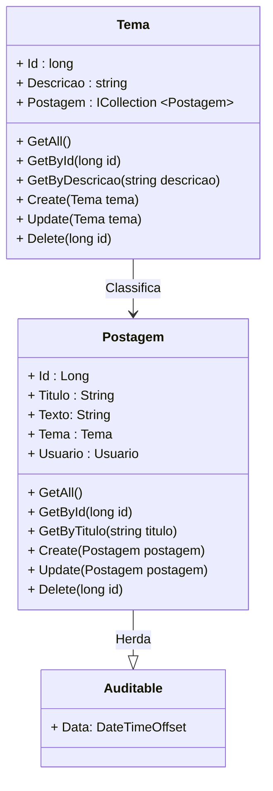

<h1>Projeto 02 - Blog Pessoal - Relacionamento entre Classes - Recurso Tema - Parte 02</h1>


O que veremos por aqui:

1. Criar a Interface ITemaService
2. Criar a Classe TemaService
3. Atualizar a Classe PostagemService - Parte 01
4. Registrar a Classe TemaService na Classe Program
5. Criar a Classe TemaController
6. Testar todos os Métodos no Insomnia
7. Atualizar as Requisições Cadastrar e Atualizar Postagem
8. Atualizar os Métodos Create e Update na Classe PostagemService
9. Atualizar os Métodos Create e Update na Classe PostagemController

<br />

<h2>1. O Recurso Tema</h2>


Na etapa anterior, começamos a construir o Recurso Tema e criamos o Relacionamento entre as Classes Tema e Postagem. Veja o Diagrama de Classes abaixo: 



<br />

|  | <div align="left"> **ALERTA DE BSM:** *Mantenha a Atenção aos Detalhes ao criar o Recurso Tema. Todas as Classes construídas no Recurso Postagem deverão ser construídas no Recurso Tema com as adaptações pertinentes ao Recurso Tema.* </div> |
| ------------------------------------------------------------ | ------------------------------------------------------------ |

<br />

|  | <div align="left"> **DICA:** *Caso você tenha alguma dúvida sobre como criar as Classes TemaService e TemaController, executar o projeto, entre outras, consulte a Documentação do Recurso Postagem.* </div> |
| ------------------------------------------------------------ | ------------------------------------------------------------ |

<br />

<h2>👣 Passo 01 - Criar a Interface ITemaService</h2>


Vamos criar a **Interface ITemaService** na pasta **Service**.

1. Clique com o botão direito do mouse sobre a **pasta Service** e na sequência, clique na opção **Adicionar 🡪 Novo item**
2. Na janela **Adicionar Novo Item**, Selecione a opção **Interface**, como mostra a figura abaixo:

<div align="center"></div>

3. No item **Nome**, digite o nome da Interface (**ITemaService**)

<br />

|  | <div align="left"> **ALERTA DE BSM:** *Mantenha a Atenção aos Detalhes ao criar a Interface Service. Na Linguagem C# toda a Interface inicia o nome com a Letra I (maiúscula), porque geralmente a Classe que implementa a Interface tem o mesmo nome da Interface.* </div> |
| ------------------------------------------------------------ | ------------------------------------------------------------ |

<br />

Agora vamos criar o código da **Interface ITemaService**:

```c#
using blogpessoal.Model;

namespace blogpessoal.Service
{
    public interface ITemaService
    {
        Task<IEnumerable<Tema>> GetAll();

        Task<Tema?> GetById(long id);

        Task<IEnumerable<Tema>> GetByDescricao(string descricao);

        Task<Tema> Create(Tema tema);

        Task<Tema?> Update(Tema tema);

        Task Delete(Tema tema);
    }
}
```

<br />

<h2>👣 Passo 02 - Criar a Classe TemaService</h2>


Vamos criar a **Classe TemaService** na pasta **Implements**, dentro da pasta **Service**:

1. Clique com o botão direito do mouse sobre a **pasta Implements**, localizada dentro da pasta **Service**, e na sequência, clique na opção **Adicionar 🡪 Classe**.
2. No item **Nome**, digite o nome da Classe (**TemaService**)

Veja abaixo a implementação da Classe **TemaService**:

```c#
using blogpessoal.Data;
using blogpessoal.Model;
using Microsoft.EntityFrameworkCore;

namespace blogpessoal.Service.Implements
{
    public class TemaService : ITemaService
    {
        public readonly AppDbContext _context;

        public TemaService(AppDbContext context)
        {
            _context = context;

        }

        public async Task<IEnumerable<Tema>> GetAll()
        {
            return await _context.Temas
                 .Include(t => t.Postagem)
                 .ToListAsync();
        }

        public async Task<Tema?> GetById(long id)
        {
            try
            {
                var Tema = await _context.Temas
                     .Include(t => t.Postagem)
                     .FirstAsync(i => i.Id == id);

                return Tema;
            }
            catch
            {
                return null;
            }

        }

        public async Task<IEnumerable<Tema>> GetByDescricao(string descricao)
        {
            var Tema = await _context.Temas
                .Include(t => t.Postagem)
                .Where(t => t.Descricao.Contains(descricao))
                .ToListAsync();

            return Tema;
        }

        public async Task<Tema> Create(Tema tema)
        {
            _context.Temas.Add(tema);
            await _context.SaveChangesAsync();

            return tema;
        }

        public async Task<Tema?> Update(Tema tema)
        {

            var TemaUpdate = await _context.Temas.FindAsync(tema.Id);

            if (TemaUpdate is null)
                return null;

            _context.Entry(TemaUpdate).State = EntityState.Detached;
            _context.Entry(tema).State = EntityState.Modified;
            await _context.SaveChangesAsync();

            return tema;
        }

        public async Task Delete(Tema tema)
        {

            _context.Temas.Remove(tema);
            await _context.SaveChangesAsync();

        }

    }
}
```

Observe que nos Métodos de consulta: **GetAll(), GetById( long id ) e GetByDescricao( string descricao )** foi acrescentada a linha abaixo:

```c#
.Include(t => t.Postagem)
```

O comando **Include** tem por objetivo exibir os Objetos da Classe Postagem que estão relacionados com os Objetos da Classe Tema, ou seja, ao executar os Métodos **GetAll(), GetById( long id ) e GetByDescricao( string descricao )**, além de **exibir os Objetos da Classe Tema persistidos no Banco de dados**, será exibido também **a lista de Objetos da Classe Postagem associados a cada Objeto da Classe da Tema**, semelhante ao exemplo abaixo:

```json
{
	"id": 1,
	"descricao": "Tema 01",
	"postagem": [
		{
			"id": 1,
			"titulo": "Postagem 01",
			"texto": "Texto da minha postagem 01",
			"data": "2023-06-08T23:28:57.2305447",
		},
		{
			"id": 3,
			"titulo": "Postagem 03",
			"texto": "Texto da minha postagem 03",
			"data": "2023-06-09T00:04:27.3084565",
		}
	]
}
```

Observe que logo após o Tema 01, foi criado um array contendo as duas postagens associadas.

<br />

|  | <div align="left"> **ATENÇÃO:** *Se o comando Include não for adicionada nos 3 Métodos de consulta, ao testar os 3 Métodos GET no Insomnia o Relacionamento entre as Classes não será exibido.* </div> |
| ------------------------------------------------------------ | ------------------------------------------------------------ |

<br />

<h2>👣 Passo 03 - Atualizar a Classe PostagemService</h2>


Da mesma forma que adicionamos o comando **Include** na Classe TemaService, também iremos adicionar na Classe PostagemService, nos 3 Métodos de consulta: **GetAll(), GetById( long id ) e GetByTitulo( string titulo )**. No trecho de código abaixo, vemos com ficará o comando **Include** na Classe PostagemService:

```c#
.Include(p => p.Tema)
```

Desta forma, ao executar os Métodos de consulta:  **GetAll(), GetById( long id ) e GetByTitulo( string titulo )**, os Objetos da Classe Postagem passarão a exibir o Objeto da Classe Tema associado, semelhante ao exemplo abaixo:

```json
{
	"id": 1,
	"titulo": "Postagem 01",
	"texto": "Texto da minha postagem 01",
	"data": "2023-06-08T23:28:57.2305447",
	"tema": {
		"id": 1,
		"descricao": "Tema 01"
	}
}
```

Veja abaixo a implementação atualizada da Classe **PostagemService**:

```c#
using blogpessoal.Data;
using blogpessoal.Model;
using Microsoft.EntityFrameworkCore;

namespace blogpessoal.Service.Implements
{
    public class PostagemService : IPostagemService
    {

        private readonly AppDbContext _context;

        public PostagemService(AppDbContext context)
        {
            _context = context;
        }

        public async Task<IEnumerable<Postagem>> GetAll()
        {
            return await _context.Postagens
                .Include(p => p.Tema)
                .ToListAsync();
        }

        public async Task<Postagem?> GetById(long id)
        {
            try
            {
                var Postagem = await _context.Postagens
                    .Include(p => p.Tema)
                    .FirstAsync(i => i.Id == id);

                return Postagem;
            }
            catch
            {
                return null;
            }

        }

        public async Task<IEnumerable<Postagem>> GetByTitulo(string titulo)
        {
            var Postagem = await _context.Postagens
                .Include(p => p.Tema)
                .Where(p => p.Titulo.Contains(titulo))
                .ToListAsync();

            return Postagem;
        }

        public async Task<Postagem?> Create(Postagem postagem)
        {

            postagem.Tema = postagem.Tema is not null ? _context.Temas.FirstOrDefault(t => t.Id == postagem.Tema.Id) : null;

            await _context.Postagens.AddAsync(postagem);
            await _context.SaveChangesAsync();

            return postagem;

        }

        public async Task<Postagem?> Update(Postagem postagem)
        {

            var PostagemUpdate = await _context.Postagens.FindAsync(postagem.Id);

            if (PostagemUpdate is null)
                return null;

            postagem.Tema = postagem.Tema is not null ? _context.Temas.FirstOrDefault(t => t.Id == postagem.Tema.Id) : null;

            _context.Entry(PostagemUpdate).State = EntityState.Detached;
            _context.Entry(postagem).State = EntityState.Modified;
            await _context.SaveChangesAsync();

            return postagem;

        }

        public async Task Delete(Postagem postagem)
        {

            _context.Postagens.Remove(postagem);
            await _context.SaveChangesAsync();

        }

    }
}
```

Observe que nos Métodos **Create(Postagem postagem) e Update(Postagem postagem)** foi acrescentada a linha abaixo:

```c#
postagem.Tema = postagem.Tema is not null ? _context.Temas.FirstOrDefault(t => t.Id == postagem.Tema.Id) : null;
```

Esta linha verifica antes de Criar ou Atualizar um Objeto Postagem se o Objeto Tema foi associado. Caso tenha sido, o Objeto Tema é localizado e associado ao Objeto Postagem. Caso não tenha sido associado, o Objeto Tema é mantido como nulo (null). Sem esta linha, não será possível associar um Tema a Postagem.

<br />

<h2>👣 Passo 04 - Registrar a Classe TemaService na Classe Program</h2>


Vamos registrar a Classe **TemaService** como um serviço na Classe **Program**. 

1. Abra a Classe **Program**;
2. Localize a linha indicada abaixo:

 <div align="left"></div>

4. Após a linha indicada acima, adicione o trecho de código abaixo:

```c#
 builder.Services.AddScoped<ITemaService, TemaService>();
```

5. A imagem abaixo, mostra como ficará o trecho com a nova linha:

 <div align="left"></div>

Veja o código completo da Classe **Program** abaixo:

```c#

using blogpessoal.Data;
using blogpessoal.Model;
using blogpessoal.Service.Implements;
using blogpessoal.Service;
using blogpessoal.Validator;
using FluentValidation;
using Microsoft.EntityFrameworkCore;

namespace blogpessoal
{
    public class Program
    {
        public static void Main(string[] args)
        {
            var builder = WebApplication.CreateBuilder(args);

            // Add services to the container.

            // Add Controller Class
            builder.Services.AddControllers()
                .AddNewtonsoftJson(options =>
                {
                    options.SerializerSettings.ReferenceLoopHandling = Newtonsoft.Json.ReferenceLoopHandling.Ignore;
                }
            );

            // Conexão com o Banco de dados
            var connectionString = builder.Configuration.
                    GetConnectionString("DefaultConnection");

            builder.Services.AddDbContext<AppDbContext>(options =>
                options.UseSqlServer(connectionString)
            );

            // Validação das Entidades
            builder.Services.AddTransient<IValidator<Postagem>, PostagemValidator>();
            builder.Services.AddTransient<IValidator<Tema>, TemaValidator>();

            // Registrar as Classes e Interfaces Service
            builder.Services.AddScoped<IPostagemService, PostagemService>();
            builder.Services.AddScoped<ITemaService, TemaService>();

            // Learn more about configuring Swagger/OpenAPI
            // at https://aka.ms/aspnetcore/swashbuckle

            builder.Services.AddEndpointsApiExplorer();
            builder.Services.AddSwaggerGen();

            // Configuração do CORS
            builder.Services.AddCors(options => {
                options.AddPolicy(name: "MyPolicy",
                    policy =>
                    {
                        policy.AllowAnyOrigin()
                        .AllowAnyHeader()
                        .AllowAnyMethod();
                    });
            });

            var app = builder.Build();

            // Criar o Banco de dados e as tabelas Automaticamente
            using (var scope = app.Services.CreateAsyncScope())
            {
                var dbContext = scope.ServiceProvider.GetRequiredService<AppDbContext>();
                dbContext.Database.EnsureCreated();

            }

            app.UseDeveloperExceptionPage();

            // Configure the HTTP request pipeline.
            if (app.Environment.IsDevelopment())
            {
                app.UseSwagger();
                app.UseSwaggerUI();
            }

            app.UseCors("MyPolicy");

            app.UseAuthorization();

            app.MapControllers();

            app.Run();
        }
    }
}
```

<br />

<h2>👣 Passo 05 - Criar a Classe TemaController</h2>


Vamos criar a **Classe PostagemController** na pasta **Controller**:

1. Clique com o botão direito do mouse sobre a **pasta Controller** e na sequência, clique na opção **Adicionar 🡪 Classe**.
2. No item **Nome**, digite o nome da Classe (**TemaController**)

Veja abaixo a implementação da Classe **TemaController**:

```c#
using blogpessoal.Model;
using blogpessoal.Service;
using FluentValidation;
using Microsoft.AspNetCore.Mvc;

namespace blogpessoal.Controller
{
    [Route("~/temas")]
    [ApiController]
    public class TemaController : ControllerBase
    {

        private readonly ITemaService _temaService;
        private readonly IValidator<Tema> _temaValidator;

        public TemaController(
            ITemaService temaService,
            IValidator<Tema> temaValidator
            )
        {
            _temaService = temaService;
            _temaValidator = temaValidator;
        }

        [HttpGet]
        public async Task<ActionResult> GetAll()
        {
            return Ok(await _temaService.GetAll());
        }

        [HttpGet("{id}")]
        public async Task<ActionResult> GetById(long id)
        {
            var Resposta = await _temaService.GetById(id);

            if (Resposta is null)
            {
                return NotFound("Tema não encontrado!");
            }

            return Ok(Resposta);
        }

        [HttpGet("descricao/{descricao}")]
        public async Task<ActionResult> GetByDescricao(string descricao)
        {
            return Ok(await _temaService.GetByDescricao(descricao));
        }

        [HttpPost]
        public async Task<ActionResult> Create([FromBody] Tema tema)
        {
            var validarTema = await _temaValidator.ValidateAsync(tema);

            if (!validarTema.IsValid)
                return StatusCode(StatusCodes.Status400BadRequest, validarTema);

            var Resposta = await _temaService.Create(tema);
            return CreatedAtAction(nameof(GetById), new { id = Resposta.Id }, Resposta);
        }

        [HttpPut]
        public async Task<ActionResult> Update([FromBody] Tema tema)
        {
            if (tema.Id == 0)
                return BadRequest("O Id do Tema é inválido!");

            var validarTema = await _temaValidator.ValidateAsync(tema);

            if (!validarTema.IsValid)
                return StatusCode(StatusCodes.Status400BadRequest, validarTema);

            var Resposta = await _temaService.Update(tema);

            if (Resposta is null)
                return NotFound("Tema não encontrado!");

            return Ok(Resposta);
        }

        [HttpDelete("{id}")]
        public async Task<IActionResult> Delete(long id)
        {
            var BuscaTema = await _temaService.GetById(id);

            if (BuscaTema is null)
                return NotFound("Tema não encontrado!");

            await _temaService.Delete(BuscaTema);

            return NoContent();

        }

    }
}
```
Observe que a implementação é semelhante a Classe **PostagemController**.

<br />

<h2>👣 Passo 06 - Executar o projeto</h2>


Para executarmos o Projeto, clique no botão **Run http**, na **Barra de Ferramentas Principal** (indicado em verde na imagem):


<br />

<h2>👣 Passo 07 - Testar o Recurso Tema no Insomnia</h2>


Vamos criar no Insomnia todas as requisições necessárias para testar os 6 Métodos do Recurso Tema. Veja abaixo como ficam as 6 Requisições:

|  | <div align="left"> **DICA:** *Caso você tenha alguma dúvida sobre como criar as Requisições, consulte a Documentação do Recurso Postagem.* </div> |
| ------------------------------------------------------------ | ------------------------------------------------------------ |

<br />

|  | <div align="left"> **ATENÇÃO:** *Depois de criar o Relacionamento entre Classes, todas as Consultas dos Recursos Postagem e Tema trarão os Objetos associados, ou seja, Cada Objeto da Classe Postagem trará o Objeto Tema associado e cada Objeto da Classe Tema trará a lista de Objetos da Classe Postagem associados a cada Tema em todos os Métodos de Consulta.* </div> |
| ------------------------------------------------------------ | ------------------------------------------------------------ |

<br />

<h3>7.1. Criar a Pasta Tema</h3>


Vamos criar dentro da **Collection Blog Pessoal** a **Pasta Tema**, que guardará todas as requisições do **Recurso Tema**.

1. Na **Collection Blog Pessoal**, clique no botão . No menu que será aberto, clique na opção **New Folder**.

<div align="center"></div>

2. Na janela que será aberta, informe o nome da pasta (**Tema**) e clique no botão **Create** para concluir. 

<div align="center"></div>

<br />

<h3>7.2.Criar a Requisição - Consultar todos os Temas</h3>


1. Clique com o botão direito do mouse sobre a **Pasta Tema** para abrir o menu e clique na opção **New HTTP Request**.

<div align="center"></div>

2. Será criada uma nova Requisição (New Request) dentro da pasta **Tema**.

3. Dê um duplo clique sobre a nova requisição (**New Request**), informe o nome da requisição (indicado na imagem abaixo na cor amarela) e pressione a tecla **enter** do seu teclado.

<div align="center"></div>

4. Selecione o Método HTTP que será utilizado (**GET**) na requisição, indicado na imagem abaixo na cor verde. 

<div align="center"></div>

5. Configure a requisição conforme a imagem abaixo:

<div align="center"></div>

<br />

<h3>7.3. Criar a  Requisição - Consultar Tema por ID</h3>


1. Clique com o botão direito do mouse sobre a **Pasta Tema** para abrir o menu e clique na opção **New HTTP Request**.

<div align="center"></div>

2. Será criada uma nova Requisição (New Request) dentro da pasta **Tema**.

3. Dê um duplo clique sobre a nova requisição (**New Request**), informe o nome da requisição (indicado na imagem abaixo na cor amarela) e pressione a tecla **enter** do seu teclado.

<div align="center"></div>

4. Selecione o Método HTTP que será utilizado (**GET**) na requisição, indicado na imagem abaixo na cor verde. 

<div align="center"></div>

5. Configure a requisição conforme a imagem abaixo:

<div align="center"></div>

<br />

<h3>7.4. Criar a  Requisição - Consultar Temas por Descrição</h3>


1. Clique com o botão direito do mouse sobre a **Pasta Tema** para abrir o menu e clique na opção **New HTTP Request**.

<div align="center"></div>

2. Será criada uma nova Requisição (New Request) dentro da pasta **Tema**.

3. Dê um duplo clique sobre a nova requisição (**New Request**), informe o nome da requisição (indicado na imagem abaixo na cor amarela) e pressione a tecla **enter** do seu teclado.

<div align="center"></div>

4. Selecione o Método HTTP que será utilizado (**GET**) na requisição, indicado na imagem abaixo na cor verde. 

<div align="center"></div>

5. Configure a requisição conforme a imagem abaixo:

<div align="center"></div>

<br />

<h3>7.5. Criar a  Requisição - Cadastrar Tema</h3>


1. Clique com o botão direito do mouse sobre a **Pasta Tema** para abrir o menu e clique na opção **New Request**.

<div align="center"></div>

2. Será criada uma nova Requisição (New Request) dentro da pasta **Tema**.

3. Dê um duplo clique sobre a nova requisição (**New Request**), informe o nome da requisição (indicado na imagem abaixo na cor amarela) e pressione a tecla **enter** do seu teclado.

<div align="center"></div>

4. Selecione o Método HTTP que será utilizado (**POST**) na requisição, indicado na imagem abaixo na cor verde. 

<div align="center"></div>

5. No item **Body**, vamos alterar para **JSON**, como mostra a imagem abaixo. Desta forma poderemos enviar os dados do Objeto Tema no Corpo da Requisição, no formato JSON.

<div align="center"></div>

6. Observe que o item **Body** será renomeado para **JSON**, como mostra a imagem abaixo:

<div align="center"></div>

7. Configure a requisição conforme a imagem abaixo:

<div align="center"></div>

8. Observe que na requisição do tipo POST o Corpo da requisição (Request Body), deve ser preenchido com um JSON contendo os dados do tema que você deseja persistir no Banco de dados, exceto o **id** que será gerado pelo Banco de dados.

<br />

<h3>7.6. Criar a  Requisição - Atualizar Tema</h3>


1. Clique com o botão direito do mouse sobre a **Pasta Tema** para abrir o menu e clique na opção **New HTTP Request**.

<div align="center"></div>

2. Será criada uma nova Requisição (New Request) dentro da pasta **Tema**.

3. Dê um duplo clique sobre a nova requisição (**New Request**), informe o nome da requisição (indicado na imagem abaixo na cor amarela) e pressione a tecla **enter** do seu teclado.

<div align="center"></div>

4. Selecione o Método HTTP que será utilizado (**PUT**) na requisição, indicado na imagem abaixo na cor verde. 

<div align="center"></div>

5. No item **Body**, vamos alterar para **JSON**, como mostra a imagem abaixo. Desta forma poderemos enviar os dados do Objeto Tema no Corpo da Requisição, no formato JSON.

<div align="center"></div>

6. Observe que o item **Body** será renomeado para **JSON**, como mostra a imagem abaixo:

<div align="center"></div>

7. Observe que na requisição do tipo PUT o Corpo da requisição (Request Body), deve ser preenchido com um JSON contendo os dados do tema que você deseja persistir no Banco de dados, inclusive o **id** que será utilizado para localizar o tema no Banco de dados.

<br />

<h3>7.7. Criar a  Requisição - Deletar Tema</h3>


1. Clique com o botão direito do mouse sobre a **Pasta Tema** para abrir o menu e clique na opção **New HTTP Request**.

<div align="center"></div>

2. Será criada uma nova Requisição (New Request) dentro da pasta **Tema**.

3. Dê um duplo clique sobre a nova requisição (**New Request**), informe o nome da requisição (indicado na imagem abaixo na cor amarela) e pressione a tecla **enter** do seu teclado.

<div align="center"></div>

4. Selecione o Método HTTP que será utilizado (**DELETE**) na requisição, indicado na imagem abaixo na cor verde. 

<div align="center"></div>

5. Configure a requisição conforme a imagem abaixo:

<div align="center"></div>

<br />

|  | **ATENÇÃO:** *Ao Deletar um Objeto da Classe Tema, todos os Objetos da Classe Postagem associados também serão Deletados. O inverso não é verdadeiro.* |
| ------------------------------------------------------------ | :----------------------------------------------------------- |

<br />

<h2>👣 Passo 08 - Atualizar as Requisições Cadastrar e Atualizar Postagem no Insomnia</h2>


Como habilitamos o Relacionamento entre as Classes, para Cadastrarmos e Alterarmos as Postagens vamos precisar atender alguns requisitos:

- Os Temas devem ser persistidos antes de criarmos as Postagens.
- Nas requisições Cadastrar e Atualizar Postagem, o JSON enviado no Corpo da Requisição deve conter um Objeto da Classe Tema identificado apenas pelo **Atributo id**.

<br />

<h3>8.1. Atualizar - Requisição Cadastrar Postagem</h3>


Vamos alterar o Corpo da requisição (Body), da Requisição Cadastrar Postagem, do Recurso Postagem.	

1. No Insomnia, abra a pasta Postagem e clique sobre a requisição Cadastrar Postagem.

2. Altere o corpo da requisição conforme a imagem abaixo:

<div align="center"></div>

No item marcado em amarelo na imagem acima, observe que está sendo passado dentro do JSON um **Objeto da Classe Tema** chamado **tema**, identificado apenas pelo **Atributo id**.

A Resposta da Requisição será semelhante a figura abaixo:

<div align="center"></div>

<br />

|  | **ATENÇÃO:** *O Objeto Tema deve ser persistido no Banco de dados antes de ser inserido no JSON da requisição Cadastrar Postagem.* |
| ------------------------------------------------------------ | :----------------------------------------------------------- |

<br />

<h3>8.2. Atualizar - Requisição Atualizar Postagem</h3>


Vamos alterar o Corpo da requisição (Body), da Requisição Atualizar Postagem, do Recurso Postagem.	

1. No Insomnia, abra a pasta Postagem e clique sobre a requisição Atualizar Postagem.

2. Altere o corpo da requisição conforme a imagem abaixo:

<div align="center"></div>

No item marcado em amarelo na imagem acima, observe que está sendo passado dentro do JSON um **Objeto da Classe Tema** chamado **tema**, identificado apenas pelo **Atributo id**.

A Resposta da Requisição será semelhante a figura abaixo:

<div align="center"></div>

<br />

|  | **ATENÇÃO:** *O Objeto Tema deve ser persistido no Banco de dados antes de ser inserido no JSON da requisição Atualizar Postagem.* |
| ------------------------------------------------------------ | :----------------------------------------------------------- |

<br />

|  | **DESAFIO:** *O que acontecerá se você inserir no JSON das requisições Cadastrar e Atualizar Postagem, no Objeto da Classe Tema, chamado tema, um id que não existe? Insira no Atributo id, do Objeto tema, um id como 100, por exemplo, e veja o que acontece.* |
| ------------------------------------------------------------ | :----------------------------------------------------------- |

<br />

<h2>👣 Passo 09 - Atualizar os Métodos Create e Update na Classe PostagemService</h2>


Se você fez o desafio acima, percebeu que as implementações atuais dos Métodos Create e Update não conseguem checar se o **Objeto da Classe Tema existe**, logo se você inserir um Objeto da Classe Tema que não existe (um Id que não existe no Banco de dados), a postagem será criada, entretanto com o tema nulo. O correto seria alertar que o tema não existe.

Para evitar este erro, faremos alguns ajustes nas **Classes PostagemService e PostagemController**.

<br />

<h3>9.1. Atualizar o Método Create da Classe PostagemService</h3>


Vamos atualizar o Método **Create(Postagem postagem)**, da Classe **PostagemService** como mostra a imagem abaixo:

<div align="left"></div>

Vamos analisar as alterações realizadas no código do Método:

**Linha 54:** Checamos se o Objeto tema, que foi inserido dentro do Objeto postagem, não é nulo. Caso **seja nulo**, a postagem é persistida sem o Tema (linha 65). Caso **não seja nulo**, vamos checar se o tema existe.

**Linha 56:** Criamos um Objeto da **Classe Tema**, chamado **BuscaTema**, para receber o resultado da execução do Método **FindAsync(postagem.Tema.Id)**, da Classe **AppDbContext**. O objetivo é checar se o Tema que será associado ao Objeto Postagem existe, através da busca pelo id, que foi inserido no JSON, no Corpo da Requisição **POST**. Observe que na chamada do Método **FindAsync(postagem.Tema.Id)** foi inserido o comando **await** (aguarde), que na prática significa espere que a **Promise** seja resolvida (o Objeto Postagem seja encontrado), antes de retornar a execução do Método e o valor resolvido para a Classe que acionou o Método.

**Linha 58:** Verifica se o Objeto **BuscaTema é nulo**, ou seja, se o tema não foi encontrado. Através desta checagem simples evitamos que a postagem seja persistida com o tema nulo, sem avisar que o tema não existe. 

**Linha 59:** Se o Objeto **BuscaTema for nulo**, o método **Create(Postagem postagem)** retornará nulo.

<br />

<h3>9.2. Atualizar o Método Update da Classe PostagemService</h3>


Vamos atualizar o Método **Update(Postagem postagem)**, como mostra a imagem abaixo:

<div align="left"></div>

Vamos analisar as alterações realizadas no código do Método:

**Linha 79:** Checamos se o Objeto tema, que foi inserido dentro do Objeto postagem, não é nulo. Caso **seja nulo**, a postagem é persistida sem o Tema (linha 65). Caso **não seja nulo**, vamos checar se o tema existe.

**Linha 81:** Criamos um Objeto da **Classe Tema**, chamado **BuscaTema**, para receber o resultado da execução do Método **FindAsync(postagem.Tema.Id)**, da Classe **AppDbContext**. O objetivo é checar se o Tema que será associado ao Objeto Postagem existe, através da busca pelo id, que foi inserido no JSON, no Corpo da Requisição **POST**. Observe que na chamada do Método **FindAsync(postagem.Tema.Id)** foi inserido o comando **await** (aguarde), que na prática significa espere que a **Promise** seja resolvida (o Objeto Postagem seja encontrado), antes de retornar a execução do Método e o valor resolvido para a Classe que acionou o Método.

**Linha 83:** Verifica se o Objeto **BuscaTema é nulo**, ou seja, se o tema não foi encontrado. Através desta checagem simples evitamos que a postagem seja persistida com o tema nulo, sem avisar que o tema não existe. 

**Linha 84:** Se o Objeto **BuscaTema for nulo**, o método **Create(Postagem postagem)** retornará nulo.

<br />

<h2>👣 Passo 10 - Atualizar os Métodos Create e Update na Classe PostagemController</h2>


<h3>10.1. Atualizar o Método Create da Classe PostagemController</h3>


Vamos atualizar o Método **Create(Postagem postagem)**, da Classe **PostagemController** como mostra a imagem abaixo:

<div align="left"></div>

Vamos analisar as alterações realizadas no código do Método:

**Linha 57:** Criamos o Objeto **Resposta**, que receberá a execução do Método **Create(Postagem postagem)**, da Classe  **PostagemService**, responsável por persistir um novo Objeto da Classe Postagem no Banco de dados.

**Linhas 59 a 60:** Verifica se o Objeto **Resposta** é nulo (null). Caso seja nulo, o Método **Create(Postagem postagem)** retornará o HTTP Status **BADREQUEST 🡪 400** indicando que o tema não foi encontrado, através do Método **BadRequest()**.

<br />

<h3>10.2. Atualizar o Método Update da Classe PostagemController</h3>


Vamos atualizar o Método **Update(Postagem postagem)**, da Classe **PostagemController** como mostra a imagem abaixo:

<div align="left"></div>

Vamos analisar as alterações realizadas no código do Método:

**Linha 79:** Alteramos a mensagem, indicando que ou a Postagem ou o Tema não foram encontrados

Refaça o Desafio no Insomnia e veja que caso o id do tema informado não exista, será retornado o **HTTP Status  400 - BAD_REQUEST** no caso do Método Create e o **HTTP Status 404 - NOT_FOUND** no caso do Método Update, indicando que o id do tema não foi encontrado.

<br />

<div align="left"> <a href="https://github.com/rafaelq80/backend_blogpessoal_aspnet_v7/tree/12_tema_service_controller" target="_blank"><b>Código fonte do projeto</b></a></div>

<br /><br />

<div align="left"><a href="README.md">Voltar</a></div>
