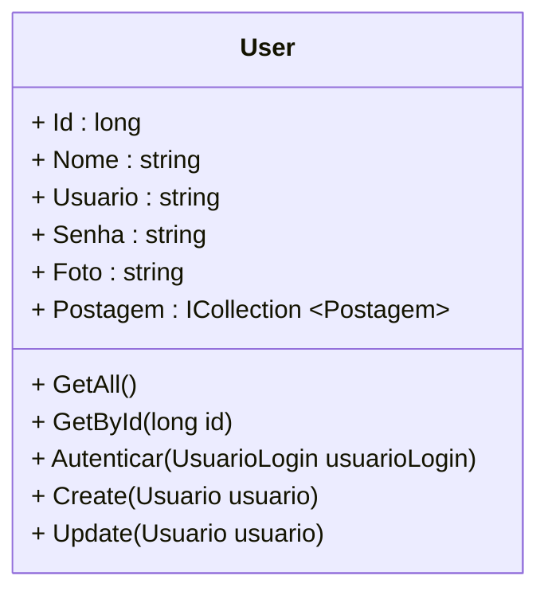
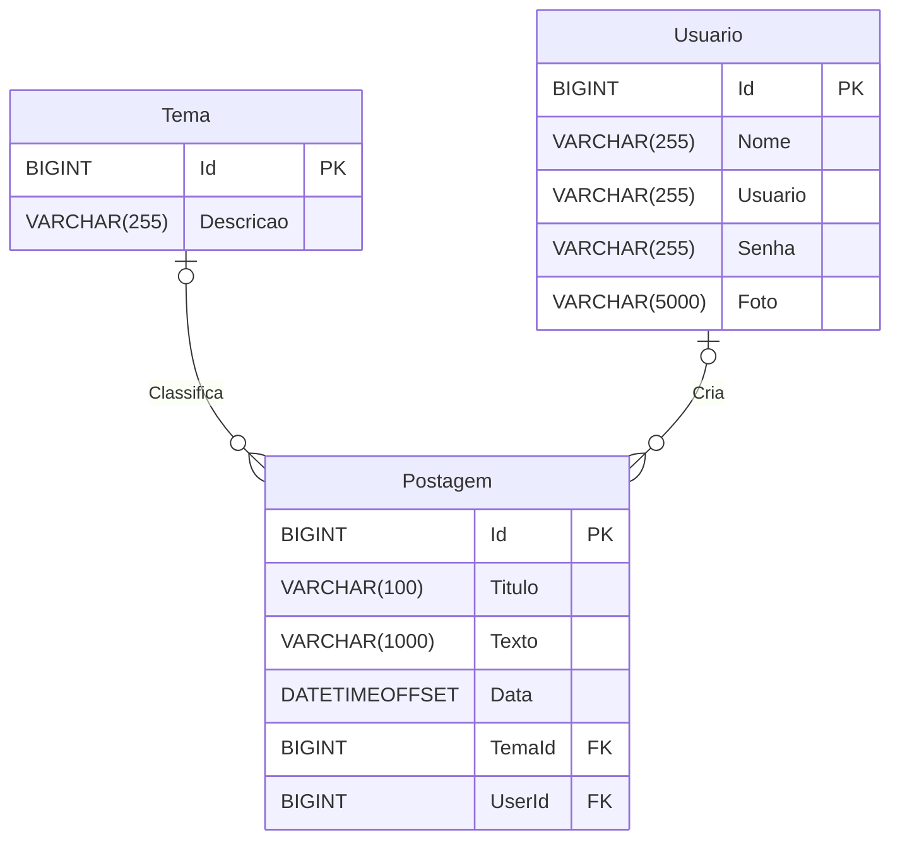
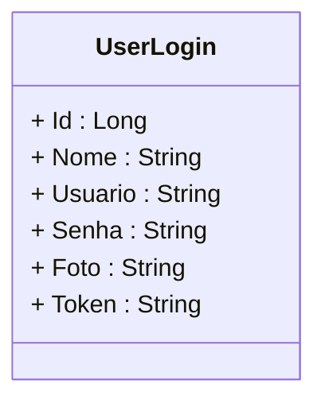

<h1>Projeto 02 - Blog Pessoal - Recurso User (Usuário) - Parte 01</h1>


O que veremos por aqui:

1. Apresentação do Recurso User
2. Criar a Classe Model User
3. Criar a Classe Model Auxiliar UserLogin
4. Criar a Classe UserValidator
5. Registrar a Classe Validator UserValidator na Classe Program
6. Registrar a Classe Model User na Classe AppDbContext
7. Criar o Relacionamento entre as Classes Postagem e User na Classe AppDbContext

<br />

<h2>1. Ecossistema do Usuário</h2>


O Ecossistema do Usuário é a parte responsável por definir os dados do nosso Objeto User, que será utilizado para autenticar e autorizar o acesso ao Blog Pessoal, assim  que a Segurança da aplicação for implementada por completo. 

|  | <div align="left"> **ATENÇÃO:** Aproveite esta etapa para validar seu código do Blog Pessoal, lembre-se que o Projeto Blog Pessoal serve como espelho para o Projeto Integrador. Tenha bastante atenção aos detalhes, pois existem implementações fundamentais para o perfeito funcionamento do sistema. Caso surjam dúvidas, não hesite em buscar os Instrutores da Generation para obter orientações.</div> |
| ------------------------------------------------------------ | ------------------------------------------------------------ |

<br />

<h2>1. O Recurso User</h2>


Nesta etapa vamos começar a construir o Recurso **User**. Veja o Diagrama de Classes abaixo: 



A **Classe User** servirá de modelo para construir a tabela **tb_usuarios** (Model) dentro do nosso Banco de dados **db_blogpessoal**. Os campos (Atributos) da tabela serão os mesmos que estão definidos no Diagrama de Classes acima. **Além de construirmos a Classe User, também faremos o Relacionamento com a Classe Postagem**, construída anteriormente. Observe que a entidade Postagem (tb_postagens) passará a ter **2 Chaves Estrangeiras (FK)**: *TemaId e UsuarioId* após o relacionamento.

Na próxima etapa vamos construir as Classes **UserService e UserController**, que irá nos auxiliar na interação com o Banco de dados e onde serão implementados os 6 métodos descritos no Diagrama de Classes acima.

Depois de criar a Classe Model User, vamos executar o projeto Blog Pessoal. Após a execução veremos que será criado no Banco de dados **db_blogpessoal** a tabela **tb_usuarios**. Veja abaixo como ficará a estrutura da nossa tabela através do **Diagrama de Model e Relacionamentos (DER)**:



O Dicionário de dados da nossa tabela tb_usuarios será o seguinte:

| Atributo | Tipo de dado  | Descrição           | Chave |
| -------- | ------------- | ------------------- | ----- |
| **id**   | BIGINT        | Identificador único | PK    |
| nome     | VARCHAR(255)  | Nome do usuário     |       |
| usuario  | VARCHAR(255)  | E-mail do usuário   |       |
| senha    | VARCHAR(255)  | Senha do usuário    |       |
| foto     | VARCHAR(5000) | Foto do usuário     |       |

<br />

|  | <div align="left"> **ALERTA DE BSM:** *Mantenha a Atenção aos Detalhes ao criar o Recurso User. Todas as Classes construídas no Recurso Postagem deverão ser construídas no Recurso User com as adaptações pertinentes ao Recurso User.* </div> |
| ------------------------------------------------------------ | ------------------------------------------------------------ |

<br />

|  | <div align="left"> **DICA:** *Caso você tenha alguma dúvida sobre como criar o Recurso, executar o projeto, entre outras, consulte a Documentação do Recurso Postagem.* </div> |
| ------------------------------------------------------------ | ------------------------------------------------------------ |

<br />

Também vamos criar a **Classe UserLogin**, que embora seja criada na **Camada Model**, ela não irá gerar uma tabela no Banco de dados. Esta Classe será uma Classe auxiliar para o usuário efetuar login no sistema. Veja o Diagrama de Classes abaixo:



<br />

<h2>👣 Passo 01 - Instalar os Pacotes para implementar a Security</h2>


Para implementarmos a Autenticação (login) e o Token JWT em nossa aplicação ASP.NET, precisamos instalar alguns pacotes, através do **NUGET**. Vamos instalar os seguintes pacotes:


| Pacote                       | Descrição                                                    |
| ---------------------------- | ------------------------------------------------------------ |
| **Authentication.JwtBearer** | Pacote que permite que um aplicativo ASP.NET receba um Token Bearer JWT. |
| **IdentityModel.Tokens.Jwt** | Pacote responsável por Incluir tipos que fornecem suporte para criar, serializar e validar JSON Web Tokens (JWT). |
| **BCrypt.Net-Core**          | Pacote responsável por criptografar a senha, através do algoritmo BCrypt. |

<br />

Para instalar os pacotes, vamos utilizar o **Gerenciador de Pacotes do Nuget**: 

1. Para abrir o **Gerenciador de Pacotes do Nuget** no Visual Studio, clique no Menu **Projeto 🡢 Gerenciador de Pacotes do Nuget**

2. Será aberta a janela do Nuget.

3. Clique na **Guia Procurar** para localizar os pacotes que serão instalados:

<div align="center"></div>

4. O primeiro pacote que vamos instalar é o Pacote **Authentication.JwtBearer**. Na caixa de texto **Pesquisar** digite o nome do pacote, selecione o pacote como mostra a imagem abaixo e na sequência clique no botão **Instalar**, localizado do lado direito da janela do Nuget.

<div align="center"></div>

5. O segundo pacote que vamos instalar é o pacote **IdentityModel.Tokens.Jwt**. Na caixa de texto **Pesquisar** digite o nome do pacote, selecione o pacote como mostra a imagem abaixo e na sequência clique no botão **Instalar**, localizado do lado direito da janela do Nuget.

<div align="center"></div>

6. O segundo pacote que vamos instalar é o pacote **BCrypt.Net-Core**. Na caixa de texto **Pesquisar** digite o nome do pacote, selecione o pacote como mostra a imagem abaixo e na sequência clique no botão **Instalar**, localizado do lado direito da janela do Nuget.

<div align="center"></div>

Caso você esteja utilizando o VSCode ou outra IDE, em  Sistemas Operacionais como o Linux e o MAC OS, que não possuem o  Gerenciador de Pacotes Gráfico do Nuget, você pode instalar as 5  bibliotecas através do Terminal, utilizando os comando abaixo:

```bash
dotnet add package Microsoft.AspNetCore.Authentication.JwtBearer --version 7.0.11

dotnet add package System.IdentityModel.Tokens.Jwt --version 7.0.2

dotnet add package BCrypt.Net-Core --version 1.6.0
```

*A Versão atual das Bibliotecas podem  ser diferentes das versões inseridas nos comandos acima. Consulte os  links abaixo para verificar quais são as versões mais atuais.*

<br />

<div align="left"> <a href="https://www.nuget.org/packages/Microsoft.AspNetCore.Authentication.JwtBearer" target="_blank"><b>Documentação: Pacote Authentication.JwtBearer</b></a></div>

<div align="left"> <a href="https://www.nuget.org/packages/System.IdentityModel.Tokens.Jwt" target="_blank"><b>Documentação: Pacote IdentityModel.Tokens.Jwt</b></a></div>

<div align="left"> <a href="https://www.nuget.org/packages/BCrypt.Net-Core" target="_blank"><b>Documentação: Pacote BCrypt.Net-Core.</b></a></div>

<br />

<h2>👣 Passo 02 - Criar a Classe Model User</h2>


Vamos criar a Classe Model **User**:

1. Clique com o botão direito do mouse sobre a **pasta Model** e na sequência, clique na opção **Adicionar 🡪 Classe**
2. Na janela **Adicionar Novo item**, no item **Nome**, digite o nome da Classe (**User**) e clique no botão **Adicionar** para concluir.

Agora vamos criar o código da Classe **User**:

```c#
using blogpessoal.Model;
using Newtonsoft.Json;
using System.ComponentModel.DataAnnotations;
using System.ComponentModel.DataAnnotations.Schema;

namespace blogpessoal.Model
{
    public class User
    {

        [Key]
        [DatabaseGenerated(DatabaseGeneratedOption.Identity)]
        public long Id { get; set; }

        [Column(TypeName = "varchar")]
        [StringLength(255)]
        public string Nome { get; set; } = string.Empty;

        [Column(TypeName = "varchar")]
        [StringLength(255)]
        public string Usuario { get; set; } = string.Empty;

        [Column(TypeName = "varchar")]
        [StringLength(255)]
        public string Senha { get; set; } = string.Empty;

        [Column(TypeName = "varchar")]
        [StringLength(5000)]
        public string? Foto { get; set; } = string.Empty;

        [InverseProperty("Usuario")]
        public virtual ICollection<Postagem>? Postagem { get; set; }
    }
}
```

Veja na tabela abaixo a conversão de **Tipo de dados C# 🡪 SQL, de acordo com o que foi definido no Diagrama de Classes acima:**

| Atributo | Tipo de dado TypeScript | Tipo de dado MySQL |
| -------- | ----------------------- | ------------------ |
| **id**   | long                    | BIGINT             |
| nome     | string                  | VARCHAR(255)       |
| usuario  | string                  | VARCHAR(255)       |
| senha    | string                  | VARCHAR(255)       |
| foto     | string                  | VARCHAR(5000)      |

<br />

|  | <div align="left">**DICA:** *Para relembrar os tipos de dados do C#, <a href="https://github.com/rafaelq80/cookbook_csharp/blob/main/01_csharp/03.md">clique aqui</a> e explore os principais tipos de dados oferecidos pelo C#.* </div> |
| ------------------------------------------------------------ | ------------------------------------------------------------ |

<br />

<h2>👣 Passo 03 - Criar a Classe Model Auxiliar UserLogin</h2>


Vamos criar a Classe Model **UserLogin**:

1. Clique com o botão direito do mouse sobre a **pasta Model** e na sequência, clique na opção **Adicionar 🡪 Classe**
2. Na janela **Adicionar Novo item**, no item **Nome**, digite o nome da Classe (**UserLogin**) e clique no botão **Adicionar** para concluir.

Agora vamos criar o código da Classe **UserLogin**:

```c#
namespace blogpessoal.Model
{
    public class UserLogin
    {
        public long Id { get; set; }

        public string Nome { get; set; } = string.Empty;

        public string Usuario { get; set; } = string.Empty;

        public string Senha { get; set; } = string.Empty;

        public string Foto { get; set; } = string.Empty;

        public string Token { get; set; } = string.Empty;

    }
}
```

<br />

<h2>👣 Passo 04 - Criar a Classe Validator UserValidator</h2>


Vamos criar a Classe de Validação de dados **UserValidator**:

1. Clique com o botão direito do mouse sobre a **pasta Validator** e na sequência, clique na opção **Adicionar 🡪 Classe**
2. Na janela **Adicionar Novo item**, no item **Nome**, digite o nome da Classe (**UserValidator**) e clique no botão **Adicionar** para concluir.

Agora vamos criar o código da Classe **UserValidator**:

```c#
using blogpessoal.Model;
using blogpessoal.Models;
using FluentValidation;

namespace blogpessoal.Validator
{
    public class UserValidator : AbstractValidator<User>
    {
        public UserValidator()
        {
            RuleFor(u => u.Nome)
                .NotEmpty()
                .MaximumLength(255);

            RuleFor(u => u.Usuario)
                .NotEmpty()
                .EmailAddress();

            RuleFor(u => u.Senha)
                .NotEmpty()
                .MinimumLength(8);

            RuleFor(u => u.Foto)
                .MaximumLength(5000);

        }

    }
}
```

<br />

**Regras de Validação utilizadas**

| Propriedade            | Descrição                           |
| ---------------------- | ----------------------------------- |
| **NotEmpty()**         | A string não pode ser nula ou vazia |
| **MinimumLength(tam)** | Define o tamanho mínimo da string.  |
| **MaximumLength(tam)** | Define o tamanho máximo da string.  |
| **EmailAddress()**     | Verifica se foi digitado um e-mail. |

<br />

<h2>👣 Passo 05 - Registrar a Classe UserValidator na Classe Program</h2>


Vamos registrar a Classe **UserValidator** como um serviço na Classe **Program**. 

1. Abra a Classe **Program**;
2. Localize a linha indicada abaixo:

 <div align="left"></div>

4. Após a linha indicada acima, adicione o trecho de código abaixo:

```c#
builder.Services.AddTransient<IValidator<User>, UserValidator>();
```

5. A imagem abaixo, mostra como ficará o trecho com a nova linha:

 <div align="left"></div>

Veja o código completo da Classe **Program** abaixo:

```c#

using blogpessoal.Data;
using blogpessoal.Model;
using blogpessoal.Service.Implements;
using blogpessoal.Service;
using blogpessoal.Validator;
using FluentValidation;
using Microsoft.EntityFrameworkCore;

namespace blogpessoal
{
    public class Program
    {
        public static void Main(string[] args)
        {
            var builder = WebApplication.CreateBuilder(args);

            // Add services to the container.

            // Add Controller Class
            builder.Services.AddControllers()
                .AddNewtonsoftJson(options =>
                {
                    options.SerializerSettings.ReferenceLoopHandling = Newtonsoft.Json.ReferenceLoopHandling.Ignore;
                    options.SerializerSettings.NullValueHandling = Newtonsoft.Json.NullValueHandling.Ignore;
                }
            );

            // Conexão com o Banco de dados
            var connectionString = builder.Configuration.
                    GetConnectionString("DefaultConnection");

            builder.Services.AddDbContext<AppDbContext>(options =>
                options.UseSqlServer(connectionString)
            );

            // Validação das Entidades
            builder.Services.AddTransient<IValidator<Postagem>, PostagemValidator>();
            builder.Services.AddTransient<IValidator<Tema>, TemaValidator>();
            builder.Services.AddTransient<IValidator<User>, UserValidator>();

            // Registrar as Classes e Interfaces Service
            builder.Services.AddScoped<IPostagemService, PostagemService>();
            builder.Services.AddScoped<ITemaService, TemaService>();

            // Learn more about configuring Swagger/OpenAPI
            // at https://aka.ms/aspnetcore/swashbuckle

            builder.Services.AddEndpointsApiExplorer();
            builder.Services.AddSwaggerGen();

            // Configuração do CORS
            builder.Services.AddCors(options => {
                options.AddPolicy(name: "MyPolicy",
                    policy =>
                    {
                        policy.AllowAnyOrigin()
                        .AllowAnyHeader()
                        .AllowAnyMethod();
                    });
            });

            var app = builder.Build();

            // Criar o Banco de dados e as tabelas Automaticamente
            using (var scope = app.Services.CreateAsyncScope())
            {
                var dbContext = scope.ServiceProvider.GetRequiredService<AppDbContext>();
                dbContext.Database.EnsureCreated();

            }

            app.UseDeveloperExceptionPage();

            // Configure the HTTP request pipeline.
            if (app.Environment.IsDevelopment())
            {
                app.UseSwagger();
                app.UseSwaggerUI();
            }

            app.UseCors("MyPolicy");

            app.UseAuthorization();

            app.MapControllers();

            app.Run();
        }
    }
}
```

<br />

<h2>👣 Passo 06 - Registrar a Classe User na Classe AppDbContext</h2>


Vamos registrar a Classe **User** na Classe **AppDbContext**, para gerar a tabela **tb_temas** no Banco de dados.:

1. Abra a Classe **AppDbContext**, localizada na pasta **Data**;
2. Localize o Método **OnModelCreating(ModelBuilder modelBuilder)**, indicado na imagem abaixo:

<div align="left"></div>

4. Adicione a linha de código abaixo dentro do Método **OnModelCreating(ModelBuilder modelBuilder)**:

```c#
modelBuilder.Entity<User>().ToTable("tb_usuarios");
```

5. A imagem abaixo, mostra como ficará o Método com a nova linha:

 <div align="left"></div>

6. Localize a linha indicada abaixo:

<div align="left"></div>

7. Após a linha indicada acima, adicione a linha de código abaixo:

```c#
public DbSet<User> Users { get; set; } = null!;
```

8. A imagem abaixo, mostra como ficará o trecho com a nova linha:

 <div align="left"></div>

Veja o código completo da Classe **AppDbContext** abaixo:

```c#
using blogpessoal.Model;
using Microsoft.EntityFrameworkCore;

namespace blogpessoal.Data
{
    public class AppDbContext : DbContext
    {
        public AppDbContext(DbContextOptions<AppDbContext> options) : base(options)
        {

        }

        protected override void OnModelCreating(ModelBuilder modelBuilder)
        {
            modelBuilder.Entity<Postagem>().ToTable("tb_postagens");
            modelBuilder.Entity<Tema>().ToTable("tb_temas");
            modelBuilder.Entity<User>().ToTable("tb_usuarios");

            // Relacionamento Postagem -> Tema
            modelBuilder.Entity<Postagem>()
                .HasOne(p => p.Tema)
                .WithMany(t => t.Postagem)
                .HasForeignKey("TemaId")
                .OnDelete(DeleteBehavior.Cascade);

        }

        // Registro das Entidades
        public DbSet<Postagem> Postagens { get; set; } = null!;
        public DbSet<Tema> Temas { get; set; } = null!;
        public DbSet<User> Users { get; set; } = null!;

        public override Task<int> SaveChangesAsync(CancellationToken cancellationToken = default)
        {
            var insertedEntries = this.ChangeTracker.Entries()
                                   .Where(x => x.State == EntityState.Added)
                                   .Select(x => x.Entity);

            foreach (var insertedEntry in insertedEntries)
            {
                //Se uma propriedade da Classe Auditable estiver sendo criada. 
                if (insertedEntry is Auditable auditableEntity)
                {
                    auditableEntity.Data = DateTimeOffset.Now;
                }
            }

            var modifiedEntries = ChangeTracker.Entries()
                       .Where(x => x.State == EntityState.Modified)
                       .Select(x => x.Entity);

            foreach (var modifiedEntry in modifiedEntries)
            {
                //Se uma propriedade da Classe Auditable estiver sendo atualizada.  
                if (modifiedEntry is Auditable auditableEntity)
                {
                    auditableEntity.Data = DateTimeOffset.Now;
                }
            }

            return base.SaveChangesAsync(cancellationToken);
        }

    }
}


```

<br />

<h2>👣 Passo 07 - Criar o Atributo User na Classe Postagem</h2>


A Classe Postagem será o lado N:1, ou seja, **Muitas Postagens podem ter apenas Um Usuario**. Para criar a Relação vamos inserir depois do último atributo da Classe **Postagem** (Tema), a linha destacada em amarelo na imagem abaixo:

<div align="left"></div>

Veja abaixo o código completo da **Classe Model Postagem**:

```c#
using System.ComponentModel.DataAnnotations.Schema;
using System.ComponentModel.DataAnnotations;

namespace blogpessoal.Model
{
    public class Postagem : Auditable
    {

        [Key]
        [DatabaseGenerated(DatabaseGeneratedOption.Identity)]
        public long Id { get; set; }

        [Column(TypeName = "varchar")]
        [StringLength(100)]
        public string Titulo { get; set; } = string.Empty;

        [Column(TypeName = "varchar")]
        [StringLength(1000)]
        public string Texto { get; set; } = string.Empty;

        public virtual Tema? Tema { get; set; }

        public virtual User? Usuario { get; set; }

    }
}
```

<br />

<h2>👣 Passo 08 - Criar o Relacionamento na Classe AppDbContext</h2>


Vamos criar o Relacionamento entre as Classes **User e Postagem**, na Classe **AppDbContext**, para gerar as tabelas **tb_temas** e **tb_postagens** no Banco de dados com o relacionamento:

1. Abra a Classe **AppDbContext**, localizada na pasta **Data**;
2. Localize dentro do Método **OnModelCreating(ModelBuilder modelBuilder)**, o trecho de código indicado na imagem abaixo:

<div align="left"></div>

4. Adicione a linha de código abaixo depois do trecho indicado acima:

```c#
// Relacionamento Postagem -> User
modelBuilder.Entity<Postagem>()
	.HasOne(p => p.Usuario)
    .WithMany(u => u.Postagem)
    .HasForeignKey("UserId")
    .OnDelete(DeleteBehavior.Cascade);
```

5. A imagem abaixo, mostra como ficará o Método com as novas linhas:

 <div align="left"></div>

Veja o código completo da Classe **AppDbContext** abaixo:

```c#
using blogpessoal.Model;
using Microsoft.EntityFrameworkCore;

namespace blogpessoal.Data
{
    public class AppDbContext : DbContext
    {
        public AppDbContext(DbContextOptions<AppDbContext> options) : base(options)
        {

        }

        protected override void OnModelCreating(ModelBuilder modelBuilder)
        {
            modelBuilder.Entity<Postagem>().ToTable("tb_postagens");
            modelBuilder.Entity<Tema>().ToTable("tb_temas");
            modelBuilder.Entity<User>().ToTable("tb_usuarios");

            // Relacionamento Postagem -> Tema
            modelBuilder.Entity<Postagem>()
                .HasOne(p => p.Tema)
                .WithMany(t => t.Postagem)
                .HasForeignKey("TemaId")
                .OnDelete(DeleteBehavior.Cascade);

            // Relacionamento Postagem -> User
            modelBuilder.Entity<Postagem>()
            .HasOne(p => p.Usuario)
            .WithMany(u => u.Postagem)
            .HasForeignKey("UserId")
            .OnDelete(DeleteBehavior.Cascade);
       
        }

        // Registro das Entidades
        public DbSet<Postagem> Postagens { get; set; } = null!;
        public DbSet<Tema> Temas { get; set; } = null!;
        public DbSet<User> Users { get; set; } = null!;

        public override Task<int> SaveChangesAsync(CancellationToken cancellationToken = default)
        {
            var insertedEntries = this.ChangeTracker.Entries()
                                   .Where(x => x.State == EntityState.Added)
                                   .Select(x => x.Entity);

            foreach (var insertedEntry in insertedEntries)
            {
                //Se uma propriedade da Classe Auditable estiver sendo criada. 
                if (insertedEntry is Auditable auditableEntity)
                {
                    auditableEntity.Data = DateTimeOffset.Now;
                }
            }

            var modifiedEntries = ChangeTracker.Entries()
                       .Where(x => x.State == EntityState.Modified)
                       .Select(x => x.Entity);

            foreach (var modifiedEntry in modifiedEntries)
            {
                //Se uma propriedade da Classe Auditable estiver sendo atualizada.  
                if (modifiedEntry is Auditable auditableEntity)
                {
                    auditableEntity.Data = DateTimeOffset.Now;
                }
            }

            return base.SaveChangesAsync(cancellationToken);
        }

    }
}
```

<br />

<h2>👣 Passo 09 - Apagar o Banco de dados</h2>


Antes de criarmos a tabela **tb_usuarios** e os respectivos relacionamentos, precisamos apagar o Banco de dados **db_blogpessoal**, porque o **ASP.NET** não consegue atualizar e/ou criar tabelas, depois que uma tabela foi criada no banco de dados. Vamos apagar o Banco de dados **db_blogpessoal**:

1. Pare o projeto, caso ele esteja em execução.
2. Abra o **SQL Server Management Studio** e conecte-se com o **SQL Server**.
3. Clique com o botão direito do mouse sobre o Banco de dados **db_blogpessoal** e no menu que será aberto, clique na opção **Excluir**, como mostra a imagem abaixo:

 <div align="center"></div>

4. Na janela **Excluir Objeto**, clique no botão **OK** para confirmar.

 <div align="center"></div>

5. Observe que o Banco de dados **db_blogpessoal** foi excluído!

 <div align="center"></div>

<br />

|  | <div align="left"> **ATENÇÃO:** *Ao excluir o Banco de dados, todos os dados cadastrados serão perdidos!* </div> |
| ------------------------------------------------------------ | ------------------------------------------------------------ |

<br />

<h2>👣 Passo 10 - Executar o projeto</h2>


1. Para executarmos o Projeto, clique no botão **Run http**, na **Barra de Ferramentas Principal** (indicado em verde na imagem):


2. Verifique na Tela do Console se o Banco e as 2 tabelas foram criadas, como mostra a imagem abaixo:

 <div align="center"></div>

<br />

<h2>👣 Passo 11 - Checar o Banco de dados</h2>


1. Volte para o **SQL Server Management Studio** e conecte-se com o **SQL Server**.
2. Para visualizar se o **Banco de Dados db_blogpessoal** e as **Tabelas tb_postagens e tb_temas com o Relacionamento** foram criados, na janela **Pesquisador de Objetos**, localizada no lado esquerdo da tela, selecione o servidor **localhost** e clique no botão **Atualizar** .

<div align="center"></div>

3. Na mesma janela, clique no sinal de (**+**) ao lado do item **Banco de Dados**, na sequência, clique no sinal de (**+**) ao lado do **Banco de Dados db_blogpessoal**, clique no sinal de (**+**) ao lado do item **Tabelas** e se tudo deu certo, veremos as tabelas **tb_postagens e tb_temas** criadas dentro do **Banco de Dados db_blogpessoal**, como mostra a imagem abaixo:

<div align="center"></div>

4. Observe que a **Chave Estrangeira UserId** foi criada na tabela **tb_postagens** e agora temos 3 tabelas no Banco de dados.
5. Crie um novo arquivo SQL **(SQLFile)**, insira as instruções abaixo e execute a consulta para popular as tabelas **tb_postagens** e **tb_temas** novamente.

```sql
USE db_blogpessoal;
GO

INSERT INTO tb_temas(descricao) values ('Tema 01');
INSERT INTO tb_temas(descricao) values ('Tema 02');
INSERT INTO tb_temas(descricao) values ('Tema 03');
GO

SELECT * FROM tb_temas;
GO

INSERT INTO tb_postagens (Titulo, Texto, Data, TemaId)
VALUES ('Postagem 01', 'Texto da Postagem 01', SYSDATETIMEOFFSET(), 1);
INSERT INTO tb_postagens (Titulo, Texto, Data, TemaId)
VALUES ('Postagem 02', 'Texto da Postagem 02', SYSDATETIMEOFFSET(), 2);
INSERT INTO tb_postagens (Titulo, Texto, Data, TemaId)
VALUES ('Postagem 03 - Atualizado', 'Texto da Postagem 03 - Atualizado', SYSDATETIMEOFFSET(), 1);
GO

SELECT * FROM tb_postagens;
GO
```

<br />

|  | <div align="left"> **ATENÇÃO:** *Lembre-se que as nossas tabelas estão vazias, logo teremos que persistir novos Objetos.* </div> |
| ------------------------------------------------------------ | ------------------------------------------------------------ |

<br />

Próximo passo: Implementar as **Classes UserService e UserController**.

<br />

<div align="left"> <a href="https://github.com/rafaelq80/backend_blogpessoal_aspnet_v7/tree/13_user_model_context" target="_blank"><b>Código fonte do projeto</b></a></div>

<br /><br />

<div align="left"><a href="README.md">Voltar</a></div>
