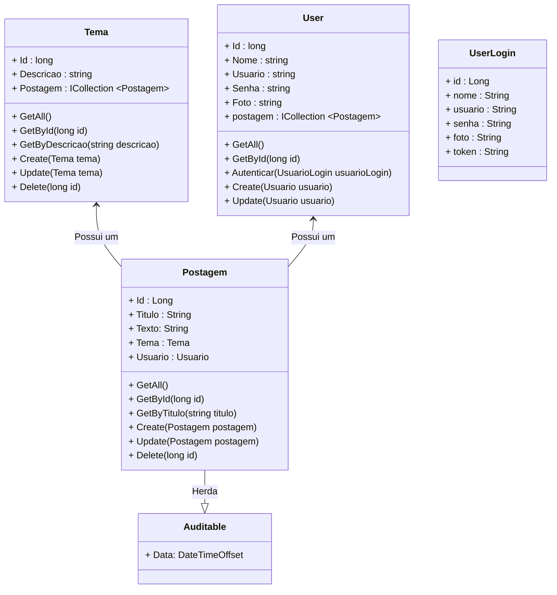

<h1>Projeto 02 - Blog Pessoal - Recurso User (Usuário) - Parte 02</h1>


O que veremos por aqui:

1. Criar a Interface IUserService
2. Criar a Classe UserService
3. Atualizar a Classe PostagemService
4. Registrar a Classe UserService na Classe Program
5. Criar a Classe UserController
6. Testar todos os Métodos no Insomnia
7. Atualizar as Requisições Cadastrar e Atualizar Postagem

<br />

<h2>1. O Recurso User</h2>


Na etapa anterior, começamos a construir o Recurso User e criamos o Relacionamento entre as Classes User e Postagem. Veja o Diagrama de Classes abaixo: 



<br />

|  | <div align="left"> **ALERTA DE BSM:** *Mantenha a Atenção aos Detalhes ao criar o Recurso User. Todas as Classes construídas no Recurso Postagem deverão ser construídas no Recurso User com as adaptações pertinentes ao Recurso User.* </div> |
| ------------------------------------------------------------ | ------------------------------------------------------------ |

<br />

|  | <div align="left"> **DICA:** *Caso você tenha alguma dúvida sobre como criar as Classes UserService e UserController, executar o projeto, entre outras, consulte a Documentação do Recurso Postagem.* </div> |
| ------------------------------------------------------------ | ------------------------------------------------------------ |

<br />

<h2>👣 Passo 01 - Criar a Interface IUserService</h2>


Vamos criar a **Interface IUserService** na pasta **Service**.

1. Clique com o botão direito do mouse sobre a **pasta Service** e na sequência, clique na opção **Adicionar 🡪 Novo item**
2. Na janela **Adicionar Novo Item**, Selecione a opção **Interface**, como mostra a figura abaixo:

<div align="center"></div>

3. No item **Nome**, digite o nome da Interface (**IUserService**)

<br />

|  | <div align="left"> **ALERTA DE BSM:** *Mantenha a Atenção aos Detalhes ao criar a Interface Service. Na Linguagem C# toda a Interface inicia o nome com a Letra I (maiúscula), porque geralmente a Classe que implementa a Interface tem o mesmo nome da Interface.* </div> |
| ------------------------------------------------------------ | ------------------------------------------------------------ |

<br />

Agora vamos criar o código da **Interface IUserService**:

```c#
using blogpessoal.Model;

namespace blogpessoal.Service
{
    public interface IUserService
    {
        Task<IEnumerable<User>> GetAll();

        Task<User?> GetById(long id);

        Task<User?> GetByUsuario(string usuario);

        Task<User?> Create(User usuario);

        Task<User?> Update(User usuario);
    }
}
```

Observe que diferente dos Recursos **Postagem e Tema**, não iremos construir o Método **Delete(long id)**. O Objetivo é impedir que um usuário seja excluído por qualquer usuário.

<br />

<h2>👣 Passo 02 - Criar a Classe UserService</h2>


Vamos criar a **Classe UserService** na pasta **Implements**, dentro da pasta **Service**:

1. Clique com o botão direito do mouse sobre a **pasta Implements**, localizada dentro da pasta **Service**, e na sequência, clique na opção **Adicionar 🡪 Classe**.
2. No item **Nome**, digite o nome da Classe (**UserService**)

Veja abaixo a implementação da Classe **UserService**:

```c#
using blogpessoal.Data;
using blogpessoal.Model;
using Microsoft.EntityFrameworkCore;

namespace blogpessoal.Service.Implements
{
    public class UserService : IUserService
    {
        public readonly AppDbContext _context;

        public UserService(AppDbContext context)
        {
            _context = context;

        }

        public async Task<IEnumerable<User>> GetAll()
        {
            return await _context.Users
                .Include(u => u.Postagem)
                .ToListAsync();
        }

        public async Task<User?> GetById(long id)
        {
            try
            {
                var Usuario = await _context.Users
                    .Include(u => u.Postagem)
                    .FirstAsync(i => i.Id == id);

                Usuario.Senha = "";

                return Usuario;
            }
            catch
            {
                return null;
            }

        }

        public async Task<User?> GetByUsuario(string usuario)
        {
            try
            {
                var BuscaUsuario = await _context.Users
                    .Include(u => u.Postagem)
                    .Where(u => u.Usuario == usuario)
                    .FirstOrDefaultAsync();

                return BuscaUsuario;
            }
            catch
            {
                return null;
            }
        }

        public async Task<User?> Create(User usuario)
        {
            var BuscaUsuario = await GetByUsuario(usuario.Usuario);

            if (BuscaUsuario is not null)
                return null;

            if (usuario.Foto is null || usuario.Foto == "")
                usuario.Foto = "https://i.imgur.com/I8MfmC8.png";

            usuario.Senha = BCrypt.Net.BCrypt.HashPassword(usuario.Senha, workFactor: 10);

            _context.Users.Add(usuario);
            await _context.SaveChangesAsync();

            return usuario;
        }

        public async Task<User?> Update(User usuario)
        {

            var UsuarioUpdate = await _context.Users.FindAsync(usuario.Id);

            if (UsuarioUpdate is null)
                return null;

            if (usuario.Foto is null || usuario.Foto == "")
                usuario.Foto = "https://i.imgur.com/I8MfmC8.png";

            usuario.Senha = BCrypt.Net.BCrypt.HashPassword(usuario.Senha, workFactor: 10);

            _context.Entry(UsuarioUpdate).State = EntityState.Detached;
            _context.Entry(usuario).State = EntityState.Modified;
            await _context.SaveChangesAsync();

            return usuario;
        }
    }
}

```

Observe que nos Métodos de consulta: **GetAll(), GetById( long id ) e GetByUsuario( string usuario )** foi acrescentada a linha abaixo:

```c#
.Include(u => u.Postagem)
```

O comando **Include** tem por objetivo exibir os Objetos da Classe Postagem que estão relacionados com os Objetos da Classe User, ou seja, ao executar os Métodos **GetAll(), GetById( long id ) e GetByDescricao( string descricao )**, além de **exibir os Objetos da Classe User persistidos no Banco de dados**, será exibido também **a lista de Objetos da Classe Postagem associados a cada Objeto da Classe da User**, semelhante ao exemplo abaixo:

```json
{
	"id": 1,
	"nome": "Administrador do Sistema",
	"usuario": "admin@email.com.br",
	"senha": "$2b$10$L/EWEnHwCGNahp9cYbdjYuoz1rsGXl9ukSHi9mILWQRwGYoyIDMdq",
	"foto": "https://i.imgur.com/Tk9f10K.png",
	"postagem": [
		{
			"id": 1,
			"titulo": "Postagem 01",
			"texto": "Texto da minha postagem 01",
			"data": "2023-06-08T23:28:57.2305447",
		},
		{
			"id": 3,
			"titulo": "Postagem 03",
			"texto": "Texto da minha postagem 03",
			"data": "2023-06-09T00:04:27.3084565",
		}
	]
}
```

Observe que logo após os dados do usuário, foi criado um array contendo as duas postagens associadas ao usuário.

<br />

|  | <div align="left"> **ATENÇÃO:** *Se o comando Include não for adicionada nos 3 Métodos de consulta, ao testar os Métodos GET no Insomnia o Relacionamento entre as Classes não será exibido.* </div> |
| ------------------------------------------------------------ | ------------------------------------------------------------ |

<br />

Note que no Método de consulta **GetById( long id )**, o atributo **senha** do Objeto usuario foi deixado em branco, antes do Objeto ser retornado. Este processo não deixa a senha em branco no Banco de dados porque não estamos fazendo uma persistência ou atualização nos dados, **apenas exibirá na consulta pelo id o atributo senha vazio**, o que simplifica o processo de criar uma página para alterar a senha do usuário, por exemplo.

Quanto aos Métodos **Create(User usuario)** e **Update(User usuario)**, vamos analisar as diferenças de implementação em relação aos Recursos Postagem e Tema:

<br />

<h3>2.1. Método Create - Usuário</h3>


O Objeto usuario será enviado pelo Método da **Classe UsuarioController**, através de um **JSON**, será semelhante ao exemplo abaixo:

```json
{
    "nome": "Administrador",
    "usuario": "admin@email.com.br",
    "senha": "admin123",
    "foto": ""
}
```

Observe que todos os Atributos serão enviados, **exceto o id**, porquê ele **será gerado pelo Banco de dados**. O atributo foto foi deixado em branco para testarmos se a foto padrão será persistida no Banco de dados.

<div align="center"></div>

**Linha 62:** Criamos um Objeto da Classe Usuario, chamado **BuscaUsuario**, para receber o resultado da execução do Método **GetByUsuario(string usuario)**, da Classe **UsuarioService**. O objetivo é checar se o Atributo usuario, do Objeto da Classe User, que será persistido já existe.

**Linhas 64 e 65:** Verifica se o Objeto **BuscaUsuario não é nulo**, ou seja, se o Objeto da Classe User existe. Caso ele exista, ele não poderá ser persistido no Banco de dados, logo o Método **Create(User usuario)** retornará nulo (null).

**Linhas 67 e 68:** Verifica se o atributo **Foto**, do Objeto usuario é nulo ou vazio. Caso seja nulo ou vazio, inserimos uma imagem padrão. Como construiremos no Frontend uma página contendo perfil do Usuário é importante termos uma imagem para não "quebrar" o visual da página.

**Linha 70:** Através do **Método HashPassword(string senha, workFactor: 10)**, do Pacote **Bcrypt**, vamos criptografar a senha do Objeto usuario antes de persistir o Objeto no Banco de dados. Observe que a  senha não criptografada (digitada no login) será substituída pela senha criptografada. O Parâmetro **workFactor: 10** é uma propriedade do Algoritmo BCrytpt, que indica quantos caracteres aleatórios serão inseridos dentro da string depois de criptografada. Neste caso, definimos 10 caracteres.

No caso de uma persistência dos dados bem sucedida, o retorno esperado do Método **SaveChangesAsync()** será a confirmação do Objeto persistido, no formato JSON, como mostra o exemplo abaixo:

```json
{
    "id": 1,
	"nome": "Administrador",
	"usuario": "admin@email.com.br",
	"senha": "$2b$10$L/EWEnHwCGNahp9cYbdjYuoz1rsGXl9ukSHi9mILWQRwGYoyIDMdq",
	"foto": "https://i.imgur.com/I8MfmC8.png",
	"postagem": []
}
```

Observe que a senha está criptografada.

<br />

<h3>2.2. Método Update - Usuário</h3>


O Objeto usuario será enviado pelo Método da **Classe UsuarioController**, através de um **JSON**, será semelhante ao exemplo abaixo:

```json
{
    "id": 1,
    "nome": "Administrador do Sistema",
    "usuario": "admin@email.com.br",
    "senha": "admin123",
    "foto": "https://i.imgur.com/Tk9f10K.png"
}
```

Observe que todos os Atributos serão enviados, **inclusive o id**, porquê ele **será utilizado para identificar o Objeto usuario que será atualizado**. Atualizamos os atributo nome e foto.

<div align="center"></div>

**Linhas 86 e 87:** Verifica se o atributo **Foto**, do Objeto usuario é nulo ou vazio. Caso seja nulo ou vazio, inserimos uma imagem padrão. Como construiremos no Frontend uma página contendo perfil do Usuário é importante termos uma imagem para não "quebrar" o visual da página.

**Linha 89:** Através do **Método HashPassword(string senha, workFactor: 10)**, do Pacote **Bcrypt**, vamos criptografar a senha do Objeto usuario antes de persistir o Objeto no Banco de dados. Observe que a  senha não criptografada (digitada no login) será substituída pela senha criptografada. O Parâmetro **workFactor: 10** é uma propriedade do Algoritmo BCrytpt, que indica quantos caracteres aleatórios serão inseridos dentro da string depois de criptografada. Neste caso, definimos 10 caracteres.

No caso de uma atualização dos dados bem sucedida, o retorno esperado do Método **SaveChangesAsync()** será a confirmação do Objeto persistido, no formato JSON, como mostra o exemplo abaixo:

```json
{
    "id": 1,
	"nome": "Administrador do Sistema",
	"usuario": "admin@email.com.br",
	"senha": "$2b$10$mXsoRRRUT1moBDzTZfhyKuKApUHFugyRDqAdQEPumnrwGrmXuzeNy",
	"foto": "https://i.imgur.com/Tk9f10K.png",
	"postagem": []
}
```

Observe que a senha está criptografada, porém não é mais a mesma sequencia de caracteres de quando foi criada, mesmo que a senha tenha sido mantida a mesma.

<br />

<div align="left"> <a href="https://github.com/neoKushan/BCrypt.Net-Core" target="_blank"><b>Documentação: Pacote BCrypt</b></a></div>

<br />

<h2>👣 Passo 03 - Atualizar a Classe PostagemService</h2>


Da mesma forma que adicionamos o comando **Include** na Classe UserService, também iremos adicionar na Classe PostagemService, nos 3 Métodos de consulta: **GetAll(), GetById( long id ) e GetByTitulo( string titulo )**. No trecho de código abaixo, vemos com ficará o comando **Include** na Classe PostagemService:

```c#
.Include(p => p.Usuario)
```

Desta forma, ao executar os Métodos de consulta:  **GetAll(), GetById( long id ) e GetByTitulo( string titulo )**, os Objetos da Classe Postagem passarão a exibir o Objeto da Classe User associado, semelhante ao exemplo abaixo:

```json
{
	"id": 1,
	"titulo": "Postagem 01",
	"texto": "Texto da minha postagem 01",
	"data": "2023-06-08T23:28:57.2305447",
	"temaId": 1
	"tema": {
		"id": 1,
		"descricao": "Tema 01"
	},
	"usuario" :{
        "id": 1,
        "nome": "Administrador do Sistema",
        "usuario": "admin@email.com.br",
        "senha": "$2b$10$mXsoRRRUT1moBDzTZfhyKuKApUHFugyRDqAdQEPumnrwGrmXuzeNy",
        "foto": "https://i.imgur.com/Tk9f10K.png"
    }
}
```

Observe que nos Métodos **Create(Postagem postagem) e Update(Postagem postagem)** foi acrescentada a linha abaixo:

```c#
postagem.Usuario = postagem.Usuario is not null ? _context.Users.FirstOrDefault(t => t.Id == postagem.Usuario.Id) : null;
```

Da mesma forma que fizemos com o Recurso Tema, esta linha verifica antes de Criar ou Atualizar um Objeto Postagem se o Objeto da Classe User foi associado. Caso tenha sido, o Objeto User é localizado e associado ao Objeto Postagem. Caso não tenha sido associado, o Objeto User é mantido como nulo (null). Sem esta linha, não será possível associar um User a Postagem.

Veja abaixo a implementação atualizada da Classe **PostagemService**:

```c#
using blogpessoal.Data;
using blogpessoal.Model;
using Microsoft.EntityFrameworkCore;

namespace blogpessoal.Service.Implements
{
    public class PostagemService : IPostagemService
    {

        private readonly AppDbContext _context;

        public PostagemService(AppDbContext context)
        {
            _context = context;
        }

        public async Task<IEnumerable<Postagem>> GetAll()
        {
            return await _context.Postagens
                .Include(p => p.Tema)
                .Include(p => p.Usuario)
                .ToListAsync();
        }

        public async Task<Postagem?> GetById(long id)
        {
            try
            {
                var Postagem = await _context.Postagens
                    .Include(p => p.Tema)
                    .Include(p => p.Usuario)
                    .FirstAsync(i => i.Id == id);

                return Postagem;
            }
            catch
            {
                return null;
            }

        }

        public async Task<IEnumerable<Postagem>> GetByTitulo(string titulo)
        {
            var Postagem = await _context.Postagens
                .Include(p => p.Tema)
                .Include(p => p.Usuario)
                .Where(p => p.Titulo.Contains(titulo))
                .ToListAsync();

            return Postagem;
        }

        public async Task<Postagem?> Create(Postagem postagem)
        {

            if (postagem.Tema is not null)
            {
                var BuscaTema = await _context.Temas.FindAsync(postagem.Tema.Id);

                if (BuscaTema is null)
                    return null;
            }

            postagem.Tema = postagem.Tema is not null ? _context.Temas.FirstOrDefault(t => t.Id == postagem.Tema.Id) : null;
            postagem.Usuario = postagem.Usuario is not null ? _context.Users.FirstOrDefault(u => u.Id == postagem.Usuario.Id) : null;
            
            await _context.Postagens.AddAsync(postagem);
            await _context.SaveChangesAsync();

            return postagem;

        }

        public async Task<Postagem?> Update(Postagem postagem)
        {

            var PostagemUpdate = await _context.Postagens.FindAsync(postagem.Id);

            if (PostagemUpdate is null)
                return null;

            if (postagem.Tema is not null)
            {
                var BuscaTema = await _context.Temas.FindAsync(postagem.Tema.Id);

                if (BuscaTema is null)
                    return null;
            }

            postagem.Tema = postagem.Tema is not null ? _context.Temas.FirstOrDefault(t => t.Id == postagem.Tema.Id) : null;
            postagem.Usuario = postagem.Usuario is not null ? _context.Users.FirstOrDefault(u => u.Id == postagem.Usuario.Id) : null;

            _context.Entry(PostagemUpdate).State = EntityState.Detached;
            _context.Entry(postagem).State = EntityState.Modified;
            await _context.SaveChangesAsync();

            return postagem;

        }

        public async Task Delete(Postagem postagem)
        {

            _context.Postagens.Remove(postagem);
            await _context.SaveChangesAsync();

        }

    }
}
```

<br />

<h2>👣 Passo 04 - Registrar a Classe UserService na Classe Program</h2>


Vamos registrar a Classe **UserService** como um serviço na Classe **Program**. 

1. Abra a Classe **Program**;
2. Localize a linha indicada abaixo:

 <div align="left"></div>

4. Após a linha indicada acima, adicione o trecho de código abaixo:

```c#
 builder.Services.AddScoped<IUserService, UserService>();
```

5. A imagem abaixo, mostra como ficará o trecho com a nova linha:

 <div align="left"></div>

Veja o código completo da Classe **Program** abaixo:

```c#

using blogpessoal.Data;
using blogpessoal.Model;
using blogpessoal.Service.Implements;
using blogpessoal.Service;
using blogpessoal.Validator;
using FluentValidation;
using Microsoft.EntityFrameworkCore;

namespace blogpessoal
{
    public class Program
    {
        public static void Main(string[] args)
        {
            var builder = WebApplication.CreateBuilder(args);

            // Add services to the container.

            // Add Controller Class
            builder.Services.AddControllers()
                .AddNewtonsoftJson(options =>
                {
                    options.SerializerSettings.ReferenceLoopHandling = Newtonsoft.Json.ReferenceLoopHandling.Ignore;
                }
            );

            // Conexão com o Banco de dados
            var connectionString = builder.Configuration.
                    GetConnectionString("DefaultConnection");

            builder.Services.AddDbContext<AppDbContext>(options =>
                options.UseSqlServer(connectionString)
            );

            // Validação das Entidades
            builder.Services.AddTransient<IValidator<Postagem>, PostagemValidator>();
            builder.Services.AddTransient<IValidator<Tema>, TemaValidator>();
            builder.Services.AddTransient<IValidator<User>, UserValidator>();

            // Registrar as Classes e Interfaces Service
            builder.Services.AddScoped<IPostagemService, PostagemService>();
            builder.Services.AddScoped<ITemaService, TemaService>();
            builder.Services.AddScoped<IUserService, UserService>();

            // Learn more about configuring Swagger/OpenAPI
            // at https://aka.ms/aspnetcore/swashbuckle

            builder.Services.AddEndpointsApiExplorer();
            builder.Services.AddSwaggerGen();

            // Configuração do CORS
            builder.Services.AddCors(options => {
                options.AddPolicy(name: "MyPolicy",
                    policy =>
                    {
                        policy.AllowAnyOrigin()
                        .AllowAnyHeader()
                        .AllowAnyMethod();
                    });
            });

            var app = builder.Build();

            // Criar o Banco de dados e as tabelas Automaticamente
            using (var scope = app.Services.CreateAsyncScope())
            {
                var dbContext = scope.ServiceProvider.GetRequiredService<AppDbContext>();
                dbContext.Database.EnsureCreated();

            }

            app.UseDeveloperExceptionPage();

            // Configure the HTTP request pipeline.
            if (app.Environment.IsDevelopment())
            {
                app.UseSwagger();
                app.UseSwaggerUI();
            }

            app.UseCors("MyPolicy");

            app.UseAuthorization();

            app.MapControllers();

            app.Run();
        }
    }
}
```

<br />

<h2>👣 Passo 05 - Criar a Classe UserController</h2>


Vamos criar a **Classe PostagemController** na pasta **Controller**:

1. Clique com o botão direito do mouse sobre a **pasta Controller** e na sequência, clique na opção **Adicionar 🡪 Classe**.
2. No item **Nome**, digite o nome da Classe (**UserController**)

Veja abaixo a implementação da Classe **UserController**:

```c#
using blogpessoal.Model;
using blogpessoal.Service;
using FluentValidation;
using Microsoft.AspNetCore.Authorization;
using Microsoft.AspNetCore.Mvc;

namespace blogpessoal.Controllers
{

    [Route("~/usuarios")]
    [ApiController]
    public class UserController : ControllerBase
    {

        private readonly IUserService _userService;
        private readonly IValidator<User> _userValidator;

        public UserController(
            IUserService userService,
            IValidator<User> userValidator
            )
        {
            _userService = userService;
            _userValidator = userValidator;

        }

        [HttpGet("all")]
        public async Task<ActionResult> GetAll()
        {
            return Ok(await _userService.GetAll());
        }

        [HttpGet("{id}")]
        public async Task<ActionResult> GetById(long id)
        {
            var Resposta = await _userService.GetById(id);

            if (Resposta is null)
            {
                return NotFound("Usuário não encontrado!");
            }

            return Ok(Resposta);
        }

        [HttpPost("cadastrar")]
        public async Task<ActionResult> Create([FromBody] User usuario)
        {
            var validarUser = await _userValidator.ValidateAsync(usuario);

            if (!validarUser.IsValid)
                return StatusCode(StatusCodes.Status400BadRequest, validarUser);

            var Resposta = await _userService.Create(usuario);

            if (Resposta is null)
                return BadRequest("Usuário já cadastrado!");

            return CreatedAtAction(nameof(GetById), new { id = Resposta.Id }, Resposta);
        }

        [HttpPut("atualizar")]
        public async Task<ActionResult> Update([FromBody] User usuario)
        {
            if (usuario.Id == 0)
                return BadRequest("O Id do Usuário é inválido!");
            
            var validarUser = await _userValidator.ValidateAsync(usuario);

            if (!validarUser.IsValid)
                return StatusCode(StatusCodes.Status400BadRequest, validarUser);

            var UserUpdate = await _userService.GetByUsuario(usuario.Usuario);

            if ((UserUpdate is not null) && (UserUpdate.Id != usuario.Id))
                return BadRequest("O Usuário (e-mail) já está em uso por outro usuário.");

            var Resposta = await _userService.Update(usuario);

            if (Resposta is null)
                return BadRequest("Usuário não encontrado!");

            return Ok(Resposta);
        }

    }
}
```

Observe que a implementação é semelhante as Classes **PostagemController** e **TemaController**. 

Note que o Método **Create(User usuario)** diferente do Recurso **Postagem**, o Método retornará o HTTP Status **BAD REQUEST 🡪 400** para indicar que o usuário já existe.

Observe apenas que o Método **Update(User usuario)** foram criadas algumas checagens adicionais:

<div align="center"></div>

**Linha 74:** Criamos um Objeto da Classe Usuario, chamado **UserUpdate**, para receber o resultado da execução do Método **GetByUsuario(string usuario)**, da Classe **UsuarioService**. O objetivo é checar se o Atributo usuario, do Objeto da Classe User, que será persistido já existe.

**Linha 76:** Verifica se o Objeto **UserUpdate não é nulo** e se o **Atributo id do Objeto UserUpdate (Objeto encontrado no Banco de dados)** é diferente do **Atributo id do Objeto usuario (Objeto enviado na Requisição)**.

A primeira condição do if, verifica se o usuário digitou no Atributo usuario, um e-mail que já foi persistido no Banco de dados.  Caso este e-mail exista, o Objeto **UserUpdate não será nulo**.

Observe que **não basta apenas checar a existência do e-mail para permitir a atualização**, precisamos **verificar também se o e-mail pertence ao usuário que será atualizado**, caso contrário teremos uma **duplicação de usuário (e-mail)**.

A segunda condição do if, verifica se **o Atributo id enviado no corpo da requisição é diferente do Atributo id, que foi encontrado no Banco de dados**. Caso seja diferente, significa que o e-mail existe, mas **não pertence ao Objeto que será atualizado**, logo a atualização não pode ser efetuada.

**Linha 77:** Se as 2 condições da linha 76  forem satisfeitas, ou seja, o usuário foi encontrado e pertence a outro  usuário, será retornado o HTTP Status **BAD REQUEST 🡪 400** (Usuário já Existe!).

<br />

<h2>👣 Passo 06 - Executar o projeto</h2>


Para executarmos o Projeto, clique no botão **Run http**, na **Barra de Ferramentas Principal** (indicado em verde na imagem):


<br />

<h2>👣 Passo 07 - Testar o Recurso User no Insomnia</h2>


Vamos criar no Insomnia todas as requisições necessárias para testar os 5 Métodos do Recurso Usuario. Veja abaixo como ficam as requisições para testar o Recurso Usuario:

|  | <div align="left"> **DICA:** *Caso você tenha alguma dúvida sobre como criar as Requisições, consulte a Documentação dos Recursos Postagem e Tema.* </div> |
| ------------------------------------------------------------ | ------------------------------------------------------------ |

<br />

|  | <div align="left"> **ATENÇÃO:** *Depois de criar o Relacionamento entre Classes, todas as Consultas dos Recursos Postagem, Tema e Usuario trarão os Objetos associados.* </div> |
| ------------------------------------------------------------ | ------------------------------------------------------------ |

<br />

<h3>4.1. Criando a Pasta Usuario</h3>

Vamos criar dentro da **Collection Blog Pessoal** a **Pasta Usuario**, que guardará todas as requisições do **Recurso Usuario**.

1. Na **Collection Blog Pessoal**, clique no botão . No menu que será aberto, clique na opção **New Folder**.

<div align="center"></div>

2. Na janela que será aberta, informe o nome da pasta (**Usuario**) e clique no botão **Create** para concluir. 

<div align="center"></div>

<br />

<h3>4.2. Criar a  Requisição - Cadastrar Usuario</h3>

Vamos começar pela requisição Cadastrar Usuario porquê sem um usuário cadastrado não será possível autenticar (logar) no sistema e acessar os demais endpoints.

1. Clique com o botão direito do mouse sobre a **Pasta Usuario** para abrir o menu e clique na opção **New HTTP Request**.

<div align="center"></div>

2. Será criada uma nova Requisição (New Request) dentro da pasta **Usuario**.
3. Dê um duplo clique sobre a nova requisição (**New Request**), informe o nome da requisição (indicado na imagem abaixo na cor amarela) e pressione a tecla **enter** do seu teclado.

<div align="center"></div>

4. Selecione o Método HTTP que será utilizado (**POST**) na requisição, indicado na imagem abaixo na cor verde. 

<div align="center"></div>

5. No item **Body**, vamos alterar para **JSON**, como mostra a imagem abaixo. Desta forma poderemos enviar os dados do Objeto Usuario no Corpo da Requisição, no formato JSON.

<div align="center"></div>

6. Observe que o item **Body** será renomeado para **JSON**, como mostra a imagem abaixo:

<div align="center"></div>

7. Configure a requisição conforme a imagem abaixo:

<div align="center"></div>

8. Observe que na requisição do tipo Post o Corpo da requisição (Request Body), deve ser preenchido com um JSON contendo o nome, o usuario (e-mail), a senha e a foto(link), que vc deseja persistir no Banco de dados.

9. Observe que depois de persistir os dados do usuario, a aplicação retornará a senha criptografada.

<div align="center"></div>

<br />

<h3>4.3. Criar a  Requisição - Consultar todos os Usuarios</h3>


1. Clique com o botão direito do mouse sobre a **Pasta Usuario** para abrir o menu e clique na opção **New Request**.

2. Será criada uma nova Requisição (New Request) dentro da pasta **Usuario**.

3. Dê um duplo clique sobre a nova requisição (**New Request**), informe o nome da requisição (indicado na imagem abaixo na cor amarela) e pressione a tecla **enter** do seu teclado.

<div align="center"></div>

4. Selecione o Método HTTP que será utilizado (**GET**) na requisição, indicado na imagem abaixo na cor verde. 

<div align="center"></div>

5. Configure a requisição conforme a imagem abaixo:

<div align="center"></div>

<br />

<h3>4.4. Criar a  Requisição - Consultar Usuario por Id</h3>


1. Clique com o botão direito do mouse sobre a **Pasta Usuario** para abrir o menu e clique na opção **New Request**.

2. Será criada uma nova Requisição (New Request) dentro da pasta **Usuario**.

3. Dê um duplo clique sobre a nova requisição (**New Request**), informe o nome da requisição (indicado na imagem abaixo na cor amarela) e pressione a tecla **enter** do seu teclado.

<div align="center"></div>

4. Selecione o Método HTTP que será utilizado (**GET**) na requisição, indicado na imagem abaixo na cor verde. 

<div align="center"></div>

5. Configure a requisição conforme a imagem abaixo:

<div align="center"></div>

<br />

<h3>4.5. Criar a  Requisição - Atualizar Usuário</h3>


1. Clique com o botão direito do mouse sobre a **Pasta Usuario** para abrir o menu e clique na opção **New Requisição**.

2. Será criada uma nova Requisição (New Request) dentro da pasta **Usuario**.

3. Dê um duplo clique sobre a nova requisição (**New Request**), informe o nome da requisição (indicado na imagem abaixo na cor amarela) e pressione a tecla **enter** do seu teclado.

<div align="center"></div>

4. Selecione o Método HTTP que será utilizado (**PUT**) na requisição, indicado na imagem abaixo na cor verde. 

<div align="center"></div>

5. No item **Body**, vamos alterar para **JSON**, como mostra a imagem abaixo. Desta forma poderemos enviar os dados do Objeto Usuario no Corpo da Requisição, no formato JSON.

<div align="center"></div>

6. Observe que o item **Body** será renomeado para **JSON**, como mostra a imagem abaixo:

<div align="center"></div>

7. Configure o endereço da requisição conforme a imagem abaixo:

<div align="center"></div>

8. Observe que na requisição do tipo **PUT** o Corpo da requisição (Request Body), deve ser preenchido com um JSON contendo o Id, o nome, o usuario (e-mail), a senha e a foto(link) que vc deseja atualizar no Banco de dados.

<br />

<h2>👣 Passo 08 - Atualizar as Requisições Cadastrar e Atualizar Postagem no Insomnia</h2>


Como habilitamos o Relacionamento entre as Classes, para Cadastrarmos e Alterarmos as Postagens vamos precisar atender alguns requisitos:

- Os Objetos da Classe User devem ser persistidos antes de criarmos as Postagens.
- Nas requisições Cadastrar e Atualizar Postagem, o JSON enviado no Corpo da Requisição deve conter um Objeto da Classe User identificado apenas pelo **Atributo id**.

<br />

<h3>8.1. Atualizar - Requisição Cadastrar Postagem</h3>


Vamos alterar o Corpo da requisição (Body), da Requisição Cadastrar Postagem, do Recurso Postagem.	

1. No Insomnia, abra a pasta Postagem e clique sobre a requisição Cadastrar Postagem.

2. Altere o corpo da requisição conforme a imagem abaixo:

<div align="center"></div>

No item marcado em amarelo na imagem acima, observe que está sendo passado dentro do JSON um **Objeto da Classe User** chamado **usuario**, identificado apenas pelo **Atributo id**.

A Resposta da Requisição será semelhante a figura abaixo:

<div align="center"></div>

<br />

|  | **ATENÇÃO:** *O Objeto usuario deve ser persistido no Banco de dados antes de ser inserido no JSON da requisição Cadastrar Postagem.* |
| ------------------------------------------------------------ | :----------------------------------------------------------- |

<br />

<h3>8.2. Atualizar - Requisição Atualizar Postagem</h3>


Vamos alterar o Corpo da requisição (Body), da Requisição Atualizar Postagem, do Recurso Postagem.	

1. No Insomnia, abra a pasta Postagem e clique sobre a requisição Atualizar Postagem.

2. Altere o corpo da requisição conforme a imagem abaixo:

<div align="center"></div>

No item marcado em amarelo na imagem acima, observe que está sendo passado dentro do JSON um **Objeto da Classe User** chamado **usuario**, identificado apenas pelo **Atributo id**.

A Resposta da Requisição será semelhante a figura abaixo:

<div align="center"></div>

<br />

|  | **ATENÇÃO:** *O Objeto usuario deve ser persistido no Banco de dados antes de ser inserido no JSON da requisição Atualizar Postagem.* |
| ------------------------------------------------------------ | :----------------------------------------------------------- |

<br />

Observe que não fizemos a **checagem do Usuário na Classe PostagemService**, assim como fizemos com o tema, porque o usuário será utilizado para autenticar no sistema, logo essa informação ficará armazenada no Frontend até o usuário efetuar logout ou token expirar. Logo a passagem deste parâmetro será automática, ou seja, como será necessário autenticar o usuário antes de publicar uma postagem, ao persistir a nova postagem o Frontend se encarregará de inserir o usuário autenticado nas Requisições Criar e Atualizar postagem.

No próximo conteúdo, vamos criar o ultimo Método do Recurso User, o Método Autenticar (Logar)...

<br />

<div align="left"> <a href="" target="_blank"><b>Código fonte do projeto</b></a></div>

<br /><br />

<div align="left"><a href="README.md">Voltar</a></div>
