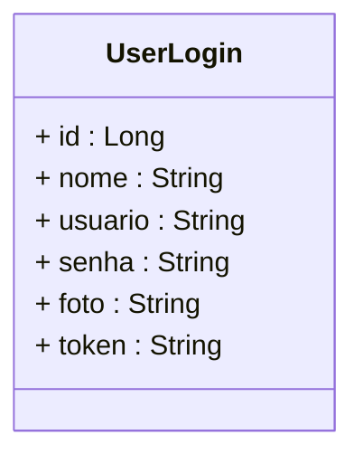

<h1>Projeto 02 - Blog Pessoal - Ecossistema da Segurança</h1>


O que veremos por aqui:

1. Criar a Classe Settings
2. Criar a Interface IAuthService
3. Criar a Classe AuthService
4. Registrar a Classe AuthService na Classe Program
5. Atualizar a Classe UserController
6. Atualizar a Classe TemaController
7. Atualizar a Classe PostagemController
8. Testar o Método de Login e Atualizar todas as Requisições no Insomnia

<br />

<h2>1. O Ecossistema da Segurança</h2>


Nesta etapa vamos começar a construir o Ecossistema da Segurança, que  será utilizado para habilitar e implementar a segurança do Blog Pessoal. Através do Ecossistema da Segurança será possível realizar a autenticação dos  usuários a  partir de uma tabela no Banco de dados. Para isso é  necessário enviar os atributos usuario (e-mail) e a senha para que o  Ecossistema da Segurança valide as credenciais do usuário, gere e valide o Token JWT, que permitirá acessar os endpoints protegidos da  aplicação.

O Ecossistema da Segurança utilizará a Classe Entidade Auxiliar **UserLogin**, criada anteriormente. Chamamos esta Classe de Auxiliar porquê ela não irá gerar uma tabela no Banco de dados, servirá apenas para enviar os dados do usuário para o  Ecossistema da Segurança. Relembre através do Diagrama abaixo a estrutura da Classe **UserLogin**:



<br />

<h2>👣 Passo 01 - Criar a Classe Settings</h2>


Dentro do projeto **blogpessoal**, vamos criar a pasta **Security**, que será utilizada para implementar o Ecossistema da Segurança:

1. No lado direito superior, na Guia **Gerenciador de Soluções**, clique com o botão direito do mouse sobre o projeto  **blogpessoal** e clique na opção **Adicionar 🡪 Nova Pasta**

2. Digite o nome da pasta (**Security**), com a primeira letra maiúscula, seguindo o padrão do C# e pressione **enter** para concluir. 

<br />

Na sequência, vamos criar a **Classe Settings** na pasta **Security**.

1. Clique com o botão direito do mouse sobre a **pasta Security** e na sequência, clique na opção **Adicionar 🡪 Classe**
2. No item **Nome**, digite o nome da Classe (**Settings**)
3. Clique no botão **Adicionar** para concluir.

<br />

Agora vamos criar e analisar o código da **Classe Settings**:

<div align="center"></div>

**Linha 05:** Foi criado o atributo **secret**. Este atributo armazenará a Chave de assinatura do Token JWT (secret). Este Atributo foi definido com um valor, porque este valor será constante, ou seja, nunca será modificado. Foi definido também o modificador **static**, porque o atributo deve estar associado **apenas e exclusivamente** a esta Classe, ou seja, é uma variável de Classe e não do Objeto. Também foi definido o modificador **private**, para manter o encapsulamento.

O valor atribuído ao atributo **secret** é uma chave encriptada aleatória, gerada através do algoritmo de Criptografia  **AES**.

> O **Advanced Encryption Standard (AES)** é  uma especificação para a criptografia de dados eletrônicos estabelecida  pelo Instituto Nacional de Padrões e Tecnologia (NIST) dos EUA em 2001.  AES é amplamente utilizado hoje em dia, pois é um algoritmo que geram  chaves muito fortes, difíceis de serem quebradas.

Para gerar esta chave, utilizamos o site All Keys Generator (<a href="https://www.keygen.io/" target="_blank"><b>https://www.keygen.io/</b></a>), na opção **SHA 256-bit Key**, que permite gerar chaves encriptadas aleatórias no formato **SHA 256**:

<div align="center"></div>

**Linha 07:** Foram criados os Métodos Get e Set utilizando uma implementação simplificada.

<br />

<div align="left"> <a href="https://jwt.io/introduction" target="_blank"><b>Documentação: JWT - JSON WEB Token</b></a></div>

<div align="left"> <a href="https://pt.wikipedia.org/wiki/SHA-2" target="_blank"><b>Algoritmo SHA256.</b></div>

<div align="left"> <a href="https://www.keygen.io" target="_blank"><b>Ferramenta: Keygen IO</b></div>

<br />

<h2>👣 Passo 02 - Criar a Interface IAuthService</h2>


Vamos criar a **Interface IAuthService** na pasta **Security**.

1. Clique com o botão direito do mouse sobre a **pasta Security** e na sequência, clique na opção **Adicionar 🡪 Novo item**
2. Na janela **Adicionar Novo Item**, Selecione a opção **Interface**, como mostra a figura abaixo:

<div align="center"></div>

3. No item **Nome**, digite o nome da Interface (**IAuthService**)

<br />

|  | <div align="left"> **ALERTA DE BSM:** *Mantenha a Atenção aos Detalhes ao criar a Interface Service. Na Linguagem C# toda a Interface inicia o nome com a Letra I (maiúscula), porque geralmente a Classe que implementa a Interface tem o mesmo nome da Interface.* </div> |
| ------------------------------------------------------------ | ------------------------------------------------------------ |

<br />

Agora vamos criar o código da **Interface IAuthService**:

```c#
using blogpessoal.Model;

namespace blogpessoal.Security
{
    public interface IAuthService
    {
        Task<UserLogin?> Autenticar(UserLogin userLogin);
    }
}
```

Observe que foi assinado apenas um Método na Interface **IAuthService**, chamado **Autenticar**, que será responsável por efetuar o login do Usuário e Gerar o Token JWT.

<br />

<h2>👣 Passo 03 - Criar a Classe AuthService</h2>


Dentro da pasta **Security**, vamos criar a pasta **Implements**:

1. No lado direito superior, na Guia **Gerenciador de Soluções**, clique com o botão direito do mouse sobre a pasta **Security** e clique na opção **Adicionar 🡪 Nova Pasta**
2. Digite o nome da pasta (**Implements**), com a primeira letra maiúscula, seguindo o padrão do C# e pressione **enter** para concluir.

<br />

Vamos criar a **Classe AuthService** na pasta **Implements**, dentro da pasta **Service**:

1. Clique com o botão direito do mouse sobre a **pasta Implements**, localizada dentro da pasta **Security**, e na sequência, clique na opção **Adicionar 🡪 Classe**.
2. No item **Nome**, digite o nome da Classe (**AuthService**)

Vamos implementar e analisar a Classe **AuthService**:

<div align="center"></div>

**Linha 01:** Importamos o Namespace **Model** (pasta Model do projeto Blog Pessoal).

**Linha 02:** Importamos o Namespace **Service** (pasta Service do projeto Blog Pessoal).

**Linha 03:** Importamos o pacote **IdentityModel.Tokens**, responsável por Criar os elementos Token JWT (Claims, Signature, entre outros).

**Linha 04:** Importamos o pacote **IdentityModel.Tokens.Jwt**, responsável por Criar o Token JWT.

**Linha 05:** Importamos o pacote **Security.Claims**, responsável por representar os Claims do Token JWT.

**Linha 06:** Importamos o pacote **System.Text** (Opcional), responsável por exibir mensagens na tela do console.

**Linha 10:** Observe que na assinatura da Classe **AuthService**, vamos adicionar **:** (dois pontos) e na sequência o nome da Interface que será implementada (**IAuthService**). 

 **Linha 12:** Instanciamos um Objeto da Interface **IUserService**, chamado **_userService** (somente leitura). Através desta Injeção de Dependências, teremos acesso aos Métodos da Classe **UserService**, que nos permitirá efetuar consultas no Banco de dados da aplicação.

**Linhas 14 a 17:** Cria um **Método Construtor**, que receberá a **Injeções de Dependência** necessárias para o desenvolvimento da Classe de Serviço. Observe que o Método Construtor receberá como Parâmetro um Objeto da Interface **UserService**, chamado **userService**.

Em nosso exemplo, a Classe de Serviço cria um ponto de injeção do tipo **IUserService** e quando houver a necessidade o EntityFramework cria um novo **Objeto da Classe Usuario** através da Interface **IUserService**. Através deste Objeto, checaremos se o o usuário e senha enviados no login (Objeto da Classe UserLogin), existem ou não no Banco de dados.

**Linhas 19 a 55:** Implementamos o Método **Autenticar(UserLogin usuarioLogin)** para um **Método Assíncrono**, através da palavra reservada **async**, que promete retornar uma **Promise** (Promessa), contendo um Objeto da Classe **UserLogin**, contendo os dados do usuário que não foram enviados no login (id, nome e foto) e o Token JWT, que permitirá o usuário acessar os endpoints protegidos da aplicação.

Observe que o Método **Autenticar(UserLogin usuarioLogin)** receberá um Objeto da Classe **UserLogin**, que possuirá apenas 2 atributos preenchidos: **usuario (e-mail) e a senha**.

**Linha 21:** Cria a variável **FotoDefault** contendo o link para a foto padrão para usuários que não cadastraram uma foto.

**Linhas 23 e 24:** Verifica se o Objeto **usuarioLogin** é nulo e se os atributos **usuario e senha** são nulos ou vazio. Caso uma destas condições seja verdadeira, o Método **Autenticar(UserLogin usuarioLogin)** retornará nulo (null).

**Linha 26:** Cria o Objeto **BuscaUsuario**, da Classe **User**, que receberá o resultado da execução do Método **GetByUsuario(usuarioLogin.Usuario)**, da Interface **UserService**, que retorna apenas um Objeto específico (o primeiro), cujo atributo **usuario** seja  igual ao valor do atributo **usuario** do Objeto **userLogin**. 

**Linhas 28 e 29:** Verifica se o Objeto **BuscaUsuario** é nulo, ou seja, se o usuário que está tentando autenticar não foi encontrado. Caso esta condição seja verdadeira, o Método **Autenticar(UserLogin usuarioLogin)** retornará nulo (null).

**Linhas 71 e 72:** Através do **Método Verify(string senhaDigitada, string senhaPersistida)**, do Pacote **Bcrypt**, vamos checar se a senha do Objeto **usuarioLogin** é diferente da senha do Objeto **BuscaUsuario**. Caso esta condição seja verdadeira, ou seja, as senhas não são iguais, o Método **Verify(string senhaDigitada, string senhaPersistida)** retornará nulo (null).

Em linhas gerais, o Método **Verify(string senhaDigitada, string senhaPersistida)**, utiliza o algoritmo **BCrypt** na senha  digitada pelo usuário e depois checa se esta senha criptografada é equivalente a senha criptografada persistida no Banco de dados. Como este Método é do tipo **bool**, ele retornará **true** se as senhas forem iguais.

**Linha 34:** Cria um Objeto da Classe **JwtSecurityTokenHandler**, chamado **tokenHandler**, que representa o **Token JWT**.

**Linha 35:** Cria uma variável do tipo **byte**, chamado **tokenKey**, que receberá o atributo **secret**, da Classe **Settings**, codificado no formato **UTF-8**.

> **UTF-8** é a página de código universal para internacionalização de caracteres, que é capaz  de codificar todo o conjunto de caracteres Unicode. Ele é usado amplamente na Web e é o padrão para plataformas baseadas em Unix, como o Linux, por exemplo.

**Linhas 36 a 44:** Cria um Objeto da Classe **SecurityTokenDescriptor**, chamado **tokenDescriptor**, que será responsável por armazenar todos os atributos relacionados ao **Token JWT**, ou seja, o **Payload** e a **Assinatura**. 

> **payload:** é um Objeto JSON, que contém as declarações do Token JWT, definidas no padrão JSON WEB Token. As declarações são as informações sobre uma entidade (normalmente, o usuário) e alguns dados adicionais.

Observe que dentro deste Objeto serão inseridas as **Claims Subject (usuario) e Expires(data e hora de validade do token)**, além da **assinatura do Token (SigningCredentials)**.

> **Claims** são declarações inseridas no payload do Token JWT, ou seja, são informações declaradas sobre um assunto.
>
> **Exemplo:**
>
> ```json
> {
> 	"unique_name": "admin@email.com.br"
> }
> ```
>
> **unique_name** é uma **claim**, que contém o e-mail do usuário.

**Linhas 38 a 41:** Cria um Objeto da Classe **ClaimsIdentity**, que é uma implementação concreta de uma identidade baseada em declarações, ou seja, uma identidade descrita por uma coleção de declarações. Uma declaração é uma representação sobre uma entidade feita por um emissor que descreve uma propriedade, um direito ou alguma outra qualidade dessa entidade. Em nosso exemplo, será descrito o **usuário que é o dono do Token JWT**.

**Linha 40:** O atributo **Subject** é responsável por inserir a **claim subject**. Note que criamos um Objeto da Classe **Claim** no atributo **Subject**, que representa uma declaração (Claim). Para criar a declaração utilizamos o Método Construtor da Classe Claim, que possui **2 parâmetros: Tipo e Valor.**

**Tipo:** O Tipo é representado por um Objeto da Classe **ClaimTypes**, que possui uma lista de possíveis declarações. Em nosso projeto, utilizaremos apenas a declaração **Name**, que receberá o usuário que é dono do Token JWT.

**Valor:** É o valor que será armazenado na declaração. Em nosso exemplo, passamos o atributo **usuario** (e-mail), do Objeto **userLogin**.

Por se tratar de um Array, podemos adicionar outras declarações (Claims), além da Claim Name. 

<br />

|  | <div align="left"> **ALERTA DE BSM:** *Mantenha a Atenção aos Detalhes ao criar a Camada Security. Não adicione dados sensíveis do usuário como a senha dentro das declarações (Claims). Lembre-se que esta parte do Token JWT pode ser facilmente decodificada.* </div> |
| ------------------------------------------------------------ | ------------------------------------------------------------ |

<br />

**Linha 42:** O atributo **Expires** é responsável por inserir a **claim exp (expiration - data e hora da expiração)**, preenchida com a data e a hora (incluindo os milissegundos da hora) exata do momento da criação do token, somada **ao tempo limite do token**, no Payload do Token JWT.  Em nosso exemplo, o limite de expiração do Token é de **60 minutos 🡪 1 hora**.

**Linha 43:**  O atributo **SigningCredentials** é responsável por armazenar a **assinatura do Token JWT encriptada**. Sem esta chave, como vimos anteriormente, é impossível alterar o conteúdo do Token, tornando o Token inválido. Este processo é relativamente simples e pode ser executado pelo Método **SigningCredentials( Chave, Algoritmo)**, da Classe **SigningCredentials**.

A **Chave** será um Objeto da Classe **SymmetricSecurityKey**, que é uma Classe Abstrata, que representa todas as Chaves geradas usando algoritmo. Para criar a Chave utilizamos o Método Construtor da Classe SymmetricSecurityKey, que possui **1 parâmetro: a variável tokenKey.**

O **Algoritmo de Encriptação** da assinatura do Token JWT será o **HMAC SHA256 - HS256**, padrão para Tokens JWT, definido pela Classe **SecurityAlgorithms**.

> **HMAC SHA256 (HS256)** é um tipo de algoritmo de hash, com chave, que é construído a partir da função hash **SHA-256** e usado como um código de autenticação de mensagem baseado em hash (HMAC). 
>
> **HS256** é um método de assinatura simétrica. Isso significa que a mesma chave secreta é usada para criar e verificar a própria assinatura. O emissor anexa o cabeçalho JWT e a carga com a chave secreta e faz o hash do resultado usando SHA256, criando uma assinatura. O destinatário usa suas cópias da chave secreta, cabeçalho JWT e carga útil da mesma maneira para reproduzir a assinatura, verificando se eles correspondem.

**Linha 45:** Cria o Token JWT utilizando o Método **CreateToken(tokenDescriptor)**, da Classe **JwtSecurityTokenHandler**. Observe que para gerar o Token foi utilizado como parâmetro do Método o Objeto **tokenDescriptor**, da Classe **SecurityTokenDescriptor**, que contém o Payload e a Assinatura do Token.

O Método **CreateToken(tokenDescriptor)**, ao ser executado, irá gerar um Token JWT, semelhante ao da imagem abaixo:

<div align="center"></div>

O Token acima, está estruturado da seguinte forma:

<div align="center"></div>

**Linhas 47 a 51:** Preenchemos o Objeto **usuarioLogin** com os dados encontrados no Banco de dados e com o Token JWT, que foi gerado na linha 45.

**Linha 49:** Antes de preencher o atributo **foto**, verificaremos se ele é nulo. Caso seja, o atributo foto será preenchido com o link da foto padrão da API (**FotoDefault**).

**Linha 50:** Observe que no atributo **token** foi realizada uma concatenação da palavra **Bearer**, seguida de um espaço em branco e o Token JWT. **Caso não seja inserida a palavra Bearer seguida de um espaço em branco no Token, o Navegador não irá reconhecer o Token**.

**Linha 51:** Note que o atributo **senha** foi deixado em branco.

**Linha 53:** O Método **Autenticar(UserLogin usuarioLogin)** retorna o Objeto **usuarioLogin** preenchido e com o Token.

<br />

<div align="left"> <a href="https://github.com/neoKushan/BCrypt.Net-Core" target="_blank"><b>Documentação: Pacote BCrypt</b></a></div>

<div align="left"> <a href="https://jwt.io/introduction" target="_blank"><b>Documentação: JWT - JSON WEB Token</b></a></div>

<div align="left"> <a href="https://jwt.io/" target="_blank"><b>Ferramenta: JWT Debugger</b></a></div>

<div align="left"> <a href="https://learn.microsoft.com/pt-br/dotnet/api/system.identitymodel.tokens.jwt.jwtsecuritytokenhandler?view=msal-web-dotnet-latest" target="_blank"><b>Documentação: Classe JwtSecurityTokenHandler</b></a></div>

<div align="left"> <a href="https://learn.microsoft.com/pt-br/dotnet/api/system.text.encoding?view=net-7.0" target="_blank"><b>Documentação: Classe Encoding</b></a></div>

<div align="left"> <a href="https://learn.microsoft.com/pt-br/windows/apps/design/globalizing/use-utf8-code-page" target="_blank"><b>Documentação: Codificação UTF-8</b></a></div>

<div align="left"> <a href="https://learn.microsoft.com/pt-br/dotnet/api/system.identitymodel.tokens.securitytokendescriptor?view=netframework-4.8.1" target="_blank"><b>Documentação: Classe SecurityTokenDescriptor</b></a></div>

<div align="left"> <a href="https://learn.microsoft.com/pt-br/dotnet/api/system.security.claims.claimsidentity?view=net-7.0" target="_blank"><b>Documentação: Classe ClaimsIdentity</b></a></div>

<div align="left"> <a href="https://learn.microsoft.com/pt-br/dotnet/api/system.security.claims.claim?view=net-7.0" target="_blank"><b>Documentação: Classe Claim</b></a></div>

<div align="left"> <a href="https://learn.microsoft.com/pt-br/dotnet/api/system.security.claims.claimtypes?view=net-7.0" target="_blank"><b>Documentação: Classe ClaimTypes</b></a></div>

<div align="left"> <a href="https://learn.microsoft.com/pt-br/dotnet/api/system.identitymodel.tokens.signingcredentials?view=netframework-4.8.1" target="_blank"><b>Documentação: Classe SigningCredentials</b></a></div>

<div align="left"> <a href="https://learn.microsoft.com/pt-br/dotnet/api/system.identitymodel.tokens.symmetricsecuritykey?view=dotnet-plat-ext-7.0" target="_blank"><b>Documentação: Classe SymmetricSecurityKey</b></a></div>

<div align="left"> <a href="https://learn.microsoft.com/pt-br/dotnet/api/system.identitymodel.tokens.securityalgorithms?view=dotnet-plat-ext-7.0" target="_blank"><b>Documentação: Classe SecurityAlgorithms</b></a></div>

<div align="left"> <a href="https://pt.wikipedia.org/wiki/SHA-2" target="_blank"><b>Algoritmo SHA256.</b></div>

<br />

<h2>👣 Passo 04 - Registrar a Classe AuthService na Classe Program</h2>


Vamos registrar a Classe **AuthService** como um serviço na Classe **Program**. 

1. Abra a Classe **Program**;
2. Localize a linha indicada abaixo:

 <div align="left"></div>

4. Após a linha indicada acima, adicione o trecho de código abaixo:

```c#
builder.Services.AddTransient<IAuthService, AuthService>();
```

5. A imagem abaixo, mostra como ficará o trecho com a nova linha:

 <div align="left"></div>

6. Abaixo desta linha que acabamos de adicionar, vamos habilitar a **Validação do Token JWT** em todas as Requisições HTTP, adicionando as linhas abaixo:

```c#
 			// Adicionar a Validação do Token JWT

			builder.Services.AddAuthentication(options =>
            {
                options.DefaultAuthenticateScheme = JwtBearerDefaults.AuthenticationScheme;
                options.DefaultChallengeScheme = JwtBearerDefaults.AuthenticationScheme;
            }).AddJwtBearer(options =>
            {
                var Key = Encoding.UTF8.GetBytes(Settings.Secret);
                options.SaveToken = true;
                options.TokenValidationParameters = new TokenValidationParameters
                {
                    ValidateIssuer = false,
                    ValidateAudience = false,
                    ValidateLifetime = true,
                    ValidateIssuerSigningKey = true,
                    IssuerSigningKey = new SymmetricSecurityKey(Key)
                };
            });
```

Vamos analisar o código acima:

 <div align="left"></div>

**Linha 54:** Adicionamos o serviço de autenticação ao pipeline de execução do ASP.NET, ou seja, habilitamos o serviço de autenticação, que irá procurar no Cabeçalho (header) de todas as requisições HTTP um Token.

**Linha 56:** Estamos informando ao serviço de autenticação, que ele deve procurar um Token **Bearer**, no formato **JWT**. **Bearer** significa que o Token será enviado no cabeçalho da requisição, na propriedade **Authorization**.

Na imagem abaixo, vemos o Cabeçalho de uma Requisição HTTP com o Token Bearer, na propriedade **Authorization**:

<div align="center"></div>

**Linha 57:** O Token JWT pode ser gerado de várias formas, inclusive em sites externos, como: Facebook, Twitter, Google e Microsoft. Este processo é chamado de **Challenge** ou desafiar, onde confrontamos um servidor para que ele
faça uma autenticação e nos retorne o Token. Desta forma, nosso desafio aqui é dizer para o ASP.NET que estamos utilizando uma autenticação interna, ou seja, ela é gerada neste servidor e vale única e exclusivamente para este servidor. Por este motivo, precisamos de uma configuração adicional **DefaultChallengeScheme**, que  definirá este processo.

**Linhas 58 a 70:** Os atributos enviados no Payload do Token JWT (usuario, expiração, entre outros) estão dentro do Token e vamos precisar recuperar estas informações para validar o Token. Entretanto, o Token está encriptado e logo para obtermos esses dados, precisamos fazer o processo reverso, para extrair as informações do Token e identificar o Usuário logado. Para efetuarmos esta Operação e validar o Token, vamos definir algumas propriedades.

**Linha 60:** Cria uma variável do tipo **byte**, chamado **key**, que receberá o atributo **secret**, da Classe **Settings**, codificado no formato **UTF-8**.

**Linha 61:** Salva os dados de login no **AuthenticationProperties**, que é uma Collection do tipo **Dictionary**, que armazena as propriedades de Autenticação da sessão atual.

**Linhas 62 a 69:** Cria um Objeto da Classe **TokenValidationParameters**, que será responsável por definir as regras de validação do Token.

**Linha 64:** Informamos que não iremos validar o Emissor, porque só existe um único emissor.

**Linha 65:** Informamos que não iremos validar o Destinatário, porque só existe um único destinatário.

**Linha 66:** Informamos validaremos o tempo de vida do Token, ou seja, data e hora de expiração.

**Linha 67:** Informamos utilizaremos uma Chave para validar o Token JWT.

**Linha 68:** Informamos através do Método **IssuerSigningKey(key)**, qual chave utilizaremos para validar o Token JWT.

7. Para finalizarmos, vamos configurar o ASP.NET para inicializar o serviço todas vezes que a aplicação for executada. Localize o trecho de código abaixo:

<div align="center"></div>

8. Logo abaixo deste trecho, acrescente as linhas abaixo:

```c#
 // Habilitar a Autenticação e a Autorização
app.UseAuthentication();

app.UseAuthorization();
```

<br />

|  | <div align="left"> **ALERTA DE BSM:** *Mantenha a Atenção aos Detalhes ao criar a Camada de Segurança da aplicação. Respeitar a ordem que os itens estão sendo inseridos na Classe Program é fundamental para o funcionamento correto da aplicação.* </div> |
| ------------------------------------------------------------ | ------------------------------------------------------------ |

<br />Veja o código completo da Classe **Program** abaixo:

```c#

using blogpessoal.Data;
using blogpessoal.Model;
using blogpessoal.Service.Implements;
using blogpessoal.Service;
using blogpessoal.Validator;
using FluentValidation;
using Microsoft.EntityFrameworkCore;
using blogpessoal.Security;
using Microsoft.AspNetCore.Authentication.JwtBearer;
using Microsoft.IdentityModel.Tokens;
using System.Text;
using blogpessoal.Security.Implements;

namespace blogpessoal
{
    public class Program
    {
        public static void Main(string[] args)
        {
            var builder = WebApplication.CreateBuilder(args);

            // Add services to the container.

            // Add Controller Class
            builder.Services.AddControllers()
                .AddNewtonsoftJson(options =>
                {
                    options.SerializerSettings.ReferenceLoopHandling = Newtonsoft.Json.ReferenceLoopHandling.Ignore;
                    options.SerializerSettings.NullValueHandling = Newtonsoft.Json.NullValueHandling.Ignore;
                }
            );

            // Conexão com o Banco de dados
            var connectionString = builder.Configuration.
                    GetConnectionString("DefaultConnection");

            builder.Services.AddDbContext<AppDbContext>(options =>
                options.UseSqlServer(connectionString)
            );

            // Validação das Entidades
            builder.Services.AddTransient<IValidator<Postagem>, PostagemValidator>();
            builder.Services.AddTransient<IValidator<Tema>, TemaValidator>();
            builder.Services.AddTransient<IValidator<User>, UserValidator>();

            // Registrar as Classes e Interfaces Service
            builder.Services.AddScoped<IPostagemService, PostagemService>();
            builder.Services.AddScoped<ITemaService, TemaService>();
            builder.Services.AddScoped<IUserService, UserService>();
            builder.Services.AddTransient<IAuthService, AuthService>();

            // Validação do Token
            builder.Services.AddAuthentication(options =>
            {
                options.DefaultAuthenticateScheme = JwtBearerDefaults.AuthenticationScheme;
                options.DefaultChallengeScheme = JwtBearerDefaults.AuthenticationScheme;
            }).AddJwtBearer(options =>
            {
                var key = Encoding.UTF8.GetBytes(Settings.Secret);
                options.SaveToken = true;
                options.TokenValidationParameters = new TokenValidationParameters
                {
                    ValidateIssuer = false,
                    ValidateAudience = false,
                    ValidateLifetime = true,
                    ValidateIssuerSigningKey = true,
                    IssuerSigningKey = new SymmetricSecurityKey(key)
                };
            });

            // Learn more about configuring Swagger/OpenAPI
            // at https://aka.ms/aspnetcore/swashbuckle

            builder.Services.AddEndpointsApiExplorer();
            builder.Services.AddSwaggerGen();

            // Configuração do CORS
            builder.Services.AddCors(options => {
                options.AddPolicy(name: "MyPolicy",
                    policy =>
                    {
                        policy.AllowAnyOrigin()
                        .AllowAnyHeader()
                        .AllowAnyMethod();
                    });
            });

            var app = builder.Build();

            // Criar o Banco de dados e as tabelas Automaticamente
            using (var scope = app.Services.CreateAsyncScope())
            {
                var dbContext = scope.ServiceProvider.GetRequiredService<AppDbContext>();
                dbContext.Database.EnsureCreated();

            }

            app.UseDeveloperExceptionPage();

            // Configure the HTTP request pipeline.
            if (app.Environment.IsDevelopment())
            {
                app.UseSwagger();
                app.UseSwaggerUI();
            }

            //Habilitar CORS

            app.UseCors("MyPolicy");

            // Habilitar a Autenticação e a Autorização

            app.UseAuthentication();

            app.UseAuthorization();

            // Habilitar Controller
            app.MapControllers();

            app.Run();
        }
    }
}
```

<br />

<div align="left"> <a href="https://learn.microsoft.com/pt-br/aspnet/core/security/authentication/?view=aspnetcore-7.0" target="_blank"><b>Documentação: Autenticação</b></a></div>

<div align="left"> <a href="https://learn.microsoft.com/pt-br/aspnet/core/security/authorization/introduction?view=aspnetcore-7.0" target="_blank"><b>Documentação: Autorização</b></a></div>

<div align="left"> <a href="https://learn.microsoft.com/pt-br/dotnet/api/microsoft.extensions.dependencyinjection.authenticationservicecollectionextensions.addauthentication?view=aspnetcore-7.0" target="_blank"><b>Documentação: Classe AddAuthentication</b></a></div>

<div align="left"> <a href="https://learn.microsoft.com/pt-br/dotnet/api/microsoft.aspnetcore.authentication.authenticationoptions?view=aspnetcore-7.0" target="_blank"><b>Documentação: Classe AddAuthentication - Opções</b></a></div>

<div align="left"> <a href="https://learn.microsoft.com/pt-br/dotnet/api/microsoft.extensions.dependencyinjection.jwtbearerextensions.addjwtbearer?view=aspnetcore-7.0" target="_blank"><b>Documentação: Método AddJwtBearer</b></a></div>

<div align="left"> <a href="https://learn.microsoft.com/pt-br/dotnet/api/microsoft.aspnetcore.authentication.jwtbearer.jwtbeareroptions.savetoken?view=aspnetcore-7.0" target="_blank"><b>Documentação: Propriedade SaveToken</b></a></div>

<div align="left"> <a href="https://learn.microsoft.com/pt-br/dotnet/api/microsoft.identitymodel.tokens.tokenvalidationparameters?view=msal-web-dotnet-latest" target="_blank"><b>Documentação: Classe TokenValidationParameters</b></a></div>

<div align="left"> <a href="https://learn.microsoft.com/pt-br/dotnet/api/microsoft.aspnetcore.builder.authappbuilderextensions.useauthentication?view=aspnetcore-7.0" target="_blank"><b>Documentação: Método UseAuthentication</b></a></div>

<div align="left"> <a href="https://learn.microsoft.com/pt-br/dotnet/api/microsoft.aspnetcore.builder.authorizationappbuilderextensions.useauthorization?view=aspnetcore-7.0" target="_blank"><b>Documentação: Método UseAuthorization</b></a></div>

<br />

<h2>👣 Passo 05 - Atualizar a Classe UserController</h2>


Após habilitar a Autenticação e a Autorização, precisamos criar o endpoint de autenticação (login), na Classe **UserController**, além de restringir o acesso aos Endpoints da aplicação. Vamos começar pelo Método **Autenticar(UserLogin usuarioLogin)**:

1. Abra a Classe **UserController**.
2. Faça as 3 alterações indicadas na imagem abaixo:

<div align="center"></div>

Basicamente estamos criando uma Injeção de Dependência para a Classe **AuthService**. Não esqueça de Importar o Namespace **Security**.

3. Após o Método **Atualizar(User usuario)**, implemente o Método **Autenticar(UserLogin usuarioLogin)**, conforme o código abaixo:

<div align="center"></div>

Vamos analisar alguma particularidades do Método acima:

**Linha 94:** Foi inserida a anotação **[AllowAnonymous]**, que indica que este endpoint será livre de validação do Token. Se este Método não for liberado de validação do Token, ninguém vai conseguir entrar na sua aplicação.

**Linha 95:** Foi inserida a anotação **[HttpPost("logar")]**, que indica que este endpoint será do tipo **POST**. Caso contrário, a sua aplicação não conseguirá receber através do Corpo da Requisição o Objeto da Classe **UserLogin**, contendo o usuario e a senha para autenticar na aplicação. Importante reforçar que no processo de autenticação nenhum dado será persistido no Banco de dados.

Observe na linha 103 que caso o login não seja bem sucedido, será retornado o HTTP Status **UNAUTHORIZED 🡪 401** para indicar que o usuário não está autorizado a acessar o sistema. 

4. Depois de criar o Método  **Autenticar(UserLogin usuarioLogin)**, precisamos configurar os demais Métodos,  através de anotações, indicando se serão protegidos ou não. Para os Métodos não protegidos utilizaremos a anotação **[AllowAnonymous]** e para os Métodos protegidos utilizaremos a anotação **[Authorize]**. Caso todos os Métodos sejam protegidos, adicionaremos a anotação na assinatura da Classe ao invés de adicionarmos na assinatura de cada  Método.

Vamos configurar os endpoints da Classe **UserController** para utilizarem a validação do Token JWT. Veja a tabela abaixo:

| Método                   | Protegido? |
| ------------------------ | ---------- |
| **GetAll()**             | Sim        |
| **GetById(long id)**     | Sim        |
| **Create(User usuario)** | Não        |
| **Update(User usuario)** | Sim        |

O Método **Create(User usuario)** também deve ser liberado de validação porque caso contrário nenhum usuário conseguirá se cadastrar na sua aplicação e efetuar o login posteriormente.

Veja abaixo a implementação final do código da Classe **UserController**:


```c#
using blogpessoal.Model;
using blogpessoal.Security;
using blogpessoal.Service;
using FluentValidation;
using Microsoft.AspNetCore.Authorization;
using Microsoft.AspNetCore.Mvc;

namespace blogpessoal.Controllers
{

    [Route("~/usuarios")]
    [ApiController]
    public class UserController : ControllerBase
    {

        private readonly IUserService _userService;
        private readonly IValidator<User> _userValidator;
        private readonly IAuthService _authService;

        public UserController(
            IUserService userService,
            IValidator<User> userValidator,
            IAuthService authService
            )
        {
            _userService = userService;
            _userValidator = userValidator;
            _authService = authService;
        }

        [Authorize]
        [HttpGet("all")]
        public async Task<ActionResult> GetAll()
        {
            return Ok(await _userService.GetAll());
        }

        [Authorize]
        [HttpGet("{id}")]
        public async Task<ActionResult> GetById(long id)
        {
            var Resposta = await _userService.GetById(id);

            if (Resposta is null)
            {
                return NotFound("Usuário não encontrado!");
            }

            return Ok(Resposta);
        }

        [AllowAnonymous]
        [HttpPost("cadastrar")]
        public async Task<ActionResult> Create([FromBody] User usuario)
        {
            var validarUser = await _userValidator.ValidateAsync(usuario);

            if (!validarUser.IsValid)
                return StatusCode(StatusCodes.Status400BadRequest, validarUser);

            var Resposta = await _userService.Create(usuario);

            if (Resposta is null)
                return BadRequest("Usuário já cadastrado!");

            return CreatedAtAction(nameof(GetById), new { id = Resposta.Id }, Resposta);
        }

        [Authorize]
        [HttpPut("atualizar")]
        public async Task<ActionResult> Update([FromBody] User usuario)
        {
            if (usuario.Id == 0)
                return BadRequest("O Id do Usuário é inválido!");
            
            var validarUser = await _userValidator.ValidateAsync(usuario);

            if (!validarUser.IsValid)
                return StatusCode(StatusCodes.Status400BadRequest, validarUser);

            var UserUpdate = await _userService.GetByUsuario(usuario.Usuario);

            if ((UserUpdate is not null) && (UserUpdate.Id != usuario.Id))
                return BadRequest("O Usuário (e-mail) já está em uso por outro usuário.");

            var Resposta = await _userService.Update(usuario);

            if (Resposta is null)
                return BadRequest("Usuário não encontrado!");

            return Ok(Resposta);
        }

        [AllowAnonymous]
        [HttpPost("logar")]
        public async Task<ActionResult> Autenticar([FromBody] UserLogin usuarioLogin)
        {
            var Resposta = await _authService.Autenticar(usuarioLogin);

            if (Resposta is null)
                return Unauthorized("Usuário e/ou Senha inválidos!");

            return Ok(Resposta);
        }

    }
}
```

<br />

<div align="left"> <a href="https://learn.microsoft.com/pt-br/aspnet/core/security/authorization/simple?view=aspnetcore-7.0" target="_blank"><b>Documentação: Autorização Simples</b></a></div>

<div align="left"> <a href="https://learn.microsoft.com/pt-br/dotnet/api/microsoft.aspnetcore.authorization.allowanonymousattribute?view=aspnetcore-7.0" target="_blank"><b>Documentação: Anotação AllowAnonymous</b></a></div>

<div align="left"> <a href="https://learn.microsoft.com/pt-br/aspnet/core/security/authorization/limitingidentitybyscheme?view=aspnetcore-7.0" target="_blank"><b>Documentação: Anotação Authorize</b></a></div>

<br />

<h2>👣 Passo 06 - Atualizar a Classe TemaController</h2>


Vamos atualizar a Classe **TemaController**, adicionando a anotação **[Authorize]** na assinatura da Classe. Desta forma, vamos proteger todos os endpoints do Recurso Tema. Veja a implementação do código abaixo:

```c#
using blogpessoal.Model;
using blogpessoal.Service;
using FluentValidation;
using Microsoft.AspNetCore.Authorization;
using Microsoft.AspNetCore.Mvc;

namespace blogpessoal.Controller
{
    [Authorize]
    [Route("~/temas")]
    [ApiController]
    public class TemaController : ControllerBase
    {

        private readonly ITemaService _temaService;
        private readonly IValidator<Tema> _temaValidator;

        public TemaController(
            ITemaService temaService,
            IValidator<Tema> temaValidator
            )
        {
            _temaService = temaService;
            _temaValidator = temaValidator;
        }

        [HttpGet]
        public async Task<ActionResult> GetAll()
        {
            return Ok(await _temaService.GetAll());
        }

        [HttpGet("{id}")]
        public async Task<ActionResult> GetById(long id)
        {
            var Resposta = await _temaService.GetById(id);

            if (Resposta is null)
            {
                return NotFound("Tema não encontrado!");
            }

            return Ok(Resposta);
        }

        [HttpGet("descricao/{descricao}")]
        public async Task<ActionResult> GetByDescricao(string descricao)
        {
            return Ok(await _temaService.GetByDescricao(descricao));
        }

        [HttpPost]
        public async Task<ActionResult> Create([FromBody] Tema tema)
        {
            var validarTema = await _temaValidator.ValidateAsync(tema);

            if (!validarTema.IsValid)
                return StatusCode(StatusCodes.Status400BadRequest, validarTema);

            var Resposta = await _temaService.Create(tema);
            return CreatedAtAction(nameof(GetById), new { id = Resposta.Id }, Resposta);
        }

        [HttpPut]
        public async Task<ActionResult> Update([FromBody] Tema tema)
        {
            if (tema.Id == 0)
                return BadRequest("O Id do Tema é inválido!");

            var validarTema = await _temaValidator.ValidateAsync(tema);

            if (!validarTema.IsValid)
                return StatusCode(StatusCodes.Status400BadRequest, validarTema);

            var Resposta = await _temaService.Update(tema);

            if (Resposta is null)
                return NotFound("Tema não encontrado!");

            return Ok(Resposta);
        }

        [HttpDelete("{id}")]
        public async Task<IActionResult> Delete(int id)
        {
            var BuscaTema = await _temaService.GetById(id);

            if (BuscaTema is null)
                return NotFound();

            await _temaService.Delete(BuscaTema);

            return NoContent();

        }

    }
}
```

<br />

<h2>👣 Passo 07 - Atualizar a Classe PostagemController</h2>


Vamos atualizar a Classe **PostagemController**, adicionando a anotação **[Authorize]** na assinatura da Classe. Desta forma, vamos proteger todos os endpoints do Recurso Postagem. Veja a implementação do código abaixo:

```c#
using blogpessoal.Model;
using blogpessoal.Service;
using FluentValidation;
using Microsoft.AspNetCore.Authorization;
using Microsoft.AspNetCore.Mvc;

namespace blogpessoal.Controller
{
    [Authorize]
    [Route("~/postagens")]
    [ApiController]
    public class PostagemController : ControllerBase
    {
        private readonly IPostagemService _postagemService;
        private readonly IValidator<Postagem> _postagemValidator;

        public PostagemController(
            IPostagemService postagemService,
            IValidator<Postagem> postagemValidator
            )
        {
            _postagemService = postagemService;
            _postagemValidator = postagemValidator;
        }

        [HttpGet]
        public async Task<ActionResult> GetAll()
        {
            return Ok(await _postagemService.GetAll());
        }

        [HttpGet("{id}")]
        public async Task<ActionResult> GetById(long id)
        {
            var Resposta = await _postagemService.GetById(id);

            if (Resposta is null)
            {
                return NotFound("Postagem não encontrada!");
            }

            return Ok(Resposta);
        }

        [HttpGet("titulo/{titulo}")]
        public async Task<ActionResult> GetByTitulo(string titulo)
        {
            return Ok(await _postagemService.GetByTitulo(titulo));
        }

        [HttpPost]
        public async Task<ActionResult> Create([FromBody] Postagem postagem)
        {
            var validarPostagem = await _postagemValidator.ValidateAsync(postagem);

            if (!validarPostagem.IsValid)
                return StatusCode(StatusCodes.Status400BadRequest, validarPostagem);

            var Resposta = await _postagemService.Create(postagem);

            if (Resposta is null)
                return BadRequest("Tema não encontrado!");

            return CreatedAtAction(nameof(GetById), new { id = postagem.Id }, postagem);
        }

        [HttpPut]
        public async Task<ActionResult> Update([FromBody] Postagem postagem)
        {
            if (postagem.Id == 0)
                return BadRequest("Id da Postagem é inválido!");

            var validarPostagem = await _postagemValidator.ValidateAsync(postagem);

            if (!validarPostagem.IsValid)
                return StatusCode(StatusCodes.Status400BadRequest, validarPostagem);

            var Resposta = await _postagemService.Update(postagem);

            if (Resposta is null)
                return NotFound("Postagem e/ou Tema não encontrados!");

            return Ok(Resposta);

        }

        [HttpDelete("{id}")]
        public async Task<IActionResult> Delete(int id)
        {
            var BuscaPostagem = await _postagemService.GetById(id);

            if (BuscaPostagem is null)
                return NotFound("Postagem não encontrada!");

            await _postagemService.Delete(BuscaPostagem);

            return NoContent();

        }

    }

}
```

<br />

<h2>👣 Passo 08 - Executar o projeto</h2>


Para executarmos o Projeto, clique no botão **Run http**, na **Barra de Ferramentas Principal** (indicado em verde na imagem):


<br />

<h2>👣 Passo 09 - Testar o Método Autenticar no Insomnia</h2>


Vamos criar no Insomnia, **dentro da pasta usuario**, a requisição Autenticar Usuário:

|  | <div align="left"> **DICA:** *Caso você tenha alguma dúvida sobre como criar as Requisições, consulte a Documentação do Recurso Postagem.* </div> |
| ------------------------------------------------------------ | ------------------------------------------------------------ |

<br />

<h3>9.1. Criando a  Requisição - Autenticar Usuário (Login)</h3>


1. Clique com o botão direito do mouse sobre a **Pasta Usuario** para abrir o menu e clique na opção **New HTTP Request**.

2. Será criada uma nova Requisição (New Request) dentro da pasta **Usuario**.

3. Dê um duplo clique sobre a nova requisição (**New Request**), informe o nome da requisição (indicado na imagem abaixo na cor amarela) e pressione a tecla **enter** do seu teclado.

<div align="center"></div>

4. Selecione o Método HTTP que será utilizado (**POST**) na requisição, indicado na imagem abaixo na cor verde. 

<div align="center"></div>

5. No item **Body**, vamos alterar para **JSON**, como mostra a imagem abaixo. Desta forma poderemos enviar os dados do Objeto **UsuarioLogin** no Corpo da Requisição, no formato JSON.

<div align="center"></div>

6. Observe que o item **Body** será renomeado para **JSON**, como mostra a imagem abaixo:

<div align="center"></div>

7. Configure a requisição conforme a imagem abaixo:

<div align="center"></div>

8. Observe que no JSON estamos informando apenas o usuário e a senha, porquê são os dois únicos Atributos da Classe **UsuarioLogin**. Se o login for efetuado com sucesso, será retornado um JSON no Corpo da Resposta, como vemos na figura abaixo:

<div align="center"></div>

9. Observe que o Token foi gerado e enviado na resposta. Copie o Token da  resposta porquê vamos precisar dele nas próximas requisições.

<div align="center"></div>

10. Caso o login falhe, você receberá o **status 401 (Unauthorized)**, como mostra a figura abaixo:

<div align="center"></div>

<br />

|  | **DESAFIO:** *Experimente executar as outras Requisições, que foram criadas anteriormente no Insomnia. Elas funcionaram?* |
| ------------------------------------------------------------ | :----------------------------------------------------------- |

<br />

<h3>9.2. Adicionar o Token JWT na Requisição Consultar todos os Usuarios</h3>


Se você fez o teste no Desafio acima, deve ter notado que todas Requisições, **exceto Cadastrar Usuário** retornaram o HTTP Status **UNAUTHORIZED 🡪 401** (Acesso não autorizado!), como mostra a imagem abaixo:

<div align="center"></div>

A explicação é simples: **Todos os Métodos protegidos precisam receber um Token JWT válido para autorizar a Requisição**. Vamos configurar a Requisição Consultar todos os Usuários para enviar o Token no cabeçalho da Requisição. 

|  | <div align="left"> **ALERTA DE BSM:** *Mantenha a Atenção aos Detalhes. Os passos que serão apresentados a seguir você deverá fazer em todas as Requisições, de todos os Recursos, exceto Autenticar Usuário e Cadastrar Usuário.* </div> |
| ------------------------------------------------------------ | ------------------------------------------------------------ |

<br />

|  | <div align="left"> **MUITA ATENÇÃO!** *Lembre-se que o Token JWT permanece válido por apenas 1 hora. Depois desta 1 hora, você precisará logar, obter um novo Token JWT e trocar  o Token em todas as Requisições do Insomnia, exceto nas Requisições Autenticar Usuário e Cadastrar Usuário.* </div> |
| ------------------------------------------------------------ | ------------------------------------------------------------ |


1. Vamos abrir a Requisição Consultar todos os Usuários.


<div align="center"></div>

4. Clique na Guia **Header**.

<div align="center"></div>

5.  No Campo **New header**, adicione a propriedade **Authorization**.

<div align="center"></div>

6.  Volte na Requisição **Autenticar Usuário**, **selecione o Token inteiro, exceto as aspas**, como mostra a imagem abaixo e copie.

<div align="center"></div>

7. No campo **Value** da propriedade **Authorization**, cole o **Token** que você copiou na Requisição **Autenticar Usuário**, como mostra a figura abaixo:

<div align="center"></div>

8. Teste a Requisição novamente. Agora ela deve estar funcionando!
8. Quando o Token expirar, você receberá o **status 401 (Unauthorized)**, como mostra a figura abaixo:

<div align="center"></div>

<br />

|  | <div align="left"> **MUITA ATENÇÃO!** **Não esqueça de adicionar o Token JWT em todas as Requisições, de todos os Recursos, exceto Autenticar Usuário e Cadastrar Usuário**.</div> |
| ------------------------------------------------------------ | ------------------------------------------------------------ |

<br />

|  | <div align="left"> ATENÇÃO: No Frontend, independente de ser implementado no Angular ou no React, a passagem do Token será automatizada.</div> |
| ------------------------------------------------------------ | ------------------------------------------------------------ |

<br />

<div align="left"> <a href="https://github.com/rafaelq80/backend_blogpessoal_aspnet_v7/tree/15_security" target="_blank"><b>Código fonte do projeto</b></a></div>

<br /><br />

<div align="left"><a href="README.md">Voltar</a></div>
